# Lodestar EIP-7732 Builder — Implementation Plan

**Planning horizon:** EPF7 Weeks 6–21+  
**Owners:** Kris O'Shea and Marko Lazic  
**Mentor / primary reviewers:** Nico Flaig, NC, and the Lodestar team  
**Implementation base:** `ChainSafe/lodestar:unstable`, pinned before implementation begins  
**Working model:** one shared feature branch; merge `unstable` regularly; split only when review benefits from it  
**Formal product name:** `lodestar builder` / `packages/builder`  
**Optional EPF mission codename:** Forgestar  
**Status:** v1.0 merged on 5 August 2026. On 31 August the payload-ownership boundary was reopened by Nico's direct-Engine proof of concept, with a full branch and tracker reconciliation completed on 1 September. The [provisional direct-Engine plan](provisional-direct-engine-plan.md) now controls any conflict with the BN-mediated payload, bid, cache, and reveal sections below until maintainers confirm the final direction. Current Lodestar `unstable` was `9ba9a5ce85`; #9832, #9904, #9914, and js-libp2p #3610 have merged. Draft #9958 implements the narrow PAYLOAD-SOURCE-01 extraction, and fork draft #61 contains its unwired orchestration follow-up. API-02, TEST-01, ENV-02, and SPEC-01 retain their independent scopes.

> **Working architecture change:** The accepted plan below remains as design history and for unaffected delivery rules. Do not implement its BN-owned payload construction or stateful reveal assumptions without first applying [the 31 August reconciliation](provisional-direct-engine-plan.md). The current working baseline has the Builder talk directly to local ELs, own payload material and bid construction, and submit bids and envelopes through a source BN that retains chain authority, validation, and publication.

> **Project documents:** [Merged proposal](https://github.com/eth-protocol-fellows/cohort-seven/blob/master/projects/lodestar-eip-7732-builder.md) · [Canonical Living Technical Note](https://github.com/krisoshea-eth/lodestar-eip-7732-builder-docs/blob/main/docs/living-technical-note.md) · [HackMD mirror](https://hackmd.io/@krisos/S1a9mdB7fl) · [Presentation slides](https://docs.google.com/presentation/d/1cmC3fpu652gZFTIm2_P1lIYOfC2M_w3c5qXSUZ4B6lc) · [Lodestar repository](https://github.com/ChainSafe/lodestar) · [Maintained Beacon API Builder flow](https://github.com/ethereum/beacon-APIs/blob/master/validator-flow.md#builder-optional)

| Plan at a glance | Value |
|---|---|
| Planning and board conversion complete | End of Week 7 |
| Core individual issues | 20 original delivery issues plus 3 Gate-A follow-ups (`TEST-01`, `MET-01`, `REVIEW-01`) and supporting `SPEC-01` |
| Named conditional packages | 8 |
| First repeatable bid → selection → reveal → FULL loop | End of Week 14 |
| Protocol-complete local evidence | End of Week 16 |
| Broader integration evidence | Weeks 17–18 |
| Security, documentation, and handoff | Weeks 20–21+ |

## Contents

1. [Purpose and document boundary](#purpose-and-document-boundary)
2. [Core outcome and definition of done](#core-outcome-and-definition-of-done)
3. [Accepted Lodestar implementation decisions](#accepted-lodestar-implementation-decisions)
4. [Delivery model and weekly roadmap](#delivery-model-and-weekly-roadmap)
5. [Milestone and board rules](#milestone-and-board-rules)
6. [Core issue catalogue](#core-issue-catalogue)
7. [Coverage map](#coverage-map)
8. [Core acceptance scenarios](#core-acceptance-scenarios)
9. [Conditional strong and stretch packages](#conditional-strong-and-stretch-packages)
10. [Upstream and change-control rules](#upstream-and-change-control-rules)
11. [Week 6 and Week 7 completion checklist](#week-6-and-week-7-completion-checklist)

### Visual guide

| Visual | Location | Question it answers |
|---|---|---|
| Document-to-execution flow | Section 1 | How do the proposal, technical note, plan, board, and delivery relate? |
| System boundary | Section 2 | What belongs to `lodestar builder`, the source BN, the EL, proposer, and network? |
| Happy-path lifecycle | Section 2 | What happens from Builder lookup through reveal and protocol evidence? |
| Stateful reveal-cache lifecycle | Section 2 | What is retained, when is it served, and how does it fail or expire? |
| Evidence ladder | Section 2 | How does the project progress from a first loop to maintainer handoff? |
| Board workflow and issue anatomy | Section 4 | How is work made Ready, picked up, reviewed, and closed? |
| Roadmap and dependency graph | Sections 4–5 | What happens when, and what blocks what? |
| Epic overview and failure maps | Section 6 | What does each epic own and how does it fail closed? |
| Cross-cutting failure taxonomy | Section 8 | How are failures classified and attributed? |
| Conditional-package decision tree | Section 9 | When may an extension start, stop, or be replaced by hardening? |

<a id="purpose-and-document-boundary"></a>

## 1. Purpose and document boundary

This is the execution document for the remainder of the fellowship. It consolidates the merged proposal, the Living Technical Note, the weekly write-ups, the current project brief, the maintained Beacon API Builder flow, and direct Lodestar-team guidance into one delivery plan that can be reviewed and then translated into project-board issues.

It answers:

- what Kris and Marko must build to complete the project end to end;
- why each implementation topic exists;
- which work is core, conditional, or explicitly out of scope;
- how the work is divided into individual issues that can be picked up independently;
- which dependencies control the order of work;
- what objective evidence closes each issue;
- how the work maps across Weeks 6–21+;
- which strong and stretch packages are available after the honest path works.

It does not replace the other project documents:

| Document | Purpose |
|---|---|
| Merged proposal | Stable motivation, scope, broad roadmap, and success tiers |
| Living Technical Note | Moving specifications, repository state, code-path maps, architecture rationale, experiments, failure research, and upstream tracking |
| This implementation plan | Delivery sequence, issue/task breakdown, dependencies, acceptance evidence, milestones, and conditional packages |
| Project board after sign-off | Live owner, reviewer, priority, status, dates, PR/evidence links, and day-to-day execution |

The documents feed execution in one direction, while implementation findings flow back to the technical note and, only when necessary, to the plan:

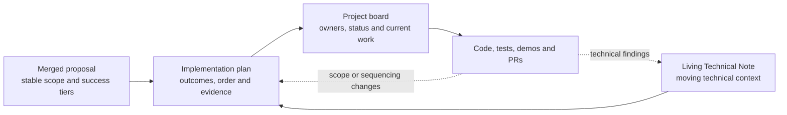

When sources disagree, direct Lodestar guidance controls implementation mechanics, the merged proposal controls scope, and the pinned specifications, APIs, and `unstable` code control technical behavior.

Abbreviations used below: BN = beacon node, VC = validator client, and EL = execution client.

### What reviewers are being asked to check

The Lodestar review should focus on:

1. whether the happy-path architecture and issue boundaries are sensible;
2. whether any core outcome is missing, duplicated, or already owned upstream;
3. whether the BN/API and `packages/builder` responsibilities are separated correctly;
4. whether the dependency order is realistic for two fellows;
5. whether the completion evidence proves a real Builder lifecycle rather than only successful HTTP calls;
6. whether the external-Builder payload fee-recipient and accounting wiring makes the payload-value baseline economically correct;
7. which conditional package would be most valuable if the core finishes early.

Reviewers are not being asked to freeze every task checkbox. Sign-off is on the core outcomes, issue boundaries, dependency order, and acceptance evidence. Task checklists may be refined when an issue approaches **Ready**, but refinement may not silently remove a core outcome or its acceptance evidence.

For a fast review, Sections 2–3 contain the outcome and accepted decisions, Section 4 contains the schedule, Section 6 is the proposed board backlog, and Sections 7–9 show coverage, acceptance scenarios, and conditional work.

| Reader | Recommended path |
|---|---|
| Lodestar maintainer reviewing architecture | Sections 2, 3, 4, 6, and 8 |
| Fellow preparing implementation work | Sections 3, 4, 5, 6, and 10 |
| Person creating the project board | Sections 4, 5, 6, and 11 |
| Reviewer checking completeness and tests | Sections 2, 7, 8, and 9 |

> **Diagram legend:** solid arrows show required flow or dependency; dotted arrows show feedback or optional movement; diamonds show decisions or gates. A **terminal** state means fail closed and record evidence—it does not necessarily mean the process exits.

### Planning and board activation

All planning and board conversion finish by the end of Week 7:

```text
Week 6
→ incorporate the current Lodestar-team decisions
→ complete the implementation-plan review draft
→ record and resolve remaining feedback
→ draft the board epics, issue shells, dependencies, and target weeks

Week 7
→ circulate the feedback-incorporated final candidate
→ obtain approval or agreed no-objection
→ publish the accepted plan as v1.0
→ create every core issue and conditional package parent on the project board
→ add owners, reviewers, dependencies, milestones, status, and evidence fields
→ pin the exact unstable SHA and create the shared feature branch
→ mark the first Week-8 issues Ready

Week 8 onward
→ begin implementation by picking the highest-priority Ready issue
```

<a id="core-outcome-and-definition-of-done"></a>

## 2. Core outcome and definition of done

### Core outcome

The core deliverable is a standalone Builder process inside the Lodestar product line:

```text
packages/builder + lodestar builder
→ load one local Builder BLS keystore and one Builder execution fee recipient
→ connect to one operator-controlled source beacon node
→ resolve the configured active Builder identity and read its BN-reported status/balance for operator visibility
→ consume fork-correct payload attributes and proposer preferences from the source BN
→ build one or more real payload candidates through configured local EL Engine APIs
→ retain the exact payload, blob, proof, request, and parent material needed for reveal
→ construct one complete coverable bid under a bounded initial policy
→ sign and submit that bid to the source BN at a configurable bounded time before the target proposal slot
→ source BN validates the submitted bid and flood-publishes it on the existing gossip topic
→ sidecar observes a BN-emitted beacon-block event containing its bid
→ sidecar constructs, signs, and submits the matching stateless envelope immediately
→ sidecar explicitly requests consensus_and_equivocation publication validation
→ source BN performs validation and publishes the envelope
→ sidecar discards the retained payload package after successful reveal
→ payload and data reach authoritative FULL/data-available state
→ PTC and trustless-payment/accounting evidence are captured
```

The first implementation deliberately optimizes for the working honest path. High availability, redundant BNs, strategic timing, remote signing, production bidding economics, and exhaustive adversarial behavior remain visible in the deferred backlog rather than blocking that path.


### System boundary

The working direct-Engine architecture keeps the Builder process standalone while separating build ownership from consensus ownership:

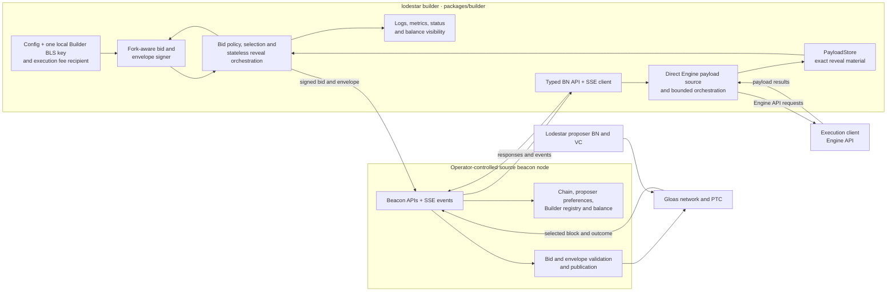

Provisional ownership rule:

```text
Builder sidecar owns keys, direct EL payload construction, payload retention, bid policy,
signatures, orchestration, exact matching, and diagnostics. Source BN owns proposer and
chain inputs, API validation, publication, and authoritative chain outcomes.
```

### First working loop

Before broader protocol evidence or hardening, the project must produce one simple working loop:

```text
real Builder-built payload through a configured local EL
→ exact payload material retained locally
→ complete coverable Builder-owned bid
→ local Builder signature and source-BN publication
→ Lodestar proposer selects the bid
→ Builder observes the selecting block
→ Builder builds, signs, and publishes the matching stateless envelope
→ selected block reaches FULL
```

This first loop does not deliberately require blob transactions, but it must accept whatever valid payload the EL builds. If network or local-mempool activity supplies blobs, the BN must retain the blob/KZG material, convert blobs to cells/columns, and disseminate the data-column sidecars. A zero-blob payload is acceptable only when it is the payload naturally returned by the test setup; `DATA-01` later forces a non-zero-blob case. The first loop does not wait for remote signing, redundancy, public-devnet deployment, advanced policy, exhaustive failure handling, or the final PTC/payment evidence package.


### Happy-path lifecycle

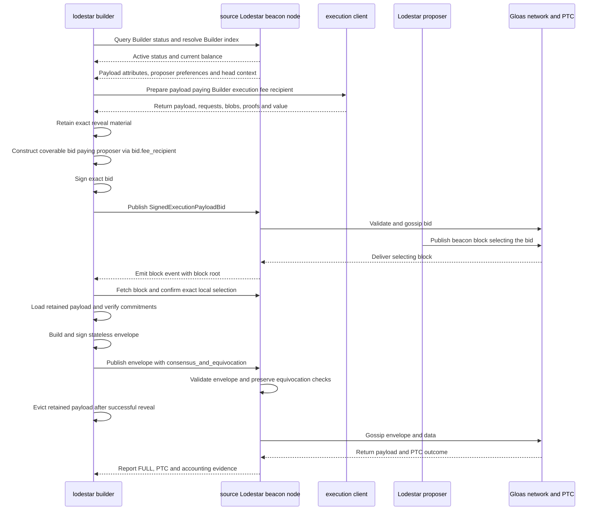

### Builder-owned payload-store lifecycle

This diagram describes the provisional Builder-owned store used by the direct-Engine implementation. The first reviewed loop may use bounded in-memory retention if maintainers accept restart loss. Durable recovery remains separate.

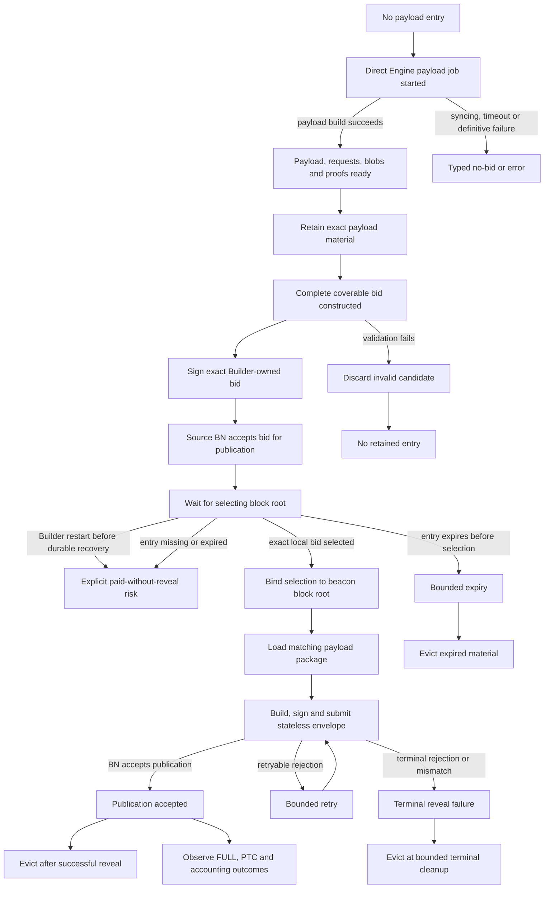

Cache invariants:

- no bid is signed or submitted before the exact reveal material is retained;
- exact bid identity and execution block hash bind selection to retained payload material;
- a cache miss or commitment mismatch never triggers payload reconstruction;
- successful envelope publication permits immediate eviction;
- expiry, terminal rejection, and Builder-store loss are explicit observable outcomes.

### Core definition of done

The core is complete only when all of the following are demonstrated:

- a pinned, reproducible Kurtosis environment runs a Lodestar proposer BN/VC, compatible EL, active Builder, and `lodestar builder`;
- the Builder exists as `packages/builder`, is wired into the Lodestar CLI, and runs independently from the beacon node and validator client;
- one local keystore-backed Builder key can sign valid fork-aware bids and envelopes;
- the Builder connects to the expected source BN, resolves an active Builder identity, and exposes its current BN-reported status/balance for diagnostics;
- any missing BN route or event required by the workflow is added in the intended standard `/builder` or `/beacon` namespace and proposed upstream, with a temporary typed adapter only where the specification is incomplete;
- the source BN reuses its canonical post-Gloas payload-production path rather than copying Engine API or proposer-state logic into the Builder;
- the unsigned bid commits to the real payload, uses the payload-value baseline (`bid.value = execution_payload_value`), and uses `execution_payment = 0`;
- the Builder config supplies the execution payload `feeRecipient`/coinbase through the BN preparation/candidate flow before payload work begins; the BN must not silently reuse the proposer's self-build fee recipient;
- the execution payload `feeRecipient`/coinbase pays a Builder-controlled address, while `bid.fee_recipient` pays the proposer; the two addresses must not be the same, although the Builder fixture may reuse its own withdrawal/execution address for payload revenue;
- insufficient Builder balance is rejected by the authoritative BN workflow and produces a clear Builder operator warning or error; the sidecar may include the status/balance it already reads, but it does not attempt to predict future coverability; top-up management remains external;
- the Builder retains the exact payload, execution requests, blobs, proofs, and fork context needed for stateless reveal until success or expiry;
- the Builder follows the connected BN's chain inputs, constructs and signs one coverable head-compatible bid, and submits it at a configurable bounded time before the target proposal slot rather than waiting until the slot boundary;
- exact local selection is detected from BN events and block retrieval without direct libp2p participation;
- the Builder retrieves, signs, and publishes the envelope immediately when it sees a block containing its bid;
- envelope publication explicitly requests `consensus_and_equivocation`; publication and proposer-equivocation validation remain BN-owned; a Deathstar-driven Kurtosis case proves that the BN does not publish the envelope after proposer equivocation, while the Builder does not implement a separate withholding policy;
- the cached reveal package is removed after successful publication and bounded expiry behavior is documented;
- one selected non-zero-blob bid reaches authoritative FULL/data-available state;
- PTC evidence and one non-zero trustless-payment/accounting transition are captured;
- essential failure cases produce explicit logs/errors; after the first working loop, a sidecar-only restart can recover selection and reveal when the same source BN still holds the exact material, without claiming full HA or durable failover;
- the full lifecycle repeats from a clean checkout with machine-readable evidence and an operator/developer runbook.

### Evidence ladder

The project adds evidence in layers. Later layers strengthen the result but do not redefine the first working loop.

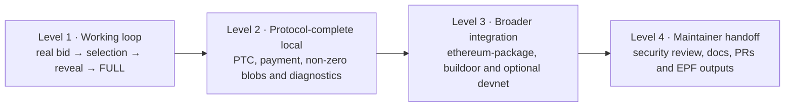

### Known first-iteration failure model

If the Builder process remains unavailable through the reveal window, or the source BN goes offline or loses the reveal material after a bid is accepted and selected, the Builder may still owe the proposer while failing to reveal the payload. That is a real protocol/operational failure, not something the first iteration must solve with redundancy.

The first iteration must:

- make this failure visible in logs and outcome evidence;
- never claim successful reveal when the source BN or reveal material is unavailable;
- document the financial consequence;
- support only the bounded same-source-BN restart recovery defined in `REL-01`;
- leave redundant instances, durable source-BN failover, and cross-node recovery to deferred work.

### Core non-goals

The core does not include:

- Builder deposits, exits, top-ups, or balance management tooling;
- direct sidecar-to-EL access;
- remote signer or validator keymanager integration;
- multiple Builder keys;
- high availability, redundant Builder instances, multi-BN failover, or durable recovery beyond the bounded same-source-BN restart path in `REL-01`;
- Builder-side proposer-equivocation detection or strategic withholding; the core equivocation check and test are BN-owned;
- reveal timing games or deliberate safety-margin optimization;
- sophisticated bidding, shading, MEV search, or profitability optimization;
- proposer bid-selection design;
- multi-branch flood publishing or relaxed local API validation for bids outside the connected BN's head view;
- circuit-breaker or FCR implementation changes;
- public-devnet success as a prerequisite for minimum completion;
- FOCIL, general Deathstar runtime controls beyond the bounded proposer-equivocation fixture, malicious runtime controls, or a configuration UI.

<a id="accepted-lodestar-implementation-decisions"></a>

## 3. Accepted Lodestar implementation decisions

| ID | Area | Accepted direction | Plan consequence |
|---|---|---|---|
| `D-01` | Base and PR model | Use `unstable`; keep merging it into one feature branch; split only later for review | Pin exact SHA in Week 7; all upstream capabilities are re-audited at activation |
| `D-02` | Product/package name | Formal command is `lodestar builder`; package lives in `packages/builder` parallel to `packages/validator` | “Forgestar” may be used only as an EPF mission codename, not as the package/API name |
| `D-03` | Runtime boundary | **Reopened 31 August.** Provisional baseline is a standalone sidecar with direct local Engine API access; the BN keeps chain inputs, validation, and publication | See [provisional direct-Engine plan](provisional-direct-engine-plan.md); dedicated versus shared EL ownership remains open |
| `D-04` | API boundary | Use the intended standard Beacon API namespaces: Builder-only operations under `/builder`, chain/publication surfaces under `/beacon`, and SSE where useful | The project may implement a typed pre-spec adapter, but it does not invent a `/lodestar` namespace for interfaces intended for upstream standardization; confirmed gaps are proposed upstream |
| `D-05` | Registration, fee recipient, and funds | Builder onboarding, top-ups, withdrawals, and balance management stay external; the Builder execution fee recipient is required local config and must reach the BN before external-Builder payload preparation begins. It may be any execution address controlled by the Builder, need not match the Builder withdrawal credentials, and must not be the proposer's address | Trace `prepareNextSlot` and the current bid route, then add the smallest reviewed preparation/candidate contract that triggers payload work with the Builder fee recipient. The simplest fixture may reuse the Builder withdrawal/execution address, but the implementation preserves separate configuration and keeps top-ups external |
| `D-06` | Key scope | One local keystore-backed Builder key | No remote signer or validator keymanager work in core because no Builder remote-signer contract is defined; retain a narrow signer boundary for a future specification |
| `D-07` | Bid policy | Use the payload-value baseline: the payload pays execution rewards to the Builder's configured payload fee-recipient address and `bid.value = execution_payload_value` pays the proposer | With the Builder payload fee recipient and proposer payment address correctly separated, the baseline targets zero pre-cost margin; implement the amount through a small strategy function so later policies can replace it without changing lifecycle code |
| `D-08` | Solvency and balance visibility | BN is authoritative for per-bid coverability and may reject at candidate generation or bid publication | The sidecar uses the Builder-status API it already needs for index resolution to expose current status/balance as passive operator diagnostics; it does not make an independent coverability decision, silently clamp, predict runway, or perform top-ups |
| `D-09` | Source-BN trust | BN is the source of truth for proposer context, preferences, payload construction, value, balance, and reveal material | Sidecar checks chain identity, Builder identity, slot/fork/domain, `execution_payment = 0`, and bid/envelope consistency; it does not independently recompute payload value or BN state |
| `D-10` | Bid timing and head view | Follow source-BN chain inputs, produce a bounded local candidate set, and submit one-shot bids through the flood-publication path merged in #9914 | Publication timing, parent-of-head variants, and non-finality breadth remain bounded policy decisions; per-call flood publication is no longer deferred |
| `D-11` | Reveal timing | Reveal immediately when a BN event/block shows the local bid was selected | No head/import waiting policy or strategic withholding in core |
| `D-12` | Equivocation | The sidecar explicitly requests `consensus_and_equivocation`; publication validation and proposer-equivocation detection are BN-owned | Reuse merged [Lodestar #9757](https://github.com/ChainSafe/lodestar/pull/9757), use Deathstar to prove the BN refuses envelope publication for the proposer-unbundling case, and do not add Builder-side equivocation policy |
| `D-13` | Reveal cache and stale work | Reuse the same-host BN stateful block-production cache model and its existing payload-job cleanup; retain the selected reveal package until reveal or bounded expiry and remove it after successful reveal | Trace and test the current BN cleanup on head change before adding anything. A new head produces a new parent-tuple bid; do not add a sidecar cache or separate cancellation path unless the baseline audit proves the existing cleanup is insufficient |
| `D-14` | Reliability | High reliability/redundancy is not a first-iteration requirement | Offline-after-bid is documented as a known paid-without-reveal failure; HA remains in the deferred hardening inventory |
| `D-15` | Test path | Local Kurtosis first; extend ethereum-package as needed; use buildoor configuration as reference; devnet next if available | Kurtosis is core evidence, devnet deployment is strong-success evidence |
| `D-16` | Proposer test path | Use a Lodestar proposer BN/VC with deterministic Builder preference | Because Lodestar may prefer its local payload when values are close, pin `--builder.selection=builderalways` for the happy-path fixture or use `--builder.selection=maxprofit` with an explicitly documented Builder boost factor; other-client proposer interop follows later |
| `D-17` | Genesis readiness | Keep a small `waitForGenesis` implementation in both validator and Builder because it depends on `@lodestar/api` and has no cleaner shared home | The Builder copy stays behaviorally aligned with validator: a 404 means genesis is not available yet and is logged at info; other errors are warnings; polling keeps the existing fixed interval and abort signal |
| `D-18` | Lodestar BN pre-genesis 404 | Do not add an unreachable `getGenesis` branch to the Lodestar BN | Lodestar does not start its API before anchor-state initialization today, so a cosmetic 404 branch would be misleading; the client-side 404 handling remains correct for Teku and any BN that exposes the API before genesis |
| `D-19` | Shared config checks and Builder API auth | Import `assertEqualParams` from `@lodestar/config`; keep staked Builder API request authentication outside the core sidecar | Reuse the utilities landed in [Lodestar #9725](https://github.com/ChainSafe/lodestar/pull/9725); do not duplicate them or import validator. Add `DOMAIN_REQUEST_AUTH` or request-signature verification only if `EXT-BUILDER-API-01` is activated or the relevant upstream API work lands |
| `D-20` | Exact protocol integers | Preserve bid and payload fields represented as protocol `uint64` values without narrowing them to JavaScript `number` | Reuse the exact `UintBn64` handling landed in [Lodestar #9749](https://github.com/ChainSafe/lodestar/pull/9749), [#9750](https://github.com/ChainSafe/lodestar/pull/9750), and [#9751](https://github.com/ChainSafe/lodestar/pull/9751). Keep `execution_payment`, bid `gas_limit`, proposer `targetGasLimit`, and any other SSZ-root input exact through parsing, caching, comparison, signing, hashing, and events; test the `2^53` boundary and `uint64` maximum |

### Details finalized against the pinned SHA

These are implementation details, not unresolved architecture questions:

- exact request serialization and route/event names after starting from the intended standard namespaces and current Beacon API gaps;
- exact cache class and eviction hook reused from stateful block production;
- the exact existing payload-job/cache cleanup reached after a head change and whether the pinned baseline exposes a measurable gap;
- the cleanest integration with `prepareNextSlot`, or a narrow new prepare-bid trigger, so the BN prepares the payload before returning a complete bid;
- the initial bounded pre-slot publication default, selected from local timing evidence and kept operator-configurable as proposer selection and the future Builder API cutoff evolve;
- whether the standard Builder API carries the configured execution fee recipient in the preparation request, candidate request, or a narrow registration call; the semantic requirement that it pays the Builder is fixed;
- exact payload/FULL/PTC/accounting observer available on the pin;
- exact ethereum-package participant configuration;
- exact current test images, fork configuration, and active-Builder fixture.

They are resolved during Week 7 baseline activation or in the issue that consumes them.

### Final confirmations from the 1–3 August follow-up

The follow-up closes the remaining plan-level questions:

- the execution payload `feeRecipient` may be any execution address controlled by the Builder, need not match the Builder withdrawal credentials, and must not be the proposer's address;
- payload preparation and bid publication are separate concerns: prepare early enough for a complete bid to be ready, then publish at an operator-configurable bounded pre-slot offset rather than waiting for `t=0`;
- an already-published bid cannot be withdrawn. A head change produces a fresh bid for the new parent tuple, while stale payload work follows the BN's existing cleanup and expiry behavior unless the pinned-baseline audit proves a gap;
- the preparation/candidate surface is bounded and operator-controlled under the one-source-BN, same-host v1 trust model;
- `consensus_and_equivocation` is explicitly requested by the sidecar and enforced by the BN.

The exact preparation route, initial publication offset, and cache hook remain implementation details to settle against the pinned baseline, not unresolved plan decisions.

<a id="delivery-model-and-weekly-roadmap"></a>

## 4. Delivery model and weekly roadmap

### Verified implementation baseline at final review

This snapshot was refreshed on 2 September 2026. It records work that can narrow the board issues without treating a draft, an open follow-up, or partially verified work as Done.

The completed capability and historical-upstream audit is recorded in [the BASELINE-01 capability audit](baseline-capability-audit.md).

| Source | Verified state | Effect on this plan |
|---|---|---|
| [Lodestar #9595](https://github.com/ChainSafe/lodestar/pull/9595) | Merged: Gloas Builder selection, broadcast validation, and stateless block-production flow | Re-audit the relevant BN and publication tasks against `unstable`; reuse landed capabilities instead of duplicating them |
| [Lodestar #9725](https://github.com/ChainSafe/lodestar/pull/9725) | Merged: `assertEqualParams`, `NotEqualParamsError`, the private comparison helper, tests, and fixtures moved from validator to `@lodestar/config` | `API-01` imports the shared config check and removes the temporary Builder TODO; no Builder-to-validator dependency |
| [Lodestar #9726](https://github.com/ChainSafe/lodestar/pull/9726) | Merged: validator treats `getGenesis` 404 as expected waiting and other errors as warnings, with the retry loop unchanged | Keep the Builder's duplicate `waitForGenesis` behavior aligned; do not add unreachable Lodestar BN code |
| [consensus-specs #5497](https://github.com/ethereum/consensus-specs/pull/5497) | Merged: bid admission and propagation are keyed by Builder plus parent tuple and restricted to bids compatible with the node's local head view | Core bids follow the connected BN's current head view; different-branch flood publishing is deferred pending propagation evidence and a safe local-validation design |
| [Lodestar #9739](https://github.com/ChainSafe/lodestar/pull/9739) | Merged at `dbe9dc8`: implements #5497 head-compatible validation, per-parent seen-bid tracking, deferred-parent recovery, and duplicate-validation protection | Rebase and reuse the API validation path. A same-head sidecar works without relaxing validation; multi-branch flood publishing remains stretch work |
| [Lodestar #9749](https://github.com/ChainSafe/lodestar/pull/9749), [#9750](https://github.com/ChainSafe/lodestar/pull/9750), and [#9751](https://github.com/ChainSafe/lodestar/pull/9751) | Merged: exact `UintBn64` handling for `execution_payment`, bid `gas_limit`, and proposer `targetGasLimit` through preferences, `PayloadAttributesV4`, and events | Preserve these fields exactly through Builder parsing, caching, signing, hashing, comparison, and diagnostics; add boundary tests rather than reintroducing JavaScript `number` narrowing |
| [Lodestar #9756](https://github.com/ChainSafe/lodestar/pull/9756) | Merged: narrowly ignores direct-parent bids at epoch boundaries; the broader same/next-slot restriction discussed during review did not land | Add a focused epoch-boundary regression around the connected BN's head-compatible publication path without imposing the retracted broader restriction |
| [Lodestar #9864](https://github.com/ChainSafe/lodestar/pull/9864) / [#9813](https://github.com/ChainSafe/lodestar/pull/9813) | #9864 merged on August 24 and recomputes fork-choice head after epoch-boundary checkpoint pull-up; NC closed the earlier #9813 alternative without merge on August 25 | Use the landed #9864 behavior as the baseline and include the resulting epoch-boundary head transition in `BID-01` tests; #9813 is historical evidence, not an active watch |
| [Lodestar #9736](https://github.com/ChainSafe/lodestar/pull/9736) | Open draft: correct FULL-parent state use for block production and reward calculation | Audit and reuse it in `BN-02` when available; do not build a parallel FULL-parent path in the Builder project |
| [Lodestar #9757](https://github.com/ChainSafe/lodestar/pull/9757) | Merged on 7 August: adds `consensus_and_equivocation` handling and Deathstar proposer-equivocation support, with buildoor used for the first end-to-end proof | Reuse the BN capability in `REV-01` and `QA-01`; retain the Lodestar Builder fixture so the project proves the same rejection once its honest loop works |
| [Lodestar #9594](https://github.com/ChainSafe/lodestar/pull/9594), [builder-specs #165](https://github.com/ethereum/builder-specs/pull/165)/[#166](https://github.com/ethereum/builder-specs/pull/166), [beacon-APIs #630](https://github.com/ethereum/beacon-APIs/pull/630), [keymanager-APIs #92](https://github.com/ethereum/keymanager-APIs/pull/92), and [Lodestar #9832](https://github.com/ChainSafe/lodestar/pull/9832) | #9594 closed without merge; #165/#166, #630, #92, and Lodestar #9832 have merged | BN-01 must audit the final landed specifications and Lodestar route/forwarding behavior rather than depend on the abandoned draft or freeze an earlier contract |
| [Lodestar #9758](https://github.com/ChainSafe/lodestar/pull/9758) | Merged at `74a3175`: initial `@lodestar/builder` package and CLI scaffolding, local keystore, bid/envelope signing and tests, source-BN wiring, `waitForGenesis`, shutdown, shared `assertEqualParams`, and active-Builder resolution. The first package was also published to npm | `SIGN-01` is Done with merged review and CI evidence. Later CLI/source-BN implementation merged through #9781, with remaining tests and metrics split into `TEST-01` and `MET-01` |
| [Lodestar #9766](https://github.com/ChainSafe/lodestar/pull/9766) | Merged: aligns the Builder package build and type-check scripts with the workspace TypeScript 7 migration by using `tsc` | Record the CI follow-up under completed `CLI-01`; #9781 post-merge reconciliation belongs to `REVIEW-01` |
| [Lodestar #9770](https://github.com/ChainSafe/lodestar/pull/9770) | Merged: hides the generated Builder CLI page from the public docs sidebar while the command is not yet functional | Keep the page hidden or clearly marked work in progress until the command is functionally ready and the open `REVIEW-01` work is closed, then restore it as part of `HANDOFF-01`; the administrative closure of `CLI-01` alone is not the publication signal |
| [Lodestar #9781](https://github.com/ChainSafe/lodestar/pull/9781), [#9826](https://github.com/ChainSafe/lodestar/pull/9826), and [#9827](https://github.com/ChainSafe/lodestar/pull/9827) | #9781 merged the foundation, #9826 centralized the Builder and Validator API test helpers, and #9827 merged abort-loop and logging follow-ups. The historical twelve #9781 thread markers still require explicit bookkeeping | Preserve completed CLI-01/API-01. REVIEW-01 now owns only thread-marker reconciliation; implemented helper and lifecycle follow-ups are no longer open |
| [Lodestar #9839](https://github.com/ChainSafe/lodestar/pull/9839), [#9848](https://github.com/ChainSafe/lodestar/pull/9848), [#9860](https://github.com/ChainSafe/lodestar/pull/9860), and [#9868](https://github.com/ChainSafe/lodestar/pull/9868) | Merged: Gloas-aware startup order, Builder metrics, CLI handler tests, and transient Builder lookup handling | Treat these as current package behavior. API-02 integrates all four; MET-01 is Done and TEST-01 retains only its remaining separated regressions |
| [Lodestar #9854](https://github.com/ChainSafe/lodestar/pull/9854), [#9875](https://github.com/ChainSafe/lodestar/pull/9875), [#9876](https://github.com/ChainSafe/lodestar/pull/9876), and [#9896](https://github.com/ChainSafe/lodestar/pull/9896) | Open Marco PoCs compare additive `block` fields, two complete-bid event shapes, and `block_v2`. Nico's implementation review reopened the original preferred direction | SPEC-01 must compare type safety, versioning, block-root identity, self-build rules, and `block_gossip` before drafting the Beacon APIs PR |
| [`nflaig/builder`](https://github.com/nflaig/lodestar/tree/builder) | Draft proof-of-concept branch at `99fd8fa9ad`; implements enriched `block` fields, mixed-version block-fetch fallback, Builder services, codec tests, and recorded two-node evidence | Use as end-to-end evidence, not the settled API contract. API-02 remains the bounded complete-block fallback |
| [Lodestar #9903](https://github.com/ChainSafe/lodestar/pull/9903) / [#9904](https://github.com/ChainSafe/lodestar/pull/9904) | #9903 remains open; bounded/reloadable envelope cache #9904 merged as `7aa8c9c93a` | Require differential PTC evidence before adopting #9903. Treat #9904 as landed BN-side recovery evidence and separately define Builder-owned retention for the direct-Engine design |
| [Lodestar #9958](https://github.com/ChainSafe/lodestar/pull/9958) / [fork #61](https://github.com/krisoshea-eth/lodestar/pull/61) / [#9957](https://github.com/ChainSafe/lodestar/pull/9957) | #9958 is the draft PAYLOAD-SOURCE-01 extraction. Fork draft #61 adds architecture-neutral bounded orchestration without runtime wiring. #9957 removes older pre-Fulu blob retrieval code but retains Gloas `getPayload` blob bundles | Review #9958 independently, keep #61 stacked until the source boundary stabilizes, and keep #9957 as a baseline watch rather than a reason to remove blobs from `BuiltPayload` |
| [Lodestar #9350](https://github.com/ChainSafe/lodestar/pull/9350) | Open mainnet-scale pending-payment quorum arithmetic fix | BASELINE-01 tracks the upstream disposition; OUT-01 must exercise a `bigint` accumulator beyond JavaScript safe-integer precision |
| [Lodestar #9332](https://github.com/ChainSafe/lodestar/pull/9332) / [#9637](https://github.com/ChainSafe/lodestar/pull/9637) | Open EL-invalid fork-choice and PTC fail-closed work | Route to EL-ARCH-01, QA-01, E2E-01, and OUT-01; do not duplicate the behavior inside the Builder sidecar |
| [Lodestar #9937](https://github.com/ChainSafe/lodestar/pull/9937) / [#9281](https://github.com/ChainSafe/lodestar/pull/9281) / [#9791](https://github.com/ChainSafe/lodestar/pull/9791) / [#9326](https://github.com/ChainSafe/lodestar/pull/9326) | #9937 merged; the other BN recovery changes remain open | Add bounded EMPTY, impossible-target, stale-root, and non-finality cases to REL-01 and E2E evidence without creating another Builder service |
| [Lodestar v1.46.0](https://github.com/ChainSafe/lodestar/releases/tag/v1.46.0) | Latest stable at `3873dd5b032d0ad82581fc3416e9628b4f6f2642`, published 12 August. It predates merged #9781 | Use as the newest immutable release target while `BASELINE-01` records the exact working `unstable` pin |
| [Lodestar v1.47.0-rc.0](https://github.com/ChainSafe/lodestar/releases/tag/v1.47.0-rc.0) | Immutable prerelease at `2aff495`, published 27 August, containing #9832, #9781, #9848, and the surrounding Gloas Builder API foundation | Use for release qualification only. It is stronger distribution evidence than a branch pin, but it does not replace current `unstable`, ENV-02 reproduction, or a stable release |
| [Lodestar v1.46.0-rc.1](https://github.com/ChainSafe/lodestar/releases/tag/v1.46.0-rc.1), [#9790](https://github.com/ChainSafe/lodestar/pull/9790), [#9792](https://github.com/ChainSafe/lodestar/pull/9792), and [#9793](https://github.com/ChainSafe/lodestar/pull/9793) | Historical release-candidate baseline now superseded by v1.46.0. #9790 protects state persistence/database close during a stuck network-worker shutdown and #9792 fixes a QUIC resource leak. #9793 closed without merge because its self-signal/force-exit approach did not generalize, especially for default container PID 1. The underlying stuck handle remains unidentified | Advance `BASELINE-01` to v1.46.0 plus an exact working `unstable` pin and test state persistence, process-manager timeout, and Builder restart/cache/reveal recovery. Retain #9793 as diagnostic history, not an active implementation requirement or root-cause fix |

The board preserves `CLI-01`, `API-01`, `SIGN-01`, `MET-01`, and `BN-PUB-01` as **Done**. `ENV-01` is Done for its manual development-environment scope. `ENV-02` now owns clean-checkout automation and independent reproduction. `REVIEW-01` remains **In progress** only for explicit #9781 thread-marker reconciliation, while `TEST-01` and `API-02` are **In review**. `BASELINE-01`, `BN-01`, and `SPEC-01` are **In progress**. Landed prerequisites may narrow a consuming issue, but do not automatically complete it.

### Board hierarchy and pickup model

```text
Project
→ Epic
→ Individual issue
→ Task checklist within the issue
```

Every issue in Section 6 is an individual proposed board issue. The short ID is only a planning alias; the human-readable title is the board title.

Board states:

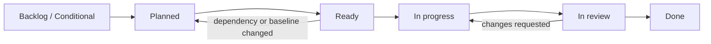

Each board issue carries the same evidence-oriented shape:

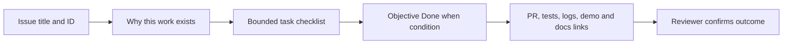

An issue becomes **Ready** only when:

- its hard dependencies are Done or explicitly waived;
- its task list and completion evidence reflect the pinned `unstable` SHA;
- an owner and reviewer are assigned;
- it is small enough for one owner to complete in about five ideal engineering days;
- no hidden design decision remains.

Each fellow has at most one primary implementation issue in progress and may review one issue owned by the other fellow. When a week pairs an issue with an issue that depends on it, the arrow in the roadmap means sequential work within that week: the second fellow pairs on the prerequisite or prepares tests, fixtures, and interfaces for the dependent issue, but the dependent issue does not close before its prerequisite is Done. Same-week arrows assume the prerequisite narrows after the pinned-SHA audit; if two full `M` issues remain sequential, move the dependent issue rather than weakening its scope or evidence.

### Week-by-week roadmap

| Week | Primary issues / activity | End-of-week outcome |
|---:|---|---|
| **6** | Finish plan; incorporate Lodestar replies; draft board | Review candidate and feedback log are complete |
| **7** | Final plan approval; create all board issues; pin `unstable`; assign Week 8 | Plan v1.0 and board are fully ready |
| **8** | `ENV-01`, `CLI-01` | Deterministic local network and runnable `lodestar builder` package/command |
| **9** | `SIGN-01`, `API-01` | Local Builder key works; sidecar connects to source BN and resolves active Builder |
| **10** | `API-02`, `BN-01` | Block observation works; required BN route/event surface exists |
| **11** | `EL-ARCH-01` / `ATTR-SPEC-01` / `ATTR-01` → `PAYLOAD-01` | Engine ownership and source-BN payload inputs are settled; one bounded direct-Engine payload source works |
| **12** | `STORE-01` → `BID-CORE-01` → `BID-01` | Exact reveal material is retained and a coverable Builder-owned bid is signed and submitted |
| **13** | `SELECT-01` → `REV-01` | Exact local selection triggers immediate stateless reveal |
| **14** | `E2E-01` | The first repeatable local bid → selection → reveal → FULL loop works |
| **15** | `OUT-01`, `DATA-01` | PTC/payment evidence and non-zero-blob/data coverage are added |
| **16** | `QA-01`, `REL-01` | Essential diagnostics, bounded same-BN restart recovery, and remaining local evidence close |
| **17** | `INT-01` | ethereum-package/buildoor integration works |
| **18** | `EXT-DEVNET-01` may start early only if `INT-01` closes early and a suitable devnet exists; otherwise core/PR hardening | Devnet evidence if the early-entry conditions are met; otherwise stronger core and review state |
| **19** | Extension gate or continued hardening | At most one conditional package is selected |
| **20** | `SEC-01`, documentation/PR shaping | Security/resource review and maintainable PR/docs state |
| **21+** | `HANDOFF-01` | Final report, presentation refresh, review responses, and maintainer handoff |

The issue order is dependency-led, not a promise that every issue takes exactly one week. If an upstream capability is already complete, the corresponding **Confirm / add** issue may close early and capacity moves to the next Ready item.


### Roadmap at a glance

```mermaid
flowchart LR
    P["Weeks 6–7<br/>Plan review, sign-off,<br/>board conversion and pin"]
    A["Weeks 8–9<br/>Environment, command,<br/>signer and BN client"]
    B["Weeks 10–12<br/>BN surface, payload path,<br/>bid, cache and publication"]
    C["Weeks 13–14<br/>Exact selection, reveal<br/>and first repeatable FULL loop"]
    D["Weeks 15–16<br/>PTC, payment, blobs,<br/>diagnostics and restart recovery"]
    E["Weeks 17–18<br/>ethereum-package, buildoor<br/>and optional devnet evidence"]
    X["Week 19<br/>One extension or<br/>continued hardening"]
    F["Weeks 20–21+<br/>Security, docs, PR shaping<br/>and maintainer handoff"]

    P -->|"Gate 0"| A
    A -->|"Gate A"| B
    B -->|"Gate B"| C
    C -->|"Gate C"| D
    D -->|"Gate D"| E
    E -->|"Gate E"| X
    X --> F
```

### Two-fellow lanes

| Lane | Typical ownership |
|---|---|
| BN/API lane | BN routes/events, payload-job reuse, bid construction, stateful cache |
| Builder lane | package/CLI, key signing, BN client, candidate request, bid/reveal orchestration |
| Shared integration lane | Kurtosis, blobs/data, FULL/PTC/payment evidence, buildoor/devnet, security, docs |

Ownership may rotate. Both fellows must understand every gate-crossing change.

<a id="milestone-and-board-rules"></a>

## 5. Milestone and board rules

### Milestone gates

| Gate | Target | Required evidence |
|---|---:|---|
| **Gate 0 — Plan and board ready** | End W7 | Plan v1.0 accepted; all issues/dependencies on board; exact `unstable` SHA pinned; W8 issues Ready |
| **Gate A — Builder foundation** | End W9 | Local environment, `packages/builder`, one local key, typed BN connection, active Builder resolution |
| **Gate B — Real bid path** | End W12 | BN builds a complete real bid, retains reveal material, and sidecar signs/publishes it |
| **Gate C — First working loop** | End W14 | Lodestar selects the local bid; Builder immediately reveals; block reaches FULL in repeatable Kurtosis runs |
| **Gate D — Protocol-complete local evidence** | End W16 | PTC/payment evidence, non-zero blobs/data, essential diagnostics, and bounded same-source-BN restart recovery are complete |
| **Gate E — Broader integration** | End W17–18 | ethereum-package/buildoor evidence and an optional devnet attempt or documented blocker |
| **Gate F — Handoff** | W21+ | Security review, docs, PRs, EPF outputs, and follow-up backlog complete |

The extension decision is taken in Week 19 after Gate E. It selects at most one named conditional package, promotes one deferred-inventory row into a newly scoped conditional package, or explicitly chooses continued core hardening. `EXT-DEVNET-01` is the only package that may start earlier under the Week-18 rule in Section 9; if it starts, it ordinarily counts as the selected package. The extension decision is not a prerequisite for core completion.

### Critical path

The diagram below is a navigation aid. The dependency and **Ready after** fields in Section 6 are authoritative if the visual and catalogue ever diverge.

```text
ENV-01 / CLI-01
→ SIGN-01 / API-01
→ API-02 / BN-01
→ BN-02 → BN-03 → BN-04
→ BID-01
→ SELECT-01 → REV-01
→ E2E-01
→ OUT-01 / DATA-01
→ QA-01 / REL-01
→ INT-01
→ SEC-01 → HANDOFF-01

Parallel Gate-A follow-ups after CLI-01 / SIGN-01 / API-01:
→ REVIEW-01 / TEST-01 / MET-01
```


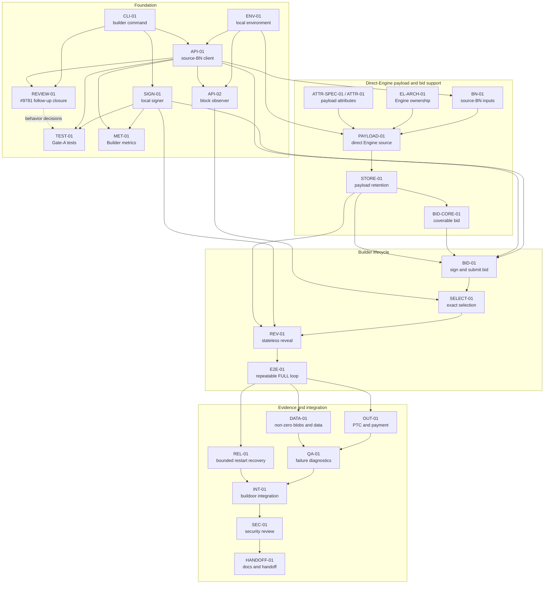

### Estimation rule

- `S`: approximately 1–2 ideal engineering days;
- `M`: approximately 3–5 ideal engineering days;
- anything larger than `M` must be split before entering **Ready**.

Issue estimates are rechecked against the pinned SHA in Week 7. Already-landed capabilities are narrowed or closed rather than preserving obsolete work.

### Project-board conversion by end of Week 7

For every core issue, create:

- title and ID;
- epic;
- owner and reviewer;
- status and target week;
- dependency links;
- size;
- task checklist;
- completion evidence;
- implementation/PR/evidence links as work progresses.

For each proposal-relevant conditional package in Section 9, create one **Conditional** parent item with entry criteria and stop rule. Operational product follow-ups such as HA and remote signing remain in the future backlog unless maintainers explicitly bring them into EPF scope.

<a id="core-issue-catalogue"></a>

## 6. Core issue catalogue

Every subsection below is one individual proposed board issue. The prefix identifies the work area; the number identifies the issue within the plan.

| Prefix | Work area |
|---|---|
| `ENV` | Deterministic environment and fixtures |
| `CLI` | `lodestar builder` package and command lifecycle |
| `SIGN` | Builder key loading and signing |
| `API` | Source-BN client, events, and block retrieval |
| `REVIEW` | Cross-cutting implementation review, lifecycle completion, and merge evidence |
| `BN` | Beacon-node payload, bid, and cache changes |
| `BID` | Candidate request, signing, and bid publication |
| `SELECT` | Exact selected-bid detection |
| `REV` | Envelope retrieval, signing, and reveal |
| `OUT` | PTC, payment, and accounting outcomes |
| `DATA` | Non-zero blobs, proofs, and data availability |
| `QA` | Core diagnostics and fail-closed coverage |
| `REL` | Bounded restart and event recovery |
| `E2E` | Repeatable end-to-end demonstration |
| `INT` | ethereum-package, buildoor, and broader integration |
| `SEC` | Security and resource review |
| `HANDOFF` | Documentation, EPF outputs, PR shaping, and handoff |

### Epic overview

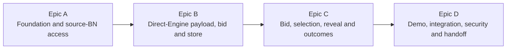

### Epic A — Foundation and source-BN access

| ID | Individual issue | Lane | Target | Effort | Ready after |
|---|---|---|---:|---:|---|
| `ENV-01` | Create the deterministic local Gloas/Kurtosis environment | Shared | W8 | M | Gate 0 |
| `CLI-01` | Add `packages/builder` and the `lodestar builder` command | Builder | W8 | M | Gate 0 |
| `SIGN-01` | Add one local Builder keystore and signer boundary | Builder | W9 | M | `CLI-01` |
| `API-01` | Implement the typed source-BN client and active-Builder resolver | Builder | W9 | M | `CLI-01`, `ENV-01` |
| `API-02` | Consume BN block events and retrieve fork-correct blocks | Builder | W10 | M | `API-01`, `ENV-01` |
| `TEST-01` | Add the remaining focused CLI, signer, identity, tracker, and readiness tests | Shared | W9 | M | `CLI-01`, `SIGN-01`, `API-01` |
| `MET-01` | Add the Builder metrics server and bounded CLI, signer, status, balance, and readiness metrics | Builder | W9 | S | `CLI-01`, `SIGN-01`, `API-01` |
| `REVIEW-01` | Close the #9781 foundation review and lifecycle implementation | Builder | W9 | S | `CLI-01`, `API-01` |

#### Epic A failure and recovery map

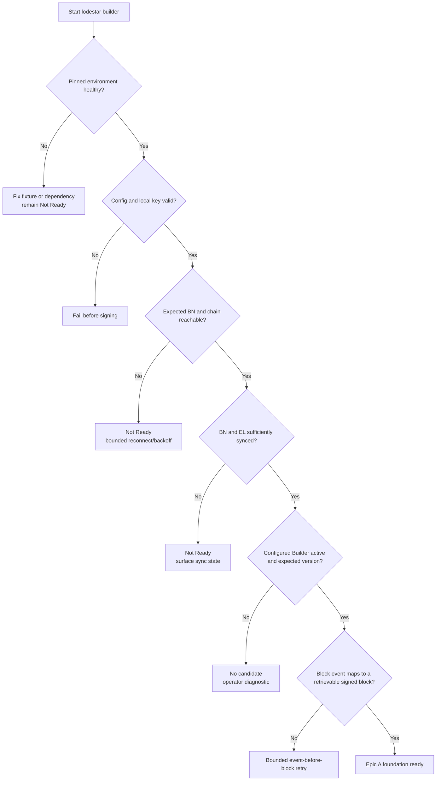

#### `ENV-01` — Create the deterministic local Gloas/Kurtosis environment

**Why:** The Builder cannot be debugged while fork configuration, proposer selection, active Builder state, EL health, breaker state, or network setup is nondeterministic.

**Tasks**

- [ ] Start from current [ethereum-package](https://github.com/ethpandaops/ethereum-package) / Kurtosis Gloas support, the maintained ethPandaOps Glamsterdam fixture/genesis-generator configuration, and [buildoor](https://github.com/ethpandaops/buildoor)'s participant setup; pin the exact image/tag in the issue rather than in this plan.
- [ ] Pin BN, VC, EL, chain config, fixture tag, accounts, one Builder key, one Builder execution fee recipient, and all temporary flags.
- [ ] Provide an active Builder in genesis or through external fixture tooling.
- [ ] Configure a Lodestar proposer/VC to predictably prefer the external Builder bid: use [`--builder.selection=builderalways`](https://chainsafe.github.io/lodestar/run/validator-management/validator-cli) for the deterministic happy path or use `--builder.selection=maxprofit` and pin the chosen Builder boost factor.
- [ ] Verify BN/EL sync, an inactive circuit breaker for the test proposer, clock synchronization, and compatible state-transition mode.
- [ ] Provide repeatable launch, teardown, smoke checks, and expected diagnostic logs. Include `lodestar builder` shutdown with the SSE stream connected and while it is reconnecting; `SIGTERM` must exit within the bounded process-manager window without `SIGKILL` or a lingering socket/timer.
- [ ] Keep onboarding and top-up tooling outside `lodestar builder`.

**Done when:** A clean checkout repeatedly launches a pinned local network with an active Builder and known proposer/BN/EL conditions.

#### `CLI-01` — Add `packages/builder` and the `lodestar builder` command

**Why:** The Builder is a first-class protocol role in the Lodestar product line and should have the same clear package/CLI status as `validator`, `beacon`, and `bootnode`.

**Board status:** Done by Marko's project-status decision. The later #9781 implementation is merged; its post-merge thread-marker and follow-up reconciliation remains in `REVIEW-01`, while tests and metrics remain in `TEST-01` and `MET-01`.

**Tasks**

- [x] Reuse and extend the merged `packages/builder` and `lodestar builder` scaffolding from [Lodestar #9758](https://github.com/ChainSafe/lodestar/pull/9758) rather than recreating it.
- [x] Complete command registration through existing CLI conventions.
- [x] Add configuration for the source BN, network/chain, local keystore, Builder execution fee recipient, timeouts, and logging. The bounded bid-publication offset remains in `BID-01`; metrics configuration and server wiring remain in `MET-01`.
- [x] Implement the startup, readiness, health, signal-handling, and shutdown scope Marko closed. The later-Builder startup lifecycle merged in #9781; post-merge reconciliation remains in `REVIEW-01`.
- [x] Prevent signing/publication until the implemented key, BN, chain, and Builder-state checks pass; retain the BN-authoritative preparation guard in the later bid path.
- [x] Use structured logs without secret material. Bounded metric labels remain in `MET-01`.
- [x] Keep the generated Builder CLI page hidden from the public sidebar, as established by [Lodestar #9770](https://github.com/ChainSafe/lodestar/pull/9770), until the command is functionally ready and `REVIEW-01` closes.
- [x] Keep Forgestar as an optional project codename only.

**Done when:** The command starts/stops cleanly, reports precise readiness failures, and remains inert until dependencies are ready.

#### `SIGN-01` — Add one local Builder keystore and signer boundary

**Why:** Bids and envelopes create protocol and financial commitments, but there is no defined Builder remote-signer contract and existing validator keymanager/remote-signer abstractions do not define Builder administration.

**Tasks**

- [x] Reuse only the local-keystore primitives that fit without treating a Builder as a validator.
- [x] Finish and review the existing one-key keystore/password loader and optional expected-pubkey check.
- [x] Implement fork-aware bid and envelope signing under the current Builder domain.
- [x] Use current fork-configured SSZ types and signing roots.
- [x] Add known-vector, wrong-domain, wrong-fork, wrong-network, malformed-key, and locked-keystore tests.
- [x] Keep the internal signer interface narrow so future remote signer/multi-key support remains possible.

**Done when:** Known-good bid/envelope messages sign and verify with the local Builder key and wrong signing context fails closed.

#### `API-01` — Implement the typed source-BN client and active-Builder resolver

**Why:** The sidecar relies on one operator-controlled BN for chain truth, payload creation, balance validation, and reveal material.

**Board status:** Done by Marko's project-status decision. The later-Builder lifecycle implementation and responsibility documentation landed with #9781 and the Builder docs; post-merge thread-marker and follow-up reconciliation remains in `REVIEW-01`.

**Tasks**

- [x] Reuse `@lodestar/api` route codecs where suitable.
- [x] Keep the small Builder `waitForGenesis` copy aligned with validator behavior from [Lodestar #9726](https://github.com/ChainSafe/lodestar/pull/9726): 404 is expected waiting, other failures are warnings, and the abort signal stops polling.
- [x] Do not add a Lodestar BN `getGenesis` 404 branch while the API cannot start before anchor-state initialization; retain client handling for Teku and other spec-compliant BNs.
- [x] Import `assertEqualParams` from `@lodestar/config` after [Lodestar #9725](https://github.com/ChainSafe/lodestar/pull/9725) and verify the source BN's spec-critical chain parameters before becoming Ready.
- [x] Verify expected genesis/fork/network identity and required BN capabilities within the implementation scope Marko closed; retain post-merge follow-up points in `REVIEW-01`.
- [x] Query Builder state by configured pubkey/index and require the expected active Builder version.
- [x] Record the resolved Builder index, lifecycle status, and BN-reported balance returned by the same status lookup.
- [x] Expose current Builder status/balance through structured diagnostics without treating that snapshot as an independent per-bid solvency decision. The bounded metric remains in `MET-01`.
- [x] Observe and report the source BN's sync, optimistic-execution, and EL-availability state at sidecar startup/readiness, and keep the sidecar inert while the source is not ready.
- [x] Keep the authoritative `not while syncing` and optimistic-execution guard in the BN preparation/candidate path. Return a typed syncing or unavailable result instead of recreating chain-readiness policy in the sidecar.
- [x] Reuse the smallest suitable existing BN helper without importing validator only for `runOnResynced`.
- [x] Implement the typed timeout, cancellation, response-bound, and redacted-error scope Marko closed. Broader regression coverage remains in `TEST-01`.
- [x] Land the reviewed later-deposited or later-activated Builder lifecycle implementation in #9781, with broader cancellation regression work retained in `TEST-01`.
- [x] Record the BN-authoritative-input and sidecar-sanity-check boundary in the implementation plan and Living Technical Note.

**Done when:** The sidecar connects only to the expected BN/chain, resolves the intended active Builder, exposes its current BN-reported status/balance, and reports precise readiness failures.

#### `API-02` — Consume BN block events and retrieve fork-correct blocks

**Why:** The Builder should learn that its bid was selected through the BN, not by joining libp2p directly.

**Tasks**

- [x] Audit existing block/SSE events on the pinned SHA and the known upstream gap in [beacon-APIs #599](https://github.com/ethereum/beacon-APIs/issues/599).
- [x] Prefer the standard block event plus `getBlockV2` when sufficient; otherwise add the smallest `/beacon` event-field or event-type change suitable for an upstream specification proposal.
- [x] Retrieve the signed fork-correct block by root and inspect the selected bid.
- [x] Handle an event arriving before the block is immediately queryable with bounded retry.
- [x] Deduplicate repeated observations of the same block root.
- [x] Add duplicate, event-before-block, and unsupported-fork tests; deeper reconnect/replay hardening follows only after the happy path works.

**Done when:** One BN event leads to one bounded evaluation of the corresponding signed block, with no direct p2p subscription.

**Current evidence:** Upstream [Lodestar #9931](https://github.com/ChainSafe/lodestar/pull/9931) is the review artifact at head `711c6c7a77`. It changes five Builder files and includes 26 focused observer tests plus lifecycle wiring coverage. After its latest `unstable` merge, the focused observer and Builder lifecycle files, package type-check, package lint, and `git diff --check` pass on Node 24.13.0. The real-BN event-to-block and connected/interrupted-stream shutdown evidence is stored under ENV-02; issue closure still requires the independent environment reproduction defined there.

**Operational handoff:** Node 24.13.0 uses Lodestar's npm `eventsource` fallback. The current Builder CLI configures one source BN, while the shared API client can otherwise serve REST calls from fallback URLs and pins SSE to its first URL. The Beacon API event contract defines no SSE `id` or `Last-Event-ID` resumption, so conforming clients cannot be assumed to replay a missed selection notification. Merged #9872 also keeps a connection alive after dropping one event that cannot be serialized, so recovery cannot be reconnect-only. `ENV-02` owns the real-process shutdown and independent-reproduction evidence; `REL-01` owns bounded same-source reconciliation both after reconnect and across connected-stream gaps; deferred multi-BN and long-gap behavior remain in their existing tracking issues.

#### `TEST-01` — Add the remaining Gate-A tests

**Why:** Implementation progress exposed a coherent cross-cutting test set that should not keep the already-separated CLI and source-BN implementation scopes open indefinitely.

**Tasks**

- [x] Cover successful Builder-index resolution, a returned non-active lifecycle status, an expected-version mismatch, and status-lookup failure behavior in the #9781 identity tests.
- [x] Cover initial empty state, first successful poll, balance-only changes, lifecycle-status changes, and failed-poll state preservation in the #9781 `BuilderStatusTracker` tests.
- [ ] Complete readiness recovery, abort, optimistic-state, and bounded BN-error cases.
- [ ] Prove that an unknown configured key remains inert, retries with cancellation, and becomes usable after a later deposit or activation, while returned non-active status remains distinct.
- [ ] Distinguish an empty successful response from a bounded BN error response and preserve useful redacted diagnostics.
- [ ] Complete fee-recipient and unscheduled-fork CLI cases.
- [ ] Add a regression for the expected `waitForGenesis` logging behavior without noisy stack traces.

**Done when:** The missing Gate-A lifecycle, readiness, cancellation, diagnostic, and CLI cases pass on the merged implementation.

#### `MET-01` — Add Builder metrics and the metrics server

**Why:** Metrics are required for operation and evidence, but their server lifecycle and bounded-label design are independent enough to review after the CLI/API implementation.

**Board status:** Done through merged [Lodestar #9848](https://github.com/ChainSafe/lodestar/pull/9848). Node-readiness metrics and bid/signature metrics follow the features that produce those signals rather than reopening the completed Gate-A metric scope.

**Tasks**

- [x] Add the CLI metrics options and server using existing Lodestar conventions without making `@lodestar/builder` depend on `@lodestar/beacon-node`.
- [x] Add bounded Builder status/balance, process, and version metrics without key or identity labels.
- [ ] Add node-readiness metrics with the readiness feature and bid/signature counts and durations with the bid and signer producers.
- [x] Close the metrics server during graceful shutdown and prove it adds no Builder-owned lingering process handle.
- [x] Exercise shutdown and restart against the rc.1/#9790/#9792 baseline and distinguish Builder-owned handles from Lodestar's wider process behavior.
- [x] Record that #9793 closed without merge because its self-signal/force-exit approach did not generalize, especially for default container PID 1; do not treat it as the metrics-server fix or evidence that the root network-worker handle is resolved.

**Done when:** A clean local run exposes the expected bounded metrics and the server starts and stops without preventing Builder shutdown.

#### `REVIEW-01` — Close the #9781 foundation review and lifecycle implementation

**Why:** Preserving Marko's completed CLI-01/API-01 status must not hide the post-merge review bookkeeping and accepted follow-ups that remain visible on #9781.

**Tasks**

- [ ] Reconcile all twelve historical review-thread markers on [Lodestar #9781](https://github.com/ChainSafe/lodestar/pull/9781): five outdated threads, two accepted or already-applied threads, one test-helper follow-up now closed through merged #9826, and four logging or abort-loop nits now landed through merged #9827.
- [x] Implement the reviewed behavior for an unknown configured Builder key: remain inert and retry with cancellation until the key is deposited or activated, while keeping pending, exited, and unknown states distinct and operator-visible.
- [x] Refactor Builder-status response handling to use the API client's standard `.value()` path and retain useful API error details.
- [x] Retain the current Gloas health-endpoint assumption while Gloas-capable clients are expected to implement it; revisit only if interoperability evidence exposes a gap.
- [x] Document BN-authoritative inputs and the sidecar's sanity checks in the implementation plan and Living Technical Note.
- [x] Link broader behavior regressions to `TEST-01`, metrics-only work to `MET-01`, and shared test-helper cleanup to #9819.
- [x] Merge #9781 with required checks passing and record final evidence: merge `2a04194b900ef972c6f469d06017d5c972be5714`, Nico approval on `3fe4ef4980645144668f8f634884c72a69f83677`, and unreleased status because v1.46.0 predates the merge.
- [x] Land [#9827](https://github.com/ChainSafe/lodestar/pull/9827) as `ec596194e2` and close [#9819](https://github.com/ChainSafe/lodestar/issues/9819) through merged #9826; retain explicit closure of the corresponding #9781 markers.

**Done when:** #9781's merged implementation and approval are recorded, all historical review markers are explicitly reconciled, the landed #9826/#9827 outcomes are linked, the responsibility boundary is documented, and all resulting tests or remaining work are linked to their owning follow-up.

### Epic B: Direct-Engine payload, bid, and payload retention

| ID | Individual issue | Lane | Target | Effort | Ready after |
|---|---|---|---:|---:|---|
| `BN-01` | Confirm or add the BN route/event surface needed by `lodestar builder` | BN/API | W10 | M | `API-01` |
| `PAYLOAD-01` | Add a direct Engine payload source and bounded build orchestration | Builder/Engine | W11 | M/L | `BN-01`, `EL-ARCH-01`, payload-attributes inputs, `ENV-02` |
| `STORE-01` | Retain exact payload material for stateless reveal | Builder | W12 | M | `PAYLOAD-01` |
| `BID-CORE-01` | Construct a complete coverable Builder-owned bid | Builder | W12 | M | `PAYLOAD-01`, `STORE-01` |

> The `BN-02`, `BN-03`, and `BN-04` task blocks below are retained as the accepted BN-mediated design history. Their active replacements are `PAYLOAD-01`, `STORE-01`, and `BID-CORE-01` in the [provisional direct-Engine plan](provisional-direct-engine-plan.md) and Linear. Do not implement the historical tasks while the provisional architecture controls.

#### Epic B failure and recovery map

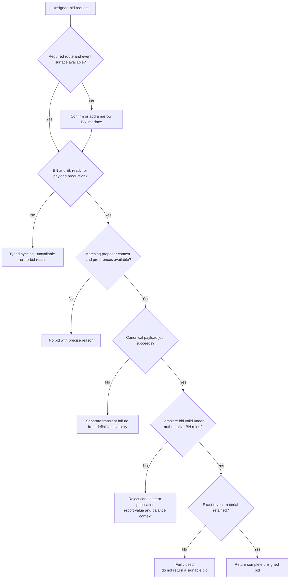

#### `BN-01` — Confirm or add the BN route/event surface needed by `lodestar builder`

**Why:** The current specifications do not yet expose every interface needed by the intended Builder workflow, and implementing the flow should help finish those specifications.

**Tasks**

- [ ] Begin from the maintained [Beacon API Builder flow](https://github.com/ethereum/beacon-APIs/blob/master/validator-flow.md#builder-optional) and current [`getExecutionPayloadBid` schema](https://github.com/ethereum/beacon-APIs/blob/master/apis/validator/execution_payload_bid.yaml), then audit the pinned `unstable` SHA for unsigned-bid, envelope, publication, Builder-state, and block-event support.
- [ ] Re-audit merged [builder-specs #165](https://github.com/ethereum/builder-specs/pull/165)/[#166](https://github.com/ethereum/builder-specs/pull/166), merged [beacon-APIs #630](https://github.com/ethereum/beacon-APIs/pull/630) at `159622d`, merged [keymanager-APIs #92](https://github.com/ethereum/keymanager-APIs/pull/92), and merged [Lodestar #9832](https://github.com/ChainSafe/lodestar/pull/9832) at `57572140f8`. Do not use the closed-unmerged #9594 shape.
- [ ] Treat the current `/eth/v1/validator/execution_payload_bids/{slot}/{builder_index}` location as a known specification gap and implement/propose its move to the `/builder` namespace, tracked in [beacon-APIs #595](https://github.com/ethereum/beacon-APIs/issues/595).
- [ ] Trace `prepareNextSlot`, the current payload-job lifecycle, and the unsigned-bid route before selecting the smallest clean trigger for external-Builder payload preparation.
- [ ] Define a reviewed preparation/candidate contract that tells the BN which target slot and head view to prepare, carries the configured Builder execution fee recipient before payload work begins, and later returns the complete bid; validate the address as a 20-byte execution address and propose the resulting contract upstream.
- [ ] Track the accepted-bid notification gap in [beacon-APIs #599](https://github.com/ethereum/beacon-APIs/issues/599) and prefer a standard block-event plus block-retrieval flow unless evidence shows a dedicated event is required.
- [ ] Close or narrow the issue when upstream already supplies the required capability.
- [ ] Put new Builder-only operations under `/builder` and chain/publication operations under `/beacon`; isolate any temporary pre-spec behavior behind typed adapters rather than a `/lodestar` namespace.
- [ ] Reuse current JSON/SSZ codecs, headers, auth/exposure conventions, and error patterns.
- [ ] Validate active Builder identity, fork, head compatibility, target proposal slot, and request parameters; keep candidate preparation separate from the configurable bid-publication schedule.
- [ ] Prevent accidental duplicate in-flight payload work from the single local Builder process.
- [ ] Return precise invalid-request, no-bid, syncing, unavailable, and internal-error states.
- [ ] Open or update the relevant Beacon API proposal with implementation evidence instead of leaving a useful interface Lodestar-only.

**Done when:** The pinned Lodestar baseline exposes a reviewed, typed, bounded interface sufficient for the intended Builder happy path.

#### Historical `BN-02`: Reuse the canonical post-Gloas payload-production path (superseded)

**Why:** Proposer preferences, `targetGasLimit`, FULL/EMPTY parent choice, Engine API calls, execution requests, blobs, and payload value already belong to Lodestar's post-Gloas payload path.

**Tasks**

- [ ] Trace the pinned self-build/produce-block path and identify the smallest reusable payload-job seam.
- [ ] Integrate the reviewed preparation trigger with the existing `prepareNextSlot`/payload-job machinery rather than assuming that fetching a bid can synchronously start and finish payload construction.
- [ ] Reuse the connected BN's proposer head and FULL/EMPTY choice rather than accepting arbitrary sidecar parent input.
- [ ] Reuse the corrected FULL-parent production path from [Lodestar #9736](https://github.com/ChainSafe/lodestar/pull/9736) if it has landed, including the correct state for operations and reward calculation; do not create a parallel workaround.
- [ ] Reuse proposer preferences for `targetGasLimit` and for the proposer's `bid.fee_recipient`, but not for the execution payload's `feeRecipient`/coinbase.
- [ ] Thread the Builder execution fee recipient from sidecar config through the preparation/candidate contract into `forkchoiceUpdated` payload attributes; do not fall back to Lodestar's proposer/self-build fee-recipient cache.
- [ ] Assert that execution rewards accrue to the configured Builder address. A wrong payload coinbase is a financial-loss configuration error and must fail a focused accounting test.
- [ ] Reuse safe/finalized handling, `engine_forkchoiceUpdated`, `engine_getPayload`, execution requests, blobs, proofs/cells, and execution-payload value.
- [ ] Prepare early enough for the target proposal slot without copying the payload builder; keep payload preparation and candidate readiness separate from the sidecar's configurable pre-slot publication schedule.
- [ ] Trace and test the existing payload-job/cache cleanup after a source-BN head change before considering any new cancellation mechanism.
- [ ] Use the existing BN sync guard so payload work is not prepared for a far-behind head and require the EL to be synced before treating candidate production as available.
- [ ] Separate transient BN/EL failure from no-bid and definitive invalidity.
- [ ] Add focused tests proving that the external route uses the canonical parent/preferences path and surfaces syncing or payload-production failure clearly.

**Done when:** External-Builder candidate production reuses the authoritative BN/EL preparation path while overriding the self-build fee-recipient input with the configured Builder payload fee recipient.

#### Historical `BN-03`: Construct the complete payload-value external-Builder bid (superseded)

**Why:** The first Builder needs a real valid bid, not a research policy. The Lodestar team selected payload value as the simplest baseline; the implementation must verify the accounting wiring before describing that baseline as zero-profit.

**Tasks**

- [ ] Construct all fork-correct bid fields from the canonical payload result and beacon context.
- [ ] Implement a small `computeBidValue(payloadValue)` strategy function whose initial implementation returns the full execution-payload value.
- [ ] Convert value units using one documented canonical conversion.
- [ ] Set `bid.fee_recipient` from the matching proposer preferences. Treat it as the proposer payment address and the execution payload's `feeRecipient`/coinbase as a Builder-controlled revenue address; reject any configuration that uses the proposer address for both roles.
- [ ] Set `execution_payment = 0` for the p2p trustless bid.
- [ ] Use BN-authoritative Builder balance and pending obligations to decide per-bid coverability.
- [ ] Reject/return no-bid when the Builder cannot cover the bid; never silently lower the value.
- [ ] Expose a typed insufficient-funds reason that the sidecar can log as an operator warning/error, including the latest BN-reported balance when available and explaining that external tooling and the Builder withdrawal/execution address must perform the top-up.
- [ ] Do not add a first-iteration low-balance threshold or runway predictor; precise early warning becomes follow-up work because pending obligations and future multi-key operation complicate it.
- [ ] Use current SSZ types and keep future fork-specific construction behind a narrow adapter.
- [ ] Preserve `execution_payment`, bid `gas_limit`, proposer `targetGasLimit`, and every other SSZ-root `uint64` input as exact `UintBn64`/`bigint` values through construction, response encoding, caching, and diagnostics; never narrow unbounded values to JavaScript `number`.
- [ ] Add exact-integer tests at `2^53 - 1`, `2^53`, `2^53 + 1`, and `uint64` maximum, including a signing-root comparison.
- [ ] Add field, unit, balance, parent, `prev_randao`, gas-limit, request-root, blob-commitment, distinct-address, and wrong-payload-coinbase tests.

**Done when:** A real payload produces one complete fork-correct payload-value bid with `execution_payment = 0`, authoritative balance validation, and tested fee-recipient/accounting behavior.

#### Historical `BN-04`: Reuse the stateful reveal cache and evict after reveal (superseded)

**Why:** The source BN already owns the payload and blob material in the stateful flow. The first iteration should reuse that model rather than create a second durable Builder cache.

**Tasks**

- [ ] Audit and reuse the existing stateful block-production payload/envelope cache.
- [ ] Retain the exact payload, execution requests, parent context, blobs, commitments, and proofs needed for the selected envelope.
- [ ] Ensure the existing cache covers the preparation-to-reveal window until successful publication or bounded expiry.
- [ ] Derive the exact envelope for the selecting beacon-block root without mutating the committed payload.
- [ ] Return clear available, missing, expired, and commitment-mismatch states for the same source BN.
- [ ] Remove the cached payload package after successful reveal publication.
- [ ] Verify that stale old-head payload work follows the existing BN cleanup/expiry path; add no separate Builder-side cancellation or cache unless the audit exposes a concrete gap.
- [ ] Bound expiry and storage use without adding first-iteration HA or crash durability.
- [ ] Add successful lookup, missing/mismatch, bounded expiry, duplicate lookup, and post-reveal eviction tests.

**Done when:** The source BN serves the exact stateful envelope for the happy path and releases the payload package immediately after successful reveal.

### Epic C — Builder bid, selection, reveal, and outcome

| ID | Individual issue | Lane | Target | Effort | Ready after |
|---|---|---|---:|---:|---|
| `BID-01` | Sign and submit one-shot Builder bids | Builder | W12 | M | `SIGN-01`, `API-01`, `STORE-01`, `BID-CORE-01`, `BN-PUB-01` |
| `SELECT-01` | Match a selected block to retained local payload material | Builder | W13 | M | `API-02`, `BID-01` |
| `REV-01` | Build, sign, and submit the stateless envelope immediately | Builder/BN | W13 | M | `SELECT-01`, `SIGN-01`, `STORE-01` |
| `OUT-01` | Verify PTC and trustless-payment outcomes | Shared | W15 | M | `E2E-01` |
| `DATA-01` | Complete the non-zero-blob/data-column path | Shared | W15 | M | `E2E-01`, `STORE-01` |
| `QA-01` | Close essential operator-diagnostic and fail-closed cases | Shared | W16 | M | `E2E-01`, `OUT-01`, `DATA-01` |
| `REL-01` | Add bounded Builder restart and event recovery | Builder/BN | W16 | M | `E2E-01`, `API-02`, `STORE-01`, `REV-01` |

#### Epic C failure and recovery map

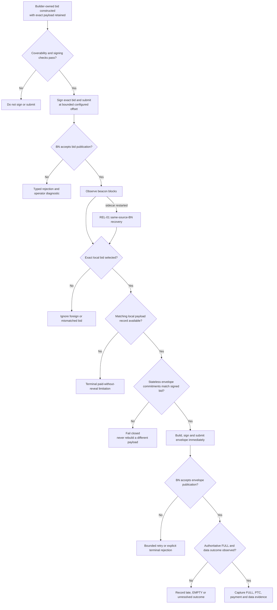

#### Historical `BID-01` task detail (superseded)

The active BID-01 scope signs the complete Builder-owned bid from `BID-CORE-01`, requires a matching `STORE-01` record before publication, and submits through the validation and flood-publication path merged in Lodestar #9914. Linear contains the current checklist. The BN-authored unsigned-bid tasks below remain design history only.

**Why:** The BN should hand the sidecar a complete bid. The sidecar only sanity-checks and signs that exact object, then publishes it with an explicit bounded timing policy.

**Tasks**

- [ ] Derive the target proposal slot from BN chain/config data and request preparation early enough for the complete bid to be ready before its publication time.
- [ ] Include the configured Builder execution fee recipient in the preparation/candidate flow and fail before triggering payload work when it is absent or malformed.
- [ ] Audit the unsigned-bid API path end to end on the pinned SHA; do not assume the currently specified route is implemented or tested in Lodestar.
- [ ] Consume the source BN's standard head SSE view and submit through the head-compatible API validation merged in [Lodestar #9739](https://github.com/ChainSafe/lodestar/pull/9739).
- [x] Audit the epoch-boundary head recomputation merged in [Lodestar #9864](https://github.com/ChainSafe/lodestar/pull/9864), record NC's [#9813](https://github.com/ChainSafe/lodestar/pull/9813) as closed without merge, and pin head-change tests to the landed #9864 behavior.
- [ ] Allow a fresh bid for a new parent tuple after the source BN head changes. An already-published old-parent bid remains published; stale BN payload work follows the existing cleanup/expiry behavior verified in `BN-02` and `BN-04`.
- [ ] Make publication time configurable relative to the target proposal slot, publish at a bounded pre-slot time rather than at the slot boundary, and pin the first default from repeatable Kurtosis timing evidence.
- [ ] Treat no-bid, syncing, missing preferences, insufficient balance, timeout, and internal errors distinctly.
- [ ] Verify the expected chain/source BN, active Builder index, slot, fork/domain, and `execution_payment = 0`.
- [ ] Sanity-check the complete BN-produced bid, but do not construct it, independently recompute payload value, or mutate it.
- [ ] Preserve exact `uint64` fields through decoding, local sanity checks, the signed-bid map, SSZ hashing/signing, API publication, and diagnostics; cover the `2^53` boundary and `uint64` maximum.
- [ ] Sign the exact returned bid with the local Builder key.
- [ ] Keep signed bids keyed by Builder, slot, `parent_block_hash`, and `parent_block_root` in the running-process map needed for exact selection matching.
- [ ] Publish through the typed BN route at the configured offset; record candidate-ready and publication timestamps.
- [ ] Surface accepted, duplicate, rejected, and transient responses clearly.
- [ ] When the BN rejects for insufficient balance, include the latest BN-reported Builder status/balance when available and log that top-up is external and must be performed through the Builder withdrawal/execution address.
- [ ] Add focused missing/wrong fee-recipient, wrong-domain, wrong-builder, malformed-bid, insufficient-balance, duplicate, head-change resubmission, timing-offset, and publication-error tests.
- [ ] Add an epoch-boundary regression for the narrow direct-parent rejection merged in [Lodestar #9756](https://github.com/ChainSafe/lodestar/pull/9756), without enforcing the broader same/next-slot restriction that was retracted during review.

**Done when:** One complete BN-produced payload-value bid is sanity-checked, signed unchanged, published under the bounded timing configuration, and available for exact local selection matching.

#### `SELECT-01` — Detect an exact local bid in a beacon block

**Why:** Reveal begins when the Builder sees a beacon block containing its bid; no strategic head/import policy is required for the first iteration.

**Tasks**

- [ ] Start from the BN block event and retrieve the signed block.
- [ ] Check that the selected bid is for the configured Builder and exactly matches a locally signed bid on the normal in-process path.
- [ ] Ignore foreign or non-matching bids.
- [ ] Pass the selecting block root directly to the normal stateful reveal flow.
- [ ] Record selection timing and identity for diagnostics.
- [ ] Add exact-match, foreign-bid, mismatch, duplicate-event, and event-before-block tests.

**Done when:** Seeing a valid block containing the local bid starts one idempotent stateful reveal workflow for that block root.

#### Historical `REV-01` task detail (superseded)

The active REV-01 scope loads the exact local `PayloadStore` record, builds and signs the stateless envelope, and submits it through the source BN. The stateful BN-envelope retrieval tasks below remain design history only.

**Why:** The accepted first-iteration rule is simple: reveal as soon as the selected block is seen and rely on the BN for publication validation.

**Tasks**

- [ ] Retrieve the unsigned envelope from the same source BN for the selecting block root.
- [ ] Check that slot, Builder index, block hash, execution-requests commitment, and fork context match the selected signed bid.
- [ ] Sign the exact envelope with the local Builder key.
- [ ] Publish immediately through the stateful same-BN path using the pinned request shape and explicitly request `consensus_and_equivocation` broadcast validation.
- [ ] Keep proposer-equivocation detection at the BN publication boundary, reuse merged [Lodestar #9757](https://github.com/ChainSafe/lodestar/pull/9757), and treat any remaining gap as an upstream BN capability issue rather than adding a Builder-side withholding rule.
- [ ] Keep duplicate publication idempotent for the exact same message.
- [ ] Attempt publication immediately and keep retries bounded. If the protocol deadline passes, record the reveal as late and follow the BN response; do not treat the deadline itself as a strategic withholding trigger or retry indefinitely.
- [ ] Add success, mismatch, cache miss, duplicate, BN rejection, timeout, late, and proposer-equivocation tests.

**Done when:** An exact selected bid causes an immediate bounded publication attempt, with success or a precise BN/cache/late outcome recorded.

#### `OUT-01` — Verify PTC and trustless-payment outcomes

**Why:** After the first bid → reveal → FULL loop works, the project still needs evidence that the protocol’s timeliness and payment paths observed it correctly.

**Tasks**

- [ ] Audit the PTC and state/accounting observation surface on the pinned SHA.
- [ ] Correlate bid, selecting block, envelope, payload, and Builder identity.
- [ ] Capture PTC payload-attestation evidence and prove EL-invalidated payloads cannot retain valid support, using the final dispositions of Lodestar #9332 and #9637.
- [ ] Exercise mainnet-scale pending-payment and quorum arithmetic covered by Lodestar #9350, including a value beyond JavaScript safe-integer precision.
- [ ] Prove that execution-payload value accrues to the configured Builder execution fee recipient while `bid.fee_recipient` identifies the proposer payment address, then prove that one non-zero trustless bid produces the expected pending-payment, Builder-balance, proposer fee-recipient, and proposer-accounting transition.
- [ ] Record the paid-without-reveal offline case as a documented known failure, not as a core HA test.

**Done when:** One correlated evidence record proves the expected PTC and trustless-accounting outcomes for a successful local reveal.

#### `DATA-01` — Complete the non-zero-blob/data-column path

**Why:** The EL may include blobs even in the first working loop, and the BN must handle them when present. The final core additionally forces a non-zero-blob case so stateful reveal proves real blob/data commitments.

**Tasks**

- [ ] Produce at least one candidate containing non-zero blobs.
- [ ] Verify commitments and required blob/KZG/data-column source material survive payload → bid → stateful reveal.
- [ ] Publish through the stateful envelope path and allow the BN to attach/gossip cached data.
- [ ] Confirm matching commitments, data availability, and FULL.
- [ ] Add focused missing/corrupt proof, wrong commitment, and cache-miss tests.
- [ ] Keep stateless/multi-BN publication conditional.

**Done when:** A selected non-zero-blob bid reveals through the stateful path and reaches authoritative FULL/data-available evidence.

#### `QA-01` — Close essential operator-diagnostic and fail-closed cases

**Why:** Edge-case hardening follows the happy path, but obvious operator failures still need to be understandable before handoff.

**Tasks**

- [ ] Cover invalid/locked key, wrong chain, inactive Builder, unsupported fork, missing preferences, and BN/EL syncing.
- [ ] Cover Builder-status/balance diagnostics and insufficient balance with a clear external-top-up warning; do not claim predictive low-balance alerting.
- [ ] Cover malformed candidate, commitment mismatch, missing reveal material, publication rejection, and late reveal.
- [ ] Cover Engine `INVALID` without wedging fork choice, and prove attestations and aggregates do not support an EL-invalidated Gloas payload, using Lodestar #9332 and #9637 as upstream evidence.
- [ ] Reuse the Deathstar proposer-equivocation feature and `consensus_and_equivocation` behavior from [Lodestar #9757](https://github.com/ChainSafe/lodestar/pull/9757), then run the stored [PR #9757 Kurtosis fixture](https://github.com/krisoshea-eth/lodestar-eip-7732-builder-docs/blob/main/docs/test-plans/pr-9757-builder-equivocation.yaml) with Lodestar Builder and assert that the BN refuses envelope publication for the equivocated proposal.
- [ ] Cover basic duplicate event/request/publication idempotency.
- [ ] Document the Builder/BN-offline-after-selection paid-without-reveal failure without implementing or simulating HA.
- [ ] Produce one evidence index mapping each retained core failure to a named test or deterministic assertion.

**Done when:** The working loop is diagnosable, the essential fail-closed cases—including BN-owned proposer-equivocation rejection—are tested, and advanced reliability/adversarial work is clearly deferred.

#### `REL-01` — Add bounded same-source-BN restart and event recovery

**Why:** A sidecar restart should not force a paid-without-reveal failure when the configured source BN is still online and still holds the exact reveal material. This is bounded recovery, not high availability.

**Tasks**

- [ ] Reconnect to the same verified source BN and resume block-event consumption after a sidecar restart.
- [ ] On the normal path, keep using the in-process locally signed-bid record for exact matching.
- [ ] When that record is absent after restart, require the block bid to use the configured active Builder index and verify its signature against the configured Builder public key.
- [ ] Retrieve the stateful envelope from the same source BN for the selecting block root and verify all bid/envelope commitments before signing.
- [ ] Preserve source affinity between the SSE stream and every correlated block/reveal request. Do not allow generic API-client fallback to evaluate or reveal against a different BN without explicit source provenance and a reviewed trust model.
- [ ] Reconcile a bounded missed-event window after reconnect and while the stream remains connected. The Beacon API event contract defines no SSE `id` or `Last-Event-ID` resumption, and merged Lodestar #9872 intentionally drops one event that cannot be serialized while preserving the connection, so recovery cannot depend only on reconnect.
- [ ] Deduplicate replayed block events and repeated publication attempts.
- [ ] Fail explicitly when the source BN is different, offline, or has lost/expired the reveal material; never reconstruct a replacement payload.
- [ ] Add restart-before-selection, bounded missed-event reconciliation, duplicate publication, wrong Builder signature, source-affinity/fallback rejection, source-cache-loss, and connected/reconnecting shutdown tests.

**Done when:** Restarting only the sidecar does not prevent reveal when the same source BN retains the exact committed material; no event or reveal request silently crosses source BNs, and loss of the source BN or its cache remains an explicit terminal failure.

### Epic D — Demonstration, integration, security, and handoff

| ID | Individual issue | Lane | Target | Effort | Ready after |
|---|---|---|---:|---:|---|
| `E2E-01` | Package the first repeatable local Kurtosis happy-path demonstration | Shared | W14 | M | `REV-01` |
| `INT-01` | Add ethereum-package and buildoor integration | Shared | W17 | M | Gate D |
| `SEC-01` | Complete the final security and resource review | Shared | W20 | M | Gate D; integration findings available |
| `HANDOFF-01` | Complete documentation, EPF outputs, PR shaping, and maintainer handoff | Shared | W21+ | M | `SEC-01` |

#### Epic D failure and recovery map

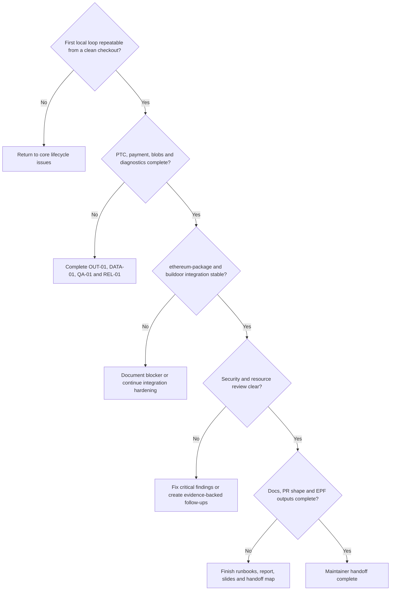

#### `E2E-01` — Package the first repeatable local Kurtosis happy-path demonstration

**Why:** The team asked for the simplest working happy path before broader edge handling.

**Tasks**

- [ ] Provide one-command/script launch and teardown.
- [ ] Repeat real payload → payload-value bid → selection → immediate stateful reveal → FULL.
- [ ] Do not inject blobs solely to satisfy the first demonstration, but handle and publish any blob/data-column material the EL naturally includes.
- [ ] Assert active Builder, synced BN/EL, a distinct configured Builder execution fee recipient, deterministic proposer selection (`--builder.selection=builderalways` or `maxprofit` with a pinned Builder boost factor), and inactive breaker.
- [ ] Capture machine-readable lifecycle logs and a short human-readable runbook.
- [ ] Do not block this issue on PTC/payment evidence, non-zero blobs, devnet deployment, HA, or advanced failure handling.

**Done when:** A clean checkout repeatedly completes the basic honest Builder loop in Kurtosis and the evidence is understandable by another contributor.

#### `INT-01` — Add ethereum-package and buildoor integration

**Why:** Broader orchestration and coexistence should follow the working local loop, not block it.

**Tasks**

- [ ] Add native `lodestar builder` participant/config support to ethereum-package if it does not already exist.
- [ ] Reuse buildoor configuration patterns rather than creating an unrelated orchestration model.
- [ ] Run Lodestar Builder and buildoor together and demonstrate at least one predictable selection.
- [ ] Pin all images, configs, keys, and feature flags.
- [ ] Attribute failures separately to Builder, BN API, BN/EL path, proposer selection, data propagation, or fixture.
- [ ] Record whether a current public devnet is ready for a separate conditional deployment attempt.

**Done when:** ethereum-package can launch `lodestar builder` and buildoor coexistence is demonstrated locally.

#### `SEC-01` — Complete the final security and resource review

**Why:** Even a simple first iteration handles secret keys and financial commitments and can trigger expensive BN/EL work.

**Tasks**

- [ ] Review key isolation, chain/source-BN trust, secret handling, and API timeouts.
- [ ] Review duplicate in-flight payload work, payload-job concurrency, response bounds, and cache eviction.
- [ ] Review value conversion, BN-authoritative balance rejection, exact commitment matching, and publication-validation claims.
- [ ] Confirm that no hidden remote-signer, HA, strategic-withholding, or timing-game behavior entered core beyond the explicit bounded bid-publication offset.
- [ ] Merge current `unstable`, rerun critical evidence, and resolve or ticket findings.

**Done when:** Key, trust, value, commitment, cache, hostile-input, and resource risks are resolved or represented by evidence-backed follow-ups.

#### `HANDOFF-01` — Complete documentation, EPF outputs, PR shaping, and maintainer handoff

**Why:** The final result must be operable and reviewable by maintainers who did not build it.

**Tasks**

- [ ] Finalize operator config, local-key, lifecycle, metrics, troubleshooting, Kurtosis, and ethereum-package runbooks.
- [ ] Restore the Builder CLI page to the public documentation sidebar only after the command is functionally ready and `REVIEW-01` has closed, reversing the temporary [Lodestar #9770](https://github.com/ChainSafe/lodestar/pull/9770) hide. The board-level closure of `CLI-01` alone does not satisfy this publication gate.
- [ ] Finalize developer architecture, issue/PR map, test guidance, known limitations, and conditional packages.
- [ ] Update the Living Technical Note with accepted decisions, final code paths, current baseline, and evidence links.
- [ ] Complete the EPF report and refresh the existing presentation.
- [ ] Split the shared branch into reviewable PRs when maintainers request it.
- [ ] Separate merged, open, blocked, deferred, and optional work.
- [ ] Disclose AI assistance according to Lodestar contribution requirements.

**Done when:** Maintainers receive current code/PRs, runbooks, architecture, evidence, final report/slides, and an explicit follow-up backlog.

<a id="coverage-map"></a>

## 7. Coverage map

| Required capability | Primary issues | Completion evidence |
|---|---|---|
| Official Lodestar Builder process | `CLI-01` | `packages/builder` and `lodestar builder` run independently |
| Local Builder identity/key | `SIGN-01`, `API-01` | Active Builder resolved; valid bid/envelope signatures |
| Deterministic environment | `ENV-01` | Clean pinned Kurtosis launch |
| BN API/event surface | `API-01`, `API-02`, `BN-01`, `ATTR-SPEC-01`, `ATTR-01` | Typed chain, proposer, payload-attributes, publication, and block-observation inputs exist or have tracked upstream proposals |
| Direct Engine payload production | `EL-ARCH-01`, `PAYLOAD-01` | One supported Engine ownership model produces a fork-correct payload with bounded work |
| Builder status, coverable bid, and balance inputs | `API-01`, `PAYLOAD-01`, `BID-CORE-01` | Active status and balance inputs are visible; Builder revenue and proposer payment addresses are distinct; the local bid is coverable and uses `execution_payment = 0` |
| Exact stateless reveal material | `STORE-01` | Exact payload, blob, request, proof, and fork material is available until reveal or expiry and evicted after success |
| Bid construction, signing, and publication | `BN-PUB-01`, `BID-CORE-01`, `BID-01` | The Builder constructs and signs a stored, coverable bid and submits it through the reviewed BN validation and flood-publication path |
| Selection detection | `API-02`, `SELECT-01` | Exact local bid found in signed block |
| Immediate reveal | `REV-01` | Envelope published immediately with `consensus_and_equivocation`; publication validation stays BN-owned |
| First working local loop | `E2E-01` | Repeatable bid → selection → reveal → FULL |
| PTC/payment evidence | `OUT-01` | Correlated protocol/accounting evidence |
| Blobs/data columns | `DATA-01` | Non-zero-blob selected payload reaches FULL/data available |
| Essential failure diagnostics | `QA-01` | Named tests and explicit operator errors |
| Bounded Builder restart recovery | `REL-01` | The accepted first durability model recovers or explicitly terminates when local reveal material is unavailable |
| Broader local integration | `INT-01` | ethereum-package/buildoor coexistence |
| Security/handoff | `SEC-01`, `HANDOFF-01` | Review, docs, PRs, report, slides, follow-up backlog |

<a id="core-acceptance-scenarios"></a>

## 8. Core acceptance scenarios

The order is intentional: first prove the simple working loop, then add protocol-complete evidence and selected diagnostics.

| Scenario | Required outcome | Owning issues |
|---|---|---|
| Wrong chain/source BN | Not Ready; no signing/publication | `API-01`, `CLI-01` |
| Missing/invalid/locked key | Fail before Ready | `SIGN-01` |
| Builder absent/inactive/wrong version | Typed failure; no candidate | `API-01`, `BN-01` |
| Missing required BN API/event | Add a narrow interface in the intended `/builder` or `/beacon` namespace and propose it upstream, or close with upstream evidence | `BN-01`, `API-02` |
| BN/EL syncing or payload-build failure | Explicit no-bid/error result | `BN-01`, `PAYLOAD-01`, `BID-01` |
| Missing/mismatched proposer preferences | No bid; precise reason | `BN-01`, `PAYLOAD-01`, `BID-CORE-01` |
| Insufficient Builder balance or cover | No bid; report current inputs and required external top-up without silently lowering a committed value | `API-01`, `BID-CORE-01`, `BID-01`, `QA-01` |
| Missing/malformed Builder execution fee recipient | No preparation/candidate request and no payload work | `CLI-01`, `BID-01` |
| Builder payload fee recipient | May be any execution address controlled by the Builder, need not match withdrawal credentials, and must not be the proposer address | `CLI-01`, `BN-01`, `PAYLOAD-01`, `OUT-01` |
| Distinct Builder/proposer payment addresses | Payload rewards accrue to the configured Builder address; `bid.fee_recipient` remains the proposer address | `PAYLOAD-01`, `BID-CORE-01`, `OUT-01` |
| Valid candidate | Complete Builder-owned bid is coverable, has matching retained payload material, and uses `execution_payment = 0` | `STORE-01`, `BID-CORE-01`, `BID-01` |
| Default Lodestar local payload would win | Happy-path fixture forces Builder selection with `--builder.selection=builderalways` or `maxprofit` plus a documented boost factor | `ENV-01`, `E2E-01` |
| Source BN parent or head input changes before publication | Build a new bid for the new compatible parent tuple; bound and expire stale local payload work | `API-01`, `PAYLOAD-01`, `STORE-01`, `BID-01` |
| Wrong domain/fork/Builder | No signature/publication | `SIGN-01`, `BID-01` |
| Foreign or mismatched selected bid | No reveal | `SELECT-01` |
| Exact local bid selected | Immediate stateless envelope construction and submission from retained material | `SELECT-01`, `STORE-01`, `REV-01` |
| BN publication rejection | Explicit BN rejection; no Builder-side withholding/equivocation policy | `REV-01`, `QA-01` |
| Proposer equivocation or attempted payload unbundling | Deathstar creates the condition; `consensus_and_equivocation` causes the BN to refuse envelope publication | `REV-01`, `QA-01` |
| Missing/mismatched reveal material | Fail closed; never rebuild a different payload | `STORE-01`, `REV-01`, `QA-01` |
| Successful reveal | Payload-store entry removed after publication | `STORE-01`, `REV-01` |
| Reveal crosses deadline | Late status is recorded; the BN result is authoritative; no strategic withholding or unlimited retry | `REV-01`, `QA-01` |
| First complete loop | Repeatable local bid → selection → reveal → FULL | `E2E-01` |
| Non-zero blobs/data | Matching commitments reach FULL/data available | `DATA-01` |
| PTC observation | Correlated payload-attestation evidence | `OUT-01` |
| Trustless payment | Expected Builder/proposer accounting transition | `OUT-01` |
| Sidecar restarts after bid publication; source BN/cache intact | Verify configured Builder signature, recover exact envelope from same BN, and reveal idempotently | `REL-01` |
| Source BN offline or reveal cache lost after selection | Explicit terminal paid-without-reveal limitation; no reconstruction or HA claim | `REL-01`, `QA-01`, `HANDOFF-01` |

### Cross-cutting failure taxonomy

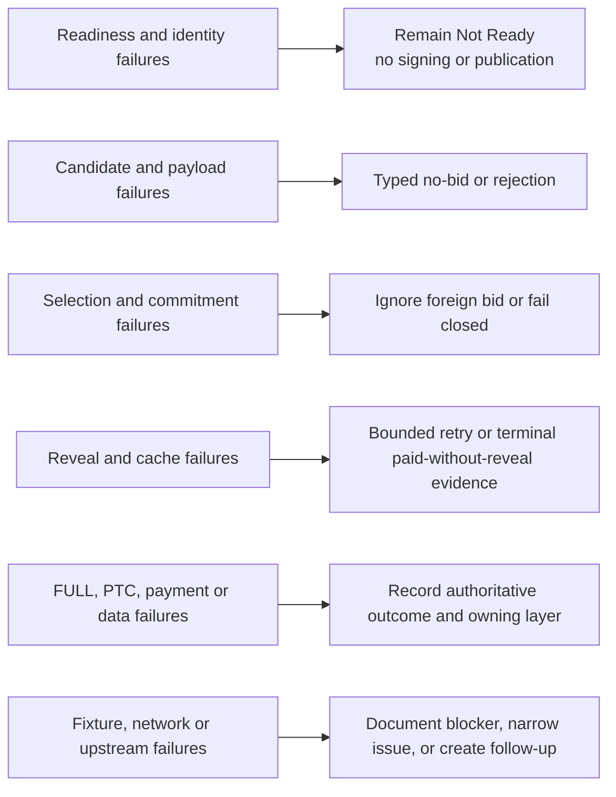

Failure-handling rule:

```text
Never convert uncertainty into success.
Attribute the failure to the owning layer.
Keep retries bounded.
Preserve enough evidence to reproduce the result.
Move production hardening to a follow-up only after the core behavior is explicit.
```

<a id="conditional-strong-and-stretch-packages"></a>

## 9. Conditional strong and stretch packages

Create one **Conditional** parent board item for each proposal-relevant package below. Child issues are created only when a package is activated under the rules below; `EXT-DEVNET-01` may use the explicit Week-18 early-entry exception.

Selection rules:

- core correctness, documentation, security, and handoff take precedence;
- at most one package is selected unless the core finishes materially ahead of forecast;
- `EXT-DEVNET-01` is the only package that may be activated before the Week-19 decision, and only when `INT-01` closes early and a suitable devnet exists; an early activation ordinarily counts as the selected package;
- the Week-19 decision may promote one row from the deferred-hardening inventory into a newly scoped Conditional package, which then counts as the selected package;
- the Lodestar team may reprioritize the package after reviewing core results;
- every selected or promoted package needs bounded tasks, one owner/reviewer, and a stop rule.

### Conditional-package decision tree

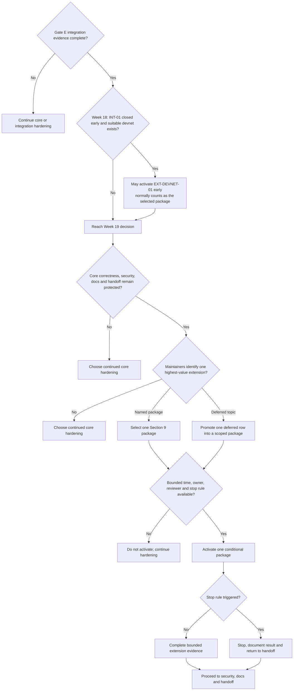

### `EXT-DEVNET-01` — Deploy the working Builder to a current devnet

**Entry criteria:** local Kurtosis and ethereum-package/buildoor paths are stable; `INT-01` has closed early enough to leave capacity; and a suitable devnet is available. This is the only conditional package that may be activated in Week 18 before the normal extension decision.

**Candidate work:** pin network images/config, provision active Builder credentials through external tooling, deploy `lodestar builder`, capture bid/selection/reveal/FULL evidence, document network-specific blockers.

**Stop rule:** devnet availability must not delay the local core or handoff.

### `EXT-POLICY-01` — Improve bid policy and buildoor competition

**Entry criteria:** core payload value and accounting evidence stable; buildoor fixture works.

**Candidate work:** fixed shade/cap, competing-bid observation, repeated controlled runs, profitability/accounting report, policy metrics.

**Evidence:** explainable policy changes produce predictable selection behavior without claiming production-optimal bidding.

**Stop rule:** no open-ended auction/MEV research inside the implementation schedule.

### `EXT-OBS-01` — Add a Lodestar Builder Grafana dashboard

**Entry criteria:** the core Builder metrics and label cardinality are stable enough to avoid building panels against temporary names.

**Candidate work:** add one small Lodestar dashboard covering candidate outcomes, bid-ready-to-publication timing, selection, reveal, FULL/EMPTY outcome, source-BN errors, and bounded Builder status/balance visibility; include it in the local Kurtosis runbook.

**Evidence:** a clean local run imports the dashboard and the happy-path lifecycle produces understandable panels without unbounded or identity-sensitive labels.

**Stop rule:** keep the dashboard a simple stretch package; do not delay lifecycle correctness, protocol evidence, or handoff for observability polish.

### `EXT-FOCIL-01` — Adapt the Builder for Heze / FOCIL

**Entry criteria:** Gloas core stable; supported Heze/FOCIL branch identified; bid and Engine API shapes sufficiently settled. Merged Lodestar #9935 and open #9936 narrow the future baseline but do not activate this package.

**Candidate work:** inclusion-list input/store, constrained payload construction, `inclusion_list_bits`, fork-aware signing, cache context, tests.

**Stop rule:** do not spend the project rebasing unrelated FOCIL work.

### `EXT-BUILDER-API-01` — Add the staked Builder API server path

**Entry criteria:** core payload/signing model stable; specs and existing Lodestar work sufficiently settled; maintainers want it.

**Current upstream input:** [builder-specs #165](https://github.com/ethereum/builder-specs/pull/165) and [beacon-APIs #630](https://github.com/ethereum/beacon-APIs/pull/630) remain active. [Lodestar #9594](https://github.com/ChainSafe/lodestar/pull/9594) closed without merge on 5 August, so activation must use the replacement Lodestar implementation after the specifications settle. Do not pull `DOMAIN_REQUEST_AUTH` or request-signature verification into the core sidecar merely to anticipate it.

**Candidate work:** bid endpoint, preferences/auth, request-auth domain and signature verification where required by the settled specification, signed-block input, shared adapter, bounds, and conformance/interoperability tests.

**Stop rule:** do not create a second payload/cache implementation.

### `EXT-PREP-01` — Add advanced FULL/EMPTY-aware payload preparation

**Entry criteria:** canonical payload seam stable and measured latency shows value.

**Candidate work:** prebuild scheduler, FULL/EMPTY candidates, cancellation, multiple payload IDs, resource metrics, and the epoch-boundary/reorg cases demonstrated by Lodestar #9944, #9929, #9233, and #9723.

**Stop rule:** stop if stale work or candidate explosion cannot be bounded.

### `EXT-ADVERSARIAL-01` — Add one Builder-related adversarial scenario

**Entry criteria:** honest path stable; isolated-network gating exists; maintainers select one useful scenario and its home.

**Candidate work:** choose exactly one direct Builder withholding/late-reveal behavior or a Deathstar chaos behavior not already covered by the core BN-owned proposer-equivocation test; add a deterministic fixture, outcome assertions, documentation, and safety gating.

**Stop rule:** do not create multiple adversarial workstreams or spend the project rebasing unrelated Deathstar code.

### `EXT-UI-01` — Add a runtime Builder/Deathstar configuration UI

**Entry criteria:** safe CLI and authenticated runtime configuration API exist; maintainers request a UI.

**Stop rule:** no UI before the command/API behavior is stable.

### Deferred hardening and product follow-ups

The happy-path ordering does not delete useful defensive work. It parks that work behind the first repeatable loop so it can be scheduled with evidence instead of speculation. These items are retained in the plan but are not created as Week-7 core issues unless maintainers explicitly promote them.

| Deferred topic | Why it remains useful | Trigger for a future issue |
|---|---|---|
| Full HA and redundant Builder instances | Avoid paid-without-reveal failures when one process fails | Core and `REL-01` are stable; operator deployment model is agreed |
| Multi-BN/stateless reveal failover | Recover when the source BN is unavailable or loses its stateful cache without mixing an SSE event from one BN with block or reveal material from another | Stateful path stable; stateless envelope contents, cache transfer, source provenance, and trust/consistency contracts are pinned |
| Durable lifecycle journal and longer recovery window | Recover across longer outages and process/host restarts | Measured failure data shows bounded same-BN recovery is insufficient |
| Remote signer and multiple Builder keys | Production key isolation and operational scale, but no Builder remote-signer contract is currently defined | A Builder signer/key-management specification or supported signer exists; do not infer the contract from today's incomplete validator remote-signing behavior |
| Proactive low-balance/runway warnings | Warn before the BN starts rejecting bids instead of only reporting the rejection | Per-key pending-obligation semantics and the intended multi-key operator model are defined; add thresholds or runway logic only then |
| Advanced SSE replay, reorg, and competing-root reconciliation | Handle long disconnects and complex branch changes when the Beacon API event contract provides no standard event ID or resumption mechanism | Basic event path and bounded restart reconciliation are stable; concrete failures and required history windows are reproduced |
| Multi-branch bid preparation and flood publishing | Test parent/head and FULL/EMPTY bid propagation when peers have different head views, including non-finality conditions | Same-head core is stable; a non-finality testnet is available; local API validation can be relaxed without creating an unbounded work or DoS surface |
| Advanced timing and strategic reveal/withholding policy | Explore latency, free-option, and adversarial behavior | Honest immediate-reveal path and outcome metrics are stable; if selected in Week 19, promote this row into one scoped Conditional package before work begins |
| Exhaustive cache-invalidity and hostile-input matrix | Harden beyond the essential fail-closed cases | Core cache/reveal semantics are stable and maintainers prioritize deeper hardening |

The technical detail for these topics belongs in the Living Technical Note until one becomes an approved board issue.

<a id="upstream-and-change-control-rules"></a>

## 10. Upstream and change-control rules

### Baseline activation

Before Week 7 closes:

- record the exact `unstable` SHA and relevant spec/API versions;
- run install, lint, type-check, targeted tests, and known baseline checks;
- record pre-existing failures separately;
- audit every **Confirm / add** capability against the pin;
- narrow or close already-satisfied work with evidence;
- update only affected dependencies and target weeks;
- create the shared feature branch.

### Ongoing upstream changes

Nico expects most relevant PRs to land before implementation starts. Therefore:

1. Describe required capabilities, not ownership of a specific currently-open PR.
2. Merge `unstable` into the feature branch regularly.
3. Re-audit route/event/cache shapes when upstream changes them.
4. Avoid duplicate implementations.
5. Isolate temporary non-standard APIs behind typed adapters.
6. Propose useful API/spec changes after the implementation proves the need.

### Plan changes after v1.0

The plan changes only when one of these changes:

- core scope or definition of done;
- an accepted Lodestar implementation contract;
- issue boundaries or ownership;
- dependency order;
- milestone evidence;
- a material upstream capability/interface.

Routine code findings, PR statuses, experiment logs, and moving technical notes remain in the Living Technical Note and relevant board issue.

### Feedback disposition

Every review item is recorded as:

```text
accepted       → update plan and affected issues
rejected       → record rationale
clarification  → close without scope change
follow-up      → create non-core/conditional item
scope change   → amend proposal before changing core
```

The Lodestar review pass and confirmed follow-up decisions from 27 July–4 August 2026 are incorporated as follows:

| Review topic | Disposition | Plan change |
|---|---|---|
| Self-build payload path currently uses the proposer fee recipient | accepted | Require a configured Builder execution fee recipient in the sidecar preparation/candidate flow; thread it into Engine API payload attributes |
| BN should own Engine API and payload-building state | clarification | Preserve the BN-owned design and make filling the missing API surface an explicit implementation/specification outcome |
| The EL may include blobs in the first loop | accepted | Handle any naturally included blobs/data columns in the first loop; keep a forced non-zero case in `DATA-01` |
| Lodestar may prefer the local payload when bid values are close | accepted | Pin `--builder.selection=builderalways` or an explicit Builder boost factor in deterministic tests |
| Bid publication must reach proposers before their local selection cutoff | clarification | Separate payload preparation from bid propagation; make publication time configurable relative to the target proposal slot, avoid waiting until the slot boundary, and pin/test the initial pre-slot default locally |
| Lodestar lacks the proposer-equivocation publication check | accepted | Keep the check BN-owned and add a Deathstar-driven Kurtosis rejection case |
| Add a Builder Grafana dashboard | follow-up | Add `EXT-OBS-01` as a bounded stretch package |
| Builder/validator remote signing is not well-defined | clarification | Keep one local key in core and defer remote signing until a Builder signer contract exists |
| Beacon APIs have known Builder workflow gaps | accepted | Audit and link the open upstream issues; use implementation evidence to finish the spec |
| `getExecutionPayloadBid` belongs under `/builder` | accepted | Treat the current `/validator` location as a gap and implement/propose the namespace move |
| New useful routes need not be `/lodestar`-specific | accepted | Use intended `/builder` or `/beacon` namespaces and isolate only temporary pre-spec details |
| A wrong execution coinbase loses Builder revenue | accepted | Treat it as a financial-loss configuration error and add distinct-address/wrong-coinbase tests |
| The BN should return the complete bid for the sidecar to sign | clarification | Limit the sidecar to sanity-checking and signing the exact BN-produced bid; audit the currently untested route |
| Payload `feeRecipient` and `bid.fee_recipient` should differ in real operation | accepted | Define the former as Builder-controlled revenue and the latter as proposer payment; do not use the proposer address for both roles |
| Builder execution payload fee-recipient identity | clarification | Allow any Builder-controlled execution address, do not require it to match withdrawal credentials, and reject use of the proposer's address; the simplest fixture may reuse the Builder withdrawal/execution address |
| `waitForGenesis` has no clean shared package because it depends on `@lodestar/api` | accepted | Keep the small validator and Builder copies behaviorally aligned rather than creating the wrong dependency |
| Validator should distinguish pre-genesis 404 from other errors | accepted and landed | Reuse the behavior from [Lodestar #9726](https://github.com/ChainSafe/lodestar/pull/9726): 404 logs expected waiting at info, other failures warn, and retry behavior is unchanged |
| Lodestar BN cannot reach a pre-genesis `getGenesis` 404 path without starting the API before chain initialization | clarification | Do not add unreachable code; retain the client behavior for Teku and any other BN that can return the specified 404 |
| Builder needs validator's spec-critical parameter comparison | accepted and landed | Import `assertEqualParams` and its error from `@lodestar/config` after [Lodestar #9725](https://github.com/ChainSafe/lodestar/pull/9725); do not duplicate it or depend on validator |
| `DOMAIN_REQUEST_AUTH` and request verification belong to the staked Builder API path | clarification | Keep them out of core and revisit only through `EXT-BUILDER-API-01` or settled upstream work |
| Payload preparation must begin before the complete bid can be returned | accepted | Trace `prepareNextSlot` and add the smallest clean preparation trigger/API before finalizing the bid-retrieval contract |
| Stateful same-host operation is sufficient for v1 | accepted | Reuse the BN production cache with one source BN; keep stateless and multi-BN support outside core |
| Bids may be resubmitted when the connected BN head changes | accepted | Follow head via SSE, submit against the BN's current head view, and key local signed bids by parent tuple |
| Old-head preparation cleanup | clarification and code audit | Reuse and test the existing BN payload-job/cache cleanup; do not add a new Builder-side cache or explicit cancellation path unless the pinned baseline exposes a gap |
| Parent/head and FULL/EMPTY multi-branch flood publishing | follow-up | Keep outside core; retain as deferred non-finality/propagation work that may require relaxed local API validation and explicit DoS bounds |
| Envelope publication validation mode | accepted | Explicitly request `consensus_and_equivocation`; keep the validation BN-owned and test proposer unbundling with Deathstar |
| [consensus-specs #5497](https://github.com/ethereum/consensus-specs/pull/5497) and [Lodestar #9739](https://github.com/ChainSafe/lodestar/pull/9739) | accepted and landed | Reuse head-compatible bid validation and per-parent seen-bid behavior; do not implement the superseded single-bid model |
| [Lodestar #9723](https://github.com/ChainSafe/lodestar/pull/9723) | clarification | Do not treat it as a Builder-project dependency or use it to block the plan |
| Initial Lodestar Builder package and signer | accepted and landed | Reuse merged [Lodestar #9758](https://github.com/ChainSafe/lodestar/pull/9758) and [#9781](https://github.com/ChainSafe/lodestar/pull/9781); preserve Marko's `SIGN-01`, `CLI-01`, and `API-01` Done statuses. `REVIEW-01` owns only #9781 thread-marker and #9827 follow-up reconciliation, while `TEST-01` and `MET-01` own their separated scopes |
| Builder startup and bid work while syncing | accepted | Let the sidecar observe and report startup readiness, but keep the authoritative syncing, optimistic-execution, and EL-readiness guard in the BN preparation/candidate path. Reuse the smallest suitable helper; do not import validator only for `runOnResynced`, while leaving a broader package dependency open to a later evidence-based audit |
| Exact bid and payload `uint64` values | accepted and landed | Preserve the exact types from [Lodestar #9749](https://github.com/ChainSafe/lodestar/pull/9749), [#9750](https://github.com/ChainSafe/lodestar/pull/9750), and [#9751](https://github.com/ChainSafe/lodestar/pull/9751) through Builder hashing/signing and test the unsafe JavaScript-number boundary |
| Epoch-boundary head-compatible bid validation | accepted and landed | Reuse the narrow rule in [Lodestar #9756](https://github.com/ChainSafe/lodestar/pull/9756) and add a focused regression without adopting the retracted broader restriction |
| Builder CLI documentation is public before the command is functional | accepted and landed | Keep it hidden or marked work in progress after [Lodestar #9770](https://github.com/ChainSafe/lodestar/pull/9770), then restore it during handoff |
| Builder API specifications and Lodestar implementation are finalizing | clarification and code audit | Re-audit [builder-specs #165](https://github.com/ethereum/builder-specs/pull/165), [beacon-APIs #630](https://github.com/ethereum/beacon-APIs/pull/630), and the replacement for closed-unmerged [Lodestar #9594](https://github.com/ChainSafe/lodestar/pull/9594) at activation; do not freeze a superseded request shape or move staked auth into core |

<a id="week-6-and-week-7-completion-checklist"></a>

## 11. Week 6 and Week 7 completion checklist

### Week 6

- [x] Record the current Lodestar-team replies in the decision register.
- [x] Confirm the superseded 90% policy, sidecar-equivocation policy, 2–3-slot durable-cache contract, remote-signer work, and full HA assumptions remain outside core and are retained only as follow-up context in Section 9 and the Living Technical Note.
- [ ] Review all core issue boundaries, sizes, lanes, and dependencies with Marko.
- [x] Draft the board epics, 20 core issue shells, proposal-relevant conditional parent items, and dependency links.
- [x] Circulate the implementation-plan review draft and maintain one feedback-disposition log.
- [x] Keep the Living Technical Note as background rather than a second plan.

### Week 7

- [x] Resolve every Lodestar comment, record its disposition, and apply accepted changes.
- [x] Resolve the final confirmation in Section 3 and update the affected fee-recipient/accounting details.
- [x] Re-circulate the final candidate with a concise change summary.
- [x] Obtain Lodestar-team confirmation or agreed no-objection for the accepted decisions.
- [x] Merge and publish v1.0 on GitHub.
- [ ] Pin the exact `unstable` SHA, spec/API versions, and feature branch.
- [ ] Complete the baseline capability audit and narrow/close already-landed work.
- [x] Create and reconcile the 52 current Linear issues, including the original core, Gate-A follow-ups, provisional direct-Engine slices, environment follow-up, and cross-repository specification tracks.
- [x] Add milestones, weeks, sizes, lanes, statuses, dependencies, and evidence fields.
- [ ] Complete remaining owner and reviewer assignments as issues approach Ready.
- [x] Preserve `CLI-01`, `MET-01`, and `BN-PUB-01` as Done with linked upstream evidence. `ENV-01` is Done for the manual setup that unblocked development; `ENV-02` owns clean-checkout automation and independent reproduction.
- [x] Confirm implementation started in Week 8 with no hidden planning dependency; merged #9758 and #9781 provide the foundation evidence, and upstream API-02 PR #9931 supplies the current block-observer evidence.
- [ ] Publish and preview the short HackMD landing page, then click-test its links to the canonical GitHub plan, review history, Living Technical Note, Linear project, and GitHub Project mirror.
- [x] Confirm every diagram still matches the authoritative issue dependencies and accepted decisions after the final feedback pass, including the `REVIEW-01`/`TEST-01`/`MET-01` split.
