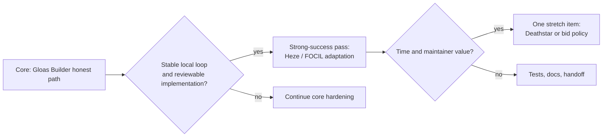
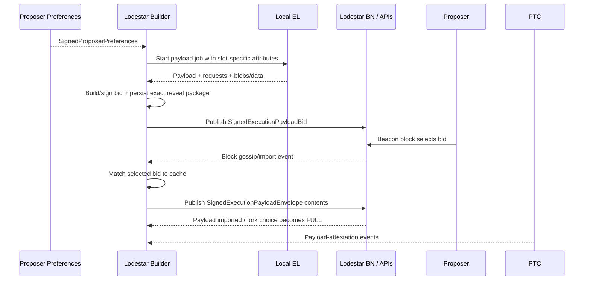
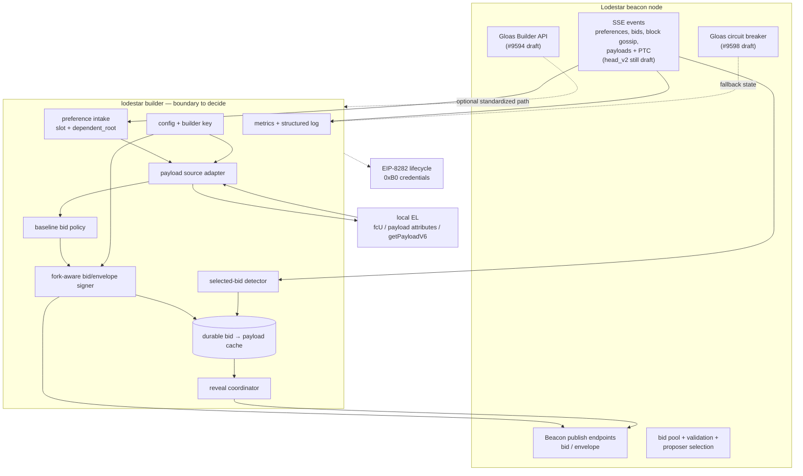
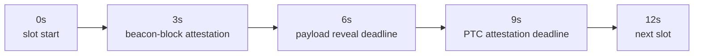

# Lodestar EIP-7732 Builder — Living Technical Note

| Doc status | |
|---|---|
| Proposal | [Merged](https://github.com/eth-protocol-fellows/cohort-seven/blob/master/projects/lodestar-eip-7732-builder.md) via [PR #161](https://github.com/eth-protocol-fellows/cohort-seven/pull/161) on July 13; strong-success list amended via [PR #186](https://github.com/eth-protocol-fellows/cohort-seven/pull/186) on July 14 |
| Spec target | [consensus-specs v1.7.0-alpha.12](https://github.com/ethereum/consensus-specs/releases/tag/v1.7.0-alpha.12) (released July 8, 2026) |
| Lodestar baseline | Stable release: [v1.44.0](https://github.com/ChainSafe/lodestar/releases/tag/v1.44.0), still aligned to alpha.11; active implementation work: `unstable`, [alpha.12 #9606](https://github.com/ChainSafe/lodestar/pull/9606), and [devnet-7 #9587](https://github.com/ChainSafe/lodestar/pull/9587) |
| Devnet | glamsterdam-devnet-6 remains **On**; [devnet-7 configuration is published](https://notes.ethereum.org/@ethpandaops/glamsterdam-devnet-7) but the network is still marked **WIP**; test fixtures pinned at [`tests-glamsterdam-devnet@v7.2.0`](https://github.com/ethereum/execution-specs/releases/tag/tests-glamsterdam-devnet%40v7.2.0) |
| Builder withdrawal prefix | `0xB0` — resolved by [consensus-specs #5416](https://github.com/ethereum/consensus-specs/pull/5416) |
| Payload deadline | `PAYLOAD_DUE_BPS = 5000` — six seconds into a 12-second slot; PTC payload attestation remains at `7500` |
| Last sweep | July 14, 2026 (monitor pass; full manual sweep July 13) |
| Next milestone | Week 5 wrap-up — publish this note, finalise the presentation, take the five gating questions to Nico; then Weeks 6–7 architecture + skeleton + first reviewable PR |

This is the working document for the Lodestar EIP-7732 Builder project, an EPF cohort 7 project by [Kris O'Shea](https://github.com/krisoshea-eth) and [Marko Lazic](https://github.com/markolazic01), mentored by [Nico Flaig](https://github.com/nflaig) (ChainSafe, EIP-7732 co-author). The [project proposal](https://github.com/eth-protocol-fellows/cohort-seven/blob/master/projects/lodestar-eip-7732-builder.md) is now merged and should remain the stable public description of scope. This note carries the moving implementation details: current specification and client baselines, architecture decisions, open questions, code-path maps, adversarial cases, and status trackers.

## Contents

- **Part I — Orientation**
  - [How to use this note](#how-to-use-this-note)
  - [Recurring sweep checklist](#recurring-sweep-checklist)
  - [Current stance](#current-stance)
  - [Decision log](#decision-log)
  - [Terms](#terms)
  - [Proposal link](#proposal-link)
- **Part II — Knowledge base**
  - [Confirmed facts](#confirmed-facts)
  - [Working notes](#working-notes)
  - [Watchlist](#watchlist)
- **Part III — Design**
  - [Mentor questions](#mentor-questions)
  - [Gloas lifecycle summary](#gloas-lifecycle-summary)
  - [Candidate architecture sketch](#candidate-architecture-sketch)
  - [Bid → payload cache design](#bid--payload-cache-design)
  - [Bid policy notes](#bid-policy-notes)
  - [Slot timing and PTC](#slot-timing-and-ptc)
  - [Deathstar notebook](#deathstar-notebook)
  - [FOCIL context](#focil-context)
- **Part IV — Implementation reference**
  - [Current Lodestar code-path map](#current-lodestar-code-path-map)
  - [Beacon API notes](#beacon-api-notes)
  - [Work packages / ownership](#possible-implementation-packages--ownership-split)
  - [Process notes](#process-notes)
  - [Weekly implementation log](#weekly-implementation-log)
- **Part V — Trackers**
  - [PR / branch status](#pr--branch-status)
  - [Resource backlog](#resource-backlog)

---

# Part I — Orientation

## How to use this note

- Keep the merged proposal stable unless the project scope materially changes.
- Put moving implementation details here: branch choices, current PR state, mentor answers, architecture sketches, experiments, and failure cases.
- Keep confirmed facts separate from working hypotheses.
- Record resolved watchlist items in the decision log before removing them.
- Run the sweep checklist before mentor calls, implementation milestones, public updates, and devnet work.
- Treat dates and status labels as part of the claim. A merged spec change, an open Lodestar PR, and a devnet-only branch are different baselines.
- Prefer a smaller number of verified, decision-relevant entries over a long list of stale links.

## Recurring sweep checklist

Run roughly weekly and before each milestone. Update the Doc status table afterwards.

- [ ] New consensus-specs tag after `v1.7.0-alpha.12`?
- [ ] Has Lodestar [#9606](https://github.com/ChainSafe/lodestar/pull/9606) merged or been replaced? Is `unstable` still pinned to alpha.11? Is there a stable release after v1.44.0?
- [ ] Has [Lodestar #9390](https://github.com/ChainSafe/lodestar/pull/9390) landed EIP-7688 on `unstable`? Has [#9587](https://github.com/ChainSafe/lodestar/pull/9587) moved from a devnet branch toward merge?
- [ ] Has glamsterdam-devnet-7 moved from **WIP** to **On**? Check its fork config, client images — including Prysm's temporary EIP-7688 flag state — the builder-deposit contract, the current `tests-glamsterdam-devnet` fixture tag (v7.2.0 at this sweep), and the explorer before treating it as a runnable target.
- [ ] Has the Gloas Builder API implementation [#9594](https://github.com/ChainSafe/lodestar/pull/9594) or the Gloas circuit breaker [#9598](https://github.com/ChainSafe/lodestar/pull/9598) changed the architecture or demo path?
- [ ] New beacon-APIs, builder-specs, or execution-apis changes touching proposer preferences, bid selection, payload attributes, builder authentication, bids, or envelopes? Has [#624](https://github.com/ethereum/beacon-APIs/pull/624) merged or changed the envelope submission shape?
- [ ] New builder-specific Lodestar command, service, or branch? Do not confuse API/proposer-side builder support with the missing external builder.
- [ ] Has the `focil` branch rebased onto current `unstable`? Any Heze change after the restored `inclusion_list_bits` field?
- [ ] Has the `deathstar` branch rebased or gained a third implemented chaos behavior? Re-read code, not only `EPBS_CHAOS_FEATURES.md`.
- [ ] EIP-8237 or EIP-8146 status or fork targeting changed?
- [ ] buildoor or assertoor registration flows updated for the `0xB0` withdrawal prefix and devnet-7 contract addresses?

## Current stance

| Area | Current stance |
|---|---|
| Core project | Implement the honest Lodestar EIP-7732 / Gloas Builder loop |
| First success target | Complete a reproducible local bid → selection → reveal loop |
| Strong-success extension | Adapt the Builder for Heze / FOCIL after the Gloas path is stable and the target Lodestar branch is agreed |
| Stretch work | Improved bid policy and/or one builder-specific Deathstar scenario after the honest path is reliable |
| Default base-branch position | Start from current Gloas work, not the large divergent `focil` branch, unless the Lodestar team explicitly recommends otherwise |

FOCIL has a stronger role than it did in the first draft: it is now the natural strong-success extension because it changes what a future builder must commit to and construct. It is still not a parallel core deliverable, and its branch should not become the default base merely because it contains substantial implementation work.

Deathstar remains notebook-first. The branch is useful prior art for conventions and test injection points, but adversarial implementation must not delay the honest Builder.



## Decision log

| Date | Question | Outcome | Notes |
|---|---|---|---|
| 2026-07-14 | Proposal strong-success list | **Amended post-merge** | [PR #186](https://github.com/eth-protocol-fellows/cohort-seven/pull/186): new goal per Nico's review comment, items decoupled, blocker links added — the first substantive mentor input on scope |
| 2026-07-14 | Devnet-7 fixture baseline | **`tests-glamsterdam-devnet@v7.2.0`** | [Published July 10](https://github.com/ethereum/execution-specs/releases/tag/tests-glamsterdam-devnet%40v7.2.0), superseding v7.1.0; carries the EIP-8037 calldata-floor / block-gas-accounting changes |
| 2026-07-13 | Proposal status | **Merged** | [EPF7 PR #161](https://github.com/eth-protocol-fellows/cohort-seven/pull/161); proposal submission is no longer the next milestone |
| 2026-07-13 | Joint vs separate proposal | **One joint proposal** | Settled at PR #161; weekly EPF updates remain individual |
| 2026-07-13 | Current spec target | **v1.7.0-alpha.12** | Alpha.12 contains the builder-prefix, deadline, EIP-7688, imported-payload, and Heze bid-shape changes relevant to this project |
| 2026-07-03 | Builder withdrawal prefix | **`0xB0`** | [consensus-specs #5416](https://github.com/ethereum/consensus-specs/pull/5416) merged; stale `0x03` credentials and scripts must be regenerated |
| 2026-07-03 | Heze `inclusion_list_bits` | **Restored** | [consensus-specs #5410](https://github.com/ethereum/consensus-specs/pull/5410) merged; Lodestar [#9526](https://github.com/ChainSafe/lodestar/pull/9526), which removed the field, closed unmerged |
| 2026-07-06 | Payload deadline | **Six seconds into the slot** | [consensus-specs #5414](https://github.com/ethereum/consensus-specs/pull/5414); mainnet alpha.12 expresses this as `PAYLOAD_DUE_BPS = 5000` |
| 2026-07-06 | Progressive consensus structures | **In alpha.12 spec baseline** | [consensus-specs #4630](https://github.com/ethereum/consensus-specs/pull/4630) merged; Lodestar implementation remains active in [#9390](https://github.com/ChainSafe/lodestar/pull/9390) |
| 2026-07-13 | Devnet-7 status | **Published configuration; network still WIP** | Use it as the next integration target, not yet as a stable live baseline |
| 2026-07-13 | FOCIL project role | **Strong-success extension** | Not a second project; not the default implementation base; adaptation begins only after the honest Gloas loop works |
| — | Base branch (`unstable` / `nc/alpha.12` / `glamsterdam-devnet-7`) | open | Resolve during the architecture milestone with the Lodestar team |
| — | Builder home (standalone command / BN service / VC-adjacent / temporary prototype) | open | [#9594](https://github.com/ChainSafe/lodestar/pull/9594) makes the standardized API path more concrete, but does not choose the service boundary |
| — | First EL (Ethrex / Nethermind / constrained mock) | open | Prefer the client aligned with the chosen devnet and `target_gas_limit` support |
| — | Registration (mock active builder vs real EIP-8282) | open | Real registration now means `0xB0`; use current devnet contract data, not old playbook defaults |
| — | Proposer `target_gas_limit` → EL plumbing | open | Must be per payload, not a static execution-client setting |
| — | Reveal trigger (first valid sight / block import / configurable) | open | Must be explicit and testable; circuit-breaker interaction matters |
| — | Proposer-side bid selection for the demo | open | [beacon-APIs issue #620](https://github.com/ethereum/beacon-APIs/issues/620) remains open |
| — | Blobs in first demo | open | Zero-blob start is acceptable only if the later stateless/data-column path is documented |
| — | First Deathstar scenario | open | Mismatched envelope is the smaller local test; withholding exercises the full failure path |
| — | Collaboration split (rotating ownership vs whole-feature + deep cross-review) | open | Settle with Marko before the first work packages |

## Terms

| Term | Meaning here |
|---|---|
| ePBS | Enshrined proposer-builder separation, introduced by EIP-7732 |
| Gloas / Glamsterdam | Consensus-layer fork name / network upgrade carrying ePBS |
| Heze / Hegotá | Next consensus fork / upgrade track in which FOCIL is being developed |
| Bid | `SignedExecutionPayloadBid`, the builder commitment selected by the beacon block |
| Envelope | `SignedExecutionPayloadEnvelope`, the later payload reveal |
| PTC | Payload Timeliness Committee, which attests payload and data availability on the Gloas timeline |
| FULL / EMPTY / PENDING | Fork-choice variants for payload revealed / unavailable / not yet resolved |
| FCR | Fast confirmation rule |
| BAL | Block access list; future sidecar work is tracked under EIP-8146 |
| IL / FOCIL | Inclusion list / fork-choice-enforced inclusion lists, EIP-7805 |
| fcU | `engine_forkchoiceUpdated` |
| BPS deadline | A slot-relative deadline expressed in basis points of configured slot duration |
| ProgressiveContainer | EIP-7688 forward-compatible SSZ container whose merkleization differs from legacy `Container` |
| Data columns | PeerDAS erasure-coded blob data that the reveal path must make available |
| Self-build | The proposer builds its own payload. The alpha.12 spec uses `BuilderIndex(UINT64_MAX)`; Lodestar currently represents that sentinel internally as `Infinity` |

## Proposal link

- [Merged Lodestar EIP-7732 Builder proposal](https://github.com/eth-protocol-fellows/cohort-seven/blob/master/projects/lodestar-eip-7732-builder.md)
- [Proposal PR #161 and review history](https://github.com/eth-protocol-fellows/cohort-seven/pull/161)
- [Strong-success amendment PR #186](https://github.com/eth-protocol-fellows/cohort-seven/pull/186)
- Public HackMD link for this living note: add after publication
- Presentation: link to be added once the deck is public

---

# Part II — Knowledge base

## Confirmed facts

These items were checked against current specifications, repository state, or merged/open PR metadata during the July 13 sweep and the July 14 monitor pass. Re-check them after each baseline bump.

### The builder gap

- **No `SignedExecutionPayloadBid` signing method exists in Lodestar.** Current code verifies bid signatures and contains `signExecutionPayloadEnvelope`, but a repository search still finds no `signExecutionPayloadBid`. The new method should use `DOMAIN_BEACON_BUILDER`, be fork-aware, and follow the existing signer/key-manager conventions.

```python
def get_execution_payload_bid_signature(state, bid, privkey):
    domain = get_domain(state, DOMAIN_BEACON_BUILDER, compute_epoch_at_slot(bid.slot))
    signing_root = compute_signing_root(bid, domain)
    return bls.Sign(privkey, signing_root)
```

- **The implementation seam remains explicit.** `produceBlockBody.ts` on `unstable` still contains `TODO GLOAS: support non self-building here` where a block body selects or constructs its execution payload bid.
- **No external builder has appeared.** [Lodestar #9594](https://github.com/ChainSafe/lodestar/pull/9594) implements the Gloas Builder API; it is proposer/beacon-node API plumbing, not the component that builds payloads, signs bids, stores commitments, detects wins, and reveals envelopes.
- **The self-build sentinel needs an explicit boundary rule.** Alpha.12 specifies `BUILDER_INDEX_SELF_BUILD = BuilderIndex(UINT64_MAX)`. Lodestar still exposes `BUILDER_INDEX_SELF_BUILD = Infinity` internally. Code must treat that as a serialization representation of the protocol sentinel, not a normal builder index, and tests should cover API/SSZ conversions.
- **The builder-owned pieces remain the same:** key handling, proposer-preference intake, payload creation, bid policy, bid signing, bid publication, exact bid → payload caching, win detection, and envelope signing/reveal.

### What already works in Lodestar

- Gloas SSZ types, gossip topics, proposer-preference production, bid validation, bid pooling, proposer-side bid selection, self-build, payload-envelope validation/import, PTC handling, and publish endpoints already exist in some form on `unstable` or active Gloas branches.
- Bid validation uses the bid parent branch's state advanced to the bid slot rather than blindly using head state.
- Two alpha.12 reference-test findings are already fixed on `unstable`:
  - [#9624](https://github.com/ChainSafe/lodestar/pull/9624) rejects an out-of-range `builder_index` cleanly instead of allowing a lazy SSZ view to throw later.
  - [#9627](https://github.com/ChainSafe/lodestar/pull/9627) applies `MAXIMUM_GOSSIP_CLOCK_DISPARITY` to bid-slot validation at millisecond precision.
- [#9636](https://github.com/ChainSafe/lodestar/pull/9636) now emits the `payload_attestation_message` SSE event. Together with proposer preferences, bids, block gossip, and execution-payload events, the merged event surface is sufficient for a serious standalone-process prototype's inputs and reveal monitoring. FULL/EMPTY outcome still needs an authoritative query or internal observer until Lodestar [#9486](https://github.com/ChainSafe/lodestar/pull/9486) lands `head_v2`.
- The envelope path already provides the model for external reveal. [#9401](https://github.com/ChainSafe/lodestar/pull/9401) remains the draft stateless path for submitting an envelope with blobs and KZG proofs.
- `engine_getPayloadV6` support and the self-build payload path exist, although the external Builder still needs an explicit payload-source abstraction and per-payload gas-limit plumbing.

### Current Gloas specification baseline

The material alpha.12 changes for this project are no longer open questions:

| Topic | Alpha.12 result | Builder consequence |
|---|---|---|
| Builder withdrawal prefix | `0xB0` | Regenerate onboarding credentials and update scripts/playbooks |
| Payload deadline | `PAYLOAD_DUE_BPS = 5000` | On a 12-second slot, reveal deadline is six seconds; never retain the old 75% assumption |
| PTC attestation deadline | `PAYLOAD_ATTESTATION_DUE_BPS = 7500` | Payload must arrive before the later committee vote window |
| EIP-7688 | Progressive containers/lists incorporated into consensus specs | Signing roots and hash-tree-root-derived identifiers must come from current SSZ types, never hand-built legacy merkleization |
| Heze bid shape | `inclusion_list_bits` restored in `ExecutionPayloadBid` | Heze adaptation must populate, sign, cache, and validate the bitvector |
| Payload-present gossip | Past-block `index == 1` votes require the payload to be imported/verified | Deathstar's “seen versus verified” distinction is narrower than before |
| Self-build index | `UINT64_MAX` in the spec | Reconcile Lodestar's `Infinity` internal sentinel at boundaries |

The mainnet alpha.12 timing parameters are:

```text
SLOT_DURATION_MS                  = 12000
ATTESTATION_DUE_BPS_GLOAS        = 2500
AGGREGATE_DUE_BPS_GLOAS          = 5000
PAYLOAD_DUE_BPS                  = 5000
PAYLOAD_ATTESTATION_DUE_BPS      = 7500
```

### Current Lodestar baseline

The phrase “Lodestar baseline” now needs two layers:

1. **Stable release baseline:** v1.44.0, released July 1 and aligned to consensus-specs alpha.11.
2. **Implementation baseline:** `unstable` plus active alpha.12/EIP-7688/devnet-7 branches.

As of the sweep:

- `unstable` still pins consensus spec tests to `v1.7.0-alpha.11`.
- [#9606](https://github.com/ChainSafe/lodestar/pull/9606), the alpha.12 upgrade, remains a draft PR.
- [#9607](https://github.com/ChainSafe/lodestar/pull/9607) merged the alpha.12 constants into the `nc/alpha.12` branch, including `PAYLOAD_DUE_BPS: 7500 → 5000`.
- [#9390](https://github.com/ChainSafe/lodestar/pull/9390), the EIP-7688 implementation, remains a large draft against `unstable`; [#9586](https://github.com/ChainSafe/lodestar/pull/9586) added further progressive Gloas containers on that branch.
- [#9587](https://github.com/ChainSafe/lodestar/pull/9587), the devnet-7 branch, remains a large draft and should not be described as merged Lodestar behavior.
- [#9594](https://github.com/ChainSafe/lodestar/pull/9594), the Gloas Builder API, is an open draft.
- [#9598](https://github.com/ChainSafe/lodestar/pull/9598), a Gloas-specific builder circuit breaker based on unrevealed payloads, is open and directly relevant to proposer fallback and demo behavior.

The practical baseline rule is therefore:

```text
Use v1.44.0 for a reproducible stable reference.
Use the chosen alpha.12/devnet-7 branch for current protocol behavior.
Never imply that every alpha.12 feature is already on unstable or in a release.
```

### Ecosystem tooling that already exists

- **buildoor** remains the closest working external reference. Its ePBS mode, lifecycle support, and ethereum-package integration make it useful for registration, interop, and competing-bid tests.
- **assertoor** still provides the `gloas-dev` lifecycle/deposit/exit/prefork playbooks. Any playbook or cached calldata that assumes `0x03` withdrawal credentials is stale after #5416; verify the current branch and devnet contract before running it.
- **builder-specs #138** defines the staked Builder API. Lodestar #9594 is the concrete client-side implementation work to watch.
- **devnet-6** remains the currently listed On network.
- **devnet-7** now has published configuration and infrastructure entries, but the repository still labels it WIP. It is the next likely integration target, not yet the stable public network baseline. Its execution-spec-tests fixtures are pinned at [`tests-glamsterdam-devnet@v7.2.0`](https://github.com/ethereum/execution-specs/releases/tag/tests-glamsterdam-devnet%40v7.2.0), published July 10 and superseding v7.1.0; the delta carries the EIP-8037 calldata-floor and block-gas-accounting changes — not Builder-specific, but lifecycle and mixed-client runs should use v7.2.0.

### Fork and spec status

- FOCIL remains outside the scheduled Glamsterdam set and belongs to the Heze/Hegotá track.
- The Heze bid-shape question is resolved for the current baseline: `inclusion_list_bits` is present.
- EIP-7688 remains in Review as an EIP, but its consensus-spec implementation is part of alpha.12. “EIP status” and “included in this spec tag” are separate statements.
- EIP-8237 and EIP-8146 remain Draft and continue to threaten future bid/cache/reveal shapes. They should stay behind fork-aware interfaces rather than inside Gloas-specific business logic.

## Working notes

Findings that shape the architecture but are not all final decisions.

### Architecture implications of the latest Lodestar work

The standalone-builder option is stronger than it was in the first note:

- the event stream now includes `payload_attestation_message` after #9636;
- proposer-preference, bid, block, and payload events already exist;
- `head_v2` would expose payload status, but the Lodestar implementation [#9486](https://github.com/ChainSafe/lodestar/pull/9486) is still an open draft;
- publish endpoints exist or are under active review;
- the standardized Gloas Builder API is being implemented in #9594.

That does not automatically settle the boundary. A standalone builder process still needs efficient access to a local EL, fork-aware Lodestar types/signing, exact payload data, retry semantics, and a way to avoid duplicating complex beacon-node logic. The architecture milestone should decide which interfaces are product boundaries and which are temporary in-process seams.

### Gloas circuit breaker and proposer fallback

[#9598](https://github.com/ChainSafe/lodestar/pull/9598) changes the failure model worth designing against. Pre-Gloas builder health used missed slots; post-Gloas the proposer still publishes a beacon block, so the relevant failure is an unrevealed payload. The draft breaker counts blocks without a FULL variant and ignores builder bids once the fault budget is exceeded while continuing to build locally.

Builder-side implications:

- reveal failures need explicit metrics and identifiers that correlate with proposer-side breaker activation;
- retry behavior must be idempotent but bounded;
- the local demo should show both normal selection/reveal and the fallback path after a withheld or failed reveal;
- “our bid was selected” is not enough — the success signal is the block becoming FULL.

### Heze / FOCIL after the bitlist decision

The restored bitlist removes one source of ambiguity but does not make the FOCIL branch a safe base. The branch is still a large draft that has diverged substantially from current `unstable`. Its value is architectural prior art and a future adaptation target.

For the Builder, the concrete Heze delta is now easier to state:

```text
Gloas bid construction
+ inclusion-list intake / local IL view
+ inclusion_list_bits derivation
+ Heze SSZ/signing root
+ cache entry that records the IL commitment context
+ payload construction that satisfies the selected IL constraints
```

### Deathstar, on the ground

The public `deathstar` branch is small relative to current `unstable`: three chaos commits ahead and many normal Lodestar commits behind at the July 13 sweep. It contains two implemented flags:

```text
--chain.chaosAlwaysBuildOnEmpty
--chain.chaosOmitPtcOnEmptyBuild
```

The catalog's opening line still says nothing is implemented, while later text and the branch code show those two features. The catalog also contains stale constants such as an old self-build index and builder-index flag. Treat the catalog as a scenario inventory and convention guide, not as a current spec reference.

`deathstar-devnet-6` includes the same chaos work on an older devnet branch. Neither branch should be used directly for current builder development without a deliberate rebase.

### Devnet-7 and branch layering

Three layers are currently easy to conflate:

```text
consensus-specs alpha.12
→ Lodestar alpha.12 / EIP-7688 implementation branches
→ Lodestar devnet-7 integration branch
→ ethpandaops devnet-7 network deployment (still WIP)
```

A local demo can begin before the public devnet is On, but its runbook must record the exact CL branch, EL image, network config, deposit contract, and builder credentials used.

- **Fixture baseline:** [`tests-glamsterdam-devnet@v7.2.0`](https://github.com/ethereum/execution-specs/releases/tag/tests-glamsterdam-devnet%40v7.2.0) is the current devnet fixture tag, published July 10 and superseding v7.1.0. The [devnet-7 sheet](https://notes.ethereum.org/@ethpandaops/glamsterdam-devnet-7) pins it. The v7.1.0 → v7.2.0 delta is the EIP-8037 calldata-floor / block-gas-accounting changes; use v7.2.0 for lifecycle and mixed-client runs even though the delta is not Builder-specific.
- **Cross-client:** devnet-7 includes EIP-7688, and Prysm is staging its progressive-SSZ support behind a temporary feature flag while the stacked EIP-7688 work lands ([Prysm #16860](https://github.com/OffchainLabs/prysm/pull/16860); maintainers say the flag will then be removed). Mixed-client tests must verify that the chosen Prysm image and flag state agree before attributing failures elsewhere.

### Validation and observability edges

- Bid tests should include parent-branch state, out-of-range builder indices, and slot-boundary clock disparity.
- Proposer preferences have a fork-boundary edge: the first Gloas slots can lack usable preferences unless they are broadcast before the fork ([#9571](https://github.com/ChainSafe/lodestar/pull/9571) addresses this).
- The clean end-to-end signal is the selected block becoming FULL, not only a successful publish response. Use `head_v2.payload_status` once [#9486](https://github.com/ChainSafe/lodestar/pull/9486) or an equivalent implementation lands; until then use the current payload-import/fork-choice observability.
- `payload_attestation_message` events are now available for measuring PTC observation and disagreement.
- Data-column “published to zero peers” logs can be misleading when peers gossip locally produced columns back first; retain source-aware metrics.
- The alpha.12 imported-payload rule means past-block payload-present votes should be tested against fully imported/verified payload state, not mere receipt.

### CL/EL integration gotchas

Failures at the consensus/execution boundary can masquerade as Builder bugs even when the Builder logic is correct, so the first local setup needs a clean separation between Builder errors and EL-integration errors:

- Post-Gloas `engine_forkchoiceUpdated` reports the bid's `parent_block_hash` as safe and finalized, because the safe or finalized block's own payload may not yet be confirmed canonical ([#9393](https://github.com/ChainSafe/lodestar/pull/9393)); pre-Gloas fcU assumptions do not carry over.
- An EL returning `INVALID` once wedged a Gloas devnet node, since the pre-Gloas safety net is bypassed with payload verification deferred to `importExecutionPayload` ([#9332](https://github.com/ChainSafe/lodestar/pull/9332)).
- The native (Zig) state-transition mode throws on Gloas; keep `nativeStateView` disabled during Builder work ([#9516](https://github.com/ChainSafe/lodestar/pull/9516)).

### Registration sharp edges

- The temporary fork-onboarding prefix is now `0xB0`; the execution request type remains a separate value.
- Existing `0x03` withdrawal credentials are not a harmless display mismatch — they represent different bytes and should be regenerated for the current baseline.
- Real EIP-8282 registration requires current devnet contract addresses and activation timing, not only a signed deposit payload.
- A top-up to an exited builder can still create confusing lifecycle state; keep lifecycle checks explicit in a real-registration demo.

## Watchlist

Only unresolved items belong here.

### Baseline and branch convergence

- **Lodestar alpha.12:** #9606 is still draft, while `unstable` remains pinned to alpha.11. Watch for merge, replacement, or a new stable release.
- **EIP-7688:** #9390 is still a large draft. Re-check type locations, signer roots, and test fixtures after it lands.
- **Devnet-7:** configuration is published but the network is WIP. Confirm activation and client images — including the Prysm EIP-7688 flag state — before planning public interop.
- **BeaconEngine refactor:** [#9550](https://github.com/ChainSafe/lodestar/pull/9550) is still a large draft and may move exactly the chain/engine interfaces the Builder wants to reuse.

### Service boundary and APIs

- **Envelope submission shape:** [beacon-APIs #624](https://github.com/ethereum/beacon-APIs/pull/624) would remove the blinded envelope types, make `include_payload` required, and replace the blinded-header response with an `Eth-Blob-Data-Included` header, cleanly separating the stateful same-node path from the stateless full-envelope path. Approved and CI-green at the July 14 monitor but not merged, with an implementation warning now recorded on the merged [#580](https://github.com/ethereum/beacon-APIs/pull/580) discussion. Do not harden against #580's blinded path while #624 is unresolved. (note: both are now merged)
- **Lodestar Gloas Builder API:** #9594 may provide a standardized external boundary, but an internal implementation may still be the fastest first version.
- **Bid selection:** beacon-APIs issue #620 remains open and affects how a demo proposer chooses the external bid.
- **Circuit breaker:** #9598 may define proposer-side failure policy and the observability a Builder should expose.
- **Stateless envelope submission:** #9401 remains draft; decide whether the first version can use a stateful/local path and how that transitions to external blobs/proofs — #624 makes the full-envelope-plus-blob-material contents shape the likely survivor.
- **`target_gas_limit`:** pin the exact execution-apis shape and verify Lodestar + target EL support before implementing payload production.

### Future bid and reveal shape

- **EIP-8237 (Draft):** would replace `execution_requests_root` with `partial_header_hash` and change bid/cache-key logic.
- **EIP-8146 (Draft):** would add `block_access_list_hash` and a separately propagated BAL sidecar.
- **Heze changes after #5410:** the bitlist is stable for alpha.12, not guaranteed forever.

### FOCIL implementation convergence

- The `focil` PR remains open and draft. Watch for rebase, split PRs, or a maintainer-endorsed branch.
- Confirm which Engine API methods and inclusion-list storage interfaces survive before starting the adaptation pass.
- Do not copy old Heze type code that predates #5410 or EIP-7688.

### Deathstar

- Watch for rebase onto alpha.12/devnet-7 and any scenario beyond the two existing flags.
- Decide whether the first Builder-specific adversarial contribution belongs in the `deathstar` branch, an integration test, or a Kurtosis/assertoor scenario.
- Resolve the stale constants and “nothing implemented” header before citing the catalog publicly as current documentation.

### Loose ends to pin

- Exact execution-apis PR carrying per-payload `targetGasLimit`.
- Current Ethrex and Nethermind alignment with devnet-7.
- Current assertoor `gloas-dev` credential defaults and deposit contract.
- Whether a zero-blob first demo is accepted by maintainers as the first architecture milestone.
- Nico's acting-as-builder gist and the Consensoor reference — ask directly when the five gating questions go over.

---

# Part III — Design

## Mentor questions

Nico's first substantive input has already arrived through the proposal itself — the strong-success amendment in [#186](https://github.com/eth-protocol-fellows/cohort-seven/pull/186) — so these continue an open thread rather than starting one. Per the proposal review, they are decisions to investigate, propose answers for, and get sign-off on through Lodestar team discussions, not blockers to wait on. The five that gate Weeks 6–7 remain: base branch; builder home and API surface, given builder-specs #138 and [#9594](https://github.com/ChainSafe/lodestar/pull/9594); mock versus real EIP-8282 registration, now on `0xB0` credentials; proposer `target_gas_limit` → EL plumbing; and the reveal trigger plus proposer-side bid selection, given [#620](https://github.com/ethereum/beacon-APIs/issues/620) and the [#9598](https://github.com/ChainSafe/lodestar/pull/9598) circuit breaker.

### Scope and base

- Should the first Builder branch target `unstable`, `nc/alpha.12`, `glamsterdam-devnet-7`, or a smaller branch cut from one of them?
- Which prerequisite PRs should be treated as hard dependencies: #9390, #9594, #9401, #9550, or none?
- What is the smallest first PR the Lodestar team would review independently?
- Is a local alpha.12 demo more valuable before devnet-7 is On, or should the first implementation align directly to the devnet branch?

### Service boundary

- Standalone `lodestar builder` command, beacon-node service, validator-client-adjacent process, or temporary internal prototype?
- If standalone, should it consume Beacon SSE + publish APIs, speak the Builder API in #9594, use a shared Lodestar library, or combine these?
- Which component owns the Engine API connection and payload-building state?
- Where should builder keys live, and which existing signer/key-manager abstractions can be reused without pretending a builder is a validator?
- How should the architecture remain useful if #9550 moves the BeaconEngine boundary?

### Builder identity and registration

- Mock an already-active builder for the first loop or use real EIP-8282 onboarding immediately?
- Which current devnet deposit contract and lifecycle tooling should the runbook use?
- How should `0xB0` credentials be generated and checked so stale `0x03` data fails loudly?
- How should the spec's `UINT64_MAX` self-build sentinel map to Lodestar's internal `Infinity` at SSZ/API boundaries?

### Payload construction

- First EL: Ethrex, Nethermind, or a constrained test double followed immediately by a real client?
- Can the self-build Engine API path be exposed through a small payload-source interface rather than copied?
- Which payload attributes carry `target_gas_limit`, and does the chosen EL honor it per job?
- Can the first demo use zero blobs? If yes, what second milestone proves the stateless envelope + data-column path?
- What exact package must remain recoverable from bid publication until reveal?

### Bid signing and publishing

- Where should `signExecutionPayloadBid` live?
- Should it share the envelope signer's domain/key path or have a dedicated Builder signer service?
- Publish through an internal network method, a Beacon API route, or both behind one interface?
- How should duplicate publication, reorged parents, and near-boundary slots be handled?

### Winning-bid detection

- Reveal on first valid block gossip, after block import, or through a configurable policy?
- What must match before a cache entry is considered ours: full signed bid root, builder index + block hash, or a canonical commitment object?
- Reveal for a selected local bid on a non-head/non-canonical block, or only under a policy?
- How will the demo proposer select the external bid while beacon-APIs issue #620 remains unresolved?
- How should Builder metrics correlate with #9598's proposer-side circuit breaker?

### Envelope reveal and data availability

- First path: local/stateful envelope, `SignedExecutionPayloadEnvelopeContents`, or both? ([beacon-APIs #624](https://github.com/ethereum/beacon-APIs/pull/624) would remove the blinded variant — plan around full-envelope-plus-blob-material submission.)
- What blobs, proofs, cells, and data columns must the external builder retain or reconstruct?
- What is the retry/idempotency contract of the publish endpoint?
- Which observation proves success: publish response, envelope event, imported payload, FULL head, PTC votes, or all of them?

### Heze / FOCIL gate

- What core Builder condition is sufficient to start the adaptation pass?
- Which FOCIL branch or split PR will be the supported target?
- Should inclusion-list satisfaction be enforced inside payload-source selection, bid construction, or both?
- Is `inclusion_list_bits` derived from locally observed ILs, from an Engine API result, or from a shared Lodestar store?

### Deathstar gate

- Which behavior is most useful to maintainers after the honest loop works: payload withholding, late reveal, or mismatched envelope?
- Should the first contribution be a normal integration test before a hidden chaos flag?
- Should the old `deathstar` branch be rebased first, or should the behavior be reimplemented on the current target branch following its conventions?

#### Stretch-stretch goal (mentioned by Nico)
UI to configure the builder and deathstar.
Additional:
the base components likely overlap ex. you need an api to modify configs at runtime.

### Builder malicious behavior

This section refers to builder's own malicious behavior, which is outside of deathstar (a more direct approach).

Features to add:
- malicious envelope withholding
- intentional late reveal
- payload equivocation

Test: [payload equivocations and PTC timeliness issue from Potuz](https://github.com/ethereum/consensus-specs/issues/5333)

Buildoor should already have some of the mentioned features, we should inspect it properly.


## Gloas lifecycle summary

The honest Builder lifecycle remains:

```text
1.  Observe and validate proposer preferences.
2.  Select target slot and parent context.
3.  Ask the local EL for an execution payload candidate.
4.  Construct the fork-correct ExecutionPayloadBid.
5.  Sign SignedExecutionPayloadBid with the builder key.
6.  Persist the exact bid → payload package.
7.  Publish the bid before the gossip deadline.
8.  Observe candidate beacon blocks.
9.  Detect whether a selected bid matches the local commitment.
10. Load and re-verify the cached payload package.
11. Construct and sign SignedExecutionPayloadEnvelope.
12. Publish the envelope and required data before PAYLOAD_DUE_BPS.
13. Observe import, FULL status, and PTC outcome.
```



The Gloas alpha.12 bid remains the current core shape. Heze extends it with `inclusion_list_bits`; EIP-8237 and EIP-8146 remain future shape risks.

## Candidate architecture sketch

This is the input to the Week 6 architecture milestone. The decision is the boundary around the Builder itself, not the lifecycle.



### Architecture milestone output

The architecture phase should produce four concrete artifacts:

1. **Boundary decision:** where the process runs and which APIs/internal interfaces it owns.
2. **Interface map:** preference source, payload source, signer, cache, block observer, reveal publisher, and metrics.
3. **Failure contract:** what fails closed, what retries, what can be mocked, and how proposer fallback is observed.
4. **Skeleton PR:** configuration + key loading + connectivity + subscriptions, without pretending the full Builder is implemented.

A reasonable implementation principle regardless of boundary:

```text
Core builder orchestration depends on narrow TypeScript interfaces.
Adapters bind those interfaces to internal Lodestar services or external APIs.
Fork-specific bid/envelope construction lives behind the type/signing adapter.
```

## Bid → payload cache design

The cache is a safety boundary. A bid must not be published unless the exact committed reveal package is durably recoverable for the necessary fork/reorg window.

### Commitment identity

For Gloas alpha.12, a logical lookup key may include:

```text
fork
slot
parent_block_root
parent_block_hash
builder_index
block_hash
execution_requests_root
signed_bid_root
```

The canonical identity should be derived through current Lodestar SSZ types rather than hand-merkleizing fields. EIP-7688 is now part of the spec baseline, so a legacy-container root and a progressive-container root are not interchangeable.

Keep the key adapter fork-aware:

- Heze adds `inclusion_list_bits` to the signed commitment.
- EIP-8237 would replace `execution_requests_root` with `partial_header_hash`.
- EIP-8146 would add `block_access_list_hash` and a BAL sidecar payload.

### Cache entry

```text
fork
signed_bid
signed_bid_root
proposer_preferences
payload_attributes
execution_payload
execution_requests
blob commitments
blobs / cells / proofs / data-column source material
parent_beacon_block_root
parent_execution_block_hash
payload_block_hash
builder_index
slot
bid_value
inclusion-list context, if Heze
created_at
expires_at
reveal attempts + result
```

That entry is deliberately the full submission unit: the [#624](https://github.com/ethereum/beacon-APIs/pull/624) direction — one stateless call carrying the signed envelope plus its blob/KZG material — confirms nothing in it can be dropped and reconstructed later.

### Write ordering

```text
build payload
→ construct bid
→ construct complete cache entry
→ persist and verify entry
→ sign bid
→ publish bid
```

Do not publish and then attempt to fill the cache asynchronously.

### Match and reveal behavior

```text
cache miss:
  do not guess or rebuild a replacement payload
  emit critical structured error + metric

partial field match:
  do not reveal
  log exact mismatched commitment fields

expired entry:
  fail closed by default
  allow override only in an explicit isolated-devnet test mode

repeat reveal request:
  return the same signed envelope / contents
  make network publication retry bounded and idempotent
```

### Expiry

Expiry must account for forks and orphaned blocks, not only elapsed slots. Retain entries long enough to handle competing blocks, delayed import, req/resp serving, and reveal retries. Mirror Lodestar's ancestry-aware payload-envelope cache lessons — the fork-aware `pruneBelowParent` fix ([#9326](https://github.com/ChainSafe/lodestar/pull/9326)) and the envelope-cache incidents around unbounded growth and in-flight fake success ([#9489](https://github.com/ChainSafe/lodestar/pull/9489), [#9501](https://github.com/ChainSafe/lodestar/pull/9501)) — rather than a simple “delete everything before head slot” rule.

### Metrics

```text
builder_payload_jobs_started_total
builder_payload_jobs_failed_total
builder_bids_constructed_total
builder_bids_persisted_total
builder_bids_published_total
builder_bids_selected_total
builder_cache_hits_total
builder_cache_misses_total
builder_cache_mismatches_total
builder_reveals_attempted_total
builder_reveals_published_total
builder_reveals_imported_total
builder_reveal_latency_ms
builder_late_reveals_total
builder_selected_payload_full_total
builder_selected_payload_empty_total
```

Every metric should carry only bounded labels. Use structured log fields for roots, slots, and builder IDs.

## Bid policy notes

The first implementation should keep policy deliberately small:

```text
fixed-value:
  bid.value = configured_value

fixed-shade:
  estimated_payload_value = local value estimate
  bid.value = min(max_bid, estimated_payload_value * configured_shade)
```

Minimum policy constraints:

- never bid more than the builder can cover after pending obligations;
- respect proposer preferences and fork-specific validity rules;
- cap bids explicitly;
- make the policy deterministic and observable for tests;
- keep policy separate from payload construction, signing, and publication.

The project does not need a production auction model to prove the honest lifecycle. A more sophisticated strategy remains behind the extension gate.

### Later research surface

“What to bid” still depends on two private estimates:

1. the builder's value for the candidate block;
2. the distribution of competing bids for the slot.

The `execution_payload_bid` stream supplies empirical competing-bid observations once the Builder runs. buildoor can provide a real devnet competitor — and that is now more than our own framing: a Lodestar developer suggested on [#186](https://github.com/eth-protocol-fellows/cohort-seven/pull/186) running a kurtosis devnet with the Lodestar Builder and buildoor together to test whether the Builder can consistently out-bid buildoor and get selected. Once the honest loop works, that run is the natural first empirical target for the fixed-shade policy and the competing-bid observations. Any later objective should include:

- priority fees and capturable MEV;
- builder balance and pending payments;
- first-price bid shading;
- free-option value between commitment and reveal;
- cost of accepted bids regardless of final canonicality;
- reveal/canonicality risk;
- future FOCIL constraints on payload value.

Useful background:

- [Free Option Problem I](https://collective.flashbots.net/t/the-free-option-problem-in-epbs/5115) and [II](https://collective.flashbots.net/t/the-free-option-problem-in-epbs-part-ii/5145) · [Mazorra et al.](https://arxiv.org/abs/2509.24849)
- [Builder bidding behaviors in ePBS](https://ethresear.ch/t/builder-bidding-behaviors-in-epbs/20129)
- [Builder reveal timing game](https://ethresear.ch/t/builder-reveal-timing-game-in-epbs/19424)
- [Who Wins Ethereum Block Building Auctions and Why?](https://drops.dagstuhl.de/entities/document/10.4230/LIPIcs.AFT.2024.22)
- [Block vs. Slot Auction PBS](https://mirror.xyz/julianma.eth/CPYI91s98cp9zKFkanKs_qotYzw09kWvouaAa9GXBrQ)

## Slot timing and PTC

Current alpha.12 mainnet timing:

```text
slot start                                      0 ms
Gloas block-attestation due (2500 BPS)      3,000 ms
payload reveal due (5000 BPS)               6,000 ms
PTC payload-attestation due (7500 BPS)       9,000 ms
next slot                                    12,000 ms
```



The code should still read configured BPS and slot duration. “Six seconds” is the current 12-second-slot result, not permission to hardcode `6000` everywhere — EIP-7782 (Reduce Block Latency) remains Declined for Glamsterdam, so 12-second slots stay the mainnet working assumption, but a six-second devnet slot using the same 5000 BPS value would have a three-second payload deadline.

Builder timing metrics should answer:

- when preferences became usable;
- when payload construction began and completed;
- when the bid was signed and accepted for publication;
- when the selecting block was first seen and imported;
- when reveal began and completed;
- whether reveal preceded `PAYLOAD_DUE_BPS`;
- when the payload became verified/FULL;
- what PTC messages were observed by the attestation deadline.

Transport and local EL latency are part of the experiment. Confirm QUIC/UDP configuration, EL sync state, clock synchronization, and data-column source before assigning a late reveal to Builder orchestration.

## Deathstar notebook

Deathstar remains notebook-first until the honest Builder path works.

### Current branch reality

- `deathstar` contains the catalog plus two implemented chaos flags.
- It is based on older Lodestar code and is substantially behind current `unstable`.
- `deathstar-devnet-6` carries the same work on the devnet-6 line and is also not a current alpha.12/devnet-7 base.
- The catalog has stale introductory text and constants. Use current code/specs for parameters and the catalog for scenario organization and flag conventions. Its four-tier structure — core safety/liveness, equivocation and split-view, market manipulation/resource exhaustion, and accounting edge cases — remains a useful organising frame even where its constants are stale.

Conventions worth preserving:

```text
hidden --chain.* option
explicit “CHAOS (devnet test only)” description
isolated local/Kurtosis/devnet use only
one behavior per flag
parameterized delay/probability/threshold where relevant
normal library tests remain off unless the chaos option is supplied
```

### Updated threat-model distinction

PTC messages are not a general execution-validity oracle. However, alpha.12 now requires a payload-present vote for a past block to correspond to a fully imported/verified payload. That reduces the old “seen but not verified” gap for that gossip case; it does not remove withholding, late reveal, equivocation, data-availability, or split-view risks.

### Candidate scenarios

| Scenario | Current rule / signal | Lodestar path | Honest test first? | Chaos behavior later? | Difficulty |
|---|---|---|---|---|---|
| Mismatched envelope | Envelope must match selected bid and current fork commitments | envelope validation + cache match | unit/integration | yes | low/medium |
| Payload withholding | Selected bid never becomes FULL; proposer circuit breaker may react | reveal coordinator, fork choice, #9598 | integration | yes | medium |
| Late reveal | `PAYLOAD_DUE_BPS = 5000` | delayed publish + timing metrics | integration/devnet | yes | medium |
| Bid at slot-boundary disparity | alpha.12 gossip range semantics | execution-payload-bid validation | unit/reference test | maybe | low |
| Out-of-range builder index | must REJECT cleanly | bid validation | unit/reference test | maybe | low |
| Invalid high-value `prev_randao` bid | rejected at gossip so it cannot suppress valid lower bids ([cs #5360](https://github.com/ethereum/consensus-specs/pull/5360)) | bid validation / bid pool | unit/reference test | yes | low |
| Bid extends wrong FULL/EMPTY parent | `shouldBuildOnFull` and proposer-head rules (regression fixed in [#9442](https://github.com/ChainSafe/lodestar/pull/9442)) | block production / fork choice | integration | yes | medium |
| Proposer-preference censorship | no matching preferences means external bid cannot be valid | preference intake / validation | integration | maybe | low |
| PTC split view | threshold/timing under asymmetric propagation ([cs #5345](https://github.com/ethereum/consensus-specs/pull/5345) grounds the split-vote case) | PTC pool + fork choice | devnet | yes | high |
| Builder API failure / timeout | proposer must fall back safely | #9594 + #9598 | integration | fault injection | medium |
| Heze IL mismatch | bid bitlist/payload violates observed ILs | future FOCIL adapter | future integration | yes | future |
| BAL sidecar withholding | future EIP-8146 commitment unavailable | future sidecar path | n/a | yes | future |

### Recommended first case

A mismatched-envelope test is the smallest high-value first case because it exercises the cache safety boundary without requiring timing-sensitive network orchestration. Payload withholding is the strongest first full-system Deathstar behavior after the honest reveal path and circuit-breaker observability exist.

## FOCIL context

FOCIL is a strong-success Builder adaptation, not a second core project.

### Current position

- EIP-7805 remains outside Glamsterdam and is being developed for the Heze/Hegotá track.
- [Lodestar #7342](https://github.com/ChainSafe/lodestar/pull/7342) remains an open draft with a large implementation footprint.
- The branch already contains inclusion-list duties, gossip validation, storage, Engine API methods, state-transition/fork-choice enforcement, and validator work.
- [consensus-specs #5410](https://github.com/ethereum/consensus-specs/pull/5410) restored `inclusion_list_bits` to the Heze bid.
- [Lodestar #9526](https://github.com/ChainSafe/lodestar/pull/9526), which removed the field, closed without merge.
- EIP-7688 means the current Heze type is a progressive container; old static-container assumptions should not be reused.

### Builder adaptation surface

A Heze-capable Builder likely needs:

```text
inclusion-list subscription / local store access
→ identify relevant IL committee messages for the target slot
→ constrain payload construction to satisfy the applicable ILs
→ derive inclusion_list_bits
→ construct the Heze ExecutionPayloadBid
→ sign with the Heze fork domain/root
→ cache IL context with the payload package
→ reveal and log IL-satisfaction outcome
```

### Gate conditions

Start FOCIL adaptation only when all are true:

1. the Gloas local bid → selection → reveal loop is reproducible;
2. core interfaces are fork-aware rather than Gloas-hardcoded;
3. the Lodestar team identifies a supported FOCIL target branch;
4. that branch is sufficiently rebased to avoid spending the project on unrelated conflict resolution;
5. the exact Engine API and `inclusion_list_bits` derivation path are agreed.

Do not use the `focil` branch as the default base before those conditions are met.

---

# Part IV — Implementation reference

## Current Lodestar code-path map

Status reflects the July 13 sweep and July 14 monitor pass.

| Area | File / PR | Current understanding | Builder follow-up |
|---|---|---|---|
| Gloas SSZ types | [`packages/types/src/gloas/sszTypes.ts`](https://github.com/ChainSafe/lodestar/blob/unstable/packages/types/src/gloas/sszTypes.ts) | Core types exist on `unstable`; alpha.12 progressive conversion is not fully merged there | Bind construction/signing to fork-configured type objects; re-check after #9390 |
| EIP-7688 implementation | [#9390](https://github.com/ChainSafe/lodestar/pull/9390), [#9586](https://github.com/ChainSafe/lodestar/pull/9586) | Large draft plus merged child work on the EIP branch | Do not hand-code roots or freeze alpha.11 fixtures |
| Gossip topics | [`topic.ts`](https://github.com/ChainSafe/lodestar/blob/unstable/packages/beacon-node/src/network/gossip/topic.ts) | Gloas topics exist | Confirm activation and event emission on chosen branch |
| SSE events | [`events.ts`](https://github.com/ChainSafe/lodestar/blob/unstable/packages/api/src/beacon/routes/events.ts), [#9636](https://github.com/ChainSafe/lodestar/pull/9636), [#9486](https://github.com/ChainSafe/lodestar/pull/9486) | Payload-attestation event is merged; `head_v2` remains draft | Build a typed event adapter, reconnect/backfill policy, and temporary FULL-status query |
| Gloas Builder API | [#9594](https://github.com/ChainSafe/lodestar/pull/9594) | Draft implementation of builder-specs #138 | Decide whether the Builder consumes/speaks this API or stays internal first |
| Bid validation | [`executionPayloadBid.ts`](https://github.com/ChainSafe/lodestar/blob/unstable/packages/beacon-node/src/chain/validation/executionPayloadBid.ts), [#9624](https://github.com/ChainSafe/lodestar/pull/9624), [#9627](https://github.com/ChainSafe/lodestar/pull/9627) | Parent-state validation plus alpha.12 bounds/timing fixes | Mirror these cases in Builder-side tests |
| Bid pool / proposer selection | [`executionPayloadBidPool.ts`](https://github.com/ChainSafe/lodestar/blob/unstable/packages/beacon-node/src/chain/opPools/executionPayloadBidPool.ts), [#9289](https://github.com/ChainSafe/lodestar/pull/9289) | Proposer can select gossip bids | Demo still needs explicit per-builder selection policy; issue #620 remains open |
| Proposer preferences | [`proposerPreferences.ts`](https://github.com/ChainSafe/lodestar/blob/unstable/packages/validator/src/services/proposerPreferences.ts) | Validator side produces/signs preferences | Implement Builder intake/matching and stale/missing policy; note the pre-fork broadcast edge ([#9571](https://github.com/ChainSafe/lodestar/pull/9571)) |
| Envelope validation/import | validation and payload-envelope processor paths | Existing reveal consumer and FULL/EMPTY transition machinery | Define exact external reveal package and success signal |
| Stateless envelope publish | [#9401](https://github.com/ChainSafe/lodestar/pull/9401) | Draft envelope + blobs/KZG proofs path | Decide first-version dependency and later data-column milestone; align with the #624 direction |
| Self-build reveal | [`block.ts`](https://github.com/ChainSafe/lodestar/blob/unstable/packages/validator/src/services/block.ts) | Existing envelope signing/publish model | Reuse logic through shared helpers rather than copy/paste |
| Envelope signer | [`validatorStore.ts`](https://github.com/ChainSafe/lodestar/blob/unstable/packages/validator/src/services/validatorStore.ts) | `signExecutionPayloadEnvelope` exists | Add bid signer with a Builder-appropriate key boundary |
| Payload production | Engine types/http/interface + self-build path | `engine_getPayloadV6` support exists | Add payload-source abstraction and `target_gas_limit` support |
| Block production seam | [`produceBlockBody.ts`](https://github.com/ChainSafe/lodestar/blob/unstable/packages/beacon-node/src/chain/produceBlock/produceBlockBody.ts) | Still contains non-self-build TODO | Keep proposer logic separate from Builder orchestration |
| Gloas circuit breaker | [#9598](https://github.com/ChainSafe/lodestar/pull/9598) | Open PR; tracks unrevealed payload faults rather than missed slots | Align Builder metrics and failure tests with proposer fallback |
| Alpha.12 upgrade | [#9606](https://github.com/ChainSafe/lodestar/pull/9606), [#9607](https://github.com/ChainSafe/lodestar/pull/9607) | Draft parent PR; constants landed on its branch | Choose exact commit/branch for the skeleton |
| Devnet-7 | [#9587](https://github.com/ChainSafe/lodestar/pull/9587) | Large draft branch | Use only with recorded EL/images/config; do not call it merged behavior |
| BeaconEngine refactor | [#9550](https://github.com/ChainSafe/lodestar/pull/9550) | Large active draft | Avoid tight coupling to APIs likely to move |
| FOCIL | [#7342](https://github.com/ChainSafe/lodestar/pull/7342), `focil` branch | Substantial but divergent Heze implementation | Strong-success adaptation target, not default base |
| Deathstar | `deathstar`, `deathstar-devnet-6` | Two implemented chaos flags on old branch lines | Rebase/reimplement only after honest path works |

## Beacon API notes

### Existing Gloas-facing routes

The current Beacon API work includes post-Gloas block production, proposer preferences, execution-payload bids, and execution-payload-envelope routes. Exact route names and request bodies must be re-read from the chosen branch before coding because some of the historical links and singular/plural paths changed during the devnets.

The important architectural split is:

```text
stateful/local path:
  the same beacon node already holds the payload context
  and can serve/publish the envelope

stateless/external path:
  caller supplies the signed full envelope plus the blob/KZG material
  needed to derive and gossip data columns
```

[beacon-APIs #624](https://github.com/ethereum/beacon-APIs/pull/624) is the open direction for this surface as of the July 14 monitor: it removes the blinded envelope types from [#580](https://github.com/ethereum/beacon-APIs/pull/580), makes `include_payload` required, replaces the blinded-header response with an `Eth-Blob-Data-Included` header, and separates the stateful same-node path from the stateless full-envelope-plus-blobs/proofs path. It is approved and CI-green but not merged, and an implementation warning now sits on #580's discussion. Until it resolves, do not harden against #580's blinded path — keep the exact signed full envelope and its blob/KZG material as one cacheable submission unit. [#9401](https://github.com/ChainSafe/lodestar/pull/9401) remains the Lodestar draft for the stateless external path. (note: both #624 and #580 are merged)

### Builder API

[builder-specs #138](https://github.com/ethereum/builder-specs/pull/138) defines the staked Builder API, including bid retrieval, proposer preferences, and signed block submission concepts. [Lodestar #9594](https://github.com/ChainSafe/lodestar/pull/9594) is the current implementation draft.

Architecture questions:

- Is `lodestar builder` a client of the Beacon API, the Builder API, internal Lodestar services, or a layered combination?
- Does the Builder API trigger payload creation or only expose already-running builder state?
- Which API owns authentication and builder endpoint discovery?
- How does direct builder access interact with P2P bids and issue #620's per-builder selection preferences?

### SSE event stream

Current useful topics include:

```text
proposer_preferences
execution_payload_bid
block_gossip
execution_payload / execution_payload_gossip / execution_payload_available
payload_attestation_message
data_column_sidecar
head_v2 (payload_status; Lodestar #9486 draft, not on unstable yet)
```

A standalone builder can map them as follows:

```text
proposer_preferences        → input matching
execution_payload_bid       → competitor observation
block_gossip / block import → selected-bid detection
execution payload events    → reveal/import monitoring
payload_attestation_message → PTC observation
head_v2                     → EMPTY/PENDING/FULL outcome once #9486 lands
```

The merged event stream is sufficient for a prototype's inputs and reveal monitoring. Until `head_v2` lands, FULL/EMPTY outcome needs a separate authoritative query or internal observer. Reconnect semantics, missed events, and ordering still need explicit design.

## Possible implementation packages / ownership split

Candidate small work packages:

1. Architecture note and interfaces.
2. Builder command/service skeleton, config, and key loading.
3. Typed event/API adapter with reconnect handling.
4. Proposer-preference store and slot/dependent-root matcher.
5. Local payload-source adapter.
6. Fork-aware bid constructor and `signExecutionPayloadBid`.
7. Baseline fixed-value/fixed-shade policy.
8. Durable bid → payload cache with failure tests.
9. Bid publisher and publication metrics.
10. Selected-bid detector.
11. Envelope constructor/signer/reveal coordinator.
12. Stateless blob/proof/data-column path.
13. End-to-end local harness and runbook, with the buildoor out-bidding run suggested on [#186](https://github.com/eth-protocol-fellows/cohort-seven/pull/186) as a candidate extension.
14. Devnet-7 interop pass.
15. Heze / FOCIL adapter after the gate.
16. One Deathstar/integration failure case after the gate.

Per-package quality bar regardless of ownership model:

```text
one named reviewer per package
tests and docs travel in the same package
no package merges without both fellows understanding it
```

The ownership model itself is still to be settled with Marko before the first packages (see decision log). The options on the table are the original rotating model — one implementation owner and one reviewer per package, with ownership rotating — or whole-feature ownership with a deep cross-review for independent features, keeping closer collaboration for coupled or blocking work.

The first PR should establish a useful seam without importing the entire roadmap. A skeleton that loads Builder config/key material and connects to the chosen interfaces is preferable to a large “everything at once” branch.

## Process notes

Lodestar's CONTRIBUTING guide requires disclosure of AI assistance in pull requests, including whether assistance covered documentation, code generation, or PR responses. Contributors remain responsible for understanding every submitted change and answering technical review questions. Apply the same discipline to this note: AI-assisted wording does not replace source verification.

For implementation PRs:

- cite the exact spec tag/PR and Lodestar base commit;
- disclose AI assistance and extent;
- separate current behavior from proposed behavior;
- include tests for every failure-closed branch;
- avoid speculative abstractions unless they isolate a known fork/API change;
- document devnet-only flags and never enable adversarial behavior on public networks.

## Weekly implementation log

This log doubles as the document changelog.

**Week 5 — Proposal milestone and checkpoint wrap-up**

Done:

- Proposal opened as [EPF7 PR #161](https://github.com/eth-protocol-fellows/cohort-seven/pull/161), revised through review, and merged July 13.
- Strong-success list amended post-merge ([PR #186](https://github.com/eth-protocol-fellows/cohort-seven/pull/186), merged July 14): a new goal added from Nico's review comment, the compound items split for readability, and links added for the blocking PRs — the first substantive mentor input on scope, arriving ahead of the planned outreach.
- A Lodestar-side benchmark suggestion recorded from #186: run the Lodestar Builder and buildoor together on a kurtosis devnet and test whether the Builder consistently out-bids and gets selected.
- Scope sharpened: Builder core; Heze/FOCIL strong-success extension; Deathstar and advanced bid policy stretch.
- Sweep run July 13; living note updated from alpha.11/devnet-6 assumptions to the alpha.12/devnet-7-WIP baseline.
- July 14 monitor applied: devnet-7 fixture baseline corrected to `tests-glamsterdam-devnet@v7.2.0`; [beacon-APIs #624](https://github.com/ethereum/beacon-APIs/pull/624) recorded as the open envelope-submission direction; the Prysm EIP-7688 flag check added to cross-client testing.
- Resolved builder prefix, payload deadline, EIP-7688 baseline, and Heze bitlist questions.
- Next milestone changed from proposal submission to architecture and the first reviewable implementation task.

Still open this week:

- Publish this note and swap the placeholder link in the merged proposal's resources (the July 14 monitor could not fetch the HackMD page publicly — confirm the share settings when publishing).
- Finalise the presentation, confirm the Week 5 format with Mario, and add its link once public.
- Continue the mentor thread the proposal review opened: take the five gating questions to Nico (and the acting-as-builder gist / Consensoor loose end).
- Formalise the first Deathstar notebook rows.

**Week 6 — Architecture milestone**

- Decide base branch and service boundary.
- Record interface/failure contracts.
- Reconcile #9594, #9598, #9401, #9550, #9606, #9587, and the #624 envelope direction with the proposed skeleton.
- Settle the collaboration split with Marko and select the first small PR plus its owner/reviewer.
- Produce a runnable skeleton that starts, loads configuration/key material, and connects to its chosen dependencies.

**Week 7 — First implementation slice**

- Expected focus: proposer-preference intake or bid-signing/payload-source seam, depending on the architecture decision.
- Update this entry only after the branch and first PR are concrete.

---

# Part V — Trackers

## PR / branch status

Status checked July 13, 2026, with the July 14 monitor delta applied. The tables prioritise items that can change the Builder architecture or current baseline.

### Lodestar

| Item | Status | Why it matters |
|---|---|---|
| [v1.44.0](https://github.com/ChainSafe/lodestar/releases/tag/v1.44.0) | Latest stable release in this sweep; July 1 | Reproducible release baseline; still alpha.11-era |
| [#9541](https://github.com/ChainSafe/lodestar/pull/9541) — alpha.11 upgrade | Merged | Current `unstable` spec-test pin baseline |
| [#9606](https://github.com/ChainSafe/lodestar/pull/9606) — alpha.12 upgrade | Open draft | Current spec upgrade; not yet merged to `unstable` |
| [#9607](https://github.com/ChainSafe/lodestar/pull/9607) — alpha.12 constants | Merged into `nc/alpha.12` | Includes `PAYLOAD_DUE_BPS = 5000` and other alpha.12 constants |
| [#9390](https://github.com/ChainSafe/lodestar/pull/9390) — EIP-7688 | Open draft | Progressive-container implementation; changes roots/types across the Builder path |
| [#9586](https://github.com/ChainSafe/lodestar/pull/9586) — additional progressive Gloas containers | Merged into EIP-7688 branch | Alpha.12 structure follow-up, not independently on `unstable` |
| [#9587](https://github.com/ChainSafe/lodestar/pull/9587) — glamsterdam-devnet-7 | Open draft | Current integration branch; large and not a stable release base |
| [#9624](https://github.com/ChainSafe/lodestar/pull/9624) — builder-index bounds | Merged July 9 | Alpha.12 bid-gossip correctness and reference-test case |
| [#9627](https://github.com/ChainSafe/lodestar/pull/9627) — bid-slot clock disparity | Merged July 9 | Correct slot-boundary gossip behavior |
| [#9636](https://github.com/ChainSafe/lodestar/pull/9636) — payload-attestation SSE event | Merged July 10 | Completes a key standalone-builder observation channel |
| [#9594](https://github.com/ChainSafe/lodestar/pull/9594) — Gloas Builder API | Open draft | Standardized service-boundary option; not the Builder itself |
| [#9598](https://github.com/ChainSafe/lodestar/pull/9598) — Gloas circuit breaker | Open | Proposer fallback based on unrevealed payloads |
| [#9401](https://github.com/ChainSafe/lodestar/pull/9401) — stateless envelope publish | Open draft | External builder reveal with blobs/KZG proofs |
| [#9550](https://github.com/ChainSafe/lodestar/pull/9550) — BeaconEngine refactor | Open draft | May move internal interfaces the Builder wants to reuse |
| [#7342](https://github.com/ChainSafe/lodestar/pull/7342) — FOCIL | Open draft | Strong-success adaptation target; large divergent branch |
| [#9526](https://github.com/ChainSafe/lodestar/pull/9526) — remove Heze IL bitlist | Closed, unmerged | Superseded by consensus-specs #5410 restoring the field |
| [#9467](https://github.com/ChainSafe/lodestar/pull/9467) — recompute envelope block hash | Closed, unmerged | Useful adversarial analysis, not current Lodestar behavior |
| [#9538](https://github.com/ChainSafe/lodestar/pull/9538) — devnet-6 branch | Closed, unmerged | Historical devnet branch; replaced as active target by devnet-7 work |
| [`deathstar`](https://github.com/ChainSafe/lodestar/tree/deathstar) | Exists; old branch line | Catalog plus two chaos flags; rebase required for current work |
| [`deathstar-devnet-6`](https://github.com/ChainSafe/lodestar/tree/deathstar-devnet-6) | Exists; old devnet line | Historical devnet integration, not current alpha.12 base |
| [#9598](https://github.com/ChainSafe/lodestar/pull/9598) | Open | Gloas circuit breaker |
| [#9595](https://github.com/ChainSafe/lodestar/pull/9595) | open | stateless flow for local block production post-gloas - changes `publishExecutionPayloadEnvelope` |

### consensus-specs

| Item | Status | Why it matters |
|---|---|---|
| [v1.7.0-alpha.12](https://github.com/ethereum/consensus-specs/releases/tag/v1.7.0-alpha.12) | Released July 8 | Current project spec target |
| [#5416](https://github.com/ethereum/consensus-specs/pull/5416) — builder withdrawal prefix `0xB0` | Merged July 3 | Resolves onboarding credential format |
| [#5410](https://github.com/ethereum/consensus-specs/pull/5410) — restore IL bitlist | Merged July 3 | Resolves current Heze bid shape |
| [#5414](https://github.com/ethereum/consensus-specs/pull/5414) — six-second payload deadline | Merged July 6 | `PAYLOAD_DUE_BPS = 5000` on 12-second slots |
| [#4630](https://github.com/ethereum/consensus-specs/pull/4630) — EIP-7688 | Merged July 6 | Progressive containers/lists in the consensus baseline |
| [#5355](https://github.com/ethereum/consensus-specs/pull/5355) — imported payload for `index == 1` gossip | Merged July 6 | Tightens PTC/payload-present validation assumptions |
| [#5210](https://github.com/ethereum/consensus-specs/pull/5210) / [#5348](https://github.com/ethereum/consensus-specs/pull/5348) — late-payload reorg/proposer head | Merged | Core failure and fork-choice behavior |
| [#5294](https://github.com/ethereum/consensus-specs/pull/5294) — Gloas gossip reference tests | Track current state | Source of recent Lodestar bid-validation fixes |
| [#5060](https://github.com/ethereum/consensus-specs/pull/5060) — orphaned-envelope serving | Track | Cache retention and reorg semantics |

### APIs

| Item | Status | Why it matters |
|---|---|---|
| [builder-specs #138](https://github.com/ethereum/builder-specs/pull/138) — staked Builder API | Merged | Defines standardized direct-builder API surface |
| [beacon-APIs #580](https://github.com/ethereum/beacon-APIs/pull/580) — post-Gloas block/envelope flow | Merged; blinded path flagged | Stateful/stateless reveal routes; an implementation warning now sits on its discussion, and #624 proposes the revision |
| [beacon-APIs #624](https://github.com/ethereum/beacon-APIs/pull/624) — remove blinded envelopes | Merged | Would make `include_payload` required, add the `Eth-Blob-Data-Included` header, and formalise the stateful/stateless split |
| [beacon-APIs #590](https://github.com/ethereum/beacon-APIs/pull/590) — `head_v2` | Merged | Specifies payload-status outcome observation |
| [Lodestar #9486](https://github.com/ChainSafe/lodestar/pull/9486) — `head_v2` implementation | Open draft | Lodestar does not yet expose the specified event on `unstable` |
| [beacon-APIs #608](https://github.com/ethereum/beacon-APIs/pull/608) — proposer preferences | Merged | Preference API surface |
| [beacon-APIs #614](https://github.com/ethereum/beacon-APIs/pull/614) — builders query | Merged | Builder registry/status access |
| [beacon-APIs issue #620](https://github.com/ethereum/beacon-APIs/issues/620) — bid selection | Open | Per-builder proposer policy and demo selection behavior |
| [Lodestar #9594](https://github.com/ChainSafe/lodestar/pull/9594) — Builder API implementation | Open draft | Concrete Lodestar API work to align with |
| execution-apis `targetGasLimit` work | Exact PR to pin | Per-payload proposer preference plumbing into the EL |
| [beacon-APIs #595](https://github.com/ethereum/beacon-APIs/issues/595) | Open issue | Changes an endpoint location |
| [beacon-APIs #599](https://github.com/ethereum/beacon-APIs/issues/599) | Open issue | Introduces event changes -  how builder gets to know if bid was accepted |

### EIPs in flight

| Item | Current status | Why it matters |
|---|---|---|
| [EIP-7688](https://eips.ethereum.org/EIPS/eip-7688) — forward-compatible consensus structures | Review; implemented in alpha.12 specs | Current root/type baseline; Lodestar implementation still landing |
| [EIP-8237](https://eips.ethereum.org/EIPS/eip-8237) — independent CL/EL sync | Draft | Replaces `execution_requests_root` with `partial_header_hash` in the bid |
| [EIP-8146](https://eips.ethereum.org/EIPS/eip-8146) — BAL sidecars | Draft | Adds bid commitment and separate Builder sidecar/reveal duty |
| [EIP-7805](https://eips.ethereum.org/EIPS/eip-7805) — FOCIL | Future-fork work | Strong-success Heze adaptation context |
| [EIP-8282](https://eips.ethereum.org/EIPS/eip-8282) — builder deposits/exits | Gloas lifecycle | Registration and builder balance prerequisites |

## Resource backlog

### Project and EPF

- [Merged project proposal](https://github.com/eth-protocol-fellows/cohort-seven/blob/master/projects/lodestar-eip-7732-builder.md)
- [Proposal PR #161](https://github.com/eth-protocol-fellows/cohort-seven/pull/161)
- [Strong-success amendment PR #186](https://github.com/eth-protocol-fellows/cohort-seven/pull/186)
- [EPF7 repository](https://github.com/eth-protocol-fellows/cohort-seven)
- [Development updates](https://github.com/eth-protocol-fellows/cohort-seven/blob/master/development-updates.md)
- [Builder project idea](https://github.com/eth-protocol-fellows/cohort-seven/blob/master/projects/project-ideas.md#lodestar-eip-7732-builder)
- [Deathstar project idea](https://github.com/eth-protocol-fellows/cohort-seven/blob/master/projects/project-ideas.md#lodestar-adversarial-node)

### Specifications, EIPs, and APIs

- [EIP-7732](https://eips.ethereum.org/EIPS/eip-7732)
- Gloas: [builder](https://github.com/ethereum/consensus-specs/blob/master/specs/gloas/builder.md) · [validator](https://github.com/ethereum/consensus-specs/blob/master/specs/gloas/validator.md) · [p2p](https://github.com/ethereum/consensus-specs/blob/master/specs/gloas/p2p-interface.md) · [beacon chain](https://github.com/ethereum/consensus-specs/blob/master/specs/gloas/beacon-chain.md) · [fork choice](https://github.com/ethereum/consensus-specs/blob/master/specs/gloas/fork-choice.md)
- Heze: [beacon chain](https://github.com/ethereum/consensus-specs/blob/master/specs/heze/beacon-chain.md) · [builder](https://github.com/ethereum/consensus-specs/blob/master/specs/heze/builder.md) · [inclusion list](https://github.com/ethereum/consensus-specs/blob/master/specs/heze/inclusion-list.md)
- [consensus-specs releases](https://github.com/ethereum/consensus-specs/releases)
- [builder-specs](https://github.com/ethereum/builder-specs)
- [beacon-APIs](https://github.com/ethereum/beacon-APIs)
- [EIP-8282](https://eips.ethereum.org/EIPS/eip-8282) · [EIP-7805](https://eips.ethereum.org/EIPS/eip-7805) · [EIP-7688](https://eips.ethereum.org/EIPS/eip-7688) · [EIP-8237](https://eips.ethereum.org/EIPS/eip-8237) · [EIP-8146](https://eips.ethereum.org/EIPS/eip-8146)

### Lodestar resources

- [Repository](https://github.com/ChainSafe/lodestar) · [releases](https://github.com/ChainSafe/lodestar/releases) · [CONTRIBUTING](https://github.com/ChainSafe/lodestar/blob/unstable/CONTRIBUTING.md)
- [Glamsterdam tracker #8439](https://github.com/ChainSafe/lodestar/issues/8439)
- Key paths: [`produceBlockBody.ts`](https://github.com/ChainSafe/lodestar/blob/unstable/packages/beacon-node/src/chain/produceBlock/produceBlockBody.ts) · [`executionPayloadBid.ts`](https://github.com/ChainSafe/lodestar/blob/unstable/packages/beacon-node/src/chain/validation/executionPayloadBid.ts) · [`executionPayloadBidPool.ts`](https://github.com/ChainSafe/lodestar/blob/unstable/packages/beacon-node/src/chain/opPools/executionPayloadBidPool.ts) · [`validatorStore.ts`](https://github.com/ChainSafe/lodestar/blob/unstable/packages/validator/src/services/validatorStore.ts) · [`events.ts`](https://github.com/ChainSafe/lodestar/blob/unstable/packages/api/src/beacon/routes/events.ts)
- Active work: [alpha.12 #9606](https://github.com/ChainSafe/lodestar/pull/9606) · [EIP-7688 #9390](https://github.com/ChainSafe/lodestar/pull/9390) · [devnet-7 #9587](https://github.com/ChainSafe/lodestar/pull/9587) · [Builder API #9594](https://github.com/ChainSafe/lodestar/pull/9594) · [circuit breaker #9598](https://github.com/ChainSafe/lodestar/pull/9598) · [BeaconEngine #9550](https://github.com/ChainSafe/lodestar/pull/9550)
- [FOCIL branch](https://github.com/ChainSafe/lodestar/tree/focil) · [FOCIL PR #7342](https://github.com/ChainSafe/lodestar/pull/7342)
- [Deathstar branch](https://github.com/ChainSafe/lodestar/tree/deathstar) · [chaos catalog](https://github.com/ChainSafe/lodestar/blob/deathstar/EPBS_CHAOS_FEATURES.md)

### Builder implementations and devnet tooling

- [buildoor](https://github.com/ethpandaops/buildoor)
- [ethereum-package](https://github.com/ethpandaops/ethereum-package)
- [assertoor](https://github.com/ethpandaops/assertoor) · [`gloas-dev` playbooks](https://github.com/ethpandaops/assertoor/tree/master/playbooks/gloas-dev)
- [glamsterdam-devnets](https://github.com/ethpandaops/glamsterdam-devnets) · [devnet-6](https://notes.ethereum.org/@ethpandaops/glamsterdam-devnet-6) · [devnet-7](https://notes.ethereum.org/@ethpandaops/glamsterdam-devnet-7) · [`tests-glamsterdam-devnet@v7.2.0` fixtures](https://github.com/ethereum/execution-specs/releases/tag/tests-glamsterdam-devnet%40v7.2.0)
- Prior-art builders: [flashbots/rbuilder](https://github.com/flashbots/rbuilder) · [ralexstokes/mev-rs](https://github.com/ralexstokes/mev-rs) · [Commit-Boost](https://github.com/Commit-Boost) · [flashbots/mev-boost](https://github.com/flashbots/mev-boost) · [mevboost.pics](https://mevboost.pics)
- [Kurtosis](https://github.com/kurtosis-tech/kurtosis) · [Lodestar simulation testing](https://chainsafe.github.io/lodestar/contribution/testing/simulation-tests/)

### ePBS research and security context

- [Why enshrine PBS?](https://ethresear.ch/t/why-enshrine-proposer-builder-separation-a-viable-path-to-epbs/15710) · [Notes on PBS](https://barnabe.substack.com/p/pbs) (Monnot) · [Enshrining PBS](https://hackmd.io/ZNPG7xPFRnmMOf0j95Hl3w) (Potuz)
- [PTC: an ePBS design](https://ethresear.ch/t/payload-timeliness-committee-ptc-an-epbs-design/16054) · [ePBS design constraints](https://ethresear.ch/t/epbs-design-constraints/18728) · [Annotated ePBS validator spec](https://hackmd.io/@ttsao/epbs-annotated-validator) (Tsao)
- [The Glamsterdam Equation](https://ethresear.ch/t/the-glamsterdam-equation/22760) · [ethereum/epbs-security-analysis](https://github.com/ethereum/epbs-security-analysis)
- [Free Option Problem I](https://collective.flashbots.net/t/the-free-option-problem-in-epbs/5115) · [II](https://collective.flashbots.net/t/the-free-option-problem-in-epbs-part-ii/5145) · [Mazorra et al.](https://arxiv.org/abs/2509.24849)
- [Builder bidding behaviors in ePBS](https://ethresear.ch/t/builder-bidding-behaviors-in-epbs/20129) · [Builder reveal timing game](https://ethresear.ch/t/builder-reveal-timing-game-in-epbs/19424) · [Who Wins Ethereum Block Building Auctions and Why?](https://drops.dagstuhl.de/entities/document/10.4230/LIPIcs.AFT.2024.22)
- [Block vs. Slot Auction PBS](https://mirror.xyz/julianma.eth/CPYI91s98cp9zKFkanKs_qotYzw09kWvouaAa9GXBrQ) (Ma) · [A Note on Equivocation in Slot Auction ePBS](https://ethresear.ch/t/a-note-on-equivocation-in-slot-auction-epbs/20331) · [Trusted Advantage in Slot Auction ePBS](https://ethresear.ch/t/trusted-advantage-in-slot-auction-epbs/20456) · [Equivocation attacks in mev-boost and ePBS](https://ethresear.ch/t/equivocation-attacks-in-mev-boost-and-epbs/15338)
- [Strategic Bidding Wars in On-chain Auctions](https://arxiv.org/abs/2312.14510) · [Time is money: timing games in PoS](https://arxiv.org/abs/2305.09032) (Monnot) · [eth2book](https://eth2book.info/) (Edgington)