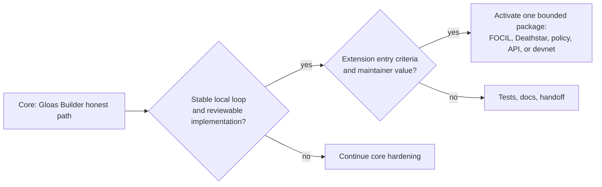
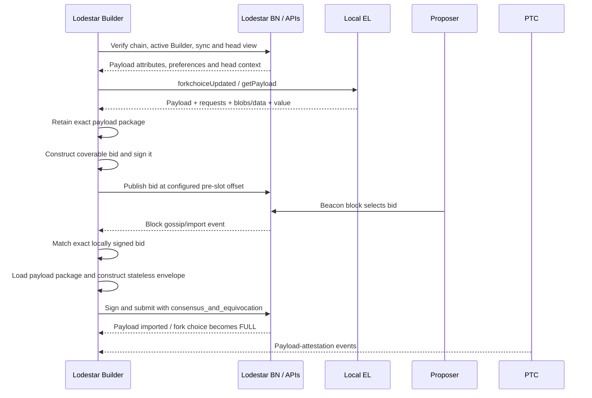
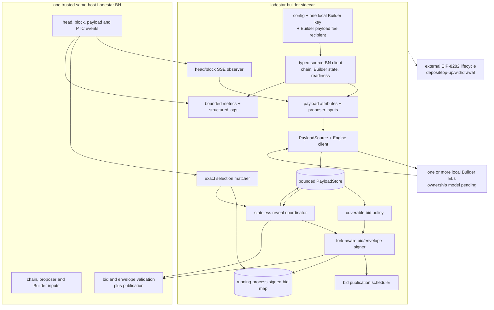
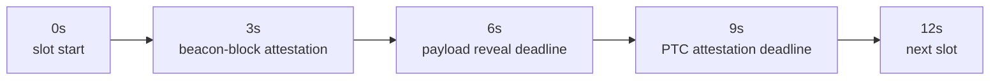

# Lodestar EIP-7732 Builder — Living Technical Note

| Doc status | |
|---|---|
| Proposal | [Merged](https://github.com/eth-protocol-fellows/cohort-seven/blob/master/projects/lodestar-eip-7732-builder.md); strong-success list amended through [PR #186](https://github.com/eth-protocol-fellows/cohort-seven/pull/186) |
| Implementation plan | [v1.0 merged](https://github.com/krisoshea-eth/lodestar-eip-7732-builder-docs/pull/2) on August 5, 2026; the merged GitHub plan is the implementation source of truth |
| Architecture reconciliation | [Direct-Engine working plan](direct-engine-working-plan.md), confirmed 2 September 2026; controls conflicts with the historical BN-mediated payload and reveal design while production EL topology remains open |
| Spec target | [consensus-specs v1.7.0-alpha.14](https://github.com/ethereum/consensus-specs/releases/tag/v1.7.0-alpha.14), the version still pinned by Lodestar `unstable`; [#5585](https://github.com/ethereum/consensus-specs/pull/5585) changed the source-tree version to `v1.7.0-beta.0`, but no beta tag or GitHub release exists yet |
| Lodestar baseline | [v1.47.0](https://github.com/ChainSafe/lodestar/releases/tag/v1.47.0) at `450996b13ab305b860acd131c87f799fdbfbabf0` is the latest stable and newest immutable release target; completed `BASELINE-01` records the exact working `unstable` pin |
| Builder implementation | Foundation through #9868, Gloas Builder API #9832, bounded envelope cache #9904, bid validation/flood publication #9914, and SSE containment #9964 are merged. API-02 #9931, TEST-01 #9932, PayloadSource #9958, the payload/store/policy foundations, and bid/reveal drafts are mapped in the direct-Engine working plan. Nico's 10-commit, 42-file branch remains proof-of-concept evidence rather than a merge-ready patch |
| Devnet | Public [Platåberget Dora](https://dora.plataberget.ethpandaops.io/) provides point-in-time runtime evidence. A finalized Lodestar-proposed block at [slot 79322](https://dora.plataberget.ethpandaops.io/slot/0x159ad62fd9512d3843f53ab79387a726d82b66fb0892134504cd1b426cc78b19) used an external Builder payload, reported `Revealed`, value 0.3246 ETH, and 99.26% PTC quorum. This does not prove continuous health, API-02's observer path, shutdown behavior, Assertoor/Buildoor results, deployed bytecode, or recovery. [`tests-glamsterdam-devnet@v8.1.1`](https://github.com/ethereum/execution-specs/releases/tag/tests-glamsterdam-devnet%40v8.1.1) is the latest successor fixture release |
| Builder lifecycle identifiers | Deposit request type `0x03`; Builder withdrawal credentials prefix `0xB0` |
| Payload deadline | `PAYLOAD_DUE_BPS = 5000`, six seconds into a 12-second slot; PTC payload attestation remains at `7500` |
| Last reconciliation | September 2, 2026: all 42 changed files in `nflaig/builder` at `99fd8fa9ad`, Lodestar `unstable` at `d00b8296c9`, current Builder PRs through #9986 plus fork drafts #77 and #80, directly relevant consensus/API/Buildoor changes, the BASELINE-01 matrix, and all 72 current Linear issues. All 72 Linear titles have GitHub issue mirrors; closed legacy `NICO-01` and unlabelled administrative `PRESENTATION-01` remain GitHub-only. The Marko-owned mirror items and both new Kris-owned fork implementation items have verified assignees, workflow status, Linear status, gate, and priority fields |
| Next milestone | Review the independent foundations first, stabilize the two logical bid/reveal review groups, complete the combined runtime loop and independent ENV-02 reproduction, and settle SPEC-01 separately from payload-attributes #638 |

This is the working document for the Lodestar EIP-7732 Builder project, an EPF cohort 7 project by [Kris O'Shea](https://github.com/krisoshea-eth) and [Marko Lazic](https://github.com/markolazic01), mentored by [Nico Flaig](https://github.com/nflaig) (ChainSafe, EIP-7732 co-author). The [project proposal](https://github.com/eth-protocol-fellows/cohort-seven/blob/master/projects/lodestar-eip-7732-builder.md) remains the stable public scope, while the [merged implementation plan](https://github.com/krisoshea-eth/lodestar-eip-7732-builder-docs/blob/main/docs/implementation-plan.md) owns accepted delivery decisions and issue boundaries. This note carries moving technical context, implementation findings, upstream state, code-path maps, adversarial cases, and research watches. Linear owns issue status, ownership, dependencies, and evidence.

## Contents

- **Part I — Orientation**
  - [How to use this note](#how-to-use-this-note)
  - [Recurring sweep checklist](#recurring-sweep-checklist)
  - [Current stance](#current-stance)
  - [Decision log](#decision-log)
  - [Terms](#terms)
  - [Proposal link](#proposal-link)
- **Part II — Knowledge base**
  - [Confirmed facts](#confirmed-facts)
  - [Working notes](#working-notes)
  - [Watchlist](#watchlist)
- **Part III — Design**
  - [Mentor questions](#mentor-questions)
  - [Gloas lifecycle summary](#gloas-lifecycle-summary)
  - [Candidate architecture sketch](#candidate-architecture-sketch)
  - [Bid → payload cache design](#bid--payload-cache-design)
  - [Bid policy notes](#bid-policy-notes)
  - [Slot timing and PTC](#slot-timing-and-ptc)
  - [Deathstar notebook](#deathstar-notebook)
  - [FOCIL context](#focil-context)
- **Part IV — Implementation reference**
  - [Current Lodestar code-path map](#current-lodestar-code-path-map)
  - [Beacon API notes](#beacon-api-notes)
  - [Implementation packages and ownership](#implementation-packages-and-ownership)
  - [Process notes](#process-notes)
  - [Weekly implementation log](#weekly-implementation-log)
- **Part V — Trackers**
  - [PR / branch status](#pr--branch-status)
  - [Resource backlog](#resource-backlog)

---

# Part I — Orientation

## How to use this note

- Keep the merged proposal stable unless the project scope materially changes.
- Put moving implementation details here: branch choices, current PR state, mentor answers, architecture sketches, experiments, and failure cases.
- Keep confirmed facts separate from working hypotheses.
- Record resolved watchlist items in the decision log before removing them.
- Run the sweep checklist before mentor calls, implementation milestones, public updates, and devnet work.
- Treat dates and status labels as part of the claim. A merged spec change, an open Lodestar PR, and a devnet-only branch are different baselines.
- Prefer a smaller number of verified, decision-relevant entries over a long list of stale links.

## Recurring sweep checklist

Run roughly weekly and before each milestone. Update the Doc status table afterwards.

- [ ] Has the `v1.7.0-beta.0` source version from #5585 received an immutable tag and been adopted by Lodestar, or has #5497's head-compatible bid rule changed?
- [ ] Stable Lodestar release after v1.47.0, or material `unstable` changes to the Builder package, Gloas types, payload production, publication, or events?
- [ ] Status change in open Lodestar [#9736](https://github.com/ChainSafe/lodestar/pull/9736), Builder API [#9832](https://github.com/ChainSafe/lodestar/pull/9832), PTC sampling [#9903](https://github.com/ChainSafe/lodestar/pull/9903), or envelope caching [#9904](https://github.com/ChainSafe/lodestar/pull/9904)?
- [ ] Follow-up after merged builder-specs [#165](https://github.com/ethereum/builder-specs/pull/165)/[#166](https://github.com/ethereum/builder-specs/pull/166), beacon-APIs [#630](https://github.com/ethereum/beacon-APIs/pull/630), keymanager-APIs [#92](https://github.com/ethereum/keymanager-APIs/pull/92), or the four open Builder-selection event PoCs?
- [ ] Cross-client rollout of #5497, especially Teku and the Prysm replacement, and any evidence that strict local-head validation limits propagation?
- [ ] Has devnet-7 changed state, or has a devnet-8 launch been verified separately from the v8 fixture release?
- [ ] Have exact `uint64` fields remained exact through Builder parsing, caching, signing, hashing, events, and API boundaries?
- [ ] Have corrected FCR fixtures been regenerated after consensus #5498/#5499 and merged smoke check #5504?
- [ ] New evidence on epoch-transition reorg pressure, bid-request timing, skipped slots, or minimum-bid fallback? Keep archive reports separate from verified telemetry.
- [ ] Has the stored #9757 proposer-equivocation fixture run end to end with Lodestar Builder rather than buildoor?
- [ ] EIP-8237, EIP-8146, FOCIL, or circuit-breaker changes that materially alter a conditional package rather than the current core?

## Current stance

| Area | Current stance |
|---|---|
| Core project | Direct-Engine `lodestar builder`: one local Builder key, one trusted source BN, and an injected payload source, initially a local EL; the Builder owns payload construction and retention while the BN owns chain inputs, validation, publication, and outcomes |
| First success target | Reproducible BN inputs → direct-Engine payload → Builder-constructed bid → BN validation/flood publication → exact selection → stateless reveal → FULL/PTC/payment evidence |
| Bid baseline | Payload-value bid, `execution_payment = 0`; execution rewards pay a Builder-controlled address and `bid.fee_recipient` pays the proposer |
| Reliability boundary | In-memory Builder payload store and one source BN first; durable restart recovery, multi-EL failover, and multi-BN publication remain later bounded work |
| Test order | Focused tests, then local Kurtosis, then ethereum-package/buildoor; public devnet is conditional evidence rather than a core prerequisite |
| Conditional extensions | One selected package after the core gates, with FOCIL, policy, observability, Builder API, advanced preparation, adversarial work, UI, and devnet deployment all explicitly gated |
| Base branch | Current `unstable`, pinned by `BASELINE-01`; merge `unstable` regularly and split work only when review benefits |

FOCIL remains a useful extension candidate, not a parallel core deliverable. Deathstar now contributes one bounded core QA fixture for proposer equivocation and payload unbundling, while broader malicious controls remain conditional. Neither should delay the honest Builder loop.



## Decision log

| Date | Question | Outcome | Notes |
|---|---|---|---|
| 2026-09-02 | Builder payload ownership | **Use direct Engine access as the working baseline; use Nico's branch as evidence, not a merge-ready patch** | Nico confirmed that direct Engine access is simpler and preserves flexibility for other building software. Extract reviewable slices from the [`nflaig/builder` proof-of-concept branch](https://github.com/ChainSafe/lodestar/tree/nflaig/builder). A shared EL is PoC-only unless the Builder follows BN-emitted payload attributes exactly; production EL topology remains explicit work |
| 2026-09-02 | Initial lifecycle persistence and transport | **In-memory first, p2p first** | Bounded in-memory retention is acceptable for the first honest loop; persistence/restart recovery follows later. Bid and envelope publication use the source BN and p2p path first; a Builder API server is a later addition |
| 2026-09-02 | Direct-Engine PR delivery | **Review foundations first and group consumers if maintainers prefer** | #9958, #9970/#9, #9974/#10, #9975, and #9976 establish foundations. #9973 remains stacked on #9958. Draft #9978/#9979 form one logical bid path; #9980/#9981/#9982 form one logical selection/reveal path. Fork draft #77 composes the resolved bid path without event or CLI wiring. Draft status records implementation evidence, not maintainer acceptance |
| 2026-08-31 | Bid publication | **Landed independently of the wider architecture decision** | Lodestar [#9914](https://github.com/ChainSafe/lodestar/pull/9914) and js-libp2p [#3610](https://github.com/libp2p/js-libp2p/pull/3610) provide API validation and per-call flood publication; BN-PUB-01 can close with evidence |
| 2026-09-02 | Payload-attributes specification and implementation | **Implement the proposed hash fields without treating emission semantics as settled** | Open beacon-APIs [#638](https://github.com/ethereum/beacon-APIs/pull/638) defines `safe_block_hash` and `finalized_block_hash`; fork draft [#80](https://github.com/krisoshea-eth/lodestar/pull/80) adds them to Lodestar's post-Gloas event type and current producer with focused tests. Trigger, deduplication, custody input, SPEC-01, and #599 remain separate |
| 2026-08-11 | API-02 SSE operational boundary | **Keep one source and route recovery explicitly** | Node 24.13.0 selects Lodestar's npm `eventsource` fallback. The Builder CLI supplies one BN URL, but the shared API client pins SSE to its first URL while ordinary REST requests can use fallbacks. The Beacon API event contract defines no SSE `id` or `Last-Event-ID` resumption. Merged #9872 and #9964 contain individual event, decode, or consumer failures without adding replay, so REL-01 owns bounded same-source reconciliation after reconnect and while connected. ENV-02 owns shutdown evidence and independent reproduction |
| 2026-08-10 | API-02 selected-bid observation path | **Use standard `block` SSE plus `getBlockV2`** | The Builder subscribes through its source BN API, retrieves the signed fork-correct block by root with five 200 ms retry delays, and deduplicates a FIFO window of 256 roots. `block_gossip`, reconnect, replay, and restart recovery remain deferred to later work; no Lodestar-specific endpoint is required for correctness |
| 2026-08-14 | Builder foundation follow-up | **#9781 merged; cleanup remains** | #9781 merged as `2a04194b900e` after Nico approval and passing checks. Twelve review-thread markers remain for explicit reconciliation; #9819 owns test-helper deduplication and #9827 carries logging and abort-loop nits. `REVIEW-01` stays In Progress until that bookkeeping is closed without reopening completed CLI-01/API-01 scope |
| 2026-08-24 | Builder foundation follow-ups | **Implementation landed; thread-marker bookkeeping remains** | #9819 was closed by shared-helper PR #9826, #9827 merged the lifecycle and logging follow-ups, #9848 merged metrics, #9860 added CLI handler tests, and #9868 hardened transient Builder lookup. REVIEW-01 remains open only for explicit reconciliation of the old #9781 thread markers |
| 2026-08-24 | SPEC-01 implementation evidence | **Reopen the event-shape decision** | Marco's upstream #9854, #9875, #9876, and #9896 compare additive `block` fields, two complete-bid event shapes, and `block_v2`. Nico's #9854 review found the additive shape implicit and error-prone and raised `block_gossip`; dedicated events exclude self-builds and raise naming, versioning, block-root, and TypeScript-union questions. Nico's unpublished branch remains end-to-end evidence, not the settled API contract. API-02 remains the bounded fallback |
| 2026-08-24 | API-02 upstream refresh | **Merge current unstable without widening scope** | Fork PR #48 integrates `bd761ec9ea` through `c3a42e6a24`, preserves upstream clock, Gloas identity, metrics, shared-stub, and SSE-resilience patterns, and passes 25 observer plus 52 Builder package tests on Node 24.13.0 |
| 2026-08-10 | Later-deposited Builder lifecycle | **Implemented and merged** | When the configured key is absent from the BN result, the sidecar remains inert and retries with cancellation so a later deposit or activation can be discovered. Pending, exited, and unknown results remain distinct and operator-visible. The implementation merged in #9781; `TEST-01` retains broader readiness, CLI, and diagnostic regressions |
| 2026-08-10 | Partial monitor and devnet configuration movement | **Record without inferring health** | The August 10 monitor was partial, so unavailable source cursors were not advanced. Direct checks confirmed the #9781 live state, the four devnet host removals in `1ca063f`, and the Dora override in `df1dfc7`; none proves public devnet health or a devnet-8 launch |
| 2026-08-09 | Release-candidate and shutdown baseline | **Audit rc.1; root shutdown handle still open** | [v1.46.0-rc.1](https://github.com/ChainSafe/lodestar/releases/tag/v1.46.0-rc.1) supersedes rc.0. #9790 preserves state/database close and #9792 fixes a QUIC resource leak. #9793 closed without merge because the proposed force-exit mechanism did not generalize, especially for container PID 1; none identifies the underlying stuck handle |
| 2026-08-09 | Builder Gate-A issue split | **Completed scopes and follow-ups remain separate** | Marko's `CLI-01` and `API-01` closure is preserved. After #9781 merged, `REVIEW-01` retains only its thread-marker and follow-up reconciliation, while `TEST-01` and `MET-01` own the remaining test matrix and metrics |
| 2026-08-07 | Equivocation validation | **Merged** | [Lodestar #9757](https://github.com/ChainSafe/lodestar/pull/9757) now supplies BN-owned `consensus_and_equivocation` validation and Deathstar proposer-equivocation machinery |
| 2026-08-05 | Implementation plan | **v1.0 merged** | [Docs PR #2](https://github.com/krisoshea-eth/lodestar-eip-7732-builder-docs/pull/2); all 14 review threads resolved and no plan-level question remains open |
| 2026-08-04 | Public Builder CLI docs | **Hidden until functional** | [Lodestar #9770](https://github.com/ChainSafe/lodestar/pull/9770) merged; restore the sidebar entry during `HANDOFF-01` |
| 2026-08-03 | Initial Builder package | **Merged and published** | [Lodestar #9758](https://github.com/ChainSafe/lodestar/pull/9758) landed the package, CLI scaffold, local keystore, bid/envelope signer, config checks, genesis wait, shutdown, and initial BN wiring; first npm publication followed |
| 2026-08-03 | Payload fee recipient | **Any Builder-controlled execution address; never the proposer address** | It need not match Builder withdrawal credentials. The simplest fixture may reuse the Builder withdrawal/execution address. `bid.fee_recipient` remains the proposer payment address |
| 2026-08-03 | Preparation and publication timing | **Separate them** | Prepare early enough for a complete bid, then publish at a configurable bounded pre-slot offset rather than racing the proposer at `t=0` |
| 2026-08-03 | Head change and stale work | **New parent tuple, new bid; no unpublish** | Audit and reuse existing BN payload-job/cache cleanup. Do not add a sidecar cancellation path unless the pin exposes a gap |
| 2026-08-03 | Stateful cache model | **One same-host source BN in v1** | Reuse BN production state; stateless and multi-BN failover remain outside core |
| 2026-08-01 | Envelope publication validation | **Explicit `consensus_and_equivocation`** | Validation and proposer-equivocation detection stay BN-owned; the implementation subsequently merged in [Lodestar #9757](https://github.com/ChainSafe/lodestar/pull/9757) |
| 2026-07-31 | Multiple bids | **Compatible with the connected BN's local head view** | [consensus-specs #5497](https://github.com/ethereum/consensus-specs/pull/5497) and [Lodestar #9739](https://github.com/ChainSafe/lodestar/pull/9739) merged; multi-branch flood publishing remains deferred |
| 2026-07-30 | Genesis wait and shared config | **Duplicate `waitForGenesis`; share `assertEqualParams` through config** | [Lodestar #9725](https://github.com/ChainSafe/lodestar/pull/9725) and [#9726](https://github.com/ChainSafe/lodestar/pull/9726) merged; do not add unreachable BN 404 code |
| 2026-07-30 | Runtime boundary | **Historical: standalone same-host sidecar; BN owns EL and payload building** | Superseded by the confirmed direct-Engine working direction above |
| 2026-07-14 | Project extension model | **Core first; one bounded extension after gates** | FOCIL, policy, observability, Builder API, advanced preparation, adversarial work, UI, and devnet deployment remain conditional |
| 2026-07-13 | Proposal status | **Merged** | [EPF7 PR #161](https://github.com/eth-protocol-fellows/cohort-seven/pull/161), amended through [PR #186](https://github.com/eth-protocol-fellows/cohort-seven/pull/186) |
| 2026-07-06 | Payload deadline | **`PAYLOAD_DUE_BPS = 5000`** | Six seconds on a 12-second slot; read configured BPS rather than hardcoding milliseconds |
| 2026-07-03 | Builder credentials | **Withdrawal prefix `0xB0`** | Deposit request type remains `0x03`; the two values are not interchangeable |

## Terms

| Term | Meaning here |
|---|---|
| ePBS | Enshrined proposer-builder separation, introduced by EIP-7732 |
| Gloas / Glamsterdam | Consensus-layer fork name / network upgrade carrying ePBS |
| Heze / Hegotá | Next consensus fork / upgrade track in which FOCIL is being developed |
| Bid | `SignedExecutionPayloadBid`, the builder commitment selected by the beacon block |
| Envelope | `SignedExecutionPayloadEnvelope`, the later payload reveal |
| PTC | Payload Timeliness Committee, which attests payload and data availability on the Gloas timeline |
| FULL / EMPTY / PENDING | Fork-choice variants for payload revealed / unavailable / not yet resolved |
| FCR | Fast confirmation rule |
| BAL | Block access list; future sidecar work is tracked under EIP-8146 |
| IL / FOCIL | Inclusion list / fork-choice-enforced inclusion lists, EIP-7805 |
| fcU | `engine_forkchoiceUpdated` |
| BPS deadline | A slot-relative deadline expressed in basis points of configured slot duration |
| ProgressiveContainer | EIP-7688 forward-compatible SSZ container whose merkleization differs from legacy `Container` |
| Data columns | PeerDAS erasure-coded blob data that the reveal path must make available |
| Self-build | The proposer builds its own payload. The Gloas spec uses `BuilderIndex(UINT64_MAX)`; Lodestar represents that sentinel internally as `Infinity` |

## Proposal link

- [Merged Lodestar EIP-7732 Builder proposal](https://github.com/eth-protocol-fellows/cohort-seven/blob/master/projects/lodestar-eip-7732-builder.md)
- [Proposal PR #161 and review history](https://github.com/eth-protocol-fellows/cohort-seven/pull/161)
- [Strong-success amendment PR #186](https://github.com/eth-protocol-fellows/cohort-seven/pull/186)
- [Merged implementation plan](https://github.com/krisoshea-eth/lodestar-eip-7732-builder-docs/blob/main/docs/implementation-plan.md)
- [Linear project](https://linear.app/kriso/project/lodestar-eip-7732-builder-814d6faca6fd)
- [Public HackMD for this living note](https://hackmd.io/@krisos/S1a9mdB7fl)
- [Presentation](https://docs.google.com/presentation/d/1cmC3fpu652gZFTIm2_P1lIYOfC2M_w3c5qXSUZ4B6lc)

---

# Part II — Knowledge base

## Confirmed facts

These items were reconciled against the August 22-24 partial monitoring reports, confirmed Lodestar-team guidance, and direct live primary-source checks through August 24. The reports did not advance unavailable source cursors. Dora now supplies point-in-time runtime evidence, but not continuous-health, recovery, lifecycle-suite, or deployed-bytecode proof. Re-check these facts after each baseline bump.

### Current Builder implementation state

- [Lodestar #9758](https://github.com/ChainSafe/lodestar/pull/9758) created the first real `@lodestar/builder` package. It includes package and CLI scaffolding, one local keystore-backed key, bid and envelope signing with tests, a Builder `waitForGenesis`, source-BN wiring, shared `assertEqualParams`, active-Builder lookup, signal handling, and shutdown.
- The package was first published to npm on August 4. `latest` is currently the placeholder `0.0.0`; development builds are published under the `next` tag. This is package availability, not a claim that the command is production-ready.
- `SIGN-01`, `CLI-01`, `API-01`, `MET-01`, and `BN-PUB-01` are complete in the project board. [Lodestar #9781](https://github.com/ChainSafe/lodestar/pull/9781) merged the foundation, [#9827](https://github.com/ChainSafe/lodestar/pull/9827) merged its lifecycle and logging follow-up, [#9826](https://github.com/ChainSafe/lodestar/pull/9826) centralized the shared API test stubs, [#9848](https://github.com/ChainSafe/lodestar/pull/9848) added metrics, [#9860](https://github.com/ChainSafe/lodestar/pull/9860) added CLI handler tests, [#9868](https://github.com/ChainSafe/lodestar/pull/9868) hardened transient Builder lookup, and [#9914](https://github.com/ChainSafe/lodestar/pull/9914) added API bid validation and flood publication. `REVIEW-01` retains only explicit #9781 thread-marker reconciliation; `TEST-01` is in upstream review. `ENV-01` is Done for its manual setup scope, while `ENV-02` owns the stored clean-checkout runbook and independent reproduction.
- #9781 adds Builder identity/status tracking, BN and EL readiness polling, `--executionFeeRecipient`, request timeout wiring, and identity/tracker tests. Unknown and pending configured keys wait inertly with cancellation, exited Builders fail distinctly, identity responses are sanity-checked, and API errors use the standard response path. The current assumption that Gloas-capable clients expose the health endpoint was explicitly accepted for now.
- Twelve #9781 review-thread markers remained unresolved in the August 14 GitHub inventory. Their implementation follow-ups are no longer open: [#9819](https://github.com/ChainSafe/lodestar/issues/9819) closed through merged #9826 and #9827 merged. `REVIEW-01` still requires explicit thread-by-thread reconciliation rather than silently treating the markers as resolved. Broader readiness recovery, bounded diagnostics, and remaining lifecycle coverage stay in `TEST-01`.
- The main implementation gap is no longer signing or local bid publication. It is the Builder-owned payload source and store, coverable bid construction, exact selection matching, stateless reveal, and complete evidence loop.
- The confirmed working baseline has the Builder connect directly to an injected payload source, initially a local EL Engine API. The final shared-versus-dedicated production topology remains open, but it no longer blocks architecture-neutral service work.
- The Builder owns its key, payload source and store, bid construction and policy, signatures, exact matching, and orchestration. The source BN owns chain and proposer inputs, API validation, publication, and authoritative outcomes.
- Merged Lodestar #9914 and js-libp2p #3610 provide the current local-bid validation and flood-publication seam. Merged #9904 remains BN-side envelope import and recovery evidence rather than the Builder's primary direct-Engine payload store.
- Merged consensus-specs [#5549](https://github.com/ethereum/consensus-specs/pull/5549) adds post-Gloas `custody_columns` to `notify_forkchoice_updated`. Nico's proof of concept predates this input. BN-01, ATTR-01, PAYLOAD-01, and EL-ARCH-01 must settle the Builder node identity and authoritative source of this value before a direct-Engine payload source lands.
- Ready [Lodestar #9958](https://github.com/ChainSafe/lodestar/pull/9958) extracts the narrow `PayloadSource` contract and injected Engine adapter as PAYLOAD-SOURCE-01. It does not settle production EL ownership or add Builder runtime construction. Draft [#9973](https://github.com/ChainSafe/lodestar/pull/9973) adds bounded architecture-neutral orchestration on top. Draft [#9957](https://github.com/ChainSafe/lodestar/pull/9957) removes older pre-Fulu blob retrieval code but leaves the Gloas `getPayload` blob bundle used by this contract intact.

### Landed Lodestar capabilities to reuse

- [#9725](https://github.com/ChainSafe/lodestar/pull/9725) moved `assertEqualParams` and `NotEqualParamsError` into `@lodestar/config`; the Builder must import them rather than duplicate validator code.
- [#9726](https://github.com/ChainSafe/lodestar/pull/9726) distinguishes the expected pre-genesis 404 from real `waitForGenesis` errors. The Builder keeps its small behaviorally aligned copy because the function depends on `@lodestar/api` and has no clean config-level home.
- [consensus-specs #5497](https://github.com/ethereum/consensus-specs/pull/5497) and [Lodestar #9739](https://github.com/ChainSafe/lodestar/pull/9739) allow multiple bids compatible with the local head view and track seen bids per parent tuple. Core follows the connected BN head; different-branch flood publishing is deferred.
- [#9749](https://github.com/ChainSafe/lodestar/pull/9749), [#9750](https://github.com/ChainSafe/lodestar/pull/9750), and [#9751](https://github.com/ChainSafe/lodestar/pull/9751) preserve `execution_payment`, bid `gas_limit`, and proposer `targetGasLimit` as exact `UintBn64` values.
- [#9756](https://github.com/ChainSafe/lodestar/pull/9756) narrowly ignores direct-parent bids at epoch boundaries. The broader same/next-slot restriction considered during review did not land.
- [#9486](https://github.com/ChainSafe/lodestar/pull/9486) provides the `head_v2` payload-status event, and [#9598](https://github.com/ChainSafe/lodestar/pull/9598) provides Lodestar's current Gloas proposer circuit breaker. The Builder observes their outcomes but does not invent a second circuit-breaker policy.
- [#9689](https://github.com/ChainSafe/lodestar/pull/9689) and [#9710](https://github.com/ChainSafe/lodestar/pull/9710) have merged the current EIP-7688 boundary follow-up and the envelope-by-peer quota correction. Cross-fork light-client work in [#9687](https://github.com/ChainSafe/lodestar/pull/9687) remains separate.
- [#9766](https://github.com/ChainSafe/lodestar/pull/9766) aligns the Builder package build and type-check scripts with the workspace TypeScript 7 migration. This closes the immediate CI-script regression but does not complete CLI readiness.
- [#9770](https://github.com/ChainSafe/lodestar/pull/9770) hides the generated Builder CLI page from the public docs sidebar until the command is functional.
- [#9757](https://github.com/ChainSafe/lodestar/pull/9757) merged BN-owned `consensus_and_equivocation` validation and Deathstar proposer-equivocation support. The stored local fixture still needs to replace buildoor with Lodestar Builder after the honest lifecycle works.
- [#9790](https://github.com/ChainSafe/lodestar/pull/9790) and [#9792](https://github.com/ChainSafe/lodestar/pull/9792) are included in v1.46.0. They preserve state/database close during a stuck network-worker shutdown and settle aborted QUIC resources respectively, but do not identify the underlying stuck handle. [#9793](https://github.com/ChainSafe/lodestar/pull/9793) closed without merge after review found that its self-signal/force-exit approach did not generalize, especially for default Docker/Kubernetes PID 1. Forced termination remains a process-manager responsibility while the root handle is investigated.
- [#9780](https://github.com/ChainSafe/lodestar/pull/9780) merged the circuit-breaker review follow-ups on August 14. Its bounded fixes are current baseline behavior and do not change the core Builder sidecar scope.
- [#9755](https://github.com/ChainSafe/lodestar/pull/9755) merged the local-versus-peer fault-ownership fix. Wrapped local EL/import failures now stay on the execution-error path rather than consuming honest peer scores.
- [#9762](https://github.com/ChainSafe/lodestar/pull/9762) updated `prepareNextSlot` to derive the proposer from the post-Fulu head state before creating the prepared state, avoiding a second state regeneration and possible double epoch transition. `BN-01` must trace this current flow rather than the older two-regeneration path.
- [#9505](https://github.com/ChainSafe/lodestar/pull/9505) landed the Heze fork definition and boilerplate. It narrows the future adaptation baseline but does not activate `EXT-FOCIL-01` or make the older FOCIL branch a core dependency.
- [#9935](https://github.com/ChainSafe/lodestar/pull/9935) landed Heze inclusion-list dependent-root handling, while [#9936](https://github.com/ChainSafe/lodestar/pull/9936) remains open for inclusion-list message-size and empty-transaction validation. Both remain conditional EXT-FOCIL-01 evidence.
- [#9937](https://github.com/ChainSafe/lodestar/pull/9937) landed the EMPTY Gloas payload range-sync guard. Open [#9281](https://github.com/ChainSafe/lodestar/pull/9281), [#9791](https://github.com/ChainSafe/lodestar/pull/9791), and [#9326](https://github.com/ChainSafe/lodestar/pull/9326) remain related BN recovery watches for impossible envelope targets, stale payload roots, and non-finality cache retention.
- Existing Gloas types, gossip, proposer preferences, bid validation/pooling/selection, payload-envelope import, PTC handling, block/payload events, and publication routes remain the BN foundation. The implementation must audit the exact pinned shapes rather than duplicate them.

### Current Gloas specification baseline

The current project target is [v1.7.0-alpha.14](https://github.com/ethereum/consensus-specs/releases/tag/v1.7.0-alpha.14). Material settled rules include:

| Topic | Current result | Builder consequence |
|---|---|---|
| Builder lifecycle identifiers | Deposit request type `0x03`; withdrawal prefix `0xB0` | Do not conflate the request type with withdrawal credentials |
| Payload deadline | `PAYLOAD_DUE_BPS = 5000` | Six seconds on a 12-second slot; reveal immediately after exact selection |
| PTC attestation deadline | `PAYLOAD_ATTESTATION_DUE_BPS = 7500` | Capture authoritative FULL/PTC evidence after reveal |
| Head-compatible bids | Multiple bids for the node's local head view | Same-head v1 can resubmit after a head change; incompatible-branch flood publication is not core |
| Parent-slot payload availability | Query availability at the parent block slot | Cover skipped-slot cases without using the child slot incorrectly |
| Already-known block redelivery | Early return preserves PTC and timeliness state | Duplicate block observation must remain idempotent |
| Progressive SSZ and exact integers | Current fork types and exact `uint64` roots are authoritative | Never hand-build roots or narrow values above `2^53` to JavaScript `number` |
| Envelope shapes | One signed envelope supports stateful and stateless contents through `Eth-Blob-Data-Included` | Core uses stateful same-BN reveal; stateless/multi-BN remains conditional |

The mainnet timing parameters remain:

```text
SLOT_DURATION_MS                  = 12000
ATTESTATION_DUE_BPS_GLOAS        = 2500
AGGREGATE_DUE_BPS_GLOAS          = 5000
PAYLOAD_DUE_BPS                  = 5000
PAYLOAD_ATTESTATION_DUE_BPS      = 7500
```

### Current Lodestar baseline

The phrase “Lodestar baseline” has two layers:

1. **Stable release and newest immutable audit target:** [v1.47.0](https://github.com/ChainSafe/lodestar/releases/tag/v1.47.0) at `450996b13ab305b860acd131c87f799fdbfbabf0`, published September 2. It includes the earlier Builder foundation but predates the direct-Engine service PR series.
2. **Implementation baseline:** current `unstable`, pinned to an exact SHA by `BASELINE-01` before more code is treated as Ready.

`BASELINE-01` still owns the deliberate project pin and reproducibility evidence. The historical August 5 observation `c65aaefd91a602df1ffb82d929ec479fba8578ac` is not a substitute for completing that issue.

Important moving inputs, reconciled through August 31:

- [#9781](https://github.com/ChainSafe/lodestar/pull/9781), merged as `2a04194b900e`: Gate-A Builder identity, readiness, configuration, lifecycle implementation, and tests;
- [#9827](https://github.com/ChainSafe/lodestar/pull/9827), merged as `ec596194e2`: Builder abort-loop and logging follow-ups from the final #9781 review;
- [#9848](https://github.com/ChainSafe/lodestar/pull/9848), merged as `bd3a76e069`: Builder metrics and metrics-server integration;
- [#9860](https://github.com/ChainSafe/lodestar/pull/9860), merged as `f3dcc639a0`: Builder CLI handler tests;
- [#9868](https://github.com/ChainSafe/lodestar/pull/9868), merged as `6585f8e881`: transient timeout and transport handling for Builder lookup;
- [#9832](https://github.com/ChainSafe/lodestar/pull/9832), merged as `57572140f8`: the proposer/BN-side Gloas Builder API flow and a direct BN-01 input;
- [#9872](https://github.com/ChainSafe/lodestar/pull/9872), merged as `1c8babbe6e`: drops only the event that cannot be serialized, keeps the stream alive, and closes genuinely broken post-header streams so EventSource can reconnect. API-02 now includes this substrate without changing its payload or recovery scope;
- [#9854](https://github.com/ChainSafe/lodestar/pull/9854), [#9875](https://github.com/ChainSafe/lodestar/pull/9875), [#9876](https://github.com/ChainSafe/lodestar/pull/9876), and [#9896](https://github.com/ChainSafe/lodestar/pull/9896): Marco's open SPEC-01 alternatives, which compare additive `block` fields, full-bid events, and `block_v2`;
- [#9903](https://github.com/ChainSafe/lodestar/pull/9903), open draft at `ad8355ee9e`: native whole-epoch PTC sampling; require differential committee, slot-offset, and final-state-root evidence before baseline adoption;
- [#9904](https://github.com/ChainSafe/lodestar/pull/9904), merged as `7aa8c9c93a`: bounded payload-envelope caching and DB reload recovery; it remains BN-side evidence rather than the direct-Engine Builder's primary payload store;
- [#9914](https://github.com/ChainSafe/lodestar/pull/9914), merged as `9ecc10f386`: validation and flood publication of API-submitted Builder bids;
- [`nflaig/builder`](https://github.com/ChainSafe/lodestar/tree/nflaig/builder), draft proof of concept at `99fd8fa9ad`: end-to-end direct-Engine Builder evidence, including enriched `block` fields and a compatibility block fetch;
- [#9736](https://github.com/ChainSafe/lodestar/pull/9736), draft: correct FULL-parent state use for production and reward calculation;
- [#9761](https://github.com/ChainSafe/lodestar/pull/9761), draft: Gloas compliance coverage;
- [#9780](https://github.com/ChainSafe/lodestar/pull/9780), merged August 14: circuit-breaker review follow-ups now in the current baseline;
- [#9793](https://github.com/ChainSafe/lodestar/pull/9793), closed without merge: retained as diagnostic history for a rejected self-signal/force-exit approach; the root network-worker handle remains unresolved;
- [builder-specs #165](https://github.com/ethereum/builder-specs/pull/165), gas-limit follow-up [#166](https://github.com/ethereum/builder-specs/pull/166), [beacon-APIs #630](https://github.com/ethereum/beacon-APIs/pull/630), and [keymanager-APIs #92](https://github.com/ethereum/keymanager-APIs/pull/92) merged on August 24. Together with merged Lodestar #9832 they replace the earlier moving API assumption for BN-01. Re-audit their final reviewed shapes before implementation.

[Lodestar #9594](https://github.com/ChainSafe/lodestar/pull/9594) closed without merge on August 5. It is historical design input, not an active dependency; `BN-01` and the conditional staked Builder API must re-audit the replacement implementation after the specifications settle.

Lodestar #9723 remains an ecosystem watch for proposer/EL coherence but is not a Builder-project dependency.

### Ecosystem tooling that already exists

- **buildoor** remains the closest working external reference. Its ePBS mode, lifecycle support, and ethereum-package integration make it useful for registration, interop, and competing-bid tests.
- **assertoor** still provides the `gloas-dev` lifecycle/deposit/exit/prefork playbooks. Any playbook or cached calldata that assumes `0x03` withdrawal credentials is stale after #5416; verify the current branch and devnet contract before running it.
- **The staked Builder API** has converged in builder-specs #165/#166, beacon-APIs #630, keymanager-APIs #92, and merged Lodestar #9832. It is not a core dependency, but BN-01 should audit the final landed route and forwarding behavior.
- **Platåberget Dora** now proves one finalized Lodestar-proposed external Builder reveal at slot 79322. It is point-in-time protocol-flow evidence only, not continuous-health, API-02, shutdown, recovery, Assertoor/Buildoor, or bytecode evidence.
- **Glamsterdam fixtures** are now published at [`tests-glamsterdam-devnet@v8.1.1`](https://github.com/ethereum/execution-specs/releases/tag/tests-glamsterdam-devnet%40v8.1.1). Fixture publication and Dora observations remain different evidence classes.

### Fork and spec status

- FOCIL remains outside the scheduled Glamsterdam set and belongs to the Heze/Hegotá track. [#9505](https://github.com/ChainSafe/lodestar/pull/9505) has landed the Heze fork scaffold, but the conditional Builder adaptation is still gated on settled Heze/FOCIL behavior and maintainer selection.
- The Heze bid-shape question is resolved for the current baseline: `inclusion_list_bits` is present.
- EIP-7688 remains a separate EIP-status question from the consensus-spec release that uses progressive structures. Keep those claims distinct.
- EIP-8237 and EIP-8146 remain Draft and continue to threaten future bid/cache/reveal shapes. They should stay behind fork-aware interfaces rather than inside Gloas-specific business logic.

## Working notes

Findings that shape the architecture but are not all final decisions.

### Architecture implications of the latest Lodestar work

The service boundary is now settled for v1: `lodestar builder` is a lightweight same-host sidecar connected to one operator-controlled BN. The sidecar does not connect to the EL. The BN remains authoritative for head and proposer context, Engine API access, payload production, payload value, balance validation, reveal material, and publication validation.

The remaining architecture work is narrower:

- trace `prepareNextSlot`, the current payload-job lifecycle, and the unsigned-bid path;
- choose the smallest reviewed preparation/candidate contract that carries target slot/head view and the Builder execution fee recipient before payload work starts;
- reuse standard `/builder` and `/beacon` namespaces plus SSE; do not create a permanent `/lodestar` API for a specification gap;
- keep the route operator-controlled and bounded in the same-host v1 model;
- re-audit the final API shapes from builder-specs #165, beacon-APIs #630, and the replacement for closed-unmerged Lodestar #9594 before freezing the adapter.

### Gloas circuit breaker and proposer fallback

Circuit-breaker threshold, recovery, fault class, and Builder-versus-relay identity remain unsettled research. Core v1 records reveal failures and authoritative FULL/EMPTY outcomes but does not implement or depend on a new circuit-breaker policy. A future package may correlate Builder failures with proposer fallback once the protocol and operator identity rules are defined.

### Heze / FOCIL after the bitlist decision

The restored bitlist removes one source of ambiguity but does not make the FOCIL branch a safe base. The branch is still a large draft that has diverged substantially from current `unstable`. Its value is architectural prior art and a future adaptation target.

For the Builder, the concrete Heze delta is now easier to state:

```text
Gloas bid construction
+ inclusion-list intake / local IL view
+ inclusion_list_bits derivation
+ Heze SSZ/signing root
+ cache entry that records the IL commitment context
+ payload construction that satisfies the selected IL constraints
```

### Deathstar, on the ground

Deathstar is now directly relevant to one bounded core test. Merged [Lodestar #9757](https://github.com/ChainSafe/lodestar/pull/9757) adds proposer equivocation and BN-side `consensus_and_equivocation` handling, initially exercised with buildoor. The project stores the reviewed local fixture at [`docs/test-plans/pr-9757-builder-equivocation.yaml`](https://github.com/krisoshea-eth/lodestar-eip-7732-builder-docs/blob/main/docs/test-plans/pr-9757-builder-equivocation.yaml) and will rerun the same rejection with Lodestar Builder once the honest loop works.

Broader runtime-configurable malicious controls, a configuration UI, payload withholding, late reveal, and Builder payload equivocation remain conditional work. The old `EPBS_CHAOS_FEATURES.md` catalog is useful for ideas but is not authoritative; some cases are stale or invalid and must be checked against current code and specs.

### Devnet and branch layering

Four layers are easy to conflate:

```text
consensus-specs alpha.14
→ current Lodestar unstable
→ public Platåberget runtime observations
→ Glamsterdam execution fixtures v8.1.1
```

A local demo can begin before the public devnet is On, but its runbook must record the exact CL branch, EL image, network config, deposit contract, and builder credentials used.

- Keep historical devnet-7, current Platåberget, and local fixture evidence separate. Fixture tags and images are configuration or publication evidence, not runtime-health evidence.
- Use the exact network and fixture versions recorded by a run. The current fixture line is v8.1.1, while Dora's slot 79322 is independent point-in-time evidence and must not be promoted to a continuous-health claim.
- Local Kurtosis remains the first evidence target, so a public devnet transition does not block the core project.

### Validation and observability edges

- Bid tests should include parent-branch state, local-head compatibility, out-of-range Builder indices, slot-boundary clock disparity, and the narrow epoch-boundary direct-parent rule in #9756.
- Preserve every SSZ-root `uint64` input exactly. Test `2^53 - 1`, `2^53`, `2^53 + 1`, and `uint64` maximum through parsing, caching, signing, hashing, proposer preferences, `PayloadAttributesV4`, and events.
- Proposer preferences have a fork-boundary edge: the first Gloas slots can lack usable preferences unless they are broadcast before the fork ([#9571](https://github.com/ChainSafe/lodestar/pull/9571) addresses this).
- The clean end-to-end signal is the selected block becoming FULL, not only a successful publish response. Merged [#9486](https://github.com/ChainSafe/lodestar/pull/9486) provides `head_v2.payload_status`; retain payload-import and fork-choice evidence as a cross-check.
- `payload_attestation_message` events are now available for measuring PTC observation and disagreement.
- Data-column “published to zero peers” logs can be misleading when peers gossip locally produced columns back first; retain source-aware metrics.
- For skipped slots, query parent payload availability using the parent block slot.
- Consensus #5498 and #5499 corrected FCR vector scheduling. #5504 has now merged the compliance-generation smoke check; regenerated artifacts and Lodestar diagnostics remain a baseline-audit concern rather than new Builder scope.

### CL/EL integration gotchas

Failures at the consensus/execution boundary can masquerade as Builder bugs even when the Builder logic is correct, so the first local setup needs a clean separation between Builder errors and EL-integration errors:

- Post-Gloas `engine_forkchoiceUpdated` reports the bid's `parent_block_hash` as safe and finalized, because the safe or finalized block's own payload may not yet be confirmed canonical ([#9393](https://github.com/ChainSafe/lodestar/pull/9393)); pre-Gloas fcU assumptions do not carry over.
- An EL returning `INVALID` once wedged a Gloas devnet node, since the pre-Gloas safety net is bypassed with payload verification deferred to `importExecutionPayload` ([#9332](https://github.com/ChainSafe/lodestar/pull/9332)).
- Open [#9637](https://github.com/ChainSafe/lodestar/pull/9637) tracks the related requirement that attestations and aggregates must not keep supporting an EL-invalidated Gloas payload. Treat #9332 and #9637 as joint QA, E2E, and OUT-01 evidence rather than Builder-only logic.
- The native (Zig) state-transition mode throws on Gloas; keep `nativeStateView` disabled during Builder work ([#9516](https://github.com/ChainSafe/lodestar/pull/9516)).
- Do not prepare, retrieve, sign, or propagate bids when the BN is far behind, execution is optimistic, or its EL is unavailable. The sidecar may observe and report startup readiness, but the BN preparation/candidate route owns the authoritative guard and typed syncing or unavailable result.
- Reuse the smallest suitable BN helper. Share or import validator's `SyncingStatusTracker` only if a real Builder resync lifecycle or broader reuse case appears and the dependency remains clean; `runOnResynced` was added for validator duty refetching and is not a reason by itself.
- Keep local EL and payload-production failures distinct from peer-attributable faults. Merged [#9755](https://github.com/ChainSafe/lodestar/pull/9755) provides the current regression-tested error-ownership behavior.

### Registration sharp edges

- The temporary fork-onboarding prefix is now `0xB0`; the execution request type remains a separate value.
- Existing `0x03` withdrawal credentials are not a harmless display mismatch — they represent different bytes and should be regenerated for the current baseline.
- Real EIP-8282 registration requires current devnet contract addresses and activation timing, not only a signed deposit payload.
- A top-up to an exited builder can still create confusing lifecycle state; keep lifecycle checks explicit in a real-registration demo.
- The execution payload fee recipient may be any address controlled by the Builder and need not match its withdrawal credentials. It must not be the proposer address. Onboarding, top-ups, withdrawals, and balance management remain external to `lodestar builder`.

## Watchlist

Only unresolved or moving items belong here.

### Direct project delivery

- **Baseline pin:** record the exact `unstable` SHA, spec/API versions, fixture/image versions, baseline failures, and capability audit in `BASELINE-01`.
- **Mainnet-scale payment arithmetic:** open [#9350](https://github.com/ChainSafe/lodestar/pull/9350) moves pending-payment quorum arithmetic to `bigint`. BASELINE-01 tracks the upstream disposition and OUT-01 must include a large-accumulator regression before a mainnet-readiness claim.
- **EL-invalid and recovery behavior:** open [#9332](https://github.com/ChainSafe/lodestar/pull/9332) and [#9637](https://github.com/ChainSafe/lodestar/pull/9637) feed EL-ARCH-01, QA-01, E2E-01, and OUT-01. Merged #9937 plus open #9281, #9791, and #9326 feed REL-01 and the bounded negative-path evidence.
- **Source-BN readiness:** [#9781](https://github.com/ChainSafe/lodestar/pull/9781), helper consolidation [#9826](https://github.com/ChainSafe/lodestar/pull/9826), lifecycle follow-up [#9827](https://github.com/ChainSafe/lodestar/pull/9827), and transient identity handling [#9868](https://github.com/ChainSafe/lodestar/pull/9868) are merged. Reconcile the twelve historical #9781 thread markers and close broader regressions through `TEST-01`.
- **Preparation/candidate contract:** trace `prepareNextSlot` and return the proposed route/lifecycle for Lodestar review in `BN-01`.
- **FULL-parent production:** reuse [Lodestar #9736](https://github.com/ChainSafe/lodestar/pull/9736) if it lands; do not create a parallel workaround.
- **Equivocation validation:** [#9757](https://github.com/ChainSafe/lodestar/pull/9757) is merged; rerun the stored fixture with Lodestar Builder.
- **Gloas compliance:** track draft [#9761](https://github.com/ChainSafe/lodestar/pull/9761) during `BASELINE-01`; use it as baseline evidence rather than creating a duplicate Builder-only compliance harness.
- **Builder API convergence:** track builder-specs #165, beacon-APIs #630, and the replacement for closed-unmerged Lodestar #9594, while keeping staked request authentication outside core.
- **Shutdown and restart:** audit rc.1 #9790/#9792 and the reasons #9793 closed without merge. Test state persistence, database close, process-manager timeout, and Builder cache/reveal recovery without treating the underlying stuck worker as solved or prescribing the rejected self-signal approach.

### Protocol and interoperability

- **Cross-client #5497 rollout:** Lodestar support is merged; Teku work and a Prysm replacement remain active. Test propagation before relaxing local validation for multi-branch bids.
- **Epoch boundaries:** preserve the narrow #9756 direct-parent rejection and test skipped slots without adopting the retracted broader restriction.
- **Exact integers:** prevent regressions that narrow `UintBn64` values to JavaScript `number`.
- **FCR artifacts:** #5498, #5499, and #5504 are merged; regenerated artifacts and Lodestar coverage still need verification.
- **Post-alpha.13 fork-choice and reward tests:** consensus [#5514](https://github.com/ethereum/consensus-specs/pull/5514) is merged and [#5509](https://github.com/ethereum/consensus-specs/pull/5509) remains open. Re-audit them when choosing the exact spec/Lodestar pin; do not silently treat unreleased `master` behavior as part of alpha.13.
- **Local versus peer faults:** #9755 is merged; retain its wrapped-error regression when exercising local EL failure and range sync.
- **Range-sync attempt identity:** [#9667](https://github.com/ChainSafe/lodestar/pull/9667) and [#9686](https://github.com/ChainSafe/lodestar/pull/9686) remain open ecosystem work. Do not pull them into Builder scope unless the pinned local evidence exposes a direct dependency.
- **Devnet transition:** devnet-7 and devnet-8 remain separate baselines; no devnet-8 launch is verified.

### Research and conditional work

- The August 4 public archive reports epoch-transition reorg concentration after skipped slots. Treat transition-state caching, duty prefetch, bid-request timing, minimum-bid fallback, and blob-heavy production as hypotheses until reproduced with reliable telemetry.
- Circuit-breaker thresholds and Builder-versus-relay identity remain unsettled.
- PTC late-slot import-freeze and shorter-attestation-deadline ideas remain non-normative research until supported by distributed, mainnet-like evidence.
- FOCIL, advanced bid policy, multi-branch flood publishing, stateless/multi-BN reveal, remote signing, runtime malicious controls, and UI remain gated packages.
- Lodestar #9723, Builder-deposit signature caching in #9727, FCR diagnostics in #9711, cross-fork light-client work in #9687, and the broader #9692 mainnet-readiness checklist remain ecosystem context unless the Builder baseline audit exposes a direct dependency.

---

# Part III — Design

## Mentor questions

The plan-level mentor questions are closed. Nico confirmed the architecture and remaining v1 assumptions, and the implementation plan merged with no unresolved review thread. The following are implementation-time design checks, not requests to reopen the plan.

### Preparation/candidate API

- Trace `prepareNextSlot`, payload-job creation, existing cache ownership, and the current unsigned-bid route.
- Propose the smallest clean request and lifecycle that lets the same-host sidecar ask the BN to prepare for a target slot and its current head view while supplying the Builder-controlled payload fee recipient.
- Bring the proposed route and lifecycle back to the Lodestar team before freezing it or proposing the upstream API change.
- Re-audit builder-specs #165, beacon-APIs #630, and the replacement for closed-unmerged Lodestar #9594 because those shapes are expected to settle while `API-01` and `BN-01` progress.

### Readiness and sync behavior

- Let the sidecar observe and report startup readiness, but place the authoritative `not while syncing`, optimistic-execution, and EL-readiness assertion on the BN preparation/candidate path.
- Reuse the smallest BN helper. Share or import validator's `SyncingStatusTracker` only if the Builder later needs its resync lifecycle or enough related code to justify the dependency. `runOnResynced` was added for duty refetching and should not be copied without a Builder use case.
- Require a typed syncing or unavailable result before any preparation, retrieval, signing, or propagation can proceed.

### Timing and payload-store evidence

- Choose the first pre-slot publication default from repeatable Kurtosis evidence and keep it operator-configurable as proposer cutoffs and the future Builder API evolve.
- Confirm how the Builder cancels or expires stale direct-Engine payload work after parent or head input changes. Keep store insertion before bid publication and bound both work and retention.
- An already-published bid cannot be withdrawn. A head change creates a new parent-tuple bid.

### Conditional-package questions

FOCIL, multi-branch flood publication, stateless/multi-BN reveal, advanced policy, runtime malicious Builder behavior, Deathstar configurability, circuit breakers, and a UI remain questions only if their package passes the implementation-plan gate. They are not hidden v1 requirements.


## Gloas lifecycle summary

The honest Builder lifecycle remains:

```text
1.  Load one local Builder key and the Builder-controlled execution payload fee recipient.
2.  Wait for genesis, verify chain parameters, resolve the active Builder, and require BN/EL readiness.
3.  Follow the source BN's current head view through SSE.
4.  Consume fork-correct payload attributes and proposer preferences from the source BN.
5.  Prepare the payload through a configured local EL with the Builder fee recipient.
6.  Retain the exact payload material, construct one complete coverable bid, and sign it.
7.  Submit the signed bid through the source BN's validation and flood-publication path at the configured pre-slot offset.
8.  Observe block events and retrieve the fork-correct signed block.
9.  Detect an exact locally signed bid selected for this Builder.
10. Load the exact retained payload package and construct the stateless envelope.
11. Recheck commitments, sign the envelope, and submit it immediately with consensus_and_equivocation.
12. Observe BN acceptance, payload import, FULL/EMPTY, PTC, data, and payment outcomes.
```



The alpha.14 Gloas types remain the current pinned core shape. Heze extends the bid with `inclusion_list_bits`; EIP-8237 and EIP-8146 remain future shape risks behind fork-aware adapters.

## Candidate architecture sketch

The direct-Engine boundary is the confirmed working baseline. Nico's proof of concept supplies implementation evidence, while the current PR series tests smaller review boundaries. Production EL ownership and authoritative source-BN inputs remain explicit rather than being hidden in service constructors.



### Architecture milestone output

The architecture phase now produces four concrete artifacts:

1. **Pinned capability audit:** exact `unstable` SHA, API/spec versions, landed capabilities, and pre-existing failures.
2. **Reviewed ownership contract:** source-BN inputs, direct-Engine ownership, payload-store bounds, publication modes, errors, and namespaces.
3. **Failure contract:** readiness, no-bid, syncing, insufficient balance, stale input, store miss, publication rejection, late reveal, and offline-after-selection outcomes.
4. **Evidence map:** the Linear issue, PR, focused tests, and end-to-end assertion that prove each retained core capability.

A reasonable implementation principle regardless of boundary:

```text
Core Builder orchestration depends on narrow typed source-BN and Engine interfaces.
The Builder owns payload construction and retention; the BN remains authoritative for chain inputs, validation, publication, and outcomes.
Fork-specific bid/envelope validation and signing live behind current Lodestar types.
Temporary pre-spec routes remain isolated so settled APIs can replace them.
```

## Bid → payload store design

Under the direct-Engine working architecture, the Builder owns the payload result and exact reveal material. The source BN remains authoritative for chain inputs, validation, publication, and outcomes, but it is not the primary reveal store. A bid must not be signed or submitted until the Builder has retained the exact material needed to construct its stateless envelope.

### Commitment identity

The local signed-bid and payload-store identity include:

```text
slot
parent_block_root
parent_block_hash
builder_index
block_hash
signed_bid_root
```

The normal selection path requires the selected block's bid to match an exact locally signed bid. Derive all roots through current fork-configured Lodestar SSZ types. Preserve exact `uint64` fields; a value narrowed through JavaScript `number` can produce a different signing root even when the displayed decimal appears plausible.

### Cache entry

The Builder entry must retain the exact execution payload, execution requests, parent context, blobs, commitments, proofs or cells, value, and fork metadata needed to derive the stateless envelope. It also retains the exact signed bid required for normal-path matching.

The bounded store returns clear available, missing, expired, and commitment-mismatch results. It must never rebuild a different payload after selection. The first loop may use in-memory retention if maintainers accept restart loss; durable recovery and multi-instance transfer remain separate work.

### Write ordering

```text
source BN emits fork-correct chain and proposer inputs
→ Builder prepares payload through a configured local EL
→ Builder retains the exact reveal package
→ Builder constructs a complete coverable bid
→ Builder signs the exact bid
→ source BN validates and flood-publishes it
```

The Builder must not sign or submit a bid and then attempt to fill the payload store asynchronously.

### Match and reveal behavior

```text
source-BN parent or head input changes before publication:
  prepare and sign a fresh bid for the new parent tuple
  leave any already-published old-parent bid published
  expire stale local payload work through bounded Builder cleanup

selected bid has no exact local match:
  do not enter normal reveal
  bounded same-BN restart recovery is handled separately by REL-01

payload-store miss or commitment mismatch:
  fail closed
  never reconstruct a different payload

repeat exact reveal:
  keep lookup and publication idempotent
  bound immediate retry and record late/terminal outcome
```

### Expiry

Remove the retained package after successful envelope publication and otherwise use bounded expiry. Bound in-flight Engine work and abort it on shutdown or stale input. Durable restart recovery and replicated payload stores remain follow-up work.

### Metrics

```text
builder_candidates_requested_total
builder_candidates_ready_total
builder_bids_published_total
builder_bids_selected_total
builder_payload_store_hits_total
builder_payload_store_misses_total
builder_commitment_mismatches_total
builder_reveals_attempted_total
builder_reveals_published_total
builder_late_reveals_total
builder_selected_payload_full_total
builder_selected_payload_empty_total
builder_candidate_ready_seconds
builder_bid_publication_offset_seconds
builder_selection_to_reveal_seconds
```

Every metric should carry only bounded labels. Use structured log fields for roots, slots, and builder IDs.

## Bid policy notes

The core implementation has one deliberately small honest policy:

```text
execution_payload.feeRecipient = builder_controlled_execution_address
bid.fee_recipient               = proposer_payment_address
bid.value                       = execution_payload_value
execution_payment               = 0
```

The Builder is authoritative for its direct-Engine payload result, local value policy, retained reveal material, and complete bid construction. The source BN remains authoritative for Builder lifecycle state and balance inputs, bid validation, publication, and chain outcomes. The Builder must not publish a bid it cannot cover, mutate a signed bid, or substitute the proposer address as the payload fee recipient.

Minimum core constraints:

- never bid more than the builder can cover after pending obligations;
- respect proposer preferences and fork-specific validity rules;
- preserve all SSZ-root-contributing integers exactly rather than narrowing them to JavaScript `number`;
- make the policy deterministic and observable for tests;
- keep policy separate from payload construction, signing, and publication.

Fixed-value, shading, balance allocation across concurrent opportunities, weak-head branch strategies, and other auction behavior belong to `EXT-POLICY-01`. They are not prerequisites for proving the honest payload-value lifecycle.

### Later research surface

“What to bid” still depends on two private estimates:

1. the builder's value for the candidate block;
2. the distribution of competing bids for the slot.

The `execution_payload_bid` stream supplies empirical competing-bid observations once the Builder runs. buildoor can provide a real devnet competitor. A Lodestar developer suggested on [#186](https://github.com/eth-protocol-fellows/cohort-seven/pull/186) running the Lodestar Builder and buildoor together in Kurtosis to test selection behavior. Once the honest payload-value loop works, that run is a natural first empirical input to the conditional bidding-policy work. Any later objective should include:

- priority fees and capturable MEV;
- builder balance and pending payments;
- first-price bid shading;
- free-option value between commitment and reveal;
- cost of accepted bids regardless of final canonicality;
- reveal/canonicality risk;
- future FOCIL constraints on payload value.

Useful background:

- [Free Option Problem I](https://collective.flashbots.net/t/the-free-option-problem-in-epbs/5115) and [II](https://collective.flashbots.net/t/the-free-option-problem-in-epbs-part-ii/5145) · [Mazorra et al.](https://arxiv.org/abs/2509.24849)
- [Builder bidding behaviors in ePBS](https://ethresear.ch/t/builder-bidding-behaviors-in-epbs/20129)
- [Builder reveal timing game](https://ethresear.ch/t/builder-reveal-timing-game-in-epbs/19424)
- [Who Wins Ethereum Block Building Auctions and Why?](https://drops.dagstuhl.de/entities/document/10.4230/LIPIcs.AFT.2024.22)
- [Block vs. Slot Auction PBS](https://mirror.xyz/julianma.eth/CPYI91s98cp9zKFkanKs_qotYzw09kWvouaAa9GXBrQ)

## Slot timing and PTC

Current alpha.13 mainnet timing:

```text
slot start                                      0 ms
Gloas block-attestation due (2500 BPS)      3,000 ms
payload reveal due (5000 BPS)               6,000 ms
PTC payload-attestation due (7500 BPS)       9,000 ms
next slot                                    12,000 ms
```



The code should still read configured BPS and slot duration. “Six seconds” is the current 12-second-slot result, not permission to hardcode `6000` everywhere. EIP-7782 (Reduce Block Latency) remains Declined for Glamsterdam, so 12-second slots stay the mainnet working assumption, but a six-second devnet slot using the same 5000 BPS value would have a three-second payload deadline.

Preparation and publication are separate timing decisions. The BN should start candidate work early enough for the full bid to be ready, while the Builder's publication offset is configurable and defaults to broadcasting before the proposal slot rather than waiting until `t=0` and racing the proposer. Exact selection triggers immediate reveal. The sidecar may make a bounded number of immediate retries, but after `PAYLOAD_DUE_BPS` it records a late outcome instead of retrying indefinitely or introducing strategic withholding into the core path.

The August 3 public ePBS archive reported a concentration of reorgs around epoch transitions after skipped slots. Transition-state caching, duty prefetch, bid-request timing, minimum-bid behavior, and blob-heavy proposal work are hypotheses to profile, not verified causes or evidence that the public devnet is unhealthy.

Builder timing metrics should answer:

- when preferences became usable;
- when payload construction began and completed;
- the configured publication offset and actual publication time;
- when the bid was signed and accepted for publication;
- when the selecting block was first seen and imported;
- when reveal began and completed;
- whether reveal preceded `PAYLOAD_DUE_BPS`;
- when the payload became verified/FULL;
- what PTC messages were observed by the attestation deadline.

Transport and local EL latency are part of the experiment. Confirm QUIC/UDP configuration, EL sync state, clock synchronization, and data-column source before assigning a late reveal to Builder orchestration.

## Deathstar notebook

Deathstar remains secondary to the honest Builder path, but the first core safety fixture is now concrete.

### Current branch reality

- [Lodestar #9757](https://github.com/ChainSafe/lodestar/pull/9757) is merged and supplies `consensus_and_equivocation` validation plus proposer-equivocation support in Deathstar.
- The repository stores the exact local end-to-end fixture at [`docs/test-plans/pr-9757-builder-equivocation.yaml`](https://github.com/krisoshea-eth/lodestar-eip-7732-builder-docs/blob/main/docs/test-plans/pr-9757-builder-equivocation.yaml). It runs the PR Lodestar BN, a Deathstar VC that signs two block roots for one duty, and lifecycle-managed buildoor until the Builder can bid and reveal.
- A devnet-7 proposer-equivocation experiment produced an almost even attestation split at [slot 171651](https://dora.glamsterdam-devnet-7.ethpandaops.io/slot/171651#attestations), with both competing roots visible in Dora. Keep this as scenario evidence for split-view observation, not as a general devnet-health or canonicality claim.
- The required outcome is rejection by the source BN before gossip publication when the selected proposer has equivocated. Buildoor is the temporary Builder actor; the same fixture should move to `@lodestar/builder` when the honest lifecycle is functional.
- The older `deathstar` catalog remains useful for scenario organization, but its parameters and implementation status must be checked against current `unstable` before reuse.

Conventions worth preserving:

```text
hidden --chain.* option
explicit “CHAOS (devnet test only)” description
isolated local/Kurtosis/devnet use only
one behavior per flag
parameterized delay/probability/threshold where relevant
normal library tests remain off unless the chaos option is supplied
```

### Updated threat-model distinction

PTC messages are not a general execution-validity oracle. The current Gloas rules require a payload-present vote for a past block to correspond to a fully imported and verified payload. That reduces the old “seen but not verified” gap for that gossip case; it does not remove withholding, late reveal, equivocation, data-availability, or split-view risks.

### Candidate scenarios

| Scenario | Current rule / signal | Lodestar path | Honest test first? | Chaos behavior later? | Difficulty |
|---|---|---|---|---|---|
| Mismatched envelope | Envelope must match selected bid and current fork commitments | envelope validation + cache match | unit/integration | yes | low/medium |
| Payload withholding | Selected bid never becomes FULL; proposer circuit breaker may react | reveal coordinator, fork choice, #9598 | integration | yes | medium |
| Late reveal | `PAYLOAD_DUE_BPS = 5000` | delayed publish + timing metrics | integration/devnet | yes | medium |
| Bid at slot-boundary disparity | current gossip range semantics | execution-payload-bid validation | unit/reference test | maybe | low |
| Out-of-range builder index | must REJECT cleanly | bid validation | unit/reference test | maybe | low |
| Invalid high-value `prev_randao` bid | rejected at gossip so it cannot suppress valid lower bids ([cs #5360](https://github.com/ethereum/consensus-specs/pull/5360)) | bid validation / bid pool | unit/reference test | yes | low |
| Bid extends wrong FULL/EMPTY parent | `shouldBuildOnFull` and proposer-head rules (regression fixed in [#9442](https://github.com/ChainSafe/lodestar/pull/9442)) | block production / fork choice | integration | yes | medium |
| Proposer equivocation and unbundling | `consensus_and_equivocation` must reject the envelope before gossip | #9757 + stored local fixture | local E2E | configurable Deathstar proposer | medium |
| Proposer-preference censorship | no matching preferences means external bid cannot be valid | preference intake / validation | integration | maybe | low |
| PTC split view | threshold/timing under asymmetric propagation ([cs #5345](https://github.com/ethereum/consensus-specs/pull/5345) grounds the split-vote case) | PTC pool + fork choice | devnet | yes | high |
| Builder API failure / timeout | proposer must fall back safely | settled replacement API + #9598 | integration | fault injection | medium |
| Heze IL mismatch | bid bitlist/payload violates observed ILs | future FOCIL adapter | future integration | yes | future |
| BAL sidecar withholding | future EIP-8146 commitment unavailable | future sidecar path | n/a | yes | future |

### Recommended first case

Use the #9757 proposer-equivocation fixture as the first full-system adversarial case because it directly proves the validation mode required by the core reveal path. Keep mismatched-envelope and cache-identity failures as smaller unit or integration tests. Payload withholding, late reveal, split views, runtime-controlled malicious behavior, and Builder-side attacks remain conditional follow-up work after the honest lifecycle is reproducible.

## FOCIL context

FOCIL is a strong-success Builder adaptation, not a second core project.

### Current position

- EIP-7805 remains outside Glamsterdam and is being developed for the Heze/Hegotá track.
- [Lodestar #7342](https://github.com/ChainSafe/lodestar/pull/7342) remains an open draft with a large implementation footprint.
- The branch already contains inclusion-list duties, gossip validation, storage, Engine API methods, state-transition/fork-choice enforcement, and validator work.
- [consensus-specs #5410](https://github.com/ethereum/consensus-specs/pull/5410) restored `inclusion_list_bits` to the Heze bid.
- [Lodestar #9526](https://github.com/ChainSafe/lodestar/pull/9526), which removed the field, closed without merge.
- EIP-7688 means the current Heze type is a progressive container; old static-container assumptions should not be reused.

### Builder adaptation surface

A Heze-capable Builder likely needs:

```text
inclusion-list subscription / local store access
→ identify relevant IL committee messages for the target slot
→ constrain payload construction to satisfy the applicable ILs
→ derive inclusion_list_bits
→ construct the Heze ExecutionPayloadBid
→ sign with the Heze fork domain/root
→ cache IL context with the payload package
→ reveal and log IL-satisfaction outcome
```

### Gate conditions

Start FOCIL adaptation only when all are true:

1. the Gloas local bid → selection → reveal loop is reproducible;
2. core interfaces are fork-aware rather than Gloas-hardcoded;
3. the Lodestar team identifies a supported FOCIL target branch;
4. that branch is sufficiently rebased to avoid spending the project on unrelated conflict resolution;
5. the exact Engine API and `inclusion_list_bits` derivation path are agreed.

Do not use the `focil` branch as the default base before those conditions are met.

---

# Part IV — Implementation reference

## Current Lodestar code-path map

Status reflects the 2 September reconciliation. The merged implementation plan and direct-Engine working plan remain the delivery sources of truth; this map highlights moving code seams and upstream work.

| Area | File / PR | Current understanding | Builder follow-up |
|---|---|---|---|
| Builder package and CLI | [#9758](https://github.com/ChainSafe/lodestar/pull/9758), [#9766](https://github.com/ChainSafe/lodestar/pull/9766), [#9781](https://github.com/ChainSafe/lodestar/pull/9781), [#9827](https://github.com/ChainSafe/lodestar/pull/9827), [#9848](https://github.com/ChainSafe/lodestar/pull/9848), [#9860](https://github.com/ChainSafe/lodestar/pull/9860), [#9868](https://github.com/ChainSafe/lodestar/pull/9868) | The initial package, TypeScript follow-up, identity/status tracking, readiness, abort-loop/logging fixes, metrics, CLI tests, and transient identity handling are merged | Keep CLI-01/API-01/MET-01 closed by project decision; REVIEW-01 retains historical thread-marker reconciliation while TEST-01 continues separately; keep generated CLI docs hidden until functional |
| Builder signing | [#9758](https://github.com/ChainSafe/lodestar/pull/9758) | Bid and envelope signing with a local Builder keystore is merged and tested | Treat `SIGN-01` as complete; extend only for fork coverage and failure evidence |
| Shared configuration checks | [#9725](https://github.com/ChainSafe/lodestar/pull/9725) | `assertEqualParams` and `NotEqualParamsError` moved to `@lodestar/config` | Import from config; do not create a Builder-to-validator dependency |
| Genesis wait behavior | [#9726](https://github.com/ChainSafe/lodestar/pull/9726) | Validator now distinguishes a pre-genesis 404 from other failures | Keep the small Builder copy aligned; do not add unreachable BN code |
| Source-BN client and readiness | [#9781](https://github.com/ChainSafe/lodestar/pull/9781), [#9827](https://github.com/ChainSafe/lodestar/pull/9827), [#9868](https://github.com/ChainSafe/lodestar/pull/9868), BN sync helpers | The standard response path, inert wait/retry for unknown and pending keys, cancellation, identity checks, readiness diagnostics, abort-loop/logging fixes, transient identity handling, and tracker tests are merged | Reconcile only the historical #9781 thread markers in REVIEW-01, retain the BN-owned preparation guard, and finish the remaining matrix in TEST-01 |
| Bid gossip and head compatibility | [#9739](https://github.com/ChainSafe/lodestar/pull/9739), [#9756](https://github.com/ChainSafe/lodestar/pull/9756) | Local-head-compatible multiple bids are merged, including the narrow epoch-boundary direct-parent filter | Track the connected BN head; publish the same-head core path and leave branch flooding conditional |
| Epoch-boundary head freshness | [#9864](https://github.com/ChainSafe/lodestar/pull/9864), [#9813](https://github.com/ChainSafe/lodestar/pull/9813) | #9864 now recomputes fork-choice head after checkpoint pull-up; NC closed the earlier recompute-before-proposer-boost-check alternative without merge | Treat #9864 as the current baseline, retain #9813 only as historical evidence, and cover the landed transition in `BID-01` head-change tests |
| Exact bid fields | [#9749](https://github.com/ChainSafe/lodestar/pull/9749), [#9750](https://github.com/ChainSafe/lodestar/pull/9750), [#9751](https://github.com/ChainSafe/lodestar/pull/9751) | Exact `UintBn64` propagation is merged for execution payment, bid gas limit, `targetGasLimit`, preferences, payload attributes, and events | Preserve exact values through parsing, caching, signing, hashing, and metrics; test `2^53±1` and `uint64` max |
| Candidate preparation and payload cache | BN production and Engine paths, [#9762](https://github.com/ChainSafe/lodestar/pull/9762) | The BN already owns EL access and payload caching; `prepareNextSlot` now avoids the earlier second state regeneration, but the Builder-specific trigger and return shape are not settled | Trace the updated `prepareNextSlot` and existing cleanup before proposing the smallest `/builder` or `/beacon` surface |
| FULL-parent production | [#9736](https://github.com/ChainSafe/lodestar/pull/9736) | Draft work remains for operation selection, rewards, exits, and execution requests on the correct state | Keep on the baseline watchlist and cover FULL/EMPTY paths in E2E evidence |
| Envelope validation and Deathstar | [#9757](https://github.com/ChainSafe/lodestar/pull/9757) | Merged `consensus_and_equivocation` support and proposer-equivocation test machinery | Use the stored local fixture, then replace buildoor with Lodestar Builder when ready |
| Builder API convergence | closed [#9594](https://github.com/ChainSafe/lodestar/pull/9594), merged [builder-specs #165](https://github.com/ethereum/builder-specs/pull/165), merged [beacon-APIs #630](https://github.com/ethereum/beacon-APIs/pull/630), merged [#9832](https://github.com/ChainSafe/lodestar/pull/9832) | #9594 closed without merge; the replacement specifications and Lodestar implementation have merged | Audit the landed route, forwarding, and authentication behavior in BN-01; staked request authentication remains conditional |
| Shutdown and restart | [v1.46.0](https://github.com/ChainSafe/lodestar/releases/tag/v1.46.0), [#9790](https://github.com/ChainSafe/lodestar/pull/9790), [#9792](https://github.com/ChainSafe/lodestar/pull/9792), [#9793](https://github.com/ChainSafe/lodestar/pull/9793) | v1.46.0 preserves state/database close and fixes a QUIC resource leak; #9793 closed without merge because its force-exit approach did not generalize; the root stuck handle is unresolved | Add Builder metrics-server shutdown, same-source restart/cache recovery, and process-manager timeout evidence without conflating the BN and Builder handles or adopting the rejected self-signal approach |
| Range-sync fault ownership | [#9755](https://github.com/ChainSafe/lodestar/pull/9755) | Merged fix preserves local-versus-peer error ownership when the EL fails | Retain the regression in tests and metrics; no new Builder workstream is required |
| Public CLI documentation | [#9770](https://github.com/ChainSafe/lodestar/pull/9770) | Merged temporary sidebar hide for the not-yet-functional command | Restore the page only after the command is functionally ready and REVIEW-01 closes; the administrative closure of CLI-01 alone is not the publication signal |
| FOCIL and advanced adversarial work | [#7342](https://github.com/ChainSafe/lodestar/pull/7342), Deathstar research | Valuable but outside the core Gloas delivery path | Activate only through the implementation plan's extension gate |

## Beacon API notes

### Existing Gloas-facing routes

The current Beacon API work includes post-Gloas block production, proposer preferences, execution-payload bids, and execution-payload-envelope routes. New Builder-specific gaps should use the intended `/builder` or `/beacon` namespace and be proposed upstream rather than becoming undocumented private conventions. Exact route names, versions, headers, and request bodies must still be re-read from the pinned baseline before coding.

The important architectural split is:

```text
stateful/local path:
  the same beacon node already holds the payload context
  and can serve/publish the envelope

stateless/external path:
  caller supplies the signed full envelope plus the blob/KZG material
  needed to derive and gossip data columns
```

[beacon-APIs #580](https://github.com/ethereum/beacon-APIs/pull/580) and [#624](https://github.com/ethereum/beacon-APIs/pull/624) are merged. The resulting surface uses one signed execution payload envelope with `Eth-Blob-Data-Included` to distinguish the stateful same-node path from the stateless full-envelope-plus-blob-material path. The direct-Engine Builder uses the stateless form because it owns the payload and blob material; the stateful form remains relevant to proposer/BN flows and historical BN-mediated design evidence.

### Builder API

[builder-specs #165](https://github.com/ethereum/builder-specs/pull/165), [#166](https://github.com/ethereum/builder-specs/pull/166), [#167](https://github.com/ethereum/builder-specs/pull/167), [beacon-APIs #630](https://github.com/ethereum/beacon-APIs/pull/630), [keymanager-APIs #92](https://github.com/ethereum/keymanager-APIs/pull/92), and [#93](https://github.com/ethereum/keymanager-APIs/pull/93) define the current Builder request, preference, block-forwarding, cap, authentication, versioning, and timeout baseline. [Lodestar #9832](https://github.com/ChainSafe/lodestar/pull/9832) implements the proposer/BN side. [Lodestar #9594](https://github.com/ChainSafe/lodestar/pull/9594) closed without merge and is historical design input only.

Core boundary:

- `lodestar builder` is a sidecar that consumes a trusted source-BN API and submits through BN publication surfaces.
- The Builder owns payload construction through an injected `PayloadSource`, retains reveal material, applies local bid policy, and assembles bids and stateless envelopes.
- The BN remains authoritative for chain/proposer inputs, validation, gossip publication, and protocol outcomes.
- A stock EL requires `forkchoiceUpdated` to trigger a build. A shared-EL PoC must follow BN-emitted payload attributes exactly; production topology, JWT ownership, readiness, and custody inputs remain in EL-ARCH-01 and BN-01.
- Staked Builder API request authentication, remote discovery, and serving arbitrary external Builders remain in `EXT-BUILDER-API-01`; core work must not pull them in accidentally.
- [beacon-APIs issues #595](https://github.com/ethereum/beacon-APIs/issues/595) and [#599](https://github.com/ethereum/beacon-APIs/issues/599) remain useful checks for endpoint placement and selection/outcome observation.

### SSE event stream

Current useful topics include:

```text
proposer_preferences
execution_payload_bid
block_gossip
execution_payload / execution_payload_gossip / execution_payload_available
payload_attestation_message
data_column_sidecar
head_v2 (payload_status; Lodestar #9486 merged)
```

A standalone builder can map them as follows:

```text
proposer_preferences        → input matching
execution_payload_bid       → competitor observation
block_gossip / block import → selected-bid detection
execution payload events    → reveal/import monitoring
payload_attestation_message → PTC observation
head_v2                     → EMPTY/PENDING/FULL outcome
```

For `API-02`, the v1 selected-bid path uses the standard `block` topic only. Its payload contains `slot`, the beacon-block root, and `execution_optimistic`; it does not contain a fork version, Builder index, or execution block hash. The Builder therefore calls `getBlockV2` once for each newly observed post-Gloas root and treats the response's `Eth-Consensus-Version` metadata as authoritative before reading `signed_execution_payload_bid` from the fork-correct body. Fork-specific bid fields remain intact across post-Gloas forks, and self-build blocks retain the `BUILDER_INDEX_SELF_BUILD` sentinel. `head` and `head_v2` are not substitutes: they describe the current head and can omit an imported non-head block, while `head_v2` reports payload status rather than selected-bid identity. The sibling `execution_payload` event already uses `builder_index`, `block_hash`, and `block_root`, but it is emitted only after the signed envelope is received and imported, too late to trigger reveal. An enriched `block` event or a dedicated `bid_included` event could reuse those field names and encodings. Exact local-bid matching remains `SELECT-01` work.

Lodestar emits `block` after state transition and fork-choice import. At that point the root lookup checks fork choice for presence, then serves the block from the seen-block input cache or the database; cache pruning happens only after the database write. The current Lodestar path therefore has no expected event-before-block 404 window. The Beacon API does not specify equivalent event-versus-retrieval ordering across clients, so the sidecar remains BN-agnostic by applying a bounded retry policy to 404, server, timeout, and transport failures. Response decoding and structural validation happen outside the retry loop so malformed data is terminal rather than treated as transient.

The observer adds each root to a bounded FIFO set before its first asynchronous operation, which suppresses both sequential redelivery and concurrent duplicate work. Roots remain consumed after success, fork skip, malformed response, and terminal retrieval failure until normal eviction. Consumers requiring complete observation must register before the stream starts because a root observed before registration is not replayed. The initial defaults are five retries, a 200 ms delay between attempts, and 256 retained roots. The delays contribute at most one second, but request latency and timeout remain separate inputs, so this is not a complete reveal-deadline bound.

On the pinned runtime, Node 24.13.0 has no native global `EventSource`, so Lodestar uses its npm `eventsource` fallback and the client's status/message-based error handling applies. The current `lodestar builder` CLI supplies exactly one source-BN URL. This matters because the shared API client pins events to its first URL while ordinary REST requests support scored fallbacks. Core therefore preserves one-source affinity; a future multi-BN path must carry explicit source provenance instead of mixing an event from one BN with a block or reveal request served by another.

The Beacon API event-stream contract tells consumers to use EventSource and permits SSE comments, but defines neither an SSE `id` field nor `Last-Event-ID` resumption. Lodestar's frames are spec-conformant, while automatic EventSource reconnect cannot be assumed to identify or replay notifications missed during the gap on any conforming client. Merged [#9872](https://github.com/ChainSafe/lodestar/pull/9872) also keeps the stream connected after dropping one event that cannot be serialized. `REL-01` must therefore perform explicit bounded same-source reconciliation after reconnect and while a connection remains live, while long disconnects, deeper reorgs, and competing roots remain in deferred LOD-41. `ENV-02` owns proof that a real Builder process exits cleanly on `SIGTERM` both with a connected stream and during reconnect, plus independent reproduction of the stored runbook.

`block_gossip` remains a possible lower-latency input but fires before import, when the block may not yet be retrievable. It is deferred along with reconnect, replay, and restart recovery. `REL-01` owns those behaviors. Abort-driven stream closure is logged at debug, while an unexpected permanent closure is an operator-visible error until REL-01 adds recovery. A connection failure is delivered asynchronously through the stream error callback rather than the subscription setup promise, so startup logs describe a subscription attempt rather than a confirmed connection. This standard `block` plus `getBlockV2` flow is sufficient for the bounded happy path without a Lodestar API change. [beacon-APIs #599](https://github.com/ethereum/beacon-APIs/issues/599) remains useful as an efficiency and cross-client interoperability improvement because the current flow requires one block fetch per imported post-Gloas block merely to discover selection identity and offers no event-ID replay contract.

## Implementation packages and ownership

The merged [implementation plan](https://github.com/krisoshea-eth/lodestar-eip-7732-builder-docs/blob/main/docs/implementation-plan.md) and [Linear project](https://linear.app/kriso/project/lodestar-eip-7732-builder-814d6faca6fd) now own the authoritative task inventory, dependencies, milestones, status, and evidence. The inventory currently contains 72 Linear issues across core, supporting, conditional, deferred, decomposition, and attribution scope. This note should not recreate a second mutable backlog.

Current delivery state at this reconciliation:

| Item | State | Evidence / next condition |
|---|---|---|
| `PLAN-01` | Done | GitHub plan merged; GitHub is canonical for the over-limit full plan and the short HackMD landing page remains the public pointer |
| Board setup | Done | 72 tracked Linear issues with 72 matching GitHub issue mirrors, milestones, scope labels, cycles, saved views, and a public GitHub Project mirror. The five new Marko-owned items have verified assignees, workflow status, Linear status, gate, and priority fields |
| `SIGN-01` | Done | Merged and tested in Lodestar #9758 |
| `CLI-01`, `API-01` | Done | Closure preserved in line with Marko's project-status decision; their #9781 implementation is merged |
| `REVIEW-01` | In progress | #9781 merged with Nico approval; #9819 is closed through merged #9826 and #9827 is merged. Explicitly reconcile the twelve historical GitHub thread markers before closure |
| `TEST-01` | In review | Upstream PR [#9932](https://github.com/ChainSafe/lodestar/pull/9932) contains the separated readiness regression coverage |
| `MET-01` | Done | #9848 merged the metrics server and current bounded Builder metrics; later bid and signing metrics stay with their producing features rather than reopening Gate A |
| `BASELINE-01` | Done | The immutable pin, reproducibility commands, capability matrix, and historical upstream audit are recorded in the [BASELINE-01 capability audit](baseline-capability-audit.md) |
| `ENV-01` | Done | Manual development setup was accepted as sufficient to unblock implementation. It does not claim independent clean-checkout reproduction |
| `ENV-02` | In review | The stored runbook has three clean launches plus real-BN API-02 and connected/interrupted-stream SIGTERM evidence on the first machine. Closure requires a second contributor to reproduce it independently |
| `API-02` | In review | Upstream PR [#9931](https://github.com/ChainSafe/lodestar/pull/9931) is the current review artifact at `afd302e94f`. Its real-BN and shutdown evidence is stored under ENV-02 |
| `PAYLOAD-SOURCE-01` | In review | [#9958](https://github.com/ChainSafe/lodestar/pull/9958) is ready and mergeable; it intentionally excludes runtime topology and CLI wiring |
| `PAYLOAD-ORCH-01` | In progress | [#9973](https://github.com/ChainSafe/lodestar/pull/9973) is a stacked draft with bounded job, cancellation, timeout, and cleanup behavior |
| `STORE-CORE-01` / `STORE-WIRING-01` | In review / In progress | Marko-owned [LOD-68](https://linear.app/kriso/issue/LOD-68/store-wiring-01-wire-and-prune-the-builder-payload-store) tracks [#9970](https://github.com/ChainSafe/lodestar/pull/9970) wiring and pruning; [contribution #9](https://github.com/markolazic01/lodestar/pull/9) carries Kris's bounded-store hardening |
| Bid foundations | In progress | Marko-owned [LOD-69](https://linear.app/kriso/issue/LOD-69/bid-policy-base-01-add-the-initial-builder-bid-policy) tracks [#9974](https://github.com/ChainSafe/lodestar/pull/9974); [#9975](https://github.com/ChainSafe/lodestar/pull/9975) and [#9976](https://github.com/ChainSafe/lodestar/pull/9976) cover pending obligations and preferences |
| Bid and reveal services | In progress | Drafts [#9978](https://github.com/ChainSafe/lodestar/pull/9978) through [#9982](https://github.com/ChainSafe/lodestar/pull/9982) expose pure assembly, publication, selection, and envelope boundaries; integrated runtime outcomes remain open |
| `SPEC-01` | In progress | The live cross-client candidates are extended `block`, lightweight `bid_included`, and `block_v2`. API-02 remains correct regardless of the eventual choice |

The near-term activation order is:

```text
BASELINE-01 / ENV-02 / REVIEW-01
→ API-02 / BN-01 / ATTR-SPEC-01 / ATTR-01 / EL-ARCH-01
→ PAYLOAD-01 / STORE-01 / BID-CORE-01
→ BID-01 / SELECT-01 / REV-01
→ E2E-01 / OUT-01 / DATA-01 / QA-01 / REL-01
→ INT-01 / SEC-01 / HANDOFF-01

Parallel Gate-A evidence: TEST-01 / MET-01
```

Per-package quality bar:

```text
one named reviewer per package
tests and docs travel in the same package
no package merges without both fellows understanding it
```

Marko and Kris assign implementation owner and reviewer in Linear. Independent features may have one primary owner, while coupled BN/sidecar work should be designed together and still receive cross-review. Discussion lives in the Lodestar Builder Discord threads; decisions that change more than one workstream are linked in the decisions/upstream thread and copied into the plan or this note as appropriate.

Conditional issues stay out of active cycles until their entry criteria pass. Deferred topics are not implementation commitments and require explicit promotion through the extension gate.

## Process notes

Lodestar's CONTRIBUTING guide requires disclosure of AI assistance in pull requests, including whether assistance covered documentation, code generation, or PR responses. Contributors remain responsible for understanding every submitted change and answering technical review questions. Apply the same discipline to this note: AI-assisted wording does not replace source verification.

For implementation PRs:

- cite the exact spec tag/PR and Lodestar base commit;
- disclose AI assistance and extent;
- separate current behavior from proposed behavior;
- include tests for every failure-closed branch;
- avoid speculative abstractions unless they isolate a known fork/API change;
- document devnet-only flags and never enable adversarial behavior on public networks.

## Development history

The canonical chronological project history now lives in [`docs/work-log.md`](https://github.com/krisoshea-eth/lodestar-eip-7732-builder-docs/blob/main/docs/work-log.md), beginning with the Week 5 proposal milestone and continuing through implementation, review, board, and coordination checkpoints. The fellows' fuller narrative updates remain in [`docs/weekly-updates`](https://github.com/krisoshea-eth/lodestar-eip-7732-builder-docs/tree/main/docs/weekly-updates).

This note intentionally does not duplicate that weekly log. It records the current technical baseline, accepted decisions, active risks, implementation consequences, and upstream watch state; current execution status remains in Linear and the public GitHub Project mirror.

---

# Part V — Trackers

## PR / branch status

Status checked 2 September 2026 against live primary sources. Static repository and tracker evidence is not runtime-health evidence. The tables prioritise items that can change the Builder architecture or current baseline; the daily monitor remains the broader watch inventory.

### Lodestar

| Item | Status | Why it matters |
|---|---|---|
| [v1.47.0](https://github.com/ChainSafe/lodestar/releases/tag/v1.47.0) | Latest stable at `450996b13ab305b860acd131c87f799fdbfbabf0`; September 2 | Newest immutable release target; includes the Builder foundation but not the direct-Engine service PR series |
| [#9758](https://github.com/ChainSafe/lodestar/pull/9758) — initial Builder | Merged | Establishes `@lodestar/builder`, CLI, key loading, signing, BN wiring, and tests |
| [#9725](https://github.com/ChainSafe/lodestar/pull/9725) / [#9726](https://github.com/ChainSafe/lodestar/pull/9726) | Merged | Shared config checks and 404-aware validator genesis waiting |
| [#9739](https://github.com/ChainSafe/lodestar/pull/9739) / [#9756](https://github.com/ChainSafe/lodestar/pull/9756) | Merged | Local-head-compatible multi-bid handling and narrow epoch-boundary filtering |
| [#9864](https://github.com/ChainSafe/lodestar/pull/9864) / [#9813](https://github.com/ChainSafe/lodestar/pull/9813) | #9864 merged; #9813 closed without merge on August 25 | Landed epoch-boundary head recomputation plus the superseded alternative retained as historical evidence |
| [#9749](https://github.com/ChainSafe/lodestar/pull/9749), [#9750](https://github.com/ChainSafe/lodestar/pull/9750), [#9751](https://github.com/ChainSafe/lodestar/pull/9751) | Merged | Exact `uint64`-safe payment, gas-limit, preference, attribute, and event propagation |
| [#9486](https://github.com/ChainSafe/lodestar/pull/9486) / [#9598](https://github.com/ChainSafe/lodestar/pull/9598) | Merged | `head_v2` payload-status observation and the existing Gloas proposer circuit breaker |
| [#9766](https://github.com/ChainSafe/lodestar/pull/9766) | Merged | Restores Builder package build/type-check scripts after the TypeScript 7 migration |
| [#9770](https://github.com/ChainSafe/lodestar/pull/9770) | Merged | Temporarily hides the incomplete Builder CLI page |
| [#9781](https://github.com/ChainSafe/lodestar/pull/9781) - Builder identity/readiness/CLI | Merged as `2a04194b900e` after Nico approval and passing checks; twelve review-thread markers remain in the UI | CLI-01/API-01 remain closed by project decision. REVIEW-01 owns only explicit thread-marker reconciliation; TEST-01 retains its separated scope and MET-01 is Done |
| [#9826](https://github.com/ChainSafe/lodestar/pull/9826) / [#9827](https://github.com/ChainSafe/lodestar/pull/9827) - Builder review follow-ups | Merged as `cec7fd63e3` and `ec596194e2` | Shared API helpers and abort-loop/logging follow-ups are landed. REVIEW-01 now retains historical thread-marker reconciliation only |
| [#9848](https://github.com/ChainSafe/lodestar/pull/9848) / [#9860](https://github.com/ChainSafe/lodestar/pull/9860) / [#9868](https://github.com/ChainSafe/lodestar/pull/9868) | Merged | Builder metrics, CLI handler tests, and transient identity handling are current upstream behavior and are integrated by API-02 |
| [#9832](https://github.com/ChainSafe/lodestar/pull/9832) - Gloas Builder API | Merged as `57572140f8` | Audit and reuse the landed proposer/BN-side flow in BN-01; do not use the earlier #9594 route shape |
| [#9854](https://github.com/ChainSafe/lodestar/pull/9854) / [#9875](https://github.com/ChainSafe/lodestar/pull/9875) / [#9876](https://github.com/ChainSafe/lodestar/pull/9876) / [#9896](https://github.com/ChainSafe/lodestar/pull/9896) | Open Lodestar event PoCs | Compare additive `block`, two full-bid event shapes, and `block_v2`. Nico's #9854 review reopened the original preferred direction; none is a settled API dependency |
| [`nflaig/builder`](https://github.com/ChainSafe/lodestar/tree/nflaig/builder) - complete Builder development branch | Draft proof of concept at `99fd8fa9ad` | Implements enriched `block` fields and a one-shot compatibility fetch as end-to-end evidence. API-02 remains the stronger bounded complete-block fallback |
| [#9872](https://github.com/ChainSafe/lodestar/pull/9872) | Merged as `1c8babbe6e` | Contains per-event serialization failure and closes broken streams so EventSource can reconnect. It improves API-02's substrate without adding replay guarantees |
| [#9964](https://github.com/ChainSafe/lodestar/pull/9964) | Merged September 2 | Contains malformed events and consumer failures without killing the event loop. It does not add replay, so REL-01 still owns connected-stream gaps |
| [#9931](https://github.com/ChainSafe/lodestar/pull/9931) / [#9932](https://github.com/ChainSafe/lodestar/pull/9932) | Ready and mergeable | API-02 block observation and TEST-01 Gate-A regressions can be reviewed independently of the direct-Engine stack |
| [#9958](https://github.com/ChainSafe/lodestar/pull/9958) / [#9973](https://github.com/ChainSafe/lodestar/pull/9973) | #9958 ready; #9973 draft and stacked | Payload-source boundary first, then bounded orchestration. Runtime construction and final Engine topology are deliberately absent |
| [#9970](https://github.com/ChainSafe/lodestar/pull/9970) / [contribution #9](https://github.com/markolazic01/lodestar/pull/9) | Draft plus ready contribution | One upstream PayloadStore path; merge accepted hardening into it rather than creating a competing upstream store PR |
| [#9974](https://github.com/ChainSafe/lodestar/pull/9974) / [contribution #10](https://github.com/markolazic01/lodestar/pull/10) / [#9975](https://github.com/ChainSafe/lodestar/pull/9975) / [#9976](https://github.com/ChainSafe/lodestar/pull/9976) | Policy draft with numeric hardening; ledger ready; preferences draft | Pure bid foundations. They narrow BID-CORE-01 but do not complete a working bid loop |
| [#9978](https://github.com/ChainSafe/lodestar/pull/9978) / [#9979](https://github.com/ChainSafe/lodestar/pull/9979) | Drafts | One logical bid assembly/publication path; decide whether to group for final review after foundation feedback |
| [fork #77](https://github.com/krisoshea-eth/lodestar/pull/77) | Fork-only stacked draft | Composes one resolved Gloas or Heze input through payload build, retention, coverability, bid assembly, and publication; event, CLI, EL configuration, selection, and reveal are excluded |
| [#9980](https://github.com/ChainSafe/lodestar/pull/9980) / [#9981](https://github.com/ChainSafe/lodestar/pull/9981) / [#9982](https://github.com/ChainSafe/lodestar/pull/9982) | Drafts | One logical selection/reveal path; integrated retained-material lookup and runtime wiring remain open |
| [#9972](https://github.com/ChainSafe/lodestar/pull/9972) | Ready, currently conflicting | Implements consensus-specs #5594 bid validation; reconcile it after merged #9984 and reuse it rather than duplicating the check |
| [#9984](https://github.com/ChainSafe/lodestar/pull/9984) | Merged September 2 | Orders cheap bid rejects and ignores before state and signature checks on the BN path; no current Builder-side PR needs to duplicate it |
| [#9986](https://github.com/ChainSafe/lodestar/pull/9986) | Draft | Makes expected-error spec vectors fail when Lodestar accepts invalid input and exposes Gloas Builder and validator sweep-index divergences; route resulting evidence to QA-01 |
| [#9878](https://github.com/ChainSafe/lodestar/pull/9878) | Open draft | Peer-score cooldown remains a resilience watch outside API-02 scope |
| [#9903](https://github.com/ChainSafe/lodestar/pull/9903) / [#9904](https://github.com/ChainSafe/lodestar/pull/9904) | #9903 open; #9904 merged as `7aa8c9c93a` | Native PTC sampling still needs differential evidence; treat the landed envelope cache as BN-side recovery evidence, not the direct-Engine Builder's primary payload store |
| [#9780](https://github.com/ChainSafe/lodestar/pull/9780) - circuit-breaker follow-up | Merged as `37dfad1378` on August 14 | Current baseline includes the review follow-ups; no new core Builder workstream is required |
| [#9594](https://github.com/ChainSafe/lodestar/pull/9594) — Builder actor/API | Closed without merge August 5 | Historical design input only; re-audit the replacement implementation before BN-01 or the staked API extension |
| [#9736](https://github.com/ChainSafe/lodestar/pull/9736) — FULL-parent production | Open draft | Correct parent-state operation selection and rewards remain relevant to E2E coverage |
| [#9755](https://github.com/ChainSafe/lodestar/pull/9755) — range-sync fault ownership | Merged August 5 | Local EL failures remain separate from peer-attributable failures |
| [#9762](https://github.com/ChainSafe/lodestar/pull/9762) — `prepareNextSlot` state reuse | Merged August 5 | BN-01 must trace the updated one-prepared-state flow before proposing the Builder trigger |
| [#9505](https://github.com/ChainSafe/lodestar/pull/9505) — Heze scaffold | Merged August 5 | Conditional FOCIL adaptation now has current fork boilerplate but remains gated |
| [#9757](https://github.com/ChainSafe/lodestar/pull/9757) — equivocation validation/Deathstar | Merged August 7 | Supplies the core proposer-unbundling validation and test fixture |
| [#9790](https://github.com/ChainSafe/lodestar/pull/9790) / [#9792](https://github.com/ChainSafe/lodestar/pull/9792) | Merged in rc.1 | Preserve state/database close during stuck-worker shutdown and fix a QUIC resource leak; do not claim the shutdown root cause is fixed |
| [#9793](https://github.com/ChainSafe/lodestar/pull/9793) | Closed without merge August 9 | Rejected self-signal/force-exit experiment; the approach did not generalize to default container PID 1 and does not resolve the root network-worker handle |
| [#9723](https://github.com/ChainSafe/lodestar/pull/9723) — proposer FCU coherence | Open ecosystem watch | Relevant to proposer/head behavior, but not a Builder project dependency |
| [#9727](https://github.com/ChainSafe/lodestar/pull/9727) — deposit signature cache | Open | Builder lifecycle/fork-transition scale watch |
| [#9689](https://github.com/ChainSafe/lodestar/pull/9689) / [#9710](https://github.com/ChainSafe/lodestar/pull/9710) | Merged August 4 | EIP-7688 boundary follow-up and envelope-by-peer quota correction |
| [#9667](https://github.com/ChainSafe/lodestar/pull/9667) / [#9686](https://github.com/ChainSafe/lodestar/pull/9686) | Open | Range-sync fault classification and attempt-identity hardening; ecosystem watch unless baseline evidence makes it direct |
| [#9687](https://github.com/ChainSafe/lodestar/pull/9687) / [#9711](https://github.com/ChainSafe/lodestar/pull/9711) | Open | Cross-fork light-client compatibility and remaining FCR diagnostics |
| [#9761](https://github.com/ChainSafe/lodestar/pull/9761) | Open draft | Gloas compliance coverage to consume during the baseline audit |
| [#7342](https://github.com/ChainSafe/lodestar/pull/7342) — FOCIL | Open draft | Conditional future-fork adaptation, not the core base |

### consensus-specs

| Item | Status | Why it matters |
|---|---|---|
| [v1.7.0-alpha.14](https://github.com/ethereum/consensus-specs/releases/tag/v1.7.0-alpha.14) | Released August 19 | Current project specification baseline |
| [#5585](https://github.com/ethereum/consensus-specs/pull/5585) | Merged August 31 | Changes the source-tree version to `v1.7.0-beta.0`; no beta tag or GitHub release exists yet, so alpha.14 remains the immutable Lodestar/project pin |
| [#5545](https://github.com/ethereum/consensus-specs/pull/5545) | Merged August 24 after alpha.14 | Initializes anchor PTC vote arrays; include it in the next spec pin and related fork-choice evidence |
| [#5559](https://github.com/ethereum/consensus-specs/pull/5559) | Merged August 21 | Ignores proposer preferences for pre-Gloas slots; Lodestar #9869 implements the matching behavior |
| [#5580](https://github.com/ethereum/consensus-specs/pull/5580) / [Lodestar #9954](https://github.com/ChainSafe/lodestar/pull/9954) | Merged | Reject bids from Builders exited by the parent payload; include the parent-state transition in bid-path tests |
| [#5582](https://github.com/ethereum/consensus-specs/pull/5582) | Merged | Supports proposer-preferences gossip at Gloas genesis; preserve this boundary in preference tests |
| [#5594](https://github.com/ethereum/consensus-specs/pull/5594) / [Lodestar #9972](https://github.com/ChainSafe/lodestar/pull/9972) | Open, reviewed | Reject a bid whose block hash equals its parent hash. Track the specification disposition and reuse Nico's Lodestar implementation |
| [#5573](https://github.com/ethereum/consensus-specs/pull/5573) | Open draft | Model-generated Gloas state-transition compliance coverage includes bids, parent payloads, payload attestations, pending payments, and PTC windows; reuse accepted vectors in QA/OUT work |
| [#5590](https://github.com/ethereum/consensus-specs/pull/5590) | Open draft, non-normative | Explores an envelope ReqResp reference-test format while ownership remains unsettled; do not treat it as the current transport contract |
| [#5497](https://github.com/ethereum/consensus-specs/pull/5497) | Merged | Admits and propagates multiple bids compatible with the node's local head view |
| [#5473](https://github.com/ethereum/consensus-specs/pull/5473) | Merged | Uses the parent block slot for payload-availability lookup across skipped slots |
| [#5495](https://github.com/ethereum/consensus-specs/pull/5495) | Merged | Preserves accumulated PTC votes and timeliness state on known-block redelivery |
| [#5498](https://github.com/ethereum/consensus-specs/pull/5498) / [#5499](https://github.com/ethereum/consensus-specs/pull/5499) | Merged | Correct epoch-boundary FCR vector scheduling |
| [#5504](https://github.com/ethereum/consensus-specs/pull/5504) | Merged by August 5 | Removes the generation gate reported as still open in the August 4 monitor; regenerate and verify artifacts before classifying Lodestar skips |
| [#5514](https://github.com/ethereum/consensus-specs/pull/5514) | Merged after alpha.13 | Adds coverage that parent payload availability precedes attestation rewards, including across a missed slot |
| [#5509](https://github.com/ethereum/consensus-specs/pull/5509) | Open | Tests payload-status variants independently in the filtered block tree; watch until settled and released |
| [#5492](https://github.com/ethereum/consensus-specs/pull/5492) | Open | Unsettled epoch-boundary late-head proposer-reorg proposal; watch, do not encode as policy |
| [#5416](https://github.com/ethereum/consensus-specs/pull/5416) / [#5414](https://github.com/ethereum/consensus-specs/pull/5414) | Merged | Builder withdrawal prefix `0xB0` and `PAYLOAD_DUE_BPS = 5000` remain settled baseline rules |

### APIs

| Item | Status | Why it matters |
|---|---|---|
| [builder-specs #165](https://github.com/ethereum/builder-specs/pull/165) / [#166](https://github.com/ethereum/builder-specs/pull/166) | Merged August 24 | Final Builder-flow clarification plus corrected target-gas-limit validation |
| [beacon-APIs #630](https://github.com/ethereum/beacon-APIs/pull/630) | Merged August 24 | `produceBlockV4`, Builder preferences, and block forwarding now define the Beacon API side of the Builder flow |
| [keymanager-APIs #92](https://github.com/ethereum/keymanager-APIs/pull/92) | Merged August 24 | Aligns the `BuilderRequestAuth` reference with the merged flow |
| [beacon-APIs #580](https://github.com/ethereum/beacon-APIs/pull/580) / [#624](https://github.com/ethereum/beacon-APIs/pull/624) | Merged | Defines the current stateful/stateless envelope publication split and blob-data header |
| [beacon-APIs #590](https://github.com/ethereum/beacon-APIs/pull/590) — `head_v2` | Merged | Specifies payload-status outcome observation |
| [Lodestar #9486](https://github.com/ChainSafe/lodestar/pull/9486) | Merged | Implements `head_v2` on Lodestar |
| [beacon-APIs #608](https://github.com/ethereum/beacon-APIs/pull/608) / [#614](https://github.com/ethereum/beacon-APIs/pull/614) | Merged | Proposer preferences and Builder registry/status surfaces |
| [beacon-APIs issue #620](https://github.com/ethereum/beacon-APIs/issues/620) | Open | Per-Builder proposer policy and demo selection context |
| [beacon-APIs issue #595](https://github.com/ethereum/beacon-APIs/issues/595) / [#599](https://github.com/ethereum/beacon-APIs/issues/599) | Open | Endpoint placement and selection/outcome observation checks |
| [beacon-APIs #638](https://github.com/ethereum/beacon-APIs/pull/638) | Open | Adds safe and finalized execution hashes to payload attributes; does not settle event timing, deduplication, or `custody_columns` |
| [Buildoor #184](https://github.com/ethpandaops/buildoor/pull/184) | Merged September 2 | Accepts Builder preferences without an external Builder URL and exercises local/p2p selection paths; reuse in E2E-01 while retaining its explicit coverage limitation |
| [Buildoor #186](https://github.com/ethpandaops/buildoor/pull/186) | Open | Adds a deterministic geth-only `testing_buildBlockV1` source and verifies exact transaction plans; useful for optional E2E evidence, not a production payload-source dependency |
| [ethereum-package #1483](https://github.com/ethpandaops/ethereum-package/pull/1483) | Open | Assigns genesis-registered Builder keys to launched Buildoor instances and records their delayed activation; pin before Builder coexistence tests |
| [execution-apis #870](https://github.com/ethereum/execution-apis/pull/870) / [#878](https://github.com/ethereum/execution-apis/pull/878) | Open | Align Heze inclusion-list byte measurement and non-empty response rules; track under conditional EXT-FOCIL-01 |
| [Lodestar #9594](https://github.com/ChainSafe/lodestar/pull/9594) | Closed without merge | Historical actor/API draft; align with its replacement after the specifications settle |

### EIPs in flight

| Item | Current status | Why it matters |
|---|---|---|
| [EIP-7688](https://eips.ethereum.org/EIPS/eip-7688) — forward-compatible consensus structures | Current Gloas specification baseline | Root/type compatibility and cross-fork boundary work still require tracking |
| [EIP-8237](https://eips.ethereum.org/EIPS/eip-8237) — independent CL/EL sync | Draft | Replaces `execution_requests_root` with `partial_header_hash` in the bid |
| [EIP-8146](https://eips.ethereum.org/EIPS/eip-8146) — BAL sidecars | Draft | Adds bid commitment and separate Builder sidecar/reveal duty |
| [EIP-7805](https://eips.ethereum.org/EIPS/eip-7805) — FOCIL | Future-fork work | Strong-success Heze adaptation context |
| [EIP-8282](https://eips.ethereum.org/EIPS/eip-8282) — builder deposits/exits | Gloas lifecycle | Registration and builder balance prerequisites |

## Resource backlog

### Project and EPF

- [Merged implementation plan](https://github.com/krisoshea-eth/lodestar-eip-7732-builder-docs/blob/main/docs/implementation-plan.md)
- [Linear project](https://linear.app/kriso/project/lodestar-eip-7732-builder-814d6faca6fd)
- [Public Living Technical Note on HackMD](https://hackmd.io/@krisos/S1a9mdB7fl)
- [Week 5 presentation](https://docs.google.com/presentation/d/1cmC3fpu652gZFTIm2_P1lIYOfC2M_w3c5qXSUZ4B6lc)
- [Merged project proposal](https://github.com/eth-protocol-fellows/cohort-seven/blob/master/projects/lodestar-eip-7732-builder.md)
- [Proposal PR #161](https://github.com/eth-protocol-fellows/cohort-seven/pull/161)
- [Strong-success amendment PR #186](https://github.com/eth-protocol-fellows/cohort-seven/pull/186)
- [EPF7 repository](https://github.com/eth-protocol-fellows/cohort-seven)
- [Development updates](https://github.com/eth-protocol-fellows/cohort-seven/blob/master/development-updates.md)
- [Builder project idea](https://github.com/eth-protocol-fellows/cohort-seven/blob/master/projects/project-ideas.md#lodestar-eip-7732-builder)
- [Deathstar project idea](https://github.com/eth-protocol-fellows/cohort-seven/blob/master/projects/project-ideas.md#lodestar-adversarial-node)

### Specifications, EIPs, and APIs

- [EIP-7732](https://eips.ethereum.org/EIPS/eip-7732)
- Gloas: [builder](https://github.com/ethereum/consensus-specs/blob/master/specs/gloas/builder.md) · [validator](https://github.com/ethereum/consensus-specs/blob/master/specs/gloas/validator.md) · [p2p](https://github.com/ethereum/consensus-specs/blob/master/specs/gloas/p2p-interface.md) · [beacon chain](https://github.com/ethereum/consensus-specs/blob/master/specs/gloas/beacon-chain.md) · [fork choice](https://github.com/ethereum/consensus-specs/blob/master/specs/gloas/fork-choice.md)
- Heze: [beacon chain](https://github.com/ethereum/consensus-specs/blob/master/specs/heze/beacon-chain.md) · [builder](https://github.com/ethereum/consensus-specs/blob/master/specs/heze/builder.md) · [inclusion list](https://github.com/ethereum/consensus-specs/blob/master/specs/heze/inclusion-list.md)
- [consensus-specs releases](https://github.com/ethereum/consensus-specs/releases)
- [builder-specs](https://github.com/ethereum/builder-specs)
- [beacon-APIs](https://github.com/ethereum/beacon-APIs)
- [EIP-8282](https://eips.ethereum.org/EIPS/eip-8282) · [EIP-7805](https://eips.ethereum.org/EIPS/eip-7805) · [EIP-7688](https://eips.ethereum.org/EIPS/eip-7688) · [EIP-8237](https://eips.ethereum.org/EIPS/eip-8237) · [EIP-8146](https://eips.ethereum.org/EIPS/eip-8146)

### Lodestar resources

- [Repository](https://github.com/ChainSafe/lodestar) · [releases](https://github.com/ChainSafe/lodestar/releases) · [CONTRIBUTING](https://github.com/ChainSafe/lodestar/blob/unstable/CONTRIBUTING.md)
- [Gloas mainnet-readiness checklist #9692](https://github.com/ChainSafe/lodestar/issues/9692) · [Glamsterdam tracker #8439](https://github.com/ChainSafe/lodestar/issues/8439)
- Key paths: [`produceBlockBody.ts`](https://github.com/ChainSafe/lodestar/blob/unstable/packages/beacon-node/src/chain/produceBlock/produceBlockBody.ts) · [`executionPayloadBid.ts`](https://github.com/ChainSafe/lodestar/blob/unstable/packages/beacon-node/src/chain/validation/executionPayloadBid.ts) · [`executionPayloadBidPool.ts`](https://github.com/ChainSafe/lodestar/blob/unstable/packages/beacon-node/src/chain/opPools/executionPayloadBidPool.ts) · [`validatorStore.ts`](https://github.com/ChainSafe/lodestar/blob/unstable/packages/validator/src/services/validatorStore.ts) · [`events.ts`](https://github.com/ChainSafe/lodestar/blob/unstable/packages/api/src/beacon/routes/events.ts)
- Builder delivery: [initial package #9758](https://github.com/ChainSafe/lodestar/pull/9758) · [current Builder follow-up #9781](https://github.com/ChainSafe/lodestar/pull/9781) · [historical closed API draft #9594](https://github.com/ChainSafe/lodestar/pull/9594) · [FULL-parent production #9736](https://github.com/ChainSafe/lodestar/pull/9736) · [equivocation/Deathstar #9757](https://github.com/ChainSafe/lodestar/pull/9757) · [npm package](https://www.npmjs.com/package/@lodestar/builder)
- Related watches: [EIP-7688 boundaries #9689](https://github.com/ChainSafe/lodestar/pull/9689) · [Builder deposit cache #9727](https://github.com/ChainSafe/lodestar/pull/9727) · [Gloas compliance #9761](https://github.com/ChainSafe/lodestar/pull/9761)
- [FOCIL branch](https://github.com/ChainSafe/lodestar/tree/focil) · [FOCIL PR #7342](https://github.com/ChainSafe/lodestar/pull/7342)
- [Deathstar branch](https://github.com/ChainSafe/lodestar/tree/deathstar) · [chaos catalog](https://github.com/ChainSafe/lodestar/blob/deathstar/EPBS_CHAOS_FEATURES.md)

### Builder implementations and devnet tooling

- [buildoor](https://github.com/ethpandaops/buildoor)
- [ethereum-package](https://github.com/ethpandaops/ethereum-package)
- [assertoor](https://github.com/ethpandaops/assertoor) · [`gloas-dev` playbooks](https://github.com/ethpandaops/assertoor/tree/master/playbooks/gloas-dev)
- [glamsterdam-devnets](https://github.com/ethpandaops/glamsterdam-devnets) · [devnet-7](https://notes.ethereum.org/@ethpandaops/glamsterdam-devnet-7) · [`tests-glamsterdam-devnet@v7.2.0` fixtures](https://github.com/ethereum/execution-specs/releases/tag/tests-glamsterdam-devnet%40v7.2.0) · [`tests-glamsterdam-devnet@v8.1.1` fixtures](https://github.com/ethereum/execution-specs/releases/tag/tests-glamsterdam-devnet%40v8.1.1)
- [epbs.space](https://epbs.space/) tracks the current public ePBS devnet; use it as an observation aid rather than launch or health proof.
- [Stored #9757 local equivocation fixture](https://github.com/krisoshea-eth/lodestar-eip-7732-builder-docs/blob/main/docs/test-plans/pr-9757-builder-equivocation.yaml)
- Prior-art builders: [flashbots/rbuilder](https://github.com/flashbots/rbuilder) · [ralexstokes/mev-rs](https://github.com/ralexstokes/mev-rs) · [Commit-Boost](https://github.com/Commit-Boost) · [flashbots/mev-boost](https://github.com/flashbots/mev-boost) · [mevboost.pics](https://mevboost.pics)
- [Kurtosis](https://github.com/kurtosis-tech/kurtosis) · [Lodestar simulation testing](https://chainsafe.github.io/lodestar/contribution/testing/simulation-tests/)

### ePBS research and security context

- [Why enshrine PBS?](https://ethresear.ch/t/why-enshrine-proposer-builder-separation-a-viable-path-to-epbs/15710) · [Notes on PBS](https://barnabe.substack.com/p/pbs) (Monnot) · [Enshrining PBS](https://hackmd.io/ZNPG7xPFRnmMOf0j95Hl3w) (Potuz)
- [PTC: an ePBS design](https://ethresear.ch/t/payload-timeliness-committee-ptc-an-epbs-design/16054) · [ePBS design constraints](https://ethresear.ch/t/epbs-design-constraints/18728) · [Annotated ePBS validator spec](https://hackmd.io/@ttsao/epbs-annotated-validator) (Tsao)
- [The Glamsterdam Equation](https://ethresear.ch/t/the-glamsterdam-equation/22760) · [ethereum/epbs-security-analysis](https://github.com/ethereum/epbs-security-analysis)
- [Free Option Problem I](https://collective.flashbots.net/t/the-free-option-problem-in-epbs/5115) · [II](https://collective.flashbots.net/t/the-free-option-problem-in-epbs-part-ii/5145) · [Mazorra et al.](https://arxiv.org/abs/2509.24849)
- [Builder bidding behaviors in ePBS](https://ethresear.ch/t/builder-bidding-behaviors-in-epbs/20129) · [Builder reveal timing game](https://ethresear.ch/t/builder-reveal-timing-game-in-epbs/19424) · [Who Wins Ethereum Block Building Auctions and Why?](https://drops.dagstuhl.de/entities/document/10.4230/LIPIcs.AFT.2024.22)
- [Block vs. Slot Auction PBS](https://mirror.xyz/julianma.eth/CPYI91s98cp9zKFkanKs_qotYzw09kWvouaAa9GXBrQ) (Ma) · [A Note on Equivocation in Slot Auction ePBS](https://ethresear.ch/t/a-note-on-equivocation-in-slot-auction-epbs/20331) · [Trusted Advantage in Slot Auction ePBS](https://ethresear.ch/t/trusted-advantage-in-slot-auction-epbs/20456) · [Equivocation attacks in mev-boost and ePBS](https://ethresear.ch/t/equivocation-attacks-in-mev-boost-and-epbs/15338)
- [Strategic Bidding Wars in On-chain Auctions](https://arxiv.org/abs/2312.14510) · [Time is money: timing games in PoS](https://arxiv.org/abs/2305.09032) (Monnot) · [eth2book](https://eth2book.info/) (Edgington)
