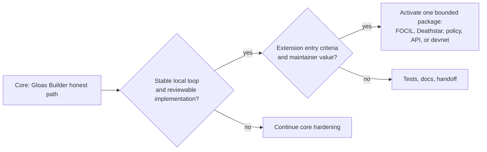
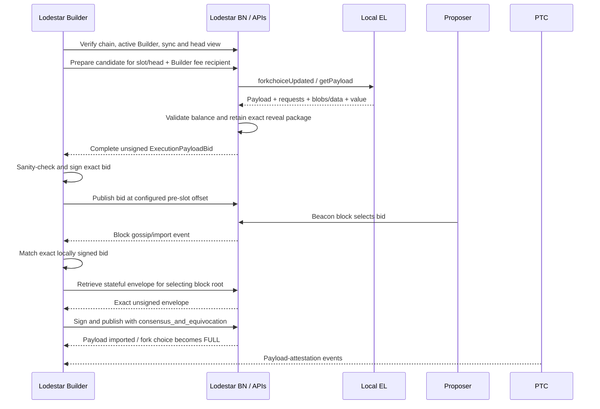
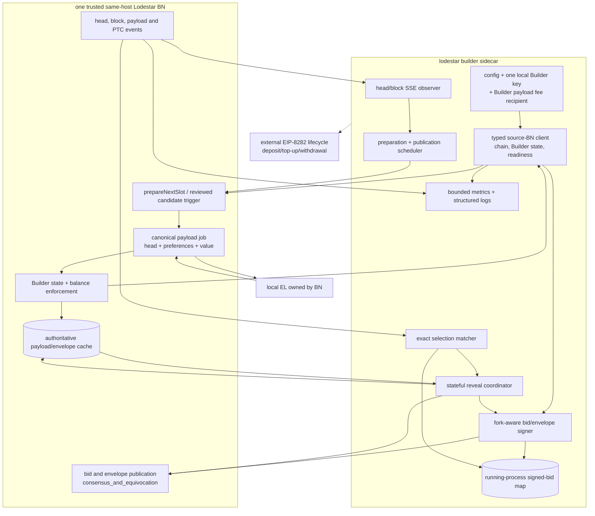
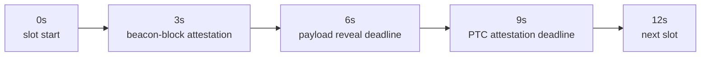

# Lodestar EIP-7732 Builder — Living Technical Note

| Doc status | |
|---|---|
| Proposal | [Merged](https://github.com/eth-protocol-fellows/cohort-seven/blob/master/projects/lodestar-eip-7732-builder.md); strong-success list amended through [PR #186](https://github.com/eth-protocol-fellows/cohort-seven/pull/186) |
| Implementation plan | [v1.0 merged](https://github.com/krisoshea-eth/lodestar-eip-7732-builder-docs/pull/2) on August 5, 2026; the merged GitHub plan is the implementation source of truth |
| Spec target | [consensus-specs v1.7.0-alpha.13](https://github.com/ethereum/consensus-specs/releases/tag/v1.7.0-alpha.13), published July 31, 2026 |
| Lodestar baseline | Stable remains [v1.45.0](https://github.com/ChainSafe/lodestar/releases/tag/v1.45.0); [v1.46.0-rc.1](https://github.com/ChainSafe/lodestar/releases/tag/v1.46.0-rc.1) at `e2b315e` is the newest immutable audit target; `BASELINE-01` still owns the exact working `unstable` pin |
| Builder implementation | Initial [`@lodestar/builder`](https://www.npmjs.com/package/@lodestar/builder) package merged in [#9758](https://github.com/ChainSafe/lodestar/pull/9758); [#9781](https://github.com/ChainSafe/lodestar/pull/9781) is ready for review at `250ae7bff1`; `SIGN-01`, `CLI-01`, and `API-01` are Done by project decision, `REVIEW-01` is Todo, `TEST-01` is In Progress, and `MET-01` is Todo |
| Devnet | [glamsterdam-devnet-7](https://notes.ethereum.org/@ethpandaops/glamsterdam-devnet-7) remains the active published configuration on alpha.12/v7.2.0; [`tests-glamsterdam-devnet@v8.1.0`](https://github.com/ethereum/execution-specs/releases/tag/tests-glamsterdam-devnet%40v8.1.0) is the latest successor fixture release but does not establish a devnet-8 launch |
| Builder lifecycle identifiers | Deposit request type `0x03`; Builder withdrawal credentials prefix `0xB0` |
| Payload deadline | `PAYLOAD_DUE_BPS = 5000`, six seconds into a 12-second slot; PTC payload attestation remains at `7500` |
| Last reconciliation | August 9, 2026: current and daily monitor reports, Lodestar primary sources, Builder PR #9781 review threads, Lodestar/Deathstar Discord context, Week 6–8 updates, implementation plan, Linear, and GitHub issue mirror |
| Next milestone | Resolve and merge #9781, finish `BASELINE-01` and `ENV-01`, progress the separated `TEST-01`/`MET-01` work, then pick up `API-02` and activate the reviewed BN preparation/candidate design |

This is the working document for the Lodestar EIP-7732 Builder project, an EPF cohort 7 project by [Kris O'Shea](https://github.com/krisoshea-eth) and [Marko Lazic](https://github.com/markolazic01), mentored by [Nico Flaig](https://github.com/nflaig) (ChainSafe, EIP-7732 co-author). The [project proposal](https://github.com/eth-protocol-fellows/cohort-seven/blob/master/projects/lodestar-eip-7732-builder.md) remains the stable public scope, while the [merged implementation plan](https://github.com/krisoshea-eth/lodestar-eip-7732-builder-docs/blob/main/docs/implementation-plan.md) owns accepted delivery decisions and issue boundaries. This note carries moving technical context, implementation findings, upstream state, code-path maps, adversarial cases, and research watches. Linear owns issue status, ownership, dependencies, and evidence.

## Contents

- **Part I — Orientation**
  - [How to use this note](#how-to-use-this-note)
  - [Recurring sweep checklist](#recurring-sweep-checklist)
  - [Current stance](#current-stance)
  - [Decision log](#decision-log)
  - [Terms](#terms)
  - [Proposal link](#proposal-link)
- **Part II — Knowledge base**
  - [Confirmed facts](#confirmed-facts)
  - [Working notes](#working-notes)
  - [Watchlist](#watchlist)
- **Part III — Design**
  - [Mentor questions](#mentor-questions)
  - [Gloas lifecycle summary](#gloas-lifecycle-summary)
  - [Candidate architecture sketch](#candidate-architecture-sketch)
  - [Bid → payload cache design](#bid--payload-cache-design)
  - [Bid policy notes](#bid-policy-notes)
  - [Slot timing and PTC](#slot-timing-and-ptc)
  - [Deathstar notebook](#deathstar-notebook)
  - [FOCIL context](#focil-context)
- **Part IV — Implementation reference**
  - [Current Lodestar code-path map](#current-lodestar-code-path-map)
  - [Beacon API notes](#beacon-api-notes)
  - [Implementation packages and ownership](#implementation-packages-and-ownership)
  - [Process notes](#process-notes)
  - [Weekly implementation log](#weekly-implementation-log)
- **Part V — Trackers**
  - [PR / branch status](#pr--branch-status)
  - [Resource backlog](#resource-backlog)

---

# Part I — Orientation

## How to use this note

- Keep the merged proposal stable unless the project scope materially changes.
- Put moving implementation details here: branch choices, current PR state, mentor answers, architecture sketches, experiments, and failure cases.
- Keep confirmed facts separate from working hypotheses.
- Record resolved watchlist items in the decision log before removing them.
- Run the sweep checklist before mentor calls, implementation milestones, public updates, and devnet work.
- Treat dates and status labels as part of the claim. A merged spec change, an open Lodestar PR, and a devnet-only branch are different baselines.
- Prefer a smaller number of verified, decision-relevant entries over a long list of stale links.

## Recurring sweep checklist

Run roughly weekly and before each milestone. Update the Doc status table afterwards.

- [ ] New consensus-specs prerelease after `v1.7.0-alpha.13`, or a change to the #5497 head-compatible bid rules?
- [ ] Stable Lodestar release after v1.45.0, or material `unstable` changes to the Builder package, Gloas types, payload production, publication, or events?
- [ ] Status change in [#9736](https://github.com/ChainSafe/lodestar/pull/9736), Builder [#9781](https://github.com/ChainSafe/lodestar/pull/9781), the replacement investigation after closed-unmerged shutdown [#9793](https://github.com/ChainSafe/lodestar/pull/9793), builder-specs #165, or beacon-APIs #630?
- [ ] Status or contract change in [builder-specs #165](https://github.com/ethereum/builder-specs/pull/165) or [beacon-APIs #630](https://github.com/ethereum/beacon-APIs/pull/630)?
- [ ] Cross-client rollout of #5497, especially Teku and the Prysm replacement, and any evidence that strict local-head validation limits propagation?
- [ ] Has devnet-7 changed state, or has a devnet-8 launch been verified separately from the v8 fixture release?
- [ ] Have exact `uint64` fields remained exact through Builder parsing, caching, signing, hashing, events, and API boundaries?
- [ ] Have corrected FCR fixtures been regenerated after consensus #5498/#5499 and merged smoke check #5504?
- [ ] New evidence on epoch-transition reorg pressure, bid-request timing, skipped slots, or minimum-bid fallback? Keep archive reports separate from verified telemetry.
- [ ] Has the stored #9757 proposer-equivocation fixture run end to end with Lodestar Builder rather than buildoor?
- [ ] EIP-8237, EIP-8146, FOCIL, or circuit-breaker changes that materially alter a conditional package rather than the current core?

## Current stance

| Area | Current stance |
|---|---|
| Core project | One same-host `lodestar builder` sidecar, one local Builder key, and one trusted source BN; the BN owns EL access, payload construction, value, balance enforcement, reveal material, and publication validation |
| First success target | Reproducible local preparation → complete BN-produced bid → configurable pre-slot publication → exact selection → immediate stateful reveal → FULL/PTC/payment evidence |
| Bid baseline | Payload-value bid, `execution_payment = 0`; execution rewards pay a Builder-controlled address and `bid.fee_recipient` pays the proposer |
| Reliability boundary | Stateful one-BN path first; bounded same-BN restart recovery later; no HA, stateless failover, or multi-BN claim in v1 |
| Test order | Focused tests, then local Kurtosis, then ethereum-package/buildoor; public devnet is conditional evidence rather than a core prerequisite |
| Conditional extensions | One selected package after the core gates, with FOCIL, policy, observability, Builder API, advanced preparation, adversarial work, UI, and devnet deployment all explicitly gated |
| Base branch | Current `unstable`, pinned by `BASELINE-01`; merge `unstable` regularly and split work only when review benefits |

FOCIL remains a useful extension candidate, not a parallel core deliverable. Deathstar now contributes one bounded core QA fixture for proposer equivocation and payload unbundling, while broader malicious controls remain conditional. Neither should delay the honest Builder loop.



## Decision log

| Date | Question | Outcome | Notes |
|---|---|---|---|
| 2026-08-09 | Release-candidate and shutdown baseline | **Audit rc.1; root shutdown handle still open** | [v1.46.0-rc.1](https://github.com/ChainSafe/lodestar/releases/tag/v1.46.0-rc.1) supersedes rc.0. #9790 preserves state/database close and #9792 fixes a QUIC resource leak. #9793 closed without merge because the proposed force-exit mechanism did not generalize, especially for container PID 1; none identifies the underlying stuck handle |
| 2026-08-09 | Builder Gate-A issue split | **Completed scopes and follow-ups remain separate** | Marko's `CLI-01` and `API-01` closure is preserved. `REVIEW-01` owns the open #9781 review/lifecycle/merge work, while `TEST-01` and `MET-01` own the remaining test matrix and metrics |
| 2026-08-07 | Equivocation validation | **Merged** | [Lodestar #9757](https://github.com/ChainSafe/lodestar/pull/9757) now supplies BN-owned `consensus_and_equivocation` validation and Deathstar proposer-equivocation machinery |
| 2026-08-05 | Implementation plan | **v1.0 merged** | [Docs PR #2](https://github.com/krisoshea-eth/lodestar-eip-7732-builder-docs/pull/2); all 14 review threads resolved and no plan-level question remains open |
| 2026-08-04 | Public Builder CLI docs | **Hidden until functional** | [Lodestar #9770](https://github.com/ChainSafe/lodestar/pull/9770) merged; restore the sidebar entry during `HANDOFF-01` |
| 2026-08-03 | Initial Builder package | **Merged and published** | [Lodestar #9758](https://github.com/ChainSafe/lodestar/pull/9758) landed the package, CLI scaffold, local keystore, bid/envelope signer, config checks, genesis wait, shutdown, and initial BN wiring; first npm publication followed |
| 2026-08-03 | Payload fee recipient | **Any Builder-controlled execution address; never the proposer address** | It need not match Builder withdrawal credentials. The simplest fixture may reuse the Builder withdrawal/execution address. `bid.fee_recipient` remains the proposer payment address |
| 2026-08-03 | Preparation and publication timing | **Separate them** | Prepare early enough for a complete bid, then publish at a configurable bounded pre-slot offset rather than racing the proposer at `t=0` |
| 2026-08-03 | Head change and stale work | **New parent tuple, new bid; no unpublish** | Audit and reuse existing BN payload-job/cache cleanup. Do not add a sidecar cancellation path unless the pin exposes a gap |
| 2026-08-03 | Stateful cache model | **One same-host source BN in v1** | Reuse BN production state; stateless and multi-BN failover remain outside core |
| 2026-08-01 | Envelope publication validation | **Explicit `consensus_and_equivocation`** | Validation and proposer-equivocation detection stay BN-owned; the implementation subsequently merged in [Lodestar #9757](https://github.com/ChainSafe/lodestar/pull/9757) |
| 2026-07-31 | Multiple bids | **Compatible with the connected BN's local head view** | [consensus-specs #5497](https://github.com/ethereum/consensus-specs/pull/5497) and [Lodestar #9739](https://github.com/ChainSafe/lodestar/pull/9739) merged; multi-branch flood publishing remains deferred |
| 2026-07-30 | Genesis wait and shared config | **Duplicate `waitForGenesis`; share `assertEqualParams` through config** | [Lodestar #9725](https://github.com/ChainSafe/lodestar/pull/9725) and [#9726](https://github.com/ChainSafe/lodestar/pull/9726) merged; do not add unreachable BN 404 code |
| 2026-07-30 | Runtime boundary | **Standalone same-host sidecar; BN owns EL and payload building** | One local key and one trusted source BN define core v1 |
| 2026-07-14 | Project extension model | **Core first; one bounded extension after gates** | FOCIL, policy, observability, Builder API, advanced preparation, adversarial work, UI, and devnet deployment remain conditional |
| 2026-07-13 | Proposal status | **Merged** | [EPF7 PR #161](https://github.com/eth-protocol-fellows/cohort-seven/pull/161), amended through [PR #186](https://github.com/eth-protocol-fellows/cohort-seven/pull/186) |
| 2026-07-06 | Payload deadline | **`PAYLOAD_DUE_BPS = 5000`** | Six seconds on a 12-second slot; read configured BPS rather than hardcoding milliseconds |
| 2026-07-03 | Builder credentials | **Withdrawal prefix `0xB0`** | Deposit request type remains `0x03`; the two values are not interchangeable |

## Terms

| Term | Meaning here |
|---|---|
| ePBS | Enshrined proposer-builder separation, introduced by EIP-7732 |
| Gloas / Glamsterdam | Consensus-layer fork name / network upgrade carrying ePBS |
| Heze / Hegotá | Next consensus fork / upgrade track in which FOCIL is being developed |
| Bid | `SignedExecutionPayloadBid`, the builder commitment selected by the beacon block |
| Envelope | `SignedExecutionPayloadEnvelope`, the later payload reveal |
| PTC | Payload Timeliness Committee, which attests payload and data availability on the Gloas timeline |
| FULL / EMPTY / PENDING | Fork-choice variants for payload revealed / unavailable / not yet resolved |
| FCR | Fast confirmation rule |
| BAL | Block access list; future sidecar work is tracked under EIP-8146 |
| IL / FOCIL | Inclusion list / fork-choice-enforced inclusion lists, EIP-7805 |
| fcU | `engine_forkchoiceUpdated` |
| BPS deadline | A slot-relative deadline expressed in basis points of configured slot duration |
| ProgressiveContainer | EIP-7688 forward-compatible SSZ container whose merkleization differs from legacy `Container` |
| Data columns | PeerDAS erasure-coded blob data that the reveal path must make available |
| Self-build | The proposer builds its own payload. The Gloas spec uses `BuilderIndex(UINT64_MAX)`; Lodestar represents that sentinel internally as `Infinity` |

## Proposal link

- [Merged Lodestar EIP-7732 Builder proposal](https://github.com/eth-protocol-fellows/cohort-seven/blob/master/projects/lodestar-eip-7732-builder.md)
- [Proposal PR #161 and review history](https://github.com/eth-protocol-fellows/cohort-seven/pull/161)
- [Strong-success amendment PR #186](https://github.com/eth-protocol-fellows/cohort-seven/pull/186)
- [Merged implementation plan](https://github.com/krisoshea-eth/lodestar-eip-7732-builder-docs/blob/main/docs/implementation-plan.md)
- [Linear project](https://linear.app/kriso/project/lodestar-eip-7732-builder-814d6faca6fd)
- [Public HackMD for this living note](https://hackmd.io/@krisos/S1a9mdB7fl)
- [Presentation](https://docs.google.com/presentation/d/1cmC3fpu652gZFTIm2_P1lIYOfC2M_w3c5qXSUZ4B6lc)

---

# Part II — Knowledge base

## Confirmed facts

These items were reconciled against the August 9 current and daily monitoring reports, confirmed Lodestar-team guidance, and live primary sources on August 9. Re-check them after each baseline bump.

### Current Builder implementation state

- [Lodestar #9758](https://github.com/ChainSafe/lodestar/pull/9758) created the first real `@lodestar/builder` package. It includes package and CLI scaffolding, one local keystore-backed key, bid and envelope signing with tests, a Builder `waitForGenesis`, source-BN wiring, shared `assertEqualParams`, active-Builder lookup, signal handling, and shutdown.
- The package was first published to npm on August 4. `latest` is currently the placeholder `0.0.0`; development builds are published under the `next` tag. This is package availability, not a claim that the command is production-ready.
- `SIGN-01`, `CLI-01`, and `API-01` are complete in the project board. `REVIEW-01` keeps the open [Lodestar #9781](https://github.com/ChainSafe/lodestar/pull/9781) review, lifecycle, documentation, and merge work visible; `TEST-01` and `MET-01` own the remaining cross-cutting test and metric work.
- [Lodestar #9781](https://github.com/ChainSafe/lodestar/pull/9781) is ready for review at head `250ae7bff1d8dfcb535604a410f9e6ffc962ef90`. It adds Builder identity/status tracking, BN and EL readiness polling, `--executionFeeRecipient`, request timeout wiring, and initial identity/tracker tests. Nico reported that it generally looks good and left seven unresolved review threads on August 9. The implementation-changing question is whether a Builder deposited or activated after sidecar startup should be waited for while the sidecar remains inert or should produce an explicit fail-fast operator error; the other threads cover log levels, stack traces, bounded BN error details, connected-node naming, and fork-epoch constant reuse.
- The main implementation gap is no longer signing. It is the complete same-host workflow: a reviewed BN preparation/candidate surface, canonical payload production with the Builder fee recipient, exact complete-bid return, publication timing, selection observation, stateful envelope retrieval, and evidence.
- The Builder does not connect directly to the EL in core. The source BN owns Engine API access, proposer/head context, payload construction, value, balance enforcement, reveal material, and publication validation.
- The sidecar owns its local key, chain/source-BN checks, active Builder resolution, head observation, bounded scheduling, sanity-checking and signing the exact BN-produced objects, exact local bid matching, diagnostics, and orchestration.

### Landed Lodestar capabilities to reuse

- [#9725](https://github.com/ChainSafe/lodestar/pull/9725) moved `assertEqualParams` and `NotEqualParamsError` into `@lodestar/config`; the Builder must import them rather than duplicate validator code.
- [#9726](https://github.com/ChainSafe/lodestar/pull/9726) distinguishes the expected pre-genesis 404 from real `waitForGenesis` errors. The Builder keeps its small behaviorally aligned copy because the function depends on `@lodestar/api` and has no clean config-level home.
- [consensus-specs #5497](https://github.com/ethereum/consensus-specs/pull/5497) and [Lodestar #9739](https://github.com/ChainSafe/lodestar/pull/9739) allow multiple bids compatible with the local head view and track seen bids per parent tuple. Core follows the connected BN head; different-branch flood publishing is deferred.
- [#9749](https://github.com/ChainSafe/lodestar/pull/9749), [#9750](https://github.com/ChainSafe/lodestar/pull/9750), and [#9751](https://github.com/ChainSafe/lodestar/pull/9751) preserve `execution_payment`, bid `gas_limit`, and proposer `targetGasLimit` as exact `UintBn64` values.
- [#9756](https://github.com/ChainSafe/lodestar/pull/9756) narrowly ignores direct-parent bids at epoch boundaries. The broader same/next-slot restriction considered during review did not land.
- [#9486](https://github.com/ChainSafe/lodestar/pull/9486) provides the `head_v2` payload-status event, and [#9598](https://github.com/ChainSafe/lodestar/pull/9598) provides Lodestar's current Gloas proposer circuit breaker. The Builder observes their outcomes but does not invent a second circuit-breaker policy.
- [#9689](https://github.com/ChainSafe/lodestar/pull/9689) and [#9710](https://github.com/ChainSafe/lodestar/pull/9710) have merged the current EIP-7688 boundary follow-up and the envelope-by-peer quota correction. Cross-fork light-client work in [#9687](https://github.com/ChainSafe/lodestar/pull/9687) remains separate.
- [#9766](https://github.com/ChainSafe/lodestar/pull/9766) aligns the Builder package build and type-check scripts with the workspace TypeScript 7 migration. This closes the immediate CI-script regression but does not complete CLI readiness.
- [#9770](https://github.com/ChainSafe/lodestar/pull/9770) hides the generated Builder CLI page from the public docs sidebar until the command is functional.
- [#9757](https://github.com/ChainSafe/lodestar/pull/9757) merged BN-owned `consensus_and_equivocation` validation and Deathstar proposer-equivocation support. The stored local fixture still needs to replace buildoor with Lodestar Builder after the honest lifecycle works.
- [#9790](https://github.com/ChainSafe/lodestar/pull/9790) and [#9792](https://github.com/ChainSafe/lodestar/pull/9792) are part of v1.46.0-rc.1. They preserve state/database close during a stuck network-worker shutdown and settle aborted QUIC resources respectively, but do not identify the underlying stuck handle. [#9793](https://github.com/ChainSafe/lodestar/pull/9793) closed without merge after review found that its self-signal/force-exit approach did not generalize, especially for default Docker/Kubernetes PID 1. Forced termination remains a process-manager responsibility while the root handle is investigated.
- [#9755](https://github.com/ChainSafe/lodestar/pull/9755) merged the local-versus-peer fault-ownership fix. Wrapped local EL/import failures now stay on the execution-error path rather than consuming honest peer scores.
- [#9762](https://github.com/ChainSafe/lodestar/pull/9762) updated `prepareNextSlot` to derive the proposer from the post-Fulu head state before creating the prepared state, avoiding a second state regeneration and possible double epoch transition. `BN-01` must trace this current flow rather than the older two-regeneration path.
- [#9505](https://github.com/ChainSafe/lodestar/pull/9505) landed the Heze fork definition and boilerplate. It narrows the future adaptation baseline but does not activate `EXT-FOCIL-01` or make the older FOCIL branch a core dependency.
- Existing Gloas types, gossip, proposer preferences, bid validation/pooling/selection, payload-envelope import, PTC handling, block/payload events, and publication routes remain the BN foundation. The implementation must audit the exact pinned shapes rather than duplicate them.

### Current Gloas specification baseline

The current project target is [v1.7.0-alpha.13](https://github.com/ethereum/consensus-specs/releases/tag/v1.7.0-alpha.13). Material settled rules include:

| Topic | Current result | Builder consequence |
|---|---|---|
| Builder lifecycle identifiers | Deposit request type `0x03`; withdrawal prefix `0xB0` | Do not conflate the request type with withdrawal credentials |
| Payload deadline | `PAYLOAD_DUE_BPS = 5000` | Six seconds on a 12-second slot; reveal immediately after exact selection |
| PTC attestation deadline | `PAYLOAD_ATTESTATION_DUE_BPS = 7500` | Capture authoritative FULL/PTC evidence after reveal |
| Head-compatible bids | Multiple bids for the node's local head view | Same-head v1 can resubmit after a head change; incompatible-branch flood publication is not core |
| Parent-slot payload availability | Query availability at the parent block slot | Cover skipped-slot cases without using the child slot incorrectly |
| Already-known block redelivery | Early return preserves PTC and timeliness state | Duplicate block observation must remain idempotent |
| Progressive SSZ and exact integers | Current fork types and exact `uint64` roots are authoritative | Never hand-build roots or narrow values above `2^53` to JavaScript `number` |
| Envelope shapes | One signed envelope supports stateful and stateless contents through `Eth-Blob-Data-Included` | Core uses stateful same-BN reveal; stateless/multi-BN remains conditional |

The mainnet timing parameters remain:

```text
SLOT_DURATION_MS                  = 12000
ATTESTATION_DUE_BPS_GLOAS        = 2500
AGGREGATE_DUE_BPS_GLOAS          = 5000
PAYLOAD_DUE_BPS                  = 5000
PAYLOAD_ATTESTATION_DUE_BPS      = 7500
```

### Current Lodestar baseline

The phrase “Lodestar baseline” has two layers:

1. **Stable release reference:** [v1.45.0](https://github.com/ChainSafe/lodestar/releases/tag/v1.45.0), published July 27.
2. **Newest immutable audit target:** [v1.46.0-rc.1](https://github.com/ChainSafe/lodestar/releases/tag/v1.46.0-rc.1) at `e2b315e`, which supersedes rc.0 but does not include Builder #9781.
3. **Implementation baseline:** current `unstable`, pinned to an exact SHA by `BASELINE-01` before more code is treated as Ready.

`BASELINE-01` still owns the deliberate project pin and reproducibility evidence. The historical August 5 observation `c65aaefd91a602df1ffb82d929ec479fba8578ac` is not a substitute for completing that issue.

Important moving inputs on August 9:

- [#9781](https://github.com/ChainSafe/lodestar/pull/9781), ready for review: Gate-A Builder identity, readiness, configuration, and tests;
- [#9736](https://github.com/ChainSafe/lodestar/pull/9736), draft: correct FULL-parent state use for production and reward calculation;
- [#9761](https://github.com/ChainSafe/lodestar/pull/9761), draft: Gloas compliance coverage;
- [#9793](https://github.com/ChainSafe/lodestar/pull/9793), closed without merge: retained as diagnostic history for a rejected self-signal/force-exit approach; the root network-worker handle remains unresolved;
- [builder-specs #165](https://github.com/ethereum/builder-specs/pull/165) and [beacon-APIs #630](https://github.com/ethereum/beacon-APIs/pull/630), open: API parity, request-auth, timeout, header, and preference details.

[Lodestar #9594](https://github.com/ChainSafe/lodestar/pull/9594) closed without merge on August 5. It is historical design input, not an active dependency; `BN-01` and the conditional staked Builder API must re-audit the replacement implementation after the specifications settle.

Lodestar #9723 remains an ecosystem watch for proposer/EL coherence but is not a Builder-project dependency.

### Ecosystem tooling that already exists

- **buildoor** remains the closest working external reference. Its ePBS mode, lifecycle support, and ethereum-package integration make it useful for registration, interop, and competing-bid tests.
- **assertoor** still provides the `gloas-dev` lifecycle/deposit/exit/prefork playbooks. Any playbook or cached calldata that assumes `0x03` withdrawal credentials is stale after #5416; verify the current branch and devnet contract before running it.
- **The staked Builder API** is moving through builder-specs #165, beacon-APIs #630, and a replacement Lodestar implementation after #9594 closed without merge. It is not a core dependency and should be re-audited when those shapes settle.
- **devnet-7** remains the active published configuration on alpha.12 and v7.2.0 fixtures. A static sheet does not establish runtime health.
- **devnet-8 fixtures** are now published at [`tests-glamsterdam-devnet@v8.1.0`](https://github.com/ethereum/execution-specs/releases/tag/tests-glamsterdam-devnet%40v8.1.0). Fixture publication does not establish that devnet-8 has launched or is healthy.

### Fork and spec status

- FOCIL remains outside the scheduled Glamsterdam set and belongs to the Heze/Hegotá track. [#9505](https://github.com/ChainSafe/lodestar/pull/9505) has landed the Heze fork scaffold, but the conditional Builder adaptation is still gated on settled Heze/FOCIL behavior and maintainer selection.
- The Heze bid-shape question is resolved for the current baseline: `inclusion_list_bits` is present.
- EIP-7688 remains a separate EIP-status question from the consensus-spec release that uses progressive structures. Keep those claims distinct.
- EIP-8237 and EIP-8146 remain Draft and continue to threaten future bid/cache/reveal shapes. They should stay behind fork-aware interfaces rather than inside Gloas-specific business logic.

## Working notes

Findings that shape the architecture but are not all final decisions.

### Architecture implications of the latest Lodestar work

The service boundary is now settled for v1: `lodestar builder` is a lightweight same-host sidecar connected to one operator-controlled BN. The sidecar does not connect to the EL. The BN remains authoritative for head and proposer context, Engine API access, payload production, payload value, balance validation, reveal material, and publication validation.

The remaining architecture work is narrower:

- trace `prepareNextSlot`, the current payload-job lifecycle, and the unsigned-bid path;
- choose the smallest reviewed preparation/candidate contract that carries target slot/head view and the Builder execution fee recipient before payload work starts;
- reuse standard `/builder` and `/beacon` namespaces plus SSE; do not create a permanent `/lodestar` API for a specification gap;
- keep the route operator-controlled and bounded in the same-host v1 model;
- re-audit the final API shapes from builder-specs #165, beacon-APIs #630, and the replacement for closed-unmerged Lodestar #9594 before freezing the adapter.

### Gloas circuit breaker and proposer fallback

Circuit-breaker threshold, recovery, fault class, and Builder-versus-relay identity remain unsettled research. Core v1 records reveal failures and authoritative FULL/EMPTY outcomes but does not implement or depend on a new circuit-breaker policy. A future package may correlate Builder failures with proposer fallback once the protocol and operator identity rules are defined.

### Heze / FOCIL after the bitlist decision

The restored bitlist removes one source of ambiguity but does not make the FOCIL branch a safe base. The branch is still a large draft that has diverged substantially from current `unstable`. Its value is architectural prior art and a future adaptation target.

For the Builder, the concrete Heze delta is now easier to state:

```text
Gloas bid construction
+ inclusion-list intake / local IL view
+ inclusion_list_bits derivation
+ Heze SSZ/signing root
+ cache entry that records the IL commitment context
+ payload construction that satisfies the selected IL constraints
```

### Deathstar, on the ground

Deathstar is now directly relevant to one bounded core test. Merged [Lodestar #9757](https://github.com/ChainSafe/lodestar/pull/9757) adds proposer equivocation and BN-side `consensus_and_equivocation` handling, initially exercised with buildoor. The project stores the reviewed local fixture at [`docs/test-plans/pr-9757-builder-equivocation.yaml`](https://github.com/krisoshea-eth/lodestar-eip-7732-builder-docs/blob/main/docs/test-plans/pr-9757-builder-equivocation.yaml) and will rerun the same rejection with Lodestar Builder once the honest loop works.

Broader runtime-configurable malicious controls, a configuration UI, payload withholding, late reveal, and Builder payload equivocation remain conditional work. The old `EPBS_CHAOS_FEATURES.md` catalog is useful for ideas but is not authoritative; some cases are stale or invalid and must be checked against current code and specs.

### Devnet-7 and branch layering

Four layers are easy to conflate:

```text
consensus-specs alpha.13
→ current Lodestar unstable
→ devnet-7 public configuration on alpha.12/v7.2.0
→ devnet-8 execution fixtures v8.1.0 without a verified public launch
```

A local demo can begin before the public devnet is On, but its runbook must record the exact CL branch, EL image, network config, deposit contract, and builder credentials used.

- Keep devnet-7 and devnet-8 evidence separate. Fixture tags and images are configuration or publication evidence, not runtime-health evidence.
- Use v7.2.0 for a devnet-7-compatible run. Use v8.1.0 only when deliberately testing the successor fixture line and a compatible EL; do not infer a public launch from the fixture tag.
- Local Kurtosis remains the first evidence target, so a public devnet transition does not block the core project.

### Validation and observability edges

- Bid tests should include parent-branch state, local-head compatibility, out-of-range Builder indices, slot-boundary clock disparity, and the narrow epoch-boundary direct-parent rule in #9756.
- Preserve every SSZ-root `uint64` input exactly. Test `2^53 - 1`, `2^53`, `2^53 + 1`, and `uint64` maximum through parsing, caching, signing, hashing, proposer preferences, `PayloadAttributesV4`, and events.
- Proposer preferences have a fork-boundary edge: the first Gloas slots can lack usable preferences unless they are broadcast before the fork ([#9571](https://github.com/ChainSafe/lodestar/pull/9571) addresses this).
- The clean end-to-end signal is the selected block becoming FULL, not only a successful publish response. Merged [#9486](https://github.com/ChainSafe/lodestar/pull/9486) provides `head_v2.payload_status`; retain payload-import and fork-choice evidence as a cross-check.
- `payload_attestation_message` events are now available for measuring PTC observation and disagreement.
- Data-column “published to zero peers” logs can be misleading when peers gossip locally produced columns back first; retain source-aware metrics.
- For skipped slots, query parent payload availability using the parent block slot.
- Consensus #5498 and #5499 corrected FCR vector scheduling. #5504 has now merged the compliance-generation smoke check; regenerated artifacts and Lodestar diagnostics remain a baseline-audit concern rather than new Builder scope.

### CL/EL integration gotchas

Failures at the consensus/execution boundary can masquerade as Builder bugs even when the Builder logic is correct, so the first local setup needs a clean separation between Builder errors and EL-integration errors:

- Post-Gloas `engine_forkchoiceUpdated` reports the bid's `parent_block_hash` as safe and finalized, because the safe or finalized block's own payload may not yet be confirmed canonical ([#9393](https://github.com/ChainSafe/lodestar/pull/9393)); pre-Gloas fcU assumptions do not carry over.
- An EL returning `INVALID` once wedged a Gloas devnet node, since the pre-Gloas safety net is bypassed with payload verification deferred to `importExecutionPayload` ([#9332](https://github.com/ChainSafe/lodestar/pull/9332)).
- The native (Zig) state-transition mode throws on Gloas; keep `nativeStateView` disabled during Builder work ([#9516](https://github.com/ChainSafe/lodestar/pull/9516)).
- Do not prepare, retrieve, sign, or propagate bids when the BN is far behind, execution is optimistic, or its EL is unavailable. The sidecar may observe and report startup readiness, but the BN preparation/candidate route owns the authoritative guard and typed syncing or unavailable result.
- Reuse the smallest suitable BN helper. Share or import validator's `SyncingStatusTracker` only if a real Builder resync lifecycle or broader reuse case appears and the dependency remains clean; `runOnResynced` was added for validator duty refetching and is not a reason by itself.
- Keep local EL and payload-production failures distinct from peer-attributable faults. Merged [#9755](https://github.com/ChainSafe/lodestar/pull/9755) provides the current regression-tested error-ownership behavior.

### Registration sharp edges

- The temporary fork-onboarding prefix is now `0xB0`; the execution request type remains a separate value.
- Existing `0x03` withdrawal credentials are not a harmless display mismatch — they represent different bytes and should be regenerated for the current baseline.
- Real EIP-8282 registration requires current devnet contract addresses and activation timing, not only a signed deposit payload.
- A top-up to an exited builder can still create confusing lifecycle state; keep lifecycle checks explicit in a real-registration demo.
- The execution payload fee recipient may be any address controlled by the Builder and need not match its withdrawal credentials. It must not be the proposer address. Onboarding, top-ups, withdrawals, and balance management remain external to `lodestar builder`.

## Watchlist

Only unresolved or moving items belong here.

### Direct project delivery

- **Baseline pin:** record the exact `unstable` SHA, spec/API versions, fixture/image versions, baseline failures, and capability audit in `BASELINE-01`.
- **Source-BN readiness:** resolve and merge [#9781](https://github.com/ChainSafe/lodestar/pull/9781), including the later-deposited Builder lifecycle question and the remaining logging/error-detail review threads; close the separated readiness evidence through `TEST-01`.
- **Preparation/candidate contract:** trace `prepareNextSlot` and return the proposed route/lifecycle for Lodestar review in `BN-01`.
- **FULL-parent production:** reuse [Lodestar #9736](https://github.com/ChainSafe/lodestar/pull/9736) if it lands; do not create a parallel workaround.
- **Equivocation validation:** [#9757](https://github.com/ChainSafe/lodestar/pull/9757) is merged; rerun the stored fixture with Lodestar Builder.
- **Gloas compliance:** track draft [#9761](https://github.com/ChainSafe/lodestar/pull/9761) during `BASELINE-01`; use it as baseline evidence rather than creating a duplicate Builder-only compliance harness.
- **Builder API convergence:** track builder-specs #165, beacon-APIs #630, and the replacement for closed-unmerged Lodestar #9594, while keeping staked request authentication outside core.
- **Shutdown and restart:** audit rc.1 #9790/#9792 and the reasons #9793 closed without merge. Test state persistence, database close, process-manager timeout, and Builder cache/reveal recovery without treating the underlying stuck worker as solved or prescribing the rejected self-signal approach.

### Protocol and interoperability

- **Cross-client #5497 rollout:** Lodestar support is merged; Teku work and a Prysm replacement remain active. Test propagation before relaxing local validation for multi-branch bids.
- **Epoch boundaries:** preserve the narrow #9756 direct-parent rejection and test skipped slots without adopting the retracted broader restriction.
- **Exact integers:** prevent regressions that narrow `UintBn64` values to JavaScript `number`.
- **FCR artifacts:** #5498, #5499, and #5504 are merged; regenerated artifacts and Lodestar coverage still need verification.
- **Post-alpha.13 fork-choice and reward tests:** consensus [#5514](https://github.com/ethereum/consensus-specs/pull/5514) is merged and [#5509](https://github.com/ethereum/consensus-specs/pull/5509) remains open. Re-audit them when choosing the exact spec/Lodestar pin; do not silently treat unreleased `master` behavior as part of alpha.13.
- **Local versus peer faults:** #9755 is merged; retain its wrapped-error regression when exercising local EL failure and range sync.
- **Range-sync attempt identity:** [#9667](https://github.com/ChainSafe/lodestar/pull/9667) and [#9686](https://github.com/ChainSafe/lodestar/pull/9686) remain open ecosystem work. Do not pull them into Builder scope unless the pinned local evidence exposes a direct dependency.
- **Devnet transition:** devnet-7 and devnet-8 remain separate baselines; no devnet-8 launch is verified.

### Research and conditional work

- The August 4 public archive reports epoch-transition reorg concentration after skipped slots. Treat transition-state caching, duty prefetch, bid-request timing, minimum-bid fallback, and blob-heavy production as hypotheses until reproduced with reliable telemetry.
- Circuit-breaker thresholds and Builder-versus-relay identity remain unsettled.
- PTC late-slot import-freeze and shorter-attestation-deadline ideas remain non-normative research until supported by distributed, mainnet-like evidence.
- FOCIL, advanced bid policy, multi-branch flood publishing, stateless/multi-BN reveal, remote signing, runtime malicious controls, and UI remain gated packages.
- Lodestar #9723, Builder-deposit signature caching in #9727, FCR diagnostics in #9711, cross-fork light-client work in #9687, and the broader #9692 mainnet-readiness checklist remain ecosystem context unless the Builder baseline audit exposes a direct dependency.

---

# Part III — Design

## Mentor questions

The plan-level mentor questions are closed. Nico confirmed the architecture and remaining v1 assumptions, and the implementation plan merged with no unresolved review thread. The following are implementation-time design checks, not requests to reopen the plan.

### Preparation/candidate API

- Trace `prepareNextSlot`, payload-job creation, existing cache ownership, and the current unsigned-bid route.
- Propose the smallest clean request and lifecycle that lets the same-host sidecar ask the BN to prepare for a target slot and its current head view while supplying the Builder-controlled payload fee recipient.
- Bring the proposed route and lifecycle back to the Lodestar team before freezing it or proposing the upstream API change.
- Re-audit builder-specs #165, beacon-APIs #630, and the replacement for closed-unmerged Lodestar #9594 because those shapes are expected to settle while `API-01` and `BN-01` progress.

### Readiness and sync behavior

- Let the sidecar observe and report startup readiness, but place the authoritative `not while syncing`, optimistic-execution, and EL-readiness assertion on the BN preparation/candidate path.
- Reuse the smallest BN helper. Share or import validator's `SyncingStatusTracker` only if the Builder later needs its resync lifecycle or enough related code to justify the dependency. `runOnResynced` was added for duty refetching and should not be copied without a Builder use case.
- Require a typed syncing or unavailable result before any preparation, retrieval, signing, or propagation can proceed.

### Timing and cache evidence

- Choose the first pre-slot publication default from repeatable Kurtosis evidence and keep it operator-configurable as proposer cutoffs and the future Builder API evolve.
- Confirm how the pinned BN cleans stale payload work after a head change. Do not add a sidecar cache or explicit cancellation path unless that audit proves a gap.
- An already-published bid cannot be withdrawn. A head change creates a new parent-tuple bid.

### Conditional-package questions

FOCIL, multi-branch flood publication, stateless/multi-BN reveal, advanced policy, runtime malicious Builder behavior, Deathstar configurability, circuit breakers, and a UI remain questions only if their package passes the implementation-plan gate. They are not hidden v1 requirements.


## Gloas lifecycle summary

The honest Builder lifecycle remains:

```text
1.  Load one local Builder key and the Builder-controlled execution payload fee recipient.
2.  Wait for genesis, verify chain parameters, resolve the active Builder, and require BN/EL readiness.
3.  Follow the source BN's current head view through SSE.
4.  Ask the BN to prepare a candidate for the target slot and head view.
5.  The BN resolves proposer context/preferences and prepares the payload through its EL with the Builder fee recipient.
6.  The BN validates balance/coverability, retains exact reveal material, and returns the complete unsigned bid.
7.  The sidecar sanity-checks the exact bid without rebuilding or revaluing it, signs it, and publishes at the configured pre-slot offset.
8.  Observe block events and retrieve the fork-correct signed block.
9.  Detect an exact locally signed bid selected for this Builder.
10. Retrieve the exact stateful envelope from the same source BN.
11. Recheck commitments, sign the exact envelope, and publish immediately with consensus_and_equivocation.
12. Observe BN acceptance, payload import, FULL/EMPTY, PTC, data, and payment outcomes.
```



The alpha.13 Gloas types remain the current core shape. Heze extends the bid with `inclusion_list_bits`; EIP-8237 and EIP-8146 remain future shape risks behind fork-aware adapters.

## Candidate architecture sketch

The v1 boundary is accepted. The remaining work is to bind it to the pinned Lodestar interfaces without duplicating BN or EL logic.



### Architecture milestone output

The architecture phase now produces four concrete artifacts:

1. **Pinned capability audit:** exact `unstable` SHA, API/spec versions, landed capabilities, and pre-existing failures.
2. **Reviewed BN contract:** preparation/candidate request, stateful envelope lookup, publication modes, bounds, errors, and namespaces.
3. **Failure contract:** readiness, no-bid, syncing, insufficient balance, stale head, cache miss, publication rejection, late reveal, and offline-after-selection outcomes.
4. **Evidence map:** the Linear issue, PR, focused tests, and end-to-end assertion that prove each retained core capability.

A reasonable implementation principle regardless of boundary:

```text
Core Builder orchestration depends on narrow typed source-BN interfaces.
The BN remains the authoritative payload and state boundary.
Fork-specific bid/envelope validation and signing live behind current Lodestar types.
Temporary pre-spec routes remain isolated so settled APIs can replace them.
```

## Bid → payload cache design

The source BN's stateful production cache is the authoritative reveal boundary for v1. The sidecar does not create a second payload cache and does not claim durable or multi-BN recovery. A bid must not be returned as signable unless the same BN retains the exact reveal material for the required bounded window.

### Commitment identity

The local signed-bid record and BN candidate identity include:

```text
slot
parent_block_root
parent_block_hash
builder_index
block_hash
signed_bid_root
```

The normal selection path requires the selected block's bid to match an exact locally signed bid. Derive all roots through current fork-configured Lodestar SSZ types. Preserve exact `uint64` fields; a value narrowed through JavaScript `number` can produce a different signing root even when the displayed decimal appears plausible.

### Cache entry

The BN entry must retain the exact execution payload, execution requests, parent context, blobs, commitments, proofs/cells, and other source material needed to derive the envelope for the selecting block root. The sidecar retains only bounded orchestration state and the exact signed bid required for normal-path matching.

The stateful cache returns clear available, missing, expired, and commitment-mismatch results. It must never rebuild a different payload after selection. Stateless contents, cache transfer, and multi-BN lookup remain a separate conditional design.

### Write ordering

```text
BN prepares payload through canonical job
→ BN constructs and validates complete unsigned bid
→ BN retains exact reveal package
→ BN returns signable bid
→ sidecar sanity-checks and signs exact bid
→ sidecar publishes at configured pre-slot offset
```

The BN must not return a signable bid and then attempt to fill the reveal cache asynchronously.

### Match and reveal behavior

```text
source-BN head changes before publication:
  prepare and sign a fresh bid for the new parent tuple
  leave any already-published old-parent bid published
  rely on verified BN payload-job cleanup/expiry for stale preparation

selected bid has no exact local match:
  do not enter normal reveal
  bounded same-BN restart recovery is handled separately by REL-01

stateful cache miss or commitment mismatch:
  fail closed
  never reconstruct a different payload

repeat exact reveal:
  keep lookup and publication idempotent
  bound immediate retry and record late/terminal outcome
```

### Expiry

First trace the existing BN payload-job/cache cleanup on head change and the normal stateful envelope eviction hook. Remove the reveal package after successful publication and otherwise use bounded expiry. Add no explicit sidecar cancellation path or second cache unless the pinned-baseline audit demonstrates a concrete gap.

### Metrics

```text
builder_candidates_requested_total
builder_candidates_ready_total
builder_bids_published_total
builder_bids_selected_total
builder_stateful_reveal_hits_total
builder_stateful_reveal_misses_total
builder_commitment_mismatches_total
builder_reveals_attempted_total
builder_reveals_published_total
builder_late_reveals_total
builder_selected_payload_full_total
builder_selected_payload_empty_total
builder_candidate_ready_seconds
builder_bid_publication_offset_seconds
builder_selection_to_reveal_seconds
```

Every metric should carry only bounded labels. Use structured log fields for roots, slots, and builder IDs.

## Bid policy notes

The core implementation has one deliberately small honest policy:

```text
execution_payload.feeRecipient = builder_controlled_execution_address
bid.fee_recipient               = proposer_payment_address
bid.value                       = execution_payload_value
execution_payment               = 0
```

The BN is authoritative for payload construction, execution value, active Builder status, current Builder balance, and balance enforcement. The sidecar requests the candidate, checks that the returned values and addresses match its request and the active fork, signs that exact BN-produced bid, and publishes it. It must not reconstruct the bid, recompute its value, silently clamp it, or substitute the proposer address as the payload fee recipient.

Minimum core constraints:

- never bid more than the builder can cover after pending obligations;
- respect proposer preferences and fork-specific validity rules;
- preserve all SSZ-root-contributing integers exactly rather than narrowing them to JavaScript `number`;
- make the policy deterministic and observable for tests;
- keep policy separate from payload construction, signing, and publication.

Fixed-value, shading, balance allocation across concurrent opportunities, weak-head branch strategies, and other auction behavior belong to `EXT-POLICY-01`. They are not prerequisites for proving the honest payload-value lifecycle.

### Later research surface

“What to bid” still depends on two private estimates:

1. the builder's value for the candidate block;
2. the distribution of competing bids for the slot.

The `execution_payload_bid` stream supplies empirical competing-bid observations once the Builder runs. buildoor can provide a real devnet competitor. A Lodestar developer suggested on [#186](https://github.com/eth-protocol-fellows/cohort-seven/pull/186) running the Lodestar Builder and buildoor together in Kurtosis to test selection behavior. Once the honest payload-value loop works, that run is a natural first empirical input to the conditional bidding-policy work. Any later objective should include:

- priority fees and capturable MEV;
- builder balance and pending payments;
- first-price bid shading;
- free-option value between commitment and reveal;
- cost of accepted bids regardless of final canonicality;
- reveal/canonicality risk;
- future FOCIL constraints on payload value.

Useful background:

- [Free Option Problem I](https://collective.flashbots.net/t/the-free-option-problem-in-epbs/5115) and [II](https://collective.flashbots.net/t/the-free-option-problem-in-epbs-part-ii/5145) · [Mazorra et al.](https://arxiv.org/abs/2509.24849)
- [Builder bidding behaviors in ePBS](https://ethresear.ch/t/builder-bidding-behaviors-in-epbs/20129)
- [Builder reveal timing game](https://ethresear.ch/t/builder-reveal-timing-game-in-epbs/19424)
- [Who Wins Ethereum Block Building Auctions and Why?](https://drops.dagstuhl.de/entities/document/10.4230/LIPIcs.AFT.2024.22)
- [Block vs. Slot Auction PBS](https://mirror.xyz/julianma.eth/CPYI91s98cp9zKFkanKs_qotYzw09kWvouaAa9GXBrQ)

## Slot timing and PTC

Current alpha.13 mainnet timing:

```text
slot start                                      0 ms
Gloas block-attestation due (2500 BPS)      3,000 ms
payload reveal due (5000 BPS)               6,000 ms
PTC payload-attestation due (7500 BPS)       9,000 ms
next slot                                    12,000 ms
```



The code should still read configured BPS and slot duration. “Six seconds” is the current 12-second-slot result, not permission to hardcode `6000` everywhere. EIP-7782 (Reduce Block Latency) remains Declined for Glamsterdam, so 12-second slots stay the mainnet working assumption, but a six-second devnet slot using the same 5000 BPS value would have a three-second payload deadline.

Preparation and publication are separate timing decisions. The BN should start candidate work early enough for the full bid to be ready, while the Builder's publication offset is configurable and defaults to broadcasting before the proposal slot rather than waiting until `t=0` and racing the proposer. Exact selection triggers immediate reveal. The sidecar may make a bounded number of immediate retries, but after `PAYLOAD_DUE_BPS` it records a late outcome instead of retrying indefinitely or introducing strategic withholding into the core path.

The August 3 public ePBS archive reported a concentration of reorgs around epoch transitions after skipped slots. Transition-state caching, duty prefetch, bid-request timing, minimum-bid behavior, and blob-heavy proposal work are hypotheses to profile, not verified causes or evidence that the public devnet is unhealthy.

Builder timing metrics should answer:

- when preferences became usable;
- when payload construction began and completed;
- the configured publication offset and actual publication time;
- when the bid was signed and accepted for publication;
- when the selecting block was first seen and imported;
- when reveal began and completed;
- whether reveal preceded `PAYLOAD_DUE_BPS`;
- when the payload became verified/FULL;
- what PTC messages were observed by the attestation deadline.

Transport and local EL latency are part of the experiment. Confirm QUIC/UDP configuration, EL sync state, clock synchronization, and data-column source before assigning a late reveal to Builder orchestration.

## Deathstar notebook

Deathstar remains secondary to the honest Builder path, but the first core safety fixture is now concrete.

### Current branch reality

- [Lodestar #9757](https://github.com/ChainSafe/lodestar/pull/9757) is merged and supplies `consensus_and_equivocation` validation plus proposer-equivocation support in Deathstar.
- The repository stores the exact local end-to-end fixture at [`docs/test-plans/pr-9757-builder-equivocation.yaml`](https://github.com/krisoshea-eth/lodestar-eip-7732-builder-docs/blob/main/docs/test-plans/pr-9757-builder-equivocation.yaml). It runs the PR Lodestar BN, a Deathstar VC that signs two block roots for one duty, and lifecycle-managed buildoor until the Builder can bid and reveal.
- A devnet-7 proposer-equivocation experiment produced an almost even attestation split at [slot 171651](https://dora.glamsterdam-devnet-7.ethpandaops.io/slot/171651#attestations), with both competing roots visible in Dora. Keep this as scenario evidence for split-view observation, not as a general devnet-health or canonicality claim.
- The required outcome is rejection by the source BN before gossip publication when the selected proposer has equivocated. Buildoor is the temporary Builder actor; the same fixture should move to `@lodestar/builder` when the honest lifecycle is functional.
- The older `deathstar` catalog remains useful for scenario organization, but its parameters and implementation status must be checked against current `unstable` before reuse.

Conventions worth preserving:

```text
hidden --chain.* option
explicit “CHAOS (devnet test only)” description
isolated local/Kurtosis/devnet use only
one behavior per flag
parameterized delay/probability/threshold where relevant
normal library tests remain off unless the chaos option is supplied
```

### Updated threat-model distinction

PTC messages are not a general execution-validity oracle. The current Gloas rules require a payload-present vote for a past block to correspond to a fully imported and verified payload. That reduces the old “seen but not verified” gap for that gossip case; it does not remove withholding, late reveal, equivocation, data-availability, or split-view risks.

### Candidate scenarios

| Scenario | Current rule / signal | Lodestar path | Honest test first? | Chaos behavior later? | Difficulty |
|---|---|---|---|---|---|
| Mismatched envelope | Envelope must match selected bid and current fork commitments | envelope validation + cache match | unit/integration | yes | low/medium |
| Payload withholding | Selected bid never becomes FULL; proposer circuit breaker may react | reveal coordinator, fork choice, #9598 | integration | yes | medium |
| Late reveal | `PAYLOAD_DUE_BPS = 5000` | delayed publish + timing metrics | integration/devnet | yes | medium |
| Bid at slot-boundary disparity | current gossip range semantics | execution-payload-bid validation | unit/reference test | maybe | low |
| Out-of-range builder index | must REJECT cleanly | bid validation | unit/reference test | maybe | low |
| Invalid high-value `prev_randao` bid | rejected at gossip so it cannot suppress valid lower bids ([cs #5360](https://github.com/ethereum/consensus-specs/pull/5360)) | bid validation / bid pool | unit/reference test | yes | low |
| Bid extends wrong FULL/EMPTY parent | `shouldBuildOnFull` and proposer-head rules (regression fixed in [#9442](https://github.com/ChainSafe/lodestar/pull/9442)) | block production / fork choice | integration | yes | medium |
| Proposer equivocation and unbundling | `consensus_and_equivocation` must reject the envelope before gossip | #9757 + stored local fixture | local E2E | configurable Deathstar proposer | medium |
| Proposer-preference censorship | no matching preferences means external bid cannot be valid | preference intake / validation | integration | maybe | low |
| PTC split view | threshold/timing under asymmetric propagation ([cs #5345](https://github.com/ethereum/consensus-specs/pull/5345) grounds the split-vote case) | PTC pool + fork choice | devnet | yes | high |
| Builder API failure / timeout | proposer must fall back safely | settled replacement API + #9598 | integration | fault injection | medium |
| Heze IL mismatch | bid bitlist/payload violates observed ILs | future FOCIL adapter | future integration | yes | future |
| BAL sidecar withholding | future EIP-8146 commitment unavailable | future sidecar path | n/a | yes | future |

### Recommended first case

Use the #9757 proposer-equivocation fixture as the first full-system adversarial case because it directly proves the validation mode required by the core reveal path. Keep mismatched-envelope and cache-identity failures as smaller unit or integration tests. Payload withholding, late reveal, split views, runtime-controlled malicious behavior, and Builder-side attacks remain conditional follow-up work after the honest lifecycle is reproducible.

## FOCIL context

FOCIL is a strong-success Builder adaptation, not a second core project.

### Current position

- EIP-7805 remains outside Glamsterdam and is being developed for the Heze/Hegotá track.
- [Lodestar #7342](https://github.com/ChainSafe/lodestar/pull/7342) remains an open draft with a large implementation footprint.
- The branch already contains inclusion-list duties, gossip validation, storage, Engine API methods, state-transition/fork-choice enforcement, and validator work.
- [consensus-specs #5410](https://github.com/ethereum/consensus-specs/pull/5410) restored `inclusion_list_bits` to the Heze bid.
- [Lodestar #9526](https://github.com/ChainSafe/lodestar/pull/9526), which removed the field, closed without merge.
- EIP-7688 means the current Heze type is a progressive container; old static-container assumptions should not be reused.

### Builder adaptation surface

A Heze-capable Builder likely needs:

```text
inclusion-list subscription / local store access
→ identify relevant IL committee messages for the target slot
→ constrain payload construction to satisfy the applicable ILs
→ derive inclusion_list_bits
→ construct the Heze ExecutionPayloadBid
→ sign with the Heze fork domain/root
→ cache IL context with the payload package
→ reveal and log IL-satisfaction outcome
```

### Gate conditions

Start FOCIL adaptation only when all are true:

1. the Gloas local bid → selection → reveal loop is reproducible;
2. core interfaces are fork-aware rather than Gloas-hardcoded;
3. the Lodestar team identifies a supported FOCIL target branch;
4. that branch is sufficiently rebased to avoid spending the project on unrelated conflict resolution;
5. the exact Engine API and `inclusion_list_bits` derivation path are agreed.

Do not use the `focil` branch as the default base before those conditions are met.

---

# Part IV — Implementation reference

## Current Lodestar code-path map

Status reflects the August 9 reconciliation. The merged implementation plan remains the delivery source of truth; this map highlights moving code seams and upstream work.

| Area | File / PR | Current understanding | Builder follow-up |
|---|---|---|---|
| Builder package and CLI | [#9758](https://github.com/ChainSafe/lodestar/pull/9758), [#9766](https://github.com/ChainSafe/lodestar/pull/9766), [#9781](https://github.com/ChainSafe/lodestar/pull/9781) | Initial package and TypeScript follow-up are merged; #9781 is ready for review with identity/status tracking, readiness, fee-recipient and timeout wiring | Keep CLI-01/API-01 closed by project decision; resolve #9781 feedback, lifecycle, documentation, and merge in REVIEW-01 while TEST-01/MET-01 continue separately; keep generated CLI docs hidden until functional |
| Builder signing | [#9758](https://github.com/ChainSafe/lodestar/pull/9758) | Bid and envelope signing with a local Builder keystore is merged and tested | Treat `SIGN-01` as complete; extend only for fork coverage and failure evidence |
| Shared configuration checks | [#9725](https://github.com/ChainSafe/lodestar/pull/9725) | `assertEqualParams` and `NotEqualParamsError` moved to `@lodestar/config` | Import from config; do not create a Builder-to-validator dependency |
| Genesis wait behavior | [#9726](https://github.com/ChainSafe/lodestar/pull/9726) | Validator now distinguishes a pre-genesis 404 from other failures | Keep the small Builder copy aligned; do not add unreachable BN code |
| Source-BN client and readiness | [#9781](https://github.com/ChainSafe/lodestar/pull/9781), BN sync helpers | Ready for review at `250ae7bff1`; identity/tracker tests landed, readiness recovery remains follow-up, and the later-deposit wait/fail lifecycle is under review | Keep the sidecar inert on not-ready status, settle the later-deposit behavior, retain the BN-owned preparation guard, and finish the missing test matrix in TEST-01 |
| Bid gossip and head compatibility | [#9739](https://github.com/ChainSafe/lodestar/pull/9739), [#9756](https://github.com/ChainSafe/lodestar/pull/9756) | Local-head-compatible multiple bids are merged, including the narrow epoch-boundary direct-parent filter | Track the connected BN head; publish the same-head core path and leave branch flooding conditional |
| Exact bid fields | [#9749](https://github.com/ChainSafe/lodestar/pull/9749), [#9750](https://github.com/ChainSafe/lodestar/pull/9750), [#9751](https://github.com/ChainSafe/lodestar/pull/9751) | Exact `UintBn64` propagation is merged for execution payment, bid gas limit, `targetGasLimit`, preferences, payload attributes, and events | Preserve exact values through parsing, caching, signing, hashing, and metrics; test `2^53±1` and `uint64` max |
| Candidate preparation and payload cache | BN production and Engine paths, [#9762](https://github.com/ChainSafe/lodestar/pull/9762) | The BN already owns EL access and payload caching; `prepareNextSlot` now avoids the earlier second state regeneration, but the Builder-specific trigger and return shape are not settled | Trace the updated `prepareNextSlot` and existing cleanup before proposing the smallest `/builder` or `/beacon` surface |
| FULL-parent production | [#9736](https://github.com/ChainSafe/lodestar/pull/9736) | Draft work remains for operation selection, rewards, exits, and execution requests on the correct state | Keep on the baseline watchlist and cover FULL/EMPTY paths in E2E evidence |
| Envelope validation and Deathstar | [#9757](https://github.com/ChainSafe/lodestar/pull/9757) | Merged `consensus_and_equivocation` support and proposer-equivocation test machinery | Use the stored local fixture, then replace buildoor with Lodestar Builder when ready |
| Builder API convergence | closed [#9594](https://github.com/ChainSafe/lodestar/pull/9594), [builder-specs #165](https://github.com/ethereum/builder-specs/pull/165), [beacon-APIs #630](https://github.com/ethereum/beacon-APIs/pull/630) | #9594 closed without merge; specifications and a replacement Lodestar implementation are still moving | Re-audit settled routes before BN-01; staked request authentication remains conditional |
| Shutdown and restart | [v1.46.0-rc.1](https://github.com/ChainSafe/lodestar/releases/tag/v1.46.0-rc.1), [#9790](https://github.com/ChainSafe/lodestar/pull/9790), [#9792](https://github.com/ChainSafe/lodestar/pull/9792), [#9793](https://github.com/ChainSafe/lodestar/pull/9793) | rc.1 preserves state/database close and fixes a QUIC resource leak; #9793 closed without merge because its force-exit approach did not generalize; the root stuck handle is unresolved | Add Builder metrics-server shutdown, same-source restart/cache recovery, and process-manager timeout evidence without conflating the BN and Builder handles or adopting the rejected self-signal approach |
| Range-sync fault ownership | [#9755](https://github.com/ChainSafe/lodestar/pull/9755) | Merged fix preserves local-versus-peer error ownership when the EL fails | Retain the regression in tests and metrics; no new Builder workstream is required |
| Public CLI documentation | [#9770](https://github.com/ChainSafe/lodestar/pull/9770) | Merged temporary sidebar hide for the not-yet-functional command | Restore the page only after the command is functionally ready and REVIEW-01 closes; the administrative closure of CLI-01 alone is not the publication signal |
| FOCIL and advanced adversarial work | [#7342](https://github.com/ChainSafe/lodestar/pull/7342), Deathstar research | Valuable but outside the core Gloas delivery path | Activate only through the implementation plan's extension gate |

## Beacon API notes

### Existing Gloas-facing routes

The current Beacon API work includes post-Gloas block production, proposer preferences, execution-payload bids, and execution-payload-envelope routes. New Builder-specific gaps should use the intended `/builder` or `/beacon` namespace and be proposed upstream rather than becoming undocumented private conventions. Exact route names, versions, headers, and request bodies must still be re-read from the pinned baseline before coding.

The important architectural split is:

```text
stateful/local path:
  the same beacon node already holds the payload context
  and can serve/publish the envelope

stateless/external path:
  caller supplies the signed full envelope plus the blob/KZG material
  needed to derive and gossip data columns
```

[beacon-APIs #580](https://github.com/ethereum/beacon-APIs/pull/580) and [#624](https://github.com/ethereum/beacon-APIs/pull/624) are merged. The resulting surface uses one signed execution payload envelope with `Eth-Blob-Data-Included` to distinguish the stateful same-node path from the stateless full-envelope-plus-blob-material path. The core Builder uses the stateful same-source-BN form; the stateless form remains a conditional extension.

### Builder API

[builder-specs #165](https://github.com/ethereum/builder-specs/pull/165) and [beacon-APIs #630](https://github.com/ethereum/beacon-APIs/pull/630) are the active specification work for Builder requests, preferences, block submission, authentication objects, versioning, required headers, and timeout propagation. [Lodestar #9594](https://github.com/ChainSafe/lodestar/pull/9594) closed without merge; use its history only as design input and re-audit the replacement Lodestar implementation.

Core boundary:

- `lodestar builder` is a same-host sidecar that consumes a trusted source-BN API and P2P-compatible publication surfaces.
- The missing core question is the smallest preparation/candidate route that lets the sidecar identify the target slot/branch and Builder-controlled payload fee recipient before the BN asks its EL to build.
- The BN remains responsible for payload creation, execution value, balance enforcement, reveal material, and publication validation.
- Staked Builder API request authentication, remote discovery, and serving arbitrary external Builders remain in `EXT-BUILDER-API-01`; core work must not pull them in accidentally.
- [beacon-APIs issues #595](https://github.com/ethereum/beacon-APIs/issues/595) and [#599](https://github.com/ethereum/beacon-APIs/issues/599) remain useful checks for endpoint placement and selection/outcome observation.

### SSE event stream

Current useful topics include:

```text
proposer_preferences
execution_payload_bid
block_gossip
execution_payload / execution_payload_gossip / execution_payload_available
payload_attestation_message
data_column_sidecar
head_v2 (payload_status; Lodestar #9486 merged)
```

A standalone builder can map them as follows:

```text
proposer_preferences        → input matching
execution_payload_bid       → competitor observation
block_gossip / block import → selected-bid detection
execution payload events    → reveal/import monitoring
payload_attestation_message → PTC observation
head_v2                     → EMPTY/PENDING/FULL outcome
```

The merged event stream is sufficient for prototype inputs and reveal monitoring, including FULL/EMPTY outcome through `head_v2`. Reconnect semantics, missed events, ordering, and authoritative block retrieval still need explicit design and tests.

## Implementation packages and ownership

The merged [implementation plan](https://github.com/krisoshea-eth/lodestar-eip-7732-builder-docs/blob/main/docs/implementation-plan.md) and [Linear project](https://linear.app/kriso/project/lodestar-eip-7732-builder-814d6faca6fd) now own the authoritative task inventory, dependencies, milestones, status, and evidence. The plan began with 20 core tasks and now has three explicit Gate-A follow-ups, `TEST-01`, `MET-01`, and `REVIEW-01`, for 47 total tracked Linear/GitHub issues across core, supporting, conditional, and deferred scope. This note should not recreate a second mutable backlog.

Current delivery state at this reconciliation:

| Item | State | Evidence / next condition |
|---|---|---|
| `PLAN-01` | Done | GitHub plan merged; GitHub is canonical for the over-limit full plan and the short HackMD landing page remains the public pointer |
| Board setup | Done | 47 tracked Linear issues with GitHub issue sync, milestones, scope labels, cycles, saved views, and a public GitHub Project mirror |
| `SIGN-01` | Done | Merged and tested in Lodestar #9758 |
| `CLI-01`, `API-01` | Done | Closure preserved in line with Marko's project-status decision; REVIEW-01 carries the remaining #9781 review, lifecycle, documentation, and merge work |
| `REVIEW-01` | Todo | Resolve #9781 review threads, the later-deposited Builder lifecycle, responsibility documentation, and final merge evidence |
| `TEST-01` | In progress | Identity/tracker cases partly landed in #9781; readiness recovery, CLI, and later-deposit lifecycle evidence remain |
| `MET-01` | Todo | Add the metrics server and bounded process, signer, Builder-status/balance, and readiness metrics with clean shutdown evidence |
| `BASELINE-01`, `ENV-01`, `API-02` | Todo | Pin the current unstable baseline, establish the deterministic local network, then add block observation |

The near-term activation order is:

```text
BASELINE-01 / ENV-01 / REVIEW-01
→ API-02 / BN-01
→ BN-02 / BN-03 / BN-04
→ BID-01 / SELECT-01 / REV-01
→ E2E-01 / OUT-01 / DATA-01 / QA-01 / REL-01
→ INT-01 / SEC-01 / HANDOFF-01

Parallel Gate-A evidence: TEST-01 / MET-01
```

Per-package quality bar:

```text
one named reviewer per package
tests and docs travel in the same package
no package merges without both fellows understanding it
```

Marko and Kris assign implementation owner and reviewer in Linear. Independent features may have one primary owner, while coupled BN/sidecar work should be designed together and still receive cross-review. Discussion lives in the Lodestar Builder Discord threads; decisions that change more than one workstream are linked in the decisions/upstream thread and copied into the plan or this note as appropriate.

Conditional issues stay out of active cycles until their entry criteria pass. Deferred topics are not implementation commitments and require explicit promotion through the extension gate.

## Process notes

Lodestar's CONTRIBUTING guide requires disclosure of AI assistance in pull requests, including whether assistance covered documentation, code generation, or PR responses. Contributors remain responsible for understanding every submitted change and answering technical review questions. Apply the same discipline to this note: AI-assisted wording does not replace source verification.

For implementation PRs:

- cite the exact spec tag/PR and Lodestar base commit;
- disclose AI assistance and extent;
- separate current behavior from proposed behavior;
- include tests for every failure-closed branch;
- avoid speculative abstractions unless they isolate a known fork/API change;
- document devnet-only flags and never enable adversarial behavior on public networks.

## Development history

The canonical chronological project history now lives in [`docs/work-log.md`](https://github.com/krisoshea-eth/lodestar-eip-7732-builder-docs/blob/main/docs/work-log.md), beginning with the Week 5 proposal milestone and continuing through implementation, review, board, and coordination checkpoints. The fellows' fuller narrative updates remain in [`docs/weekly-updates`](https://github.com/krisoshea-eth/lodestar-eip-7732-builder-docs/tree/main/docs/weekly-updates).

This note intentionally does not duplicate that weekly log. It records the current technical baseline, accepted decisions, active risks, implementation consequences, and upstream watch state; current execution status remains in Linear and the public GitHub Project mirror.

---

# Part V — Trackers

## PR / branch status

Status checked August 9, 2026 against the live primary sources. The tables prioritise items that can change the Builder architecture or current baseline; the daily monitor remains the broader watch inventory.

### Lodestar

| Item | Status | Why it matters |
|---|---|---|
| [v1.45.0](https://github.com/ChainSafe/lodestar/releases/tag/v1.45.0) | Latest stable; July 27 | Reproducible stable release, but the Builder project pins a newer `unstable` commit |
| [v1.46.0-rc.1](https://github.com/ChainSafe/lodestar/releases/tag/v1.46.0-rc.1) | Newest immutable audit target at `e2b315e` | Supersedes rc.0; includes shutdown/resource work but not Builder #9781 |
| [#9758](https://github.com/ChainSafe/lodestar/pull/9758) — initial Builder | Merged | Establishes `@lodestar/builder`, CLI, key loading, signing, BN wiring, and tests |
| [#9725](https://github.com/ChainSafe/lodestar/pull/9725) / [#9726](https://github.com/ChainSafe/lodestar/pull/9726) | Merged | Shared config checks and 404-aware validator genesis waiting |
| [#9739](https://github.com/ChainSafe/lodestar/pull/9739) / [#9756](https://github.com/ChainSafe/lodestar/pull/9756) | Merged | Local-head-compatible multi-bid handling and narrow epoch-boundary filtering |
| [#9749](https://github.com/ChainSafe/lodestar/pull/9749), [#9750](https://github.com/ChainSafe/lodestar/pull/9750), [#9751](https://github.com/ChainSafe/lodestar/pull/9751) | Merged | Exact `uint64`-safe payment, gas-limit, preference, attribute, and event propagation |
| [#9486](https://github.com/ChainSafe/lodestar/pull/9486) / [#9598](https://github.com/ChainSafe/lodestar/pull/9598) | Merged | `head_v2` payload-status observation and the existing Gloas proposer circuit breaker |
| [#9766](https://github.com/ChainSafe/lodestar/pull/9766) | Merged | Restores Builder package build/type-check scripts after the TypeScript 7 migration |
| [#9770](https://github.com/ChainSafe/lodestar/pull/9770) | Merged | Temporarily hides the incomplete Builder CLI page |
| [#9781](https://github.com/ChainSafe/lodestar/pull/9781) — Builder identity/readiness/CLI | Ready for review at `250ae7bff1` | Current CLI-01/API-01 implementation; identity/tracker tests partly landed, seven review threads unresolved on August 9, metrics/readiness recovery split into follow-ups |
| [#9594](https://github.com/ChainSafe/lodestar/pull/9594) — Builder actor/API | Closed without merge August 5 | Historical design input only; re-audit the replacement implementation before BN-01 or the staked API extension |
| [#9736](https://github.com/ChainSafe/lodestar/pull/9736) — FULL-parent production | Open draft | Correct parent-state operation selection and rewards remain relevant to E2E coverage |
| [#9755](https://github.com/ChainSafe/lodestar/pull/9755) — range-sync fault ownership | Merged August 5 | Local EL failures remain separate from peer-attributable failures |
| [#9762](https://github.com/ChainSafe/lodestar/pull/9762) — `prepareNextSlot` state reuse | Merged August 5 | BN-01 must trace the updated one-prepared-state flow before proposing the Builder trigger |
| [#9505](https://github.com/ChainSafe/lodestar/pull/9505) — Heze scaffold | Merged August 5 | Conditional FOCIL adaptation now has current fork boilerplate but remains gated |
| [#9757](https://github.com/ChainSafe/lodestar/pull/9757) — equivocation validation/Deathstar | Merged August 7 | Supplies the core proposer-unbundling validation and test fixture |
| [#9790](https://github.com/ChainSafe/lodestar/pull/9790) / [#9792](https://github.com/ChainSafe/lodestar/pull/9792) | Merged in rc.1 | Preserve state/database close during stuck-worker shutdown and fix a QUIC resource leak; do not claim the shutdown root cause is fixed |
| [#9793](https://github.com/ChainSafe/lodestar/pull/9793) | Closed without merge August 9 | Rejected self-signal/force-exit experiment; the approach did not generalize to default container PID 1 and does not resolve the root network-worker handle |
| [#9723](https://github.com/ChainSafe/lodestar/pull/9723) — proposer FCU coherence | Open ecosystem watch | Relevant to proposer/head behavior, but not a Builder project dependency |
| [#9727](https://github.com/ChainSafe/lodestar/pull/9727) — deposit signature cache | Open | Builder lifecycle/fork-transition scale watch |
| [#9689](https://github.com/ChainSafe/lodestar/pull/9689) / [#9710](https://github.com/ChainSafe/lodestar/pull/9710) | Merged August 4 | EIP-7688 boundary follow-up and envelope-by-peer quota correction |
| [#9667](https://github.com/ChainSafe/lodestar/pull/9667) / [#9686](https://github.com/ChainSafe/lodestar/pull/9686) | Open | Range-sync fault classification and attempt-identity hardening; ecosystem watch unless baseline evidence makes it direct |
| [#9687](https://github.com/ChainSafe/lodestar/pull/9687) / [#9711](https://github.com/ChainSafe/lodestar/pull/9711) | Open | Cross-fork light-client compatibility and remaining FCR diagnostics |
| [#9761](https://github.com/ChainSafe/lodestar/pull/9761) | Open draft | Gloas compliance coverage to consume during the baseline audit |
| [#7342](https://github.com/ChainSafe/lodestar/pull/7342) — FOCIL | Open draft | Conditional future-fork adaptation, not the core base |

### consensus-specs

| Item | Status | Why it matters |
|---|---|---|
| [v1.7.0-alpha.13](https://github.com/ethereum/consensus-specs/releases/tag/v1.7.0-alpha.13) | Released July 31 | Current project specification baseline |
| [#5497](https://github.com/ethereum/consensus-specs/pull/5497) | Merged | Admits and propagates multiple bids compatible with the node's local head view |
| [#5473](https://github.com/ethereum/consensus-specs/pull/5473) | Merged | Uses the parent block slot for payload-availability lookup across skipped slots |
| [#5495](https://github.com/ethereum/consensus-specs/pull/5495) | Merged | Preserves accumulated PTC votes and timeliness state on known-block redelivery |
| [#5498](https://github.com/ethereum/consensus-specs/pull/5498) / [#5499](https://github.com/ethereum/consensus-specs/pull/5499) | Merged | Correct epoch-boundary FCR vector scheduling |
| [#5504](https://github.com/ethereum/consensus-specs/pull/5504) | Merged by August 5 | Removes the generation gate reported as still open in the August 4 monitor; regenerate and verify artifacts before classifying Lodestar skips |
| [#5514](https://github.com/ethereum/consensus-specs/pull/5514) | Merged after alpha.13 | Adds coverage that parent payload availability precedes attestation rewards, including across a missed slot |
| [#5509](https://github.com/ethereum/consensus-specs/pull/5509) | Open | Tests payload-status variants independently in the filtered block tree; watch until settled and released |
| [#5492](https://github.com/ethereum/consensus-specs/pull/5492) | Open | Unsettled epoch-boundary late-head proposer-reorg proposal; watch, do not encode as policy |
| [#5416](https://github.com/ethereum/consensus-specs/pull/5416) / [#5414](https://github.com/ethereum/consensus-specs/pull/5414) | Merged | Builder withdrawal prefix `0xB0` and `PAYLOAD_DUE_BPS = 5000` remain settled baseline rules |

### APIs

| Item | Status | Why it matters |
|---|---|---|
| [builder-specs #165](https://github.com/ethereum/builder-specs/pull/165) | Open | Final Builder-flow request/auth/version/header work to re-audit before activating the staked API extension |
| [beacon-APIs #630](https://github.com/ethereum/beacon-APIs/pull/630) | Open | Companion Beacon API work for the Builder flow |
| [beacon-APIs #580](https://github.com/ethereum/beacon-APIs/pull/580) / [#624](https://github.com/ethereum/beacon-APIs/pull/624) | Merged | Defines the current stateful/stateless envelope publication split and blob-data header |
| [beacon-APIs #590](https://github.com/ethereum/beacon-APIs/pull/590) — `head_v2` | Merged | Specifies payload-status outcome observation |
| [Lodestar #9486](https://github.com/ChainSafe/lodestar/pull/9486) | Merged | Implements `head_v2` on Lodestar |
| [beacon-APIs #608](https://github.com/ethereum/beacon-APIs/pull/608) / [#614](https://github.com/ethereum/beacon-APIs/pull/614) | Merged | Proposer preferences and Builder registry/status surfaces |
| [beacon-APIs issue #620](https://github.com/ethereum/beacon-APIs/issues/620) | Open | Per-Builder proposer policy and demo selection context |
| [beacon-APIs issue #595](https://github.com/ethereum/beacon-APIs/issues/595) / [#599](https://github.com/ethereum/beacon-APIs/issues/599) | Open | Endpoint placement and selection/outcome observation checks |
| [Lodestar #9594](https://github.com/ChainSafe/lodestar/pull/9594) | Closed without merge | Historical actor/API draft; align with its replacement after the specifications settle |

### EIPs in flight

| Item | Current status | Why it matters |
|---|---|---|
| [EIP-7688](https://eips.ethereum.org/EIPS/eip-7688) — forward-compatible consensus structures | Current Gloas specification baseline | Root/type compatibility and cross-fork boundary work still require tracking |
| [EIP-8237](https://eips.ethereum.org/EIPS/eip-8237) — independent CL/EL sync | Draft | Replaces `execution_requests_root` with `partial_header_hash` in the bid |
| [EIP-8146](https://eips.ethereum.org/EIPS/eip-8146) — BAL sidecars | Draft | Adds bid commitment and separate Builder sidecar/reveal duty |
| [EIP-7805](https://eips.ethereum.org/EIPS/eip-7805) — FOCIL | Future-fork work | Strong-success Heze adaptation context |
| [EIP-8282](https://eips.ethereum.org/EIPS/eip-8282) — builder deposits/exits | Gloas lifecycle | Registration and builder balance prerequisites |

## Resource backlog

### Project and EPF

- [Merged implementation plan](https://github.com/krisoshea-eth/lodestar-eip-7732-builder-docs/blob/main/docs/implementation-plan.md)
- [Linear project](https://linear.app/kriso/project/lodestar-eip-7732-builder-814d6faca6fd)
- [Public Living Technical Note on HackMD](https://hackmd.io/@krisos/S1a9mdB7fl)
- [Week 5 presentation](https://docs.google.com/presentation/d/1cmC3fpu652gZFTIm2_P1lIYOfC2M_w3c5qXSUZ4B6lc)
- [Merged project proposal](https://github.com/eth-protocol-fellows/cohort-seven/blob/master/projects/lodestar-eip-7732-builder.md)
- [Proposal PR #161](https://github.com/eth-protocol-fellows/cohort-seven/pull/161)
- [Strong-success amendment PR #186](https://github.com/eth-protocol-fellows/cohort-seven/pull/186)
- [EPF7 repository](https://github.com/eth-protocol-fellows/cohort-seven)
- [Development updates](https://github.com/eth-protocol-fellows/cohort-seven/blob/master/development-updates.md)
- [Builder project idea](https://github.com/eth-protocol-fellows/cohort-seven/blob/master/projects/project-ideas.md#lodestar-eip-7732-builder)
- [Deathstar project idea](https://github.com/eth-protocol-fellows/cohort-seven/blob/master/projects/project-ideas.md#lodestar-adversarial-node)

### Specifications, EIPs, and APIs

- [EIP-7732](https://eips.ethereum.org/EIPS/eip-7732)
- Gloas: [builder](https://github.com/ethereum/consensus-specs/blob/master/specs/gloas/builder.md) · [validator](https://github.com/ethereum/consensus-specs/blob/master/specs/gloas/validator.md) · [p2p](https://github.com/ethereum/consensus-specs/blob/master/specs/gloas/p2p-interface.md) · [beacon chain](https://github.com/ethereum/consensus-specs/blob/master/specs/gloas/beacon-chain.md) · [fork choice](https://github.com/ethereum/consensus-specs/blob/master/specs/gloas/fork-choice.md)
- Heze: [beacon chain](https://github.com/ethereum/consensus-specs/blob/master/specs/heze/beacon-chain.md) · [builder](https://github.com/ethereum/consensus-specs/blob/master/specs/heze/builder.md) · [inclusion list](https://github.com/ethereum/consensus-specs/blob/master/specs/heze/inclusion-list.md)
- [consensus-specs releases](https://github.com/ethereum/consensus-specs/releases)
- [builder-specs](https://github.com/ethereum/builder-specs)
- [beacon-APIs](https://github.com/ethereum/beacon-APIs)
- [EIP-8282](https://eips.ethereum.org/EIPS/eip-8282) · [EIP-7805](https://eips.ethereum.org/EIPS/eip-7805) · [EIP-7688](https://eips.ethereum.org/EIPS/eip-7688) · [EIP-8237](https://eips.ethereum.org/EIPS/eip-8237) · [EIP-8146](https://eips.ethereum.org/EIPS/eip-8146)

### Lodestar resources

- [Repository](https://github.com/ChainSafe/lodestar) · [releases](https://github.com/ChainSafe/lodestar/releases) · [CONTRIBUTING](https://github.com/ChainSafe/lodestar/blob/unstable/CONTRIBUTING.md)
- [Gloas mainnet-readiness checklist #9692](https://github.com/ChainSafe/lodestar/issues/9692) · [Glamsterdam tracker #8439](https://github.com/ChainSafe/lodestar/issues/8439)
- Key paths: [`produceBlockBody.ts`](https://github.com/ChainSafe/lodestar/blob/unstable/packages/beacon-node/src/chain/produceBlock/produceBlockBody.ts) · [`executionPayloadBid.ts`](https://github.com/ChainSafe/lodestar/blob/unstable/packages/beacon-node/src/chain/validation/executionPayloadBid.ts) · [`executionPayloadBidPool.ts`](https://github.com/ChainSafe/lodestar/blob/unstable/packages/beacon-node/src/chain/opPools/executionPayloadBidPool.ts) · [`validatorStore.ts`](https://github.com/ChainSafe/lodestar/blob/unstable/packages/validator/src/services/validatorStore.ts) · [`events.ts`](https://github.com/ChainSafe/lodestar/blob/unstable/packages/api/src/beacon/routes/events.ts)
- Builder delivery: [initial package #9758](https://github.com/ChainSafe/lodestar/pull/9758) · [current Builder follow-up #9781](https://github.com/ChainSafe/lodestar/pull/9781) · [historical closed API draft #9594](https://github.com/ChainSafe/lodestar/pull/9594) · [FULL-parent production #9736](https://github.com/ChainSafe/lodestar/pull/9736) · [equivocation/Deathstar #9757](https://github.com/ChainSafe/lodestar/pull/9757) · [npm package](https://www.npmjs.com/package/@lodestar/builder)
- Related watches: [EIP-7688 boundaries #9689](https://github.com/ChainSafe/lodestar/pull/9689) · [Builder deposit cache #9727](https://github.com/ChainSafe/lodestar/pull/9727) · [Gloas compliance #9761](https://github.com/ChainSafe/lodestar/pull/9761)
- [FOCIL branch](https://github.com/ChainSafe/lodestar/tree/focil) · [FOCIL PR #7342](https://github.com/ChainSafe/lodestar/pull/7342)
- [Deathstar branch](https://github.com/ChainSafe/lodestar/tree/deathstar) · [chaos catalog](https://github.com/ChainSafe/lodestar/blob/deathstar/EPBS_CHAOS_FEATURES.md)

### Builder implementations and devnet tooling

- [buildoor](https://github.com/ethpandaops/buildoor)
- [ethereum-package](https://github.com/ethpandaops/ethereum-package)
- [assertoor](https://github.com/ethpandaops/assertoor) · [`gloas-dev` playbooks](https://github.com/ethpandaops/assertoor/tree/master/playbooks/gloas-dev)
- [glamsterdam-devnets](https://github.com/ethpandaops/glamsterdam-devnets) · [devnet-7](https://notes.ethereum.org/@ethpandaops/glamsterdam-devnet-7) · [`tests-glamsterdam-devnet@v7.2.0` fixtures](https://github.com/ethereum/execution-specs/releases/tag/tests-glamsterdam-devnet%40v7.2.0) · [`tests-glamsterdam-devnet@v8.1.0` fixtures](https://github.com/ethereum/execution-specs/releases/tag/tests-glamsterdam-devnet%40v8.1.0)
- [epbs.space](https://epbs.space/) tracks the current public ePBS devnet; use it as an observation aid rather than launch or health proof.
- [Stored #9757 local equivocation fixture](https://github.com/krisoshea-eth/lodestar-eip-7732-builder-docs/blob/main/docs/test-plans/pr-9757-builder-equivocation.yaml)
- Prior-art builders: [flashbots/rbuilder](https://github.com/flashbots/rbuilder) · [ralexstokes/mev-rs](https://github.com/ralexstokes/mev-rs) · [Commit-Boost](https://github.com/Commit-Boost) · [flashbots/mev-boost](https://github.com/flashbots/mev-boost) · [mevboost.pics](https://mevboost.pics)
- [Kurtosis](https://github.com/kurtosis-tech/kurtosis) · [Lodestar simulation testing](https://chainsafe.github.io/lodestar/contribution/testing/simulation-tests/)

### ePBS research and security context

- [Why enshrine PBS?](https://ethresear.ch/t/why-enshrine-proposer-builder-separation-a-viable-path-to-epbs/15710) · [Notes on PBS](https://barnabe.substack.com/p/pbs) (Monnot) · [Enshrining PBS](https://hackmd.io/ZNPG7xPFRnmMOf0j95Hl3w) (Potuz)
- [PTC: an ePBS design](https://ethresear.ch/t/payload-timeliness-committee-ptc-an-epbs-design/16054) · [ePBS design constraints](https://ethresear.ch/t/epbs-design-constraints/18728) · [Annotated ePBS validator spec](https://hackmd.io/@ttsao/epbs-annotated-validator) (Tsao)
- [The Glamsterdam Equation](https://ethresear.ch/t/the-glamsterdam-equation/22760) · [ethereum/epbs-security-analysis](https://github.com/ethereum/epbs-security-analysis)
- [Free Option Problem I](https://collective.flashbots.net/t/the-free-option-problem-in-epbs/5115) · [II](https://collective.flashbots.net/t/the-free-option-problem-in-epbs-part-ii/5145) · [Mazorra et al.](https://arxiv.org/abs/2509.24849)
- [Builder bidding behaviors in ePBS](https://ethresear.ch/t/builder-bidding-behaviors-in-epbs/20129) · [Builder reveal timing game](https://ethresear.ch/t/builder-reveal-timing-game-in-epbs/19424) · [Who Wins Ethereum Block Building Auctions and Why?](https://drops.dagstuhl.de/entities/document/10.4230/LIPIcs.AFT.2024.22)
- [Block vs. Slot Auction PBS](https://mirror.xyz/julianma.eth/CPYI91s98cp9zKFkanKs_qotYzw09kWvouaAa9GXBrQ) (Ma) · [A Note on Equivocation in Slot Auction ePBS](https://ethresear.ch/t/a-note-on-equivocation-in-slot-auction-epbs/20331) · [Trusted Advantage in Slot Auction ePBS](https://ethresear.ch/t/trusted-advantage-in-slot-auction-epbs/20456) · [Equivocation attacks in mev-boost and ePBS](https://ethresear.ch/t/equivocation-attacks-in-mev-boost-and-epbs/15338)
- [Strategic Bidding Wars in On-chain Auctions](https://arxiv.org/abs/2312.14510) · [Time is money: timing games in PoS](https://arxiv.org/abs/2305.09032) (Monnot) · [eth2book](https://eth2book.info/) (Edgington)
