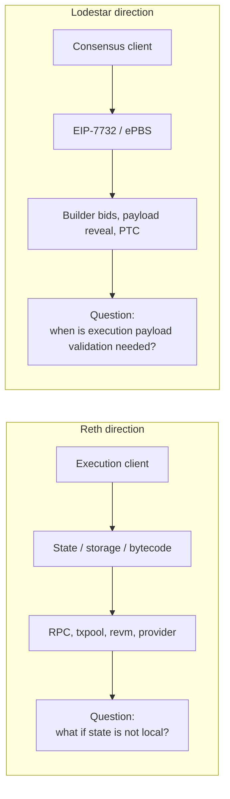
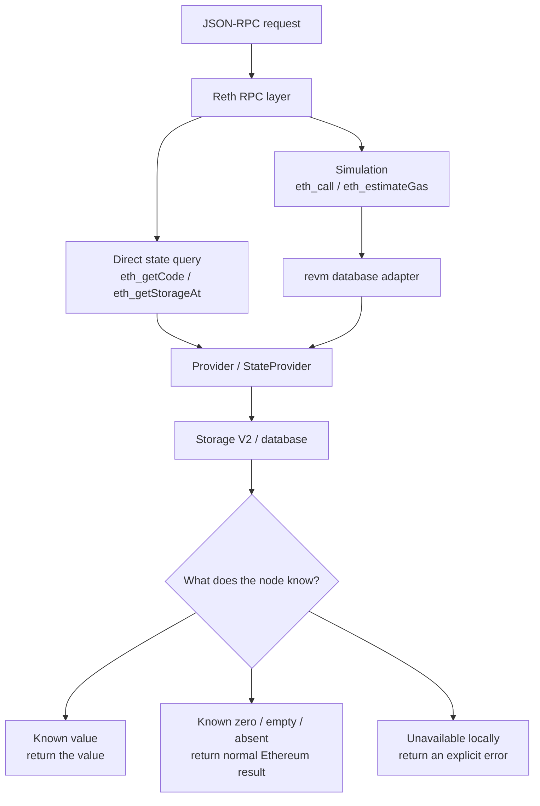
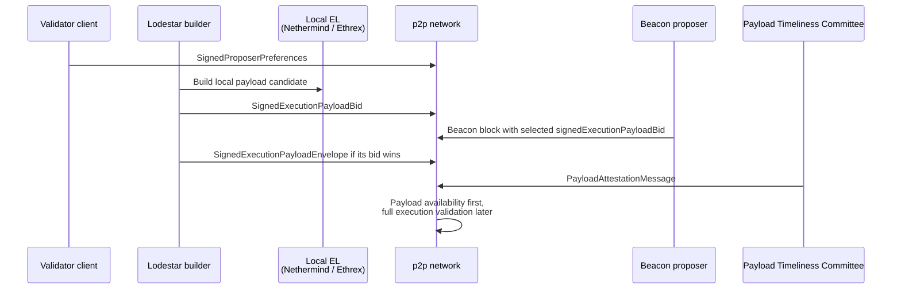

# EPF7 Week 1 Update — Project Board Scan, Reth, and Lodestar

For Week 1, we were encouraged to look back across the EPF7 project board and see what else was available. I did another broad pass over the projects, then narrowed my deeper reading to two directions:

- [Reth: Partial Statefulness and State Expiry Prototype][epf-reth-project]
- [Lodestar: EIP-7732 Builder][epf-lodestar-builder]

I am still looking into both from a technical and implementation perspective. I am currently leaning toward Reth, mostly because it lines up more directly with the Rust / execution-client / state-storage path I want to focus on, but I am also quite interested in the Lodestar EIP-7732 Builder project. I want to understand the scope of both projects before committing to either one.

## What changed since Week 0

Week 0 mostly involved me trying to understand the Reth problem space. I wanted to better understand partial statefulness, state expiry, BALs, the Geth prototype, Erigon's different direction, and the question of what should happen when state is unavailable.

This week I zoomed out again. I wanted to check whether Reth was still the strongest fit after comparing it with other projects, especially the Lodestar / EIP-7732 builder work.

That changed the shape of the week. I started focusing on answering the following questions:

- What would I get to learn more about by taking on either the Reth or the Lodestar project?
- What would a realistic prototype look like for each project?
- What would I actually be focusing on day to day in each project?

The Reth project is about execution-state availability. Lodestar / EIP-7732 is about block production, builder commitments, payload reveal, and separating execution validation from the immediate consensus hot path.

## Reth work this week

Reth is still the project I am leaning toward.

Specifically, I would like to learn more about how a production execution client reads, stores, interprets, and proves state.

In my Week 0 update, I focused mostly on the Reth partial-statefulness project. The core idea I took from the [EPF project description][epf-reth-project] is that a Reth node might keep account-level state broadly available, while only retaining storage and bytecode for selected contracts or state ranges. The important part is not just saving disk space; it is making sure the client can tell the difference between state that is actually zero / empty / absent and state that is simply unavailable locally. The part of the project that continues to interest me is the boundary behavior. Sync, execution, txpool, and RPC all need to distinguish between state that is genuinely zero / empty / absent and state that is unavailable locally.

This week, I spent more time reading about the latest updates to Reth and why they were implemented. The main things I read up on were:

- the latest [Reth releases][reth-releases], especially the Amsterdam / Block Access List work in v2.2.0 and v2.3.0;
- the [Reth 2.0 release post][reth-2], because Storage V2, Sparse Trie Cache, and Partial Proofs seem very relevant to any state-retention prototype;
- the Reth docs for [building from source][reth-source] and running [`reth node`][reth-node];
- the Geth partial-state PR again, but this time with the question “which parts of this are Geth-specific and which parts tackle the general partial-statefulness problem?”

My current Reth mental model is still rough, but I think the first useful part of this project to go after is the RPC / provider / revm boundary.

This is not meant to be a complete Reth architecture diagram. It is just used to illustrate the first vertical I believe I should focus on for this project.

## Lodestar work this week

The second project I looked at in detail was [Lodestar: EIP-7732 Builder][epf-lodestar-builder] by Nico Flaig.

The Lodestar project is about exploring what it would mean for a consensus client to act as an in-protocol builder under [EIP-7732][eip-7732]. My current understanding is that the builder would use a normal execution client, such as Nethermind or Ethrex, to build an execution payload locally. It would then turn that payload into a signed bid and publish the bid over p2p for the relevant slot. If that bid is selected by the proposer, the builder must later reveal the matching execution payload so the network can check that it corresponds to the original commitment.

The part I still need to understand better is the full lifecycle around this flow. For instance, how Lodestar should construct and sign the bid, how proposer preferences are used, how the winning bid is selected, how the payload reveal works, and how EIP-7732’s in-protocol payment mechanism removes the need for a trusted relay. The value of this project seems to be more about walking through the whole bid → selection → reveal → payment path inside Lodestar and finding any spec or implementation gaps along the way.

The question I wanted to answer this week was: is there already enough EIP-7732 / Gloas scaffolding in Lodestar to make this a real implementation project, or would I mostly be blocked on missing surrounding pieces?

I conducted a first pass over the Lodestar codebase to investigate this. It looks like a lot of the surrounding pieces are already present, but I still need to understand what is missing for the actual builder loop.

The Gloas types are already visible in [`packages/types/src/gloas/sszTypes.ts`][lodestar-gloas-ssz]. The file defines the relevant objects I would expect to need for this project: `ProposerPreferences`, `SignedProposerPreferences`, `ExecutionPayloadBid`, `SignedExecutionPayloadBid`, `PayloadAttestationMessage`, `ExecutionPayloadEnvelope`, and `SignedExecutionPayloadEnvelope`. The same file also updates the Gloas `BeaconBlockBody`: the direct execution payload / blob commitments / execution requests fields are removed, and the block body instead carries `signedExecutionPayloadBid`, `payloadAttestations`, and `parentExecutionRequests`.

That maps pretty closely to what was proposed in EIP-7732. In other words, the beacon block commits to the execution payload through a signed bid, and the full execution payload comes later as a signed envelope.

On the p2p side, Lodestar already appears to implement the relevant Gloas gossip topics. In [`packages/beacon-node/src/network/gossip/topic.ts`][lodestar-gossip-topic], the Gloas topics map to the expected SSZ types:

- `execution_payload` → `SignedExecutionPayloadEnvelope`
- `payload_attestation_message` → `PayloadAttestationMessage`
- `execution_payload_bid` → `SignedExecutionPayloadBid`
- `proposer_preferences` → `SignedProposerPreferences`

The same topic file adds `payload_attestation_message`, `execution_payload_bid`, and `proposer_preferences` to the core topics after the Gloas fork. The network interface also exposes publish methods for signed payload envelopes, signed bids, payload attestation messages, and proposer preferences in [`packages/beacon-node/src/network/interface.ts`][lodestar-network-interface]. So any work I would do as part of this project would involve using the existing gossip plumbing.

I also found some validation and pool code that makes the expected builder lifecycle clearer:

- [`executionPayloadBid.ts`][lodestar-validate-bid] validates signed execution payload bids. It checks slot timing, parent block root/hash, matching proposer preferences, active builder status, fee recipient / gas-limit compatibility, KZG commitment limits, duplicate bids, bid value, builder balance, and the builder signature.
- [`executionPayloadBidPool.ts`][lodestar-bid-pool] stores the best signed bid per slot and parent root/hash. That looks like the pool a proposer path would query when selecting a bid.
- [`proposerPreferences.ts`][lodestar-proposer-preferences-service] in the validator package signs and submits proposer preferences ahead of proposal slots. I would likely need to use this as part of the auction flow because builders need to know proposer preferences before they can submit valid bids.
- [`executionPayloadEnvelope.ts`][lodestar-validate-envelope] validates a revealed signed payload envelope. It checks that the beacon block root is known, that the envelope is not already known, that the slot, builder index, block hash, execution requests root, and signature match the prior bid/envelope input.

One detail I found useful is in the block publish path. In [`packages/beacon-node/src/api/impl/beacon/blocks/index.ts`][lodestar-block-api], when the fork is post-Gloas, Lodestar creates a payload-envelope input for the block and does not publish data columns with the beacon block; the relevant comment says that after Gloas, data columns are published when publishing the execution payload envelope. That helped me understand the practical meaning of separating the beacon block from the execution payload.

### What I understand better about Lodestar now

My current understanding is that the Lodestar project is really about implementing the honest builder lifecycle end to end. The builder needs to listen for proposer preferences, build a local payload using normal EL software, turn that payload into a signed bid, publish the bid over p2p, detect whether the bid was selected, and reveal the matching payload envelope in time.

The parts that seem most important are:

- connecting Lodestar’s existing Gloas types and gossip paths into an actual builder loop;
- deciding how the builder talks to local EL software;
- tracking the relationship between a bid and the payload envelope it commits to;
- testing whether the bid → selection → reveal → payment flow exposes any spec or implementation gaps.

So based on my initial research, I believe this Lodestar project would consist of the following:

1. collect or receive proposer preferences;
2. build a local execution payload with vanilla EL software;
3. compute the bid fields from that payload and the current beacon-chain context;
4. sign and publish `SignedExecutionPayloadBid` over p2p;
5. track whether that bid was selected in a beacon block;
6. reveal the matching `SignedExecutionPayloadEnvelope` if selected;
7. rely on PTC / payload-attestation logic to record whether the payload was revealed in time;
8. use the trustless payment path so the proposer is paid according to the bid.

## What is still unclear to me

For Reth, I still need to figure out:

- where account, storage, and bytecode reads actually happen in the codebase;
- where unavailable state might currently collapse into zero or empty values;
- whether the first prototype should start at RPC, provider/revm, sync/storage, or BAL validation;

For Lodestar, I still need to figure out:

- whether there is already a WIP branch or internal issue for the `lodestar builder` service itself;
- how the builder should talk to local EL software like Nethermind or Ethrex to produce payload candidates;
- where the builder key / builder registration / builder balance setup should live in a devnet;
- how a builder should detect that its bid won and map that selected bid back to the exact payload envelope it needs to reveal;
- whether the first useful artifact is a local demo, a devnet contribution, spec-gap notes, implementation PRs, or some combination;
- how much of the project is blocked by moving specs or Glamsterdam devnet readiness.

## Plan for next week

Next week I want to keep both projects in view, but I need to start doing more hands-on work.

For Reth, I want to:

1. build or install Reth locally;
2. run `reth node --dev`;
3. make basic JSON-RPC calls against the dev node;
4. deploy or inspect a tiny contract with bytecode and at least one storage slot;
5. trace `eth_getCode` and `eth_getStorageAt` from RPC to provider/database reads;
6. start tracing `eth_call` and `eth_estimateGas` through the provider/revm boundary;
7. continue reading the Geth partial-state PR and Erigon’s related tracking issue.

For Lodestar, I want to:

1. read the EIP-7732 again and turn the builder project into a step-by-step builder lifecycle;
2. trace the Gloas files I found this week: SSZ types, proposer preferences, bid validation, bid pool, network publishing, and payload-envelope validation;
3. search for an existing WIP branch, devnet setup, or issue thread for `lodestar builder` specifically;
4. Determine what a realistic minimal builder implementation could be;

## Useful links

### Reth / partial statefulness

- [Reth GitHub][reth-github]
- [Reth releases][reth-releases]
- [Reth v2.3.0 release notes][reth-v230]
- [Reth 2.0 release post][reth-2]
- [Build Reth from source][reth-source]
- [Reth `node` CLI docs][reth-node]
- [Geth partial-state PR][geth-partial-state-pr]
- [Erigon partial-statefulness tracking issue][erigon-partial-state]
- [EIP-7928: Block-Level Access Lists][eip-7928]
- [EIP-8268: Storage Roots in Block Access Lists][eip-8268]
- [VOPS: Validity-Only Partial Statelessness][vops]
- [EIP-7805: FOCIL][eip-7805]
- [Ress / Stateless Reth][ress]
- [Portal Network specs][portal-specs]

### Lodestar / EIP-7732

- [Lodestar documentation][lodestar-docs]
- [Lodestar GitHub][lodestar-github]
- [EIP-7732: Enshrined Proposer-Builder Separation][eip-7732]
- [EIP-7732: the case for inclusion in Glamsterdam][eip-7732-glamsterdam]
- [Ethereum Magicians EIP-7732 discussion thread][eip-7732-discussion]
- [Lodestar Gloas SSZ types][lodestar-gloas-ssz]
- [Lodestar Gloas type exports][lodestar-gloas-types]
- [Lodestar Gloas gossip topics][lodestar-gossip-topic]
- [Lodestar network interface publish methods][lodestar-network-interface]
- [Lodestar execution payload bid validation][lodestar-validate-bid]
- [Lodestar execution payload bid pool][lodestar-bid-pool]
- [Lodestar proposer preferences service][lodestar-proposer-preferences-service]
- [Lodestar execution payload envelope validation][lodestar-validate-envelope]
- [Lodestar beacon block API / post-Gloas payload envelope input][lodestar-block-api]

[epf-project-ideas]: https://github.com/eth-protocol-fellows/cohort-seven/blob/main/projects/project-ideas.md
[epf-reth-project]: https://github.com/eth-protocol-fellows/cohort-seven/blob/main/projects/project-ideas.md#reth-partial-statefulness-and-state-expiry-prototype
[epf-lodestar-builder]: https://github.com/eth-protocol-fellows/cohort-seven/blob/main/projects/project-ideas.md#lodestar-eip-7732-builder
[epf-lodestar-adversarial]: https://github.com/eth-protocol-fellows/cohort-seven/blob/main/projects/project-ideas.md#lodestar-adversarial-node
[reth-github]: https://github.com/paradigmxyz/reth
[reth-releases]: https://github.com/paradigmxyz/reth/releases
[reth-v230]: https://github.com/paradigmxyz/reth/releases/tag/v2.3.0
[reth-2]: https://www.paradigm.xyz/2026/04/releasing-reth-2-0
[reth-source]: https://reth.rs/installation/source/
[reth-node]: https://reth.rs/cli/reth/node/
[geth-partial-state-pr]: https://github.com/ethereum/go-ethereum/pull/33764
[erigon-partial-state]: https://github.com/erigontech/erigon/issues/20587
[eip-7928]: https://eips.ethereum.org/EIPS/eip-7928
[eip-8268]: https://eips.ethereum.org/EIPS/eip-8268
[vops]: https://ethresear.ch/t/a-pragmatic-path-towards-validity-only-partial-statelessness-vops/22236
[eip-7805]: https://eips.ethereum.org/EIPS/eip-7805
[ress]: https://github.com/paradigmxyz/ress
[portal-specs]: https://github.com/ethereum/portal-network-specs
[lodestar-docs]: https://chainsafe.github.io/lodestar/
[lodestar-github]: https://github.com/ChainSafe/lodestar
[eip-7732]: https://eips.ethereum.org/EIPS/eip-7732
[eip-7732-glamsterdam]: https://ethereum-magicians.org/t/eip-7732-the-case-for-inclusion-in-glamsterdam/24306
[eip-7732-discussion]: https://ethereum-magicians.org/t/eip-7732-enshrined-proposer-builder-separation-epbs/19634

[lodestar-gloas-ssz]: https://github.com/ChainSafe/lodestar/blob/ec438788c32c1c4f3decfaab5e1dc8018d6e575d/packages/types/src/gloas/sszTypes.ts
[lodestar-gloas-types]: https://github.com/ChainSafe/lodestar/blob/ec438788c32c1c4f3decfaab5e1dc8018d6e575d/packages/types/src/gloas/types.ts
[lodestar-gossip-topic]: https://github.com/ChainSafe/lodestar/blob/ec438788c32c1c4f3decfaab5e1dc8018d6e575d/packages/beacon-node/src/network/gossip/topic.ts
[lodestar-network-interface]: https://github.com/ChainSafe/lodestar/blob/ec438788c32c1c4f3decfaab5e1dc8018d6e575d/packages/beacon-node/src/network/interface.ts
[lodestar-validate-bid]: https://github.com/ChainSafe/lodestar/blob/ec438788c32c1c4f3decfaab5e1dc8018d6e575d/packages/beacon-node/src/chain/validation/executionPayloadBid.ts
[lodestar-bid-pool]: https://github.com/ChainSafe/lodestar/blob/ec438788c32c1c4f3decfaab5e1dc8018d6e575d/packages/beacon-node/src/chain/opPools/executionPayloadBidPool.ts
[lodestar-proposer-preferences-service]: https://github.com/ChainSafe/lodestar/blob/ec438788c32c1c4f3decfaab5e1dc8018d6e575d/packages/validator/src/services/proposerPreferences.ts
[lodestar-validate-envelope]: https://github.com/ChainSafe/lodestar/blob/ec438788c32c1c4f3decfaab5e1dc8018d6e575d/packages/beacon-node/src/chain/validation/executionPayloadEnvelope.ts
[lodestar-block-api]: https://github.com/ChainSafe/lodestar/blob/ec438788c32c1c4f3decfaab5e1dc8018d6e575d/packages/beacon-node/src/api/impl/beacon/blocks/index.ts