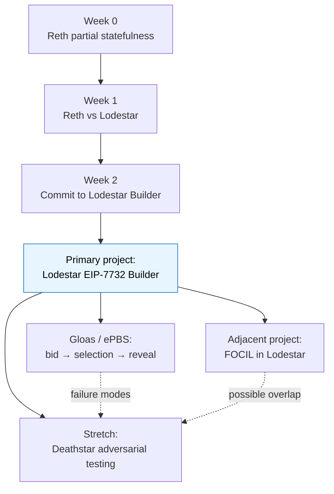
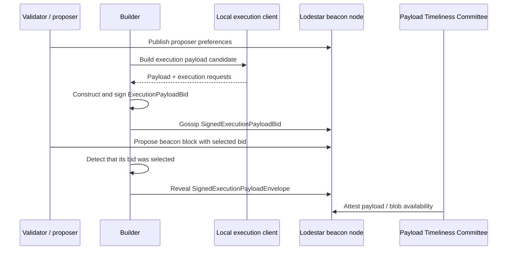
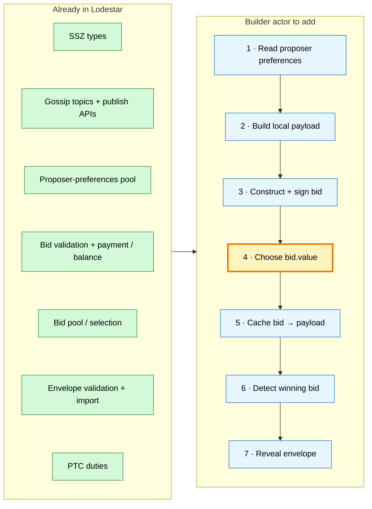
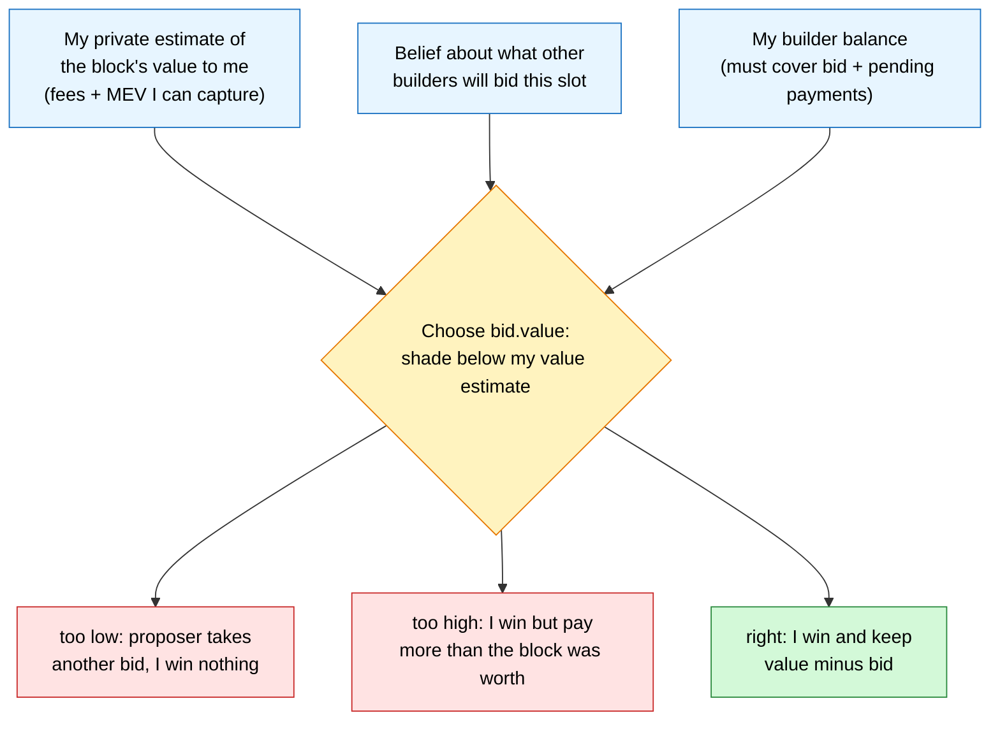
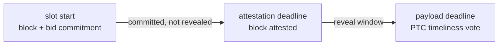
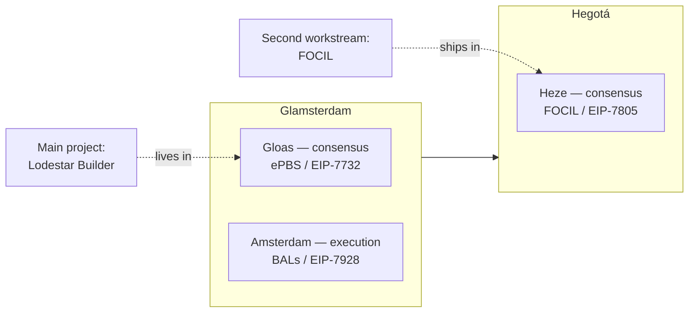

# EPF7 Week 2 Update — Committing to the Lodestar EIP-7732 Builder Project


This week I changed direction and committed to the **Lodestar Builder** as my main EPF project. The rest of this update is about going deep enough on Lodestar to understand exactly what that work involves. I also had a first project discussion with Marko, who is going to coordinate with me on the Builder work. We may also help to implement [FOCIL](https://eips.ethereum.org/EIPS/eip-7805) in Lodestar as an adjacent project. I haven't reached out to mentors yet, since we've been asked to hold off, so this week was self-directed spec and repo research.

At a high level the direction now looks like this:



## What changed since Week 1

In Week 1, I was still weighing Reth against Lodestar and leaning slightly toward Reth because of the Rust and execution-client depth. Reth still looks like a strong project. It would teach me a lot about execution-client internals, state storage, RPC behavior, txpool validation, and partial-state correctness.

What tipped me toward the builder project is that its central problem is closer to the part of Ethereum I most want to work on. The builder has to produce or receive an execution payload, decide what to bid for it, publish that bid, and reveal the matching payload if it wins. That touches block production, auctions, proposer-builder separation, MEV, censorship resistance, and mechanism design.

Most of my recent work has been around mechanism design and truth-discovery mechanisms, so this feels like a part of the protocol where my background is useful rather than something I am only catching up on.

The other reason is ownership and clear scope. The builder project seems fairly self-contained, and its stated purpose is to explore the specs and find the gaps that block a clean consensus-client-as-builder implementation. That is a clear thing to aim at.

So this week I stopped comparing projects and started mapping the builder in detail.

## My current understanding of EIP-7732 / Gloas

My current understanding is that [EIP-7732](https://eips.ethereum.org/EIPS/eip-7732) changes block production by separating the consensus part of a block from the execution payload. Instead of the beacon block carrying the full execution payload, the block carries a signed builder commitment, `SignedExecutionPayloadBid`, and the builder later reveals the matching payload as a `SignedExecutionPayloadEnvelope`. The builder pays the proposer through an in-protocol mechanism, which is what removes the need for a trusted relay. It's worth noting this is a confirmed Glamsterdam headliner, and that Nico Flaig, who mentors this project, is a co-author of the EIP.

The rough lifecycle I need to understand is the interaction between the proposer, the builder, a local execution client, and the Payload Timeliness Committee (PTC):



That is still a simplified diagram, but it is the mental model I am using for now.

The project, as I understand it, is about making the builder an actual participant in this lifecycle.

The builder needs to:

1. understand proposer preferences;
2. produce or request a local execution payload;
3. compute the bid fields from that payload and the beacon-chain context;
4. sign and publish a `SignedExecutionPayloadBid`;
5. remember the payload and related data that the bid commits to;
6. detect whether the bid was selected;
7. reveal the matching `SignedExecutionPayloadEnvelope`;
8. test where the bid → selection → reveal path breaks.

The part I currently think is most central is the bid-to-payload mapping. A builder cannot just publish a bid and later reconstruct the reveal from scratch. It needs to keep enough local state to map a selected `SignedExecutionPayloadBid` back to the exact payload, execution requests, blobs, proofs, and metadata that the bid committed to.

## What the builder work actually involves

In Week 1 I did a first pass over the Lodestar codebase and found a lot of the Gloas scaffolding already there. This week I went further and reconciled the code against the [Gloas builder spec](https://github.com/ethereum/consensus-specs/blob/dev/specs/gloas/builder.md), tracking live `unstable`. The short version is that almost everything the builder needs already exists, except the builder itself.

Most of the lifecycle is implemented. The builder registry, meaning deposits, index assignment and activation, is handled in [`processBuilderDepositRequest.ts`](https://github.com/ChainSafe/lodestar/blob/unstable/packages/state-transition/src/block/processBuilderDepositRequest.ts). Local payload production already supports `engine_getPayloadV6`. Bid validation, the builder-payment and balance checks, and the signature checks live in [`executionPayloadBid.ts`](https://github.com/ChainSafe/lodestar/blob/unstable/packages/beacon-node/src/chain/validation/executionPayloadBid.ts) and [`processExecutionPayloadBid.ts`](https://github.com/ChainSafe/lodestar/blob/unstable/packages/state-transition/src/block/processExecutionPayloadBid.ts), and the best-bid-per-slot pool is in [`executionPayloadBidPool.ts`](https://github.com/ChainSafe/lodestar/blob/unstable/packages/beacon-node/src/chain/opPools/executionPayloadBidPool.ts). Revealed envelopes are validated and imported through [`executionPayloadEnvelope.ts`](https://github.com/ChainSafe/lodestar/blob/unstable/packages/beacon-node/src/chain/validation/executionPayloadEnvelope.ts), and the validator can already sign an envelope through `signExecutionPayloadEnvelope` in [`validatorStore.ts`](https://github.com/ChainSafe/lodestar/blob/unstable/packages/validator/src/services/validatorStore.ts). The gossip topics and the publish endpoints for both bids and envelopes are present too.

So the project is ultimately about answering:

> what is the missing builder actor, and where should it live in Lodestar? 

Lodestar can already produce a block where the proposer builds its own payload, which the spec calls the self-build path. What it has no path for is an external builder producing a payload, bidding for it, and revealing it. Concretely that means there's no client method to sign a bid (only the envelope variant exists), no actor that constructs and submits a bid, no logic to choose what to bid, no way for a builder to notice that its own bid won, and no builder config or key handling.

This is not entirely static though. There is active builder-adjacent work right now: [#9507](https://github.com/ChainSafe/lodestar/pull/9507) is scaffolding builder execution requests (the EIP-8282 deposit/exit side), and [#9289](https://github.com/ChainSafe/lodestar/pull/9289) added proposer-side gossip bid selection along with the `publishExecutionPayloadBid` endpoint. Neither is the external builder actor itself, but they border it, so part of my research next week will involve confirming exactly where the line sits and coordinating so I'm not duplicating work.

The distinction I'm trying to keep clear is between what exists and what the builder actor still needs:



As mentioned above, the closest thing to a reference implementation is the self-build path. In [`block.ts`](https://github.com/ChainSafe/lodestar/blob/unstable/packages/validator/src/services/block.ts) the validator already does the reveal half of the flow for self-build. It fetches the envelope, signs it, and publishes it. An external builder runs the same steps, decoupled from being the proposer, plus the bidding and winning-detection it adds. 

Some of the pieces I want to inspect more carefully are:

- Gloas SSZ types in [`packages/types/src/gloas/sszTypes.ts`](https://github.com/ChainSafe/lodestar/blob/unstable/packages/types/src/gloas/sszTypes.ts);
- Gloas gossip topics in [`packages/beacon-node/src/network/gossip/topic.ts`](https://github.com/ChainSafe/lodestar/blob/unstable/packages/beacon-node/src/network/gossip/topic.ts);
- network publish methods in [`packages/beacon-node/src/network/interface.ts`](https://github.com/ChainSafe/lodestar/blob/unstable/packages/beacon-node/src/network/interface.ts);
- builder deposit processing in [`processBuilderDepositRequest.ts`](https://github.com/ChainSafe/lodestar/blob/unstable/packages/state-transition/src/block/processBuilderDepositRequest.ts);
- execution payload bid validation in [`executionPayloadBid.ts`](https://github.com/ChainSafe/lodestar/blob/unstable/packages/beacon-node/src/chain/validation/executionPayloadBid.ts);
- execution payload bid processing in [`processExecutionPayloadBid.ts`](https://github.com/ChainSafe/lodestar/blob/unstable/packages/state-transition/src/block/processExecutionPayloadBid.ts);
- the execution payload bid pool in [`executionPayloadBidPool.ts`](https://github.com/ChainSafe/lodestar/blob/unstable/packages/beacon-node/src/chain/opPools/executionPayloadBidPool.ts);
- proposer preferences in [`proposerPreferences.ts`](https://github.com/ChainSafe/lodestar/blob/unstable/packages/validator/src/services/proposerPreferences.ts);
- execution payload envelope validation in [`executionPayloadEnvelope.ts`](https://github.com/ChainSafe/lodestar/blob/unstable/packages/beacon-node/src/chain/validation/executionPayloadEnvelope.ts);
- the validator self-build / reveal path in [`block.ts`](https://github.com/ChainSafe/lodestar/blob/unstable/packages/validator/src/services/block.ts);
- envelope signing in [`validatorStore.ts`](https://github.com/ChainSafe/lodestar/blob/unstable/packages/validator/src/services/validatorStore.ts);
- Engine API support around payload production, including [`engine_getPayloadV6`](https://github.com/ChainSafe/lodestar/blob/unstable/packages/beacon-node/src/execution/engine/types.ts).

I also want to inspect some recent Gloas/ePBS PRs:

- [Add gossip bid selection to block production](https://github.com/ChainSafe/lodestar/pull/9289)
- [Add stateless path to publishExecutionPayloadEnvelope](https://github.com/ChainSafe/lodestar/pull/9401)
- [Verify ExecutionPayloadEnvelope block_hash via keccak256/RLP header](https://github.com/ChainSafe/lodestar/pull/9467)
- [Glamsterdam devnet 6](https://github.com/ChainSafe/lodestar/pull/9538)
- [Builder execution requests scaffolding](https://github.com/ChainSafe/lodestar/pull/9507)

## Mapping the Gloas objects to Lodestar code

One way I want to work through the codebase is to map each Gloas spec object to the Lodestar file that handles it, and the question I'm trying to answer for each:

| Spec object / concept | Where I expect to look in Lodestar | Question |
|---|---|---|
| `SignedProposerPreferences` | validator service, gossip, op pool | How does the builder learn proposer constraints? |
| `SignedExecutionPayloadBid` | Gloas types, bid validation, bid pool | What does Lodestar already validate before accepting a bid? |
| bid selection | block production path | How does the proposer select a bid for the block? |
| `SignedExecutionPayloadEnvelope` | payload-envelope validation/import | What has to match the original bid? |
| PTC / payload attestation | PTC duties, fork choice | How does Lodestar decide whether a payload was available in time? |
| builder index / balance | Gloas state transition | How does a local/devnet builder become an active builder? |
| execution requests | payload attributes / EL interface | What needs to be cached between bid and reveal? |
| blobs / data columns | data-column sidecar handling | What data is published with the envelope rather than the beacon block? |

## The part I most want to research: what to bid

This is the part of the project I'm most interested in and the part that's least worked out, so I want to be clear, it's still an open problem. The current spec clearly says that the builder must hold enough balance to cover its bid plus any pending payments, but it deliberately says nothing about how to choose the number, because that's a builder strategy question rather than a protocol one. This is where my background in mechanism design I hope will be most useful. The protocol can define what a valid bid is, how it is signed, how it is gossiped, and when the payload must be revealed. But it can't tell a builder what number to put in `bid.value`.

The structure is a first-price auction. The builder builds a block, forms a private estimate of what that block is worth to it (the fees and MEV it can capture), and then sets `bid.value`, which is what it pays the proposer if its bid is selected. Bid too low and the proposer takes a competing builder's bid, so the original builder wins nothing. Bid too high and the original builder wins but pays out more than the block was worth to them.

The standard result for a first-price auction is that you shade your bid below your value estimate, and [Julian Ma's work](https://mirror.xyz/julianma.eth/CPYI91s98cp9zKFkanKs_qotYzw09kWvouaAa9GXBrQ) on ePBS bidding shows builders with more MEV capacity rationally shade more, which is part of why builder centralization is a concern. So "what to bid" really decomposes into two things I can't directly observe: the value of the block I just built, and the distribution of what other builders will bid for the same slot.



There are two wrinkles specific to ePBS that I'll need to price in. The first is the [free-option problem](https://collective.flashbots.net/t/the-free-option-problem-in-epbs-part-ii/5145): there's a window between committing to a bid and revealing the payload during which a builder can withhold if the market moves against it, which is a known and [studied](https://arxiv.org/abs/2509.24849) design concern. The second is that under the trustless-payment mechanism the builder pays the proposer whether or not the block ends up canonical, so the cost of winning and then failing is real and has to be in the model.

I'm obviously not going to try to solve this in week two. What I want to do first is write the objective down precisely, list exactly what the builder knows at the moment it bids, and then implement the simplest pricing rule that runs, probably a fixed shade below a rough value estimate, so the end-to-end loop works and I have a baseline to improve against. I just need a simple pricing rule that can run end to end. Once the lifecycle works, the bidding rule becomes something Marko and I can improve rather than an empty placeholder.

## The slot timing that makes this work

A lot of the builder's behaviour, and most of the ways it can go wrong, comes down to the slot's internal deadlines. The current Gloas config expresses these as basis points of the slot rather than fixed seconds, since the slot length itself is still being decided. The proposer publishes the block with the bid commitment at the start of the slot, attesters vote on the block at 25% of the slot before the payload has necessarily been revealed (`ATTESTATION_DUE_BPS_GLOAS`), and the builder must reveal the payload by 75% of the slot (the payload deadline), at which point the Payload Timeliness Committee (PTC) votes on whether it arrived in time (`PAYLOAD_DUE_BPS`).

The gap from the start of the slot to the reveal deadline is the free-option window from the value section, and it's where most of the adversarial cases below live (late reveal, withheld payload, mismatched envelope, and split PTC views).



## Where FOCIL fits

I also want to keep [FOCIL / EIP-7805](https://eips.ethereum.org/EIPS/eip-7805) in scope as a possible second Lodestar workstream.

My main project will still be the [Lodestar EIP-7732 Builder](https://github.com/eth-protocol-fellows/cohort-seven/blob/main/projects/project-ideas.md#lodestar-eip-7732-builder). That is the work I want to prioritise first, and it is the project I currently expect to spend most of my time on. But Marko and I may also contribute directly to Lodestar’s FOCIL implementation if we find a clear piece of work there and have time to do so.



FOCIL is relevant in the context of this builder work because it touches the same general parts of the protocol: block construction, censorship resistance, proposer/builder constraints, fork choice, and the information different actors have when blocks are being built.

FOCIL introduces fork-choice enforced inclusion lists. Inclusion-list committee members build and gossip inclusion lists, and proposers / builders are then constrained by those lists when constructing blocks. That makes it a natural area to study alongside the builder project, even if the contribution is not directly inside the builder codepath.

So FOCIL and the builder project do share a natural seam. Under FOCIL the payload-construction function the builder uses is modified from its Gloas version to pull in inclusion-list transactions, so the builder I'm writing now will, in the FOCIL world, have to satisfy inclusion lists when it builds a payload. Further, those forced transactions feed back into the value-estimation and bidding problem. But that seam is one reason the two pair well, not the limit of what I'd contribute.

My FOCIL goals for now:

- What does the `focil` branch already implement, and what's on it versus `unstable` — including which gaps are still open or unmerged?
- What would a realistic first FOCIL contribution be?
- Where does FOCIL meet ePBS / Gloas at payload construction — as context for the builder, and where it complements the builder without being part of that codepath?
- How should Marko and I split the FOCIL work?
- Does FOCIL need more spec reading before touching code?
- Which FOCIL failure modes belong in the adversarial notebook?

In sum I'm framing my EPF work as follows:

```text
Primary project:
  Lodestar EIP-7732 Builder

Secondary Lodestar workstream:
  FOCIL implementation, if Marko and I find a clear contribution point

Stretch / testing angle:
  Deathstar-style adversarial scenarios informed by Builder and/or FOCIL failure modes
```

The FOCIL links I want to review are:

- [EIP-7805: FOCIL](https://eips.ethereum.org/EIPS/eip-7805)
- [Lodestar FOCIL tracker](https://github.com/ChainSafe/lodestar/issues/7340)
- [Initial Lodestar FOCIL implementation PR](https://github.com/ChainSafe/lodestar/pull/7342)
- [Add FOCIL beacon metrics](https://github.com/ChainSafe/lodestar/pull/8062)
- [Update EIP-7805 to use BPS deadlines](https://github.com/ChainSafe/lodestar/pull/8478)
- [Heze inclusion-list spec](https://github.com/ethereum/consensus-specs/blob/dev/specs/heze/inclusion-list.md)

## Starting the adversarial notebook

The other Lodestar related project, [Deathstar](https://github.com/eth-protocol-fellows/cohort-seven/blob/master/projects/project-ideas.md#lodestar-adversarial-node), is an adversarial Lodestar node. In other words it is a node that speaks the protocol correctly but misbehaves on purpose to surface consensus bugs in other clients before mainnet. 

The way I am thinking about this is:

> Builder is the main implementation project. Deathstar is a possible adversarial testing extension once the honest builder path works.

The reason Deathstar fits as a stretch goal is that a builder is naturally an adversarial actor to test. Once a client accepts signed bids and delayed payload reveals, there are new ways for a node to be well-formed enough to enter the protocol path while still behaving badly. I have started a notebook of ways the builder and reveal flow can break, partly because the builder's own remit is to find spec gaps, and partly because each of these is a candidate Deathstar scenario later.

Most of the failure modes live at the transitions in the timing diagram. A builder can equivocate by gossiping conflicting bids, or send a bid that validates locally but fails elsewhere. Having won, it can withhold the payload entirely, which is honest if the block was late but an attack if it wasn't, or reveal right on the 75% deadline to stress the PTC, or reveal a payload whose block hash or execution-requests root doesn't match the bid. The PTC itself can end up with a split view. 

The potential sections I have considered so far are:

- bid construction failures;
- bid gossip and validation failures;
- proposer-preference mismatches;
- parent-root and parent-execution-hash mismatches;
- builder balance and bid-value edge cases;
- payload cache misses;
- winning-bid detection failures;
- late or missing reveals;
- mismatched envelopes;
- blob and data-column availability;
- PTC disagreement;
- fork-choice EMPTY / FULL ambiguity;
- FOCIL inclusion-list equivocation or propagation issues;
- possible Deathstar scenarios.

For each case, I want to record:

```text
What can go wrong?

Where does the spec describe this?

Where does Lodestar handle this?

Is this an honest-path test, integration test, or Deathstar scenario?

Could this become part of the final write-up?
```

## What I did this week

This week was mostly about narrowing the project direction and turning the Lodestar project into a more concrete research plan.

The main things I did were:

- Committed to the Lodestar Builder as my primary EPF project.
- Had a first project discussion with Marko about coordinating on the Builder work.
- Reconciled the Gloas builder spec against live `unstable`, separating the infrastructure that already exists from the missing builder-side loop.
- Mapped the builder path as a bid → selection → reveal lifecycle.
- Framed value estimation — what to set `bid.value` to — as the core problem, rather than a placeholder.
- Started treating FOCIL as adjacent context / adjacent project after finding its implementation on a dedicated `focil` branch.
- Started a Deathstar / adversarial notebook.

## What I still need to understand

The main open questions I have are:

- Should the builder live inside the beacon node, the validator client, or as a separate service?
- Where does the active builder-adjacent work ([#9507](https://github.com/ChainSafe/lodestar/pull/9507), [#9289](https://github.com/ChainSafe/lodestar/pull/9289)) end and my actor begin, and is there other in-flight work I'm missing?
- How should builder keys, indices, and balances be represented in a local/devnet setup — including how `builder_index` is encoded on the wire for self-build blocks, given Lodestar's `Infinity` sentinel isn't a valid `uint64`?
- Should the first version use a real EL client like Nethermind / Ethrex, or a mock/local payload source?
- Is `engine_getPayloadV6` reusable as-is from the self-build path?
- How does the builder reliably detect that its bid was selected, and exactly what needs to be cached between bid publication and reveal?
- How much blob / data-column handling should the first prototype include?
- What should the first bidding rule be?
- Should the builder target the consensus-layer payment (`bid.value`) or the trusted execution-layer payment (`bid.execution_payment`) first?
- Where does FOCIL intersect the Builder path?
- How do Marko and I split the builder lifecycle, and is FOCIL part of that split?
- Which adversarial cases would be useful enough to later implement in Deathstar?

## Plan for next week

**1. Read the core Gloas specs and turn them into a lifecycle note.** The main sources are [EIP-7732](https://eips.ethereum.org/EIPS/eip-7732), the [Gloas builder guide](https://github.com/ethereum/consensus-specs/blob/dev/specs/gloas/builder.md), the [p2p interface](https://github.com/ethereum/consensus-specs/blob/dev/specs/gloas/p2p-interface.md), the [honest validator guide](https://github.com/ethereum/consensus-specs/blob/dev/specs/gloas/validator.md), and the [fork-choice spec](https://github.com/ethereum/consensus-specs/blob/dev/specs/gloas/fork-choice.md). The questions I want answered: what exactly the builder signs, the fields of the bid and the envelope, what "winning" means from the builder's side, what must be cached before reveal, the timing relationship between bid, block, reveal and PTC attestation, and which parts of the spec are clear versus underspecified.

**2. Map the Lodestar Gloas codepaths.** Trace the files behind those objects ([SSZ types](https://github.com/ChainSafe/lodestar/blob/unstable/packages/types/src/gloas/sszTypes.ts), [gossip topics](https://github.com/ChainSafe/lodestar/blob/unstable/packages/beacon-node/src/network/gossip/topic.ts), [bid validation](https://github.com/ChainSafe/lodestar/blob/unstable/packages/beacon-node/src/chain/validation/executionPayloadBid.ts), [bid pool](https://github.com/ChainSafe/lodestar/blob/unstable/packages/beacon-node/src/chain/opPools/executionPayloadBidPool.ts), [proposer preferences](https://github.com/ChainSafe/lodestar/blob/unstable/packages/validator/src/services/proposerPreferences.ts), [envelope validation](https://github.com/ChainSafe/lodestar/blob/unstable/packages/beacon-node/src/chain/validation/executionPayloadEnvelope.ts)) into a short architecture note:

```text
Already exists:
- ...
Unclear / needs tracing:
- ...
Likely missing builder-owned pieces:
- ...
```

**3. Inspect the recent Gloas / ePBS PRs** to see whether they change my working hypothesis about what's left for the builder: [#9289](https://github.com/ChainSafe/lodestar/pull/9289), [#9401](https://github.com/ChainSafe/lodestar/pull/9401), [#9467](https://github.com/ChainSafe/lodestar/pull/9467), [#9507](https://github.com/ChainSafe/lodestar/pull/9507), [#9538](https://github.com/ChainSafe/lodestar/pull/9538).

**4. Write down the builder's bidding objective.** Not to solve optimal bidding yet, just to make the first version explicit:

```text
- What does the builder know at bid time?
- What is the rough value estimate?
- What constraints come from builder balance / pending payments?
- What simple pricing rule can run end to end?
- How could that rule be improved later?
```

**5. Inspect the focil branch and identify a concrete first contribution** — what's on the `focil` branch and where it touches the builder path and how it fits alongside the builder.

**6. Keep the adversarial notebook running** alongside the spec reading, recording for each case what goes wrong, where the spec and Lodestar handle it, whether it's an honest-path test or a Deathstar scenario, and its write-up relevance.

By the next update I want a clearer map of the Lodestar builder lifecycle and a first view of what the simplest end-to-end builder target should be.

## Useful links

### EPF project board
- [EPF7 project ideas](https://github.com/eth-protocol-fellows/cohort-seven/blob/master/projects/project-ideas.md)
- [Lodestar: EIP-7732 Builder](https://github.com/eth-protocol-fellows/cohort-seven/blob/master/projects/project-ideas.md#lodestar-eip-7732-builder) · [Lodestar: Adversarial Node / Deathstar](https://github.com/eth-protocol-fellows/cohort-seven/blob/master/projects/project-ideas.md#lodestar-adversarial-node) · [Reth: Partial Statefulness](https://github.com/eth-protocol-fellows/cohort-seven/blob/master/projects/project-ideas.md#reth-partial-statefulness-and-state-expiry-prototype)
- [EPF Cohort 7 repository](https://github.com/eth-protocol-fellows/cohort-seven) · [EPF wiki](https://epf.wiki)

### Specs & EIPs
- [EIP-7732: Enshrined Proposer-Builder Separation](https://eips.ethereum.org/EIPS/eip-7732) (Nico Flaig, my mentor, is a co-author) · [Magicians discussion](https://ethereum-magicians.org/t/eip-7732-enshrined-proposer-builder-separation-epbs/19634)
- [EIP-7805: FOCIL](https://eips.ethereum.org/EIPS/eip-7805) · [EIP-7928: Block-Level Access Lists](https://eips.ethereum.org/EIPS/eip-7928)
- Gloas specs: [builder guide](https://github.com/ethereum/consensus-specs/blob/dev/specs/gloas/builder.md) · [beacon-chain](https://github.com/ethereum/consensus-specs/blob/dev/specs/gloas/beacon-chain.md) · [fork-choice](https://github.com/ethereum/consensus-specs/blob/dev/specs/gloas/fork-choice.md) · [p2p interface](https://github.com/ethereum/consensus-specs/blob/dev/specs/gloas/p2p-interface.md) · [honest validator](https://github.com/ethereum/consensus-specs/blob/dev/specs/gloas/validator.md)
- [Heze inclusion-list spec](https://github.com/ethereum/consensus-specs/blob/dev/specs/heze/inclusion-list.md) (FOCIL)

### Lodestar code
- [Lodestar GitHub](https://github.com/ChainSafe/lodestar) · [docs](https://chainsafe.github.io/lodestar/) · [releases](https://github.com/ChainSafe/lodestar/releases)
- The builder gap: `TODO GLOAS` in [`produceBlockBody.ts`](https://github.com/ChainSafe/lodestar/blob/unstable/packages/beacon-node/src/chain/produceBlock/produceBlockBody.ts)
- [`processBuilderDepositRequest.ts`](https://github.com/ChainSafe/lodestar/blob/unstable/packages/state-transition/src/block/processBuilderDepositRequest.ts) · [`executionPayloadBid.ts`](https://github.com/ChainSafe/lodestar/blob/unstable/packages/beacon-node/src/chain/validation/executionPayloadBid.ts) · [`processExecutionPayloadBid.ts`](https://github.com/ChainSafe/lodestar/blob/unstable/packages/state-transition/src/block/processExecutionPayloadBid.ts) · [`executionPayloadBidPool.ts`](https://github.com/ChainSafe/lodestar/blob/unstable/packages/beacon-node/src/chain/opPools/executionPayloadBidPool.ts) · [`executionPayloadEnvelope.ts`](https://github.com/ChainSafe/lodestar/blob/unstable/packages/beacon-node/src/chain/validation/executionPayloadEnvelope.ts)
- [`proposerPreferences.ts`](https://github.com/ChainSafe/lodestar/blob/unstable/packages/validator/src/services/proposerPreferences.ts) · [`block.ts` (self-build reveal)](https://github.com/ChainSafe/lodestar/blob/unstable/packages/validator/src/services/block.ts) · [`validatorStore.ts`](https://github.com/ChainSafe/lodestar/blob/unstable/packages/validator/src/services/validatorStore.ts) · [Gloas SSZ types](https://github.com/ChainSafe/lodestar/blob/unstable/packages/types/src/gloas/sszTypes.ts) · [gossip topics](https://github.com/ChainSafe/lodestar/blob/unstable/packages/beacon-node/src/network/gossip/topic.ts) · [Engine API types](https://github.com/ChainSafe/lodestar/blob/unstable/packages/beacon-node/src/execution/engine/types.ts)

### Recent Lodestar Gloas / ePBS PRs to inspect
- [#9289 add gossip bid selection to block production](https://github.com/ChainSafe/lodestar/pull/9289)
- [#9401 stateless path to publishExecutionPayloadEnvelope](https://github.com/ChainSafe/lodestar/pull/9401)
- [#9467 verify ExecutionPayloadEnvelope block_hash](https://github.com/ChainSafe/lodestar/pull/9467)
- [#9507 builder execution requests scaffolding (EIP-8282)](https://github.com/ChainSafe/lodestar/pull/9507)
- [#9538 glamsterdam-devnet-6](https://github.com/ChainSafe/lodestar/pull/9538)

### FOCIL implementation & Hegotá roadmap
- [Lodestar FOCIL tracker #7340](https://github.com/ChainSafe/lodestar/issues/7340)
- [#7342 initial Lodestar FOCIL implementation](https://github.com/ChainSafe/lodestar/pull/7342) · [#8062 FOCIL beacon metrics](https://github.com/ChainSafe/lodestar/pull/8062) · [#8478 EIP-7805 BPS deadlines](https://github.com/ChainSafe/lodestar/pull/8478)
- [Hegotá headliner proposal: FOCIL / EIP-7805](https://ethereum-magicians.org/t/hegota-headliner-proposal-focil-eip-7805/27604)
- EF Checkpoint [#8](https://blog.ethereum.org/2026/01/20/checkpoint-8) and [#9](https://blog.ethereum.org/2026/04/10/checkpoint-9) — Glamsterdam scope and FOCIL moving to Hegotá

### ePBS economics (for the value-estimation work)
- [The free-option problem in ePBS](https://collective.flashbots.net/t/the-free-option-problem-in-epbs-part-ii/5145) (Flashbots) · [the paper](https://arxiv.org/abs/2509.24849)
- [Julian Ma — builder bidding under ePBS](https://mirror.xyz/julianma.eth/CPYI91s98cp9zKFkanKs_qotYzw09kWvouaAa9GXBrQ) · [The Glamsterdam Equation](https://ethresear.ch/t/the-glamsterdam-equation/22760)