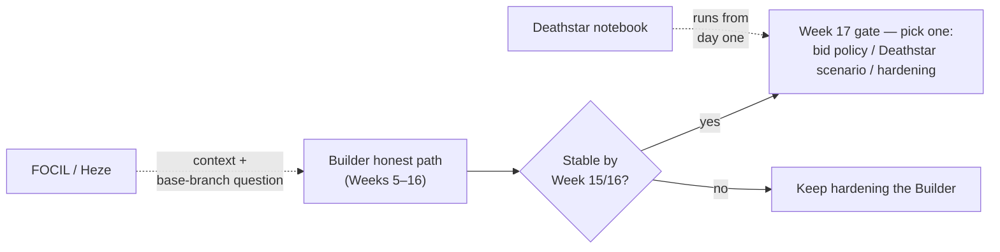
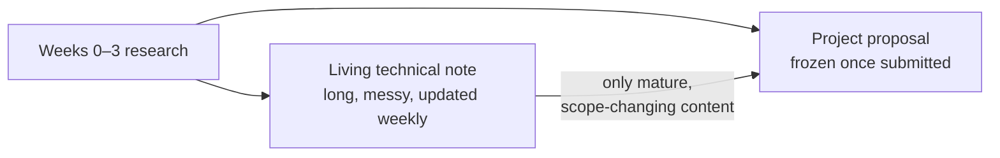
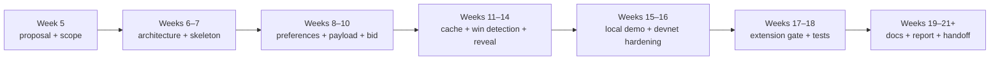
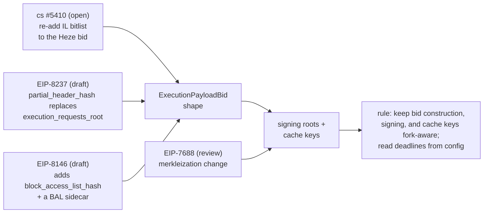

# EPF7 Week 3 Update — Lodestar Builder Proposal and Living Technical Note

This week I focused on writing and consolidating rather than researching. Marko and I finished the first drafts of the project proposal for the Lodestar EIP-7732 Builder and a living technical note that will carry everything the proposal shouldn't. The Week 2 plan (lifecycle note, code-path map, bidding objective, `focil` branch inspection) all happened, but the results now live in those two documents instead of a stack of my loose notes.

## What changed since Week 2

Week 2 ended with this framing:

```text
Primary project:
  Lodestar EIP-7732 Builder

Secondary Lodestar workstream:
  FOCIL implementation, if Marko and I find a clear contribution point

Stretch / testing angle:
  Deathstar-style adversarial scenarios informed by Builder and/or FOCIL failure modes
```

Writing the proposal forced us to commit, and the framing that survived is:

```text
Primary project:
  Lodestar EIP-7732 Builder

Context / possible base-branch question:
  FOCIL — it affects future builder payload construction and lives on a large Lodestar draft branch

Stretch / testing:
  Deathstar builder-specific adversarial cases, implementation only after the honest Builder path works
```

Three things drove the FOCIL demotion. [EIP-7773](https://eips.ethereum.org/EIPS/eip-7773) lists [EIP-7805](https://eips.ethereum.org/EIPS/eip-7805) under Declined for Inclusion, so FOCIL is Hegotá-track work, not Glamsterdam ([headliner proposal](https://ethereum-magicians.org/t/hegota-headliner-proposal-focil-eip-7805/27604)). The [`focil` branch](https://github.com/ChainSafe/lodestar/tree/focil) turned out to be substantially complete when I actually went through it. IL committee duties, gossip validation, the inclusion-list store, the engine methods, and fork-choice enforcement are already mostly present, so there is no net-new FOCIL piece for us to own. And the Heze bid shape is actively churning: [consensus-specs #5410](https://github.com/ethereum/consensus-specs/pull/5410) proposes re-adding the inclusion-list bitlist that [Lodestar #9526](https://github.com/ChainSafe/lodestar/pull/9526) had just removed, which makes it doubtful as a build base. 

We formalised our approach to Deathstar too. We intend to keep an adversarial notebook running in parallel from day one, but implementation will depend on where we are with the builder project by Week 17. If a scenario does get implemented, the leading first candidates are payload withholding and a mismatched envelope. Inspecting the branches also turned up more than I expected: the public [`deathstar` branch](https://github.com/ChainSafe/lodestar/tree/deathstar) already carries an [ePBS chaos catalog](https://github.com/ChainSafe/lodestar/blob/deathstar/EPBS_CHAOS_FEATURES.md) with explicit flag conventions, and two chaos features have already shipped on it, so anything we implement later has conventions to follow rather than invent.



## Why two documents

The proposal has to stay stable and readable once submitted. Everything that will continue changing (spec churn, PR state, mentor answers, design sketches, the adversarial notebook) will go into the living note, and only mature, scope-changing content flows back the other way.



The note is organised into five parts: orientation (how to use it, a recurring sweep checklist, a decision log), a knowledge base that keeps confirmed facts strictly separate from working notes and a watchlist, design (mentor questions, an architecture sketch, the bid → payload cache design, bid-policy notes, the Deathstar notebook, FOCIL context), implementation reference (a Lodestar code-path map, Beacon API notes, candidate work packages), and trackers (PR tables across Lodestar, consensus-specs, and the API repos, plus a resource backlog).

## What the proposal pins down

The proposal follows the EPF template, and within it the scope is the honest builder loop and nothing more:

```text
SignedProposerPreferences
→ local execution payload
→ SignedExecutionPayloadBid
→ bid selected in beacon block
→ cached payload recovered
→ SignedExecutionPayloadEnvelope published
→ PTC can observe payload availability
```

The roadmap runs Weeks 5–21, with the Week 17 gate deciding the single extension:



The success tiers are written so the project counts as finished if the honest loop is implemented and documented, even if Deathstar stays future work.

Some implementation decisions have been deliberately left as mentor questions rather than guessed at. The five that gate Weeks 6–7:

```text
1. Base branch: unstable, glamsterdam-devnet-6, or FOCIL-related?
2. Builder home and API surface, given the staked Builder API (builder-specs #138)
3. Registration: mock active-builder status, or real EIP-8282 deposits from the start?
4. How the proposer's target_gas_limit gets into the local EL per payload
5. Reveal trigger, plus proposer-side bid selection for the demo (beacon-APIs #620)
```

## What writing it surfaced

A few things stood out while putting the two documents together.

### Some subtleties are already handled

[Bid validation](https://github.com/ChainSafe/lodestar/blob/unstable/packages/beacon-node/src/chain/validation/executionPayloadBid.ts) already runs against the bid's parent-branch state advanced to the bid slot, the exact subtlety [consensus-specs #5294](https://github.com/ethereum/consensus-specs/pull/5294) formalises, so builder-side tests should mirror that rather than assume head state. And the [SSE event stream](https://github.com/ChainSafe/lodestar/blob/unstable/packages/api/src/beacon/routes/events.ts) already defines every Gloas-era topic an external process needs, which makes a standalone builder driven purely off events plus the publish endpoints genuinely viable. This sharpened the service-boundary question rather than settling it. [Lodestar v1.44.0](https://github.com/ChainSafe/lodestar/releases), released July 1 against spec [v1.7.0-alpha.11](https://github.com/ethereum/consensus-specs/releases), bundles enough of the recent envelope and fork-choice fixes to be the Week-6 baseline.

Condensed, the map I'm now confident in:

| Piece | Verified state |
|---|---|
| Gloas types, gossip topics, publish endpoints | Present on `unstable` — reuse |
| Bid validation + bid pool | Present; validates against the bid's parent-branch state |
| Envelope validation + self-build reveal | Present — the reveal half already runs for self-build |
| Self-build path | Present (`BUILDER_INDEX_SELF_BUILD`) |
| Engine API payload path | Present (`engine_getPayloadV6`) |
| Bid signing | Confirmed absent — [envelope signer](https://github.com/ChainSafe/lodestar/blob/unstable/packages/validator/src/services/validatorStore.ts) is the model to copy |
| External builder actor | Absent on every branch |
| Bid → payload cache, win detection | Builder-owned — ours to implement |

### The ecosystem is further along than I expected

[buildoor](https://github.com/ethpandaops/buildoor) is a standalone builder+relay with an explicit ePBS mode and a `--lifecycle` flag that handles builder deposits, and in [ethereum-package](https://github.com/ethpandaops/ethereum-package) it now runs as dedicated per-participant builders. [assertoor](https://github.com/ethpandaops/assertoor) ships an entire [`gloas-dev` builder playbook suite](https://github.com/ethpandaops/assertoor/tree/master/playbooks/gloas-dev) (lifecycle, EIP-8282 deposits with the raw calldata format and a concrete devnet deposit contract, exits, pre-fork onboarding). This is essentially a ready-made registration harness for Week 8. A [staked Builder API for Glamsterdam](https://github.com/ethereum/builder-specs/pull/138) was also merged in June. [glamsterdam-devnet-6](https://dora.glamsterdam-devnet-6.ethpandaops.io/) has been live since June 25 with no devnet-7 published yet, and the [Soldøgn interop recap](https://blog.ethereum.org/2026/05/02/soldogn-interop-recap) confirms the external-builders pipeline was exercised end to end as early as devnet-2. buildoor doubles as our reference implementation, interop peer, and — on a devnet — a real competing bidder.

### The churn is measurable

Roughly fifteen builder-adjacent spec changes landed in June alone, including the forced reorg of late payloads ([consensus-specs #5210](https://github.com/ethereum/consensus-specs/pull/5210)): a late reveal now invites a reorg, not just a PTC no-vote. On top of that there are three live bid-shape churn vectors, a merkleization change that would shift every signing root, and a proposed (unmerged) retune of the payload deadline from 75% to 50% of the slot.



The practical consequences are already written into both documents as defaults: bid construction, signing, and cache-key derivation stay fork-aware ([EIP-8237](https://eips.ethereum.org/EIPS/eip-8237), [EIP-8146](https://eips.ethereum.org/EIPS/eip-8146), [EIP-7688](https://eips.ethereum.org/EIPS/eip-7688)), and slot deadlines get read from config, never hardcoded.

## The bidding problem

I outlined this part of the project in the note's bid-policy section. The structure is a first-price auction, and "what to bid" decomposes into two things a builder can't directly observe: the value of their own block, and the distribution of competing bids for the slot. Further, two ePBS-specific cost terms belong in any objective: the [free option](https://collective.flashbots.net/t/the-free-option-problem-in-epbs/5115) between commitment and reveal, whose penalty side #5210 just raised, and the fact that an accepted bid pays out whether or not the block ends up canonical. The part I like is that the empirical input comes nearly free. The `execution_payload_bid` event stream is a live feed of competing bids once the honest builder runs, and buildoor is a real bidder to shade against on a devnet. It's also the part of the project I could most easily over-invest in too early, which is exactly why the proposal commits to nothing fancier than fixed-value or fixed-shade for the honest path, with anything smarter waiting behind the Week 17 gate.

## What I did this week

- Drafted the full project proposal with Marko: scope, roadmap, success tiers, challenges, and the collaboration model.
- Built the living technical note: five parts, a recurring sweep checklist, a decision log, mentor questions, the cache design, bid-policy notes, the Deathstar notebook, and PR trackers.
- Re-verified everything going into both documents against the live repositories, and dropped what didn't check out.
- Confirmed the builder gap precisely: no bid signer anywhere in Lodestar, the [`TODO GLOAS` seam](https://github.com/ChainSafe/lodestar/blob/unstable/packages/beacon-node/src/chain/produceBlock/produceBlockBody.ts), no external-builder actor on any branch.
- Mapped the tooling around the project: buildoor, the assertoor `gloas-dev` playbooks, builder-specs #138, glamsterdam-devnet-6.
- Settled the FOCIL stance (context, not a deliverable) and the Deathstar stance (notebook-first, gated at Week 17).
- Broke the implementation into candidate PR-sized work packages, each with one owner and one reviewer, with ownership rotating between us.
- Logged Lodestar's [contribution requirements](https://github.com/ChainSafe/lodestar/blob/unstable/CONTRIBUTING.md), including its AI-assistance disclosure policy for PRs, in the note's process section ahead of any implementation work.

## Plan for next week

1. Run the sweep checklist one last time before submission: any spec tag past v1.7.0-alpha.11, the builder-prefix PR ([cs #5416](https://github.com/ethereum/consensus-specs/pull/5416), `0x03` → `0xB0`), the Heze bitlist question, the deadline retune, any Lodestar release past v1.44.0.
2. Publish both documents to HackMD and open the proposal PR against cohort-seven for the Week 5 checkpoint.
3. Start the weekly implementation log and get the first Deathstar notebook rows into proper shape.
4. Prep first mentor contact around the five gating questions, plus the loose ends to pin: the `targetGasLimit` execution-apis PR, the ACDC agenda items, Ethrex devnet alignment.
5. Get a head start on the Week 6 architecture note by re-reading the seams the devnet-6 branch ([#9538](https://github.com/ChainSafe/lodestar/pull/9538)) and the BeaconEngine refactor ([#9550](https://github.com/ChainSafe/lodestar/pull/9550)) touch, and start shortlisting the first PR-sized work package.

## Useful links

### EPF
- [EPF7 repository](https://github.com/eth-protocol-fellows/cohort-seven) · [Builder project idea](https://github.com/eth-protocol-fellows/cohort-seven/blob/master/projects/project-ideas.md#lodestar-eip-7732-builder) · [Deathstar project idea](https://github.com/eth-protocol-fellows/cohort-seven/blob/master/projects/project-ideas.md#lodestar-adversarial-node) · [development updates](https://github.com/eth-protocol-fellows/cohort-seven/blob/master/development-updates.md)

### Specs, EIPs & APIs
- [EIP-7732](https://eips.ethereum.org/EIPS/eip-7732) · Gloas [builder](https://github.com/ethereum/consensus-specs/blob/dev/specs/gloas/builder.md) and [p2p](https://github.com/ethereum/consensus-specs/blob/dev/specs/gloas/p2p-interface.md) specs · [EIP-7773](https://eips.ethereum.org/EIPS/eip-7773) · [EIP-8282](https://eips.ethereum.org/EIPS/eip-8282) · [EIP-7805 / FOCIL](https://eips.ethereum.org/EIPS/eip-7805) · [Hegotá headliner proposal](https://ethereum-magicians.org/t/hegota-headliner-proposal-focil-eip-7805/27604)
- Bid-shape churn: [cs #5410](https://github.com/ethereum/consensus-specs/pull/5410) · [EIP-8237](https://eips.ethereum.org/EIPS/eip-8237) · [EIP-8146](https://eips.ethereum.org/EIPS/eip-8146) · [EIP-7688](https://eips.ethereum.org/EIPS/eip-7688)
- [builder-specs #138 — staked Builder API](https://github.com/ethereum/builder-specs/pull/138) · [beacon-APIs #620 — bid selection](https://github.com/ethereum/beacon-APIs/issues/620) · [cs #5210 — forced reorg of late payloads](https://github.com/ethereum/consensus-specs/pull/5210) · [cs #5416 — builder prefix](https://github.com/ethereum/consensus-specs/pull/5416)

### Lodestar
- [Repo](https://github.com/ChainSafe/lodestar) · [releases](https://github.com/ChainSafe/lodestar/releases) · [CONTRIBUTING](https://github.com/ChainSafe/lodestar/blob/unstable/CONTRIBUTING.md)
- [`produceBlockBody.ts`](https://github.com/ChainSafe/lodestar/blob/unstable/packages/beacon-node/src/chain/produceBlock/produceBlockBody.ts) · [`validatorStore.ts`](https://github.com/ChainSafe/lodestar/blob/unstable/packages/validator/src/services/validatorStore.ts) · [`executionPayloadBid.ts`](https://github.com/ChainSafe/lodestar/blob/unstable/packages/beacon-node/src/chain/validation/executionPayloadBid.ts) · [events API](https://github.com/ChainSafe/lodestar/blob/unstable/packages/api/src/beacon/routes/events.ts)
- [`focil` branch](https://github.com/ChainSafe/lodestar/tree/focil) · [`deathstar` branch](https://github.com/ChainSafe/lodestar/tree/deathstar) · [Deathstar chaos catalog](https://github.com/ChainSafe/lodestar/blob/deathstar/EPBS_CHAOS_FEATURES.md)

### Devnet & builder tooling
- [buildoor](https://github.com/ethpandaops/buildoor) · [ethereum-package](https://github.com/ethpandaops/ethereum-package) · [assertoor](https://github.com/ethpandaops/assertoor) / [`gloas-dev` playbooks](https://github.com/ethpandaops/assertoor/tree/master/playbooks/gloas-dev) · [glamsterdam-devnets](https://github.com/ethpandaops/glamsterdam-devnets) · [devnet-6 explorer](https://dora.glamsterdam-devnet-6.ethpandaops.io/) · [Soldøgn interop recap](https://blog.ethereum.org/2026/05/02/soldogn-interop-recap)

### ePBS economics
- [Free Option Problem I](https://collective.flashbots.net/t/the-free-option-problem-in-epbs/5115) / [II](https://collective.flashbots.net/t/the-free-option-problem-in-epbs-part-ii/5145) · [Mazorra et al.](https://arxiv.org/abs/2509.24849) · [Block vs. Slot Auction PBS](https://mirror.xyz/julianma.eth/CPYI91s98cp9zKFkanKs_qotYzw09kWvouaAa9GXBrQ) · [Who Wins Ethereum Block Building Auctions and Why?](https://drops.dagstuhl.de/entities/document/10.4230/LIPIcs.AFT.2024.22) · [Builder bidding behaviors in ePBS](https://ethresear.ch/t/builder-bidding-behaviors-in-epbs/20129) · [Builder reveal timing game](https://ethresear.ch/t/builder-reveal-timing-game-in-epbs/19424)