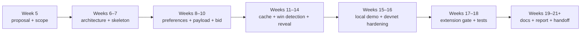

# EPF7 Week 4 Update — Refining the Lodestar Builder Proposal

This week was mainly about getting our Lodestar Builder proposal through review and merged.

Marko and I opened it as [PR #161](https://github.com/eth-protocol-fellows/cohort-seven/pull/161) in the EPF7 repo, worked through [Mario](https://github.com/taxmeifyoucan)'s review, and revised the proposal until it was approved. It has now been merged. Alongside that, we continued refining the living technical note and created the first version of the presentation that will accompany the proposal.

There was less new technical exploration than in the previous weeks. The work was instead about deciding what belongs in the proposal, what belongs in the living note, and what needs to be communicated in the presentation.

## Outputs this week

| Output | Status |
|---|---|
| Joint Lodestar EIP-7732 Builder proposal | Opened as PR #161, revised through review, and merged |
| Proposal review feedback | Substantive comments addressed |
| Living technical note | Updated alongside the proposal |
| Proposal presentation | First slide deck created |
| Project roadmap | Condensed into broader implementation phases |
| Scope and success criteria | Refined around Builder, Heze / FOCIL, and Deathstar |

## Refining the proposal

The first proposal draft was deliberately detailed. I wanted it to demonstrate that we had looked at the current Lodestar implementation, the Gloas specifications, the surrounding APIs, and the practical builder lifecycle rather than proposing something vague.

Mario's review was positive on the substance, with one consistent criticism. The document was too long and sometimes repeated the same point in different sections. The proposal needed to remain technically useful while becoming easier for someone with Eth context to read in one sitting.

That led to several changes.

| Feedback | Change |
|---|---|
| The introduction repeated the project scope several times | Shortened the opening and moved the scope summary further into the proposal |
| The roadmap was too dense week by week | Grouped it into broader implementation phases |
| The evolving-specs challenge listed too many individual changes | Reduced it to the core point that the implementation must remain modular as the specs evolve |
| Some open questions appeared to depend entirely on mentor input | Reframed them as implementation decisions to investigate, propose solutions for, and align on with the Lodestar team |
| FOCIL and Deathstar were not clearly ranked | Moved Heze / FOCIL adaptation into strong-success territory and kept Deathstar as a genuine stretch goal |
| "Simple bid" was vague | Replaced it with a baseline bid policy, such as a fixed value or fixed shade |
| The proposer-preference flow was unclear | Clarified that preferences come from the proposer/validator side and are consumed by the builder before it bids |

The [merged proposal](https://github.com/eth-protocol-fellows/cohort-seven/blob/master/projects/lodestar-eip-7732-builder.md) is now the stable public description of the project, and the living-note and presentation links will be added to it once each is public.

## The current project framing

The final scope is now roughly:

```text
Core project:
  Implement the honest Lodestar Builder lifecycle for EIP-7732 / Gloas.

First success target:
  Complete a local bid → selection → reveal loop.

Strong-success extension:
  Prepare or adapt the Builder for Heze / FOCIL if the relevant
  Lodestar work has merged or stabilised.

Stretch work:
  Improve the bid policy and/or implement one builder-specific
  Deathstar scenario if the Builder is already stable.
```

Builder remains the clear priority.

FOCIL is relevant because it will eventually affect how builders construct payloads — and potentially how bids are represented — but it is not a separate implementation project for us. If the FOCIL work merges into `unstable` and the core Builder is sufficiently mature, adapting the Builder for Heze is a realistic extension.

Deathstar remains further out. We will continue recording adversarial cases, but implementing them should not take time away from the honest Builder path.

## Clarifying the lifecycle and the cache path

Two technical sections took the most rewriting, and in both the substance stayed put while the explanation improved.

The proposer-preference flow now states its provenance plainly. Preferences are produced by the proposer/validator side and specify values the builder must respect, including the proposer's `fee_recipient` and `target_gas_limit`. The builder consumes them through gossip, an event stream, or Lodestar's internal pool, matches them by `proposal_slot` and `dependent_root`, and skips the slot if none match. One plumbing question remains. A static execution-client gas-limit setting cannot follow preferences that vary from proposer to proposer, so how the per-payload `target_gas_limit` reaches the local execution client is left as an implementation question to resolve once the code is in front of us.

The cache section now leads with the point that matters. The bid → payload cache is a safety boundary, not an optimisation. A builder should only publish a bid if it can later recover the exact payload package that bid commits to, and a missing, expired, or partially matching entry fails closed rather than revealing a guessed payload.

Winning-bid detection connects the cache to the reveal path:

```text
observe imported or gossiped beacon blocks
→ inspect the selected SignedExecutionPayloadBid
→ match it against the local cache
→ load the committed payload package
→ construct and sign the matching envelope
→ reveal only on a complete match
```

The reveal trigger — first sight of a valid block, wait for block import, or configurable for devnet testing — remains an open decision, recorded in the living note to settle during implementation and Lodestar team discussions.

## Updating the roadmap

The original roadmap described almost every week individually. It was useful as a planning exercise, but it made the proposal look more certain than the work really is.

The revised roadmap groups the project into broader phases:



The phases still give us clear milestones, but they also leave room for specification changes, review delays, and implementation details that take longer than expected.

This feels more realistic than assigning every feature to one exact fellowship week.

## Updating the success criteria

The success tiers also changed slightly.

**Minimum success** remains the honest Builder path, covering architecture, configuration, proposer preferences, local payload production, bid construction and signing, publication, caching, win detection, envelope reveal, and tests.

**Strong success** now includes:

- a reproducible end-to-end demo;
- a real local execution client;
- a configurable bid policy;
- useful metrics and logs;
- implementation PRs merged or under review;
- a Heze / FOCIL adaptation pass if the relevant work has stabilised;
- a final write-up of what existed, what changed, and what remains.

**Stretch success** includes:

- a more sophisticated bid policy;
- one or two builder-specific Deathstar scenarios;
- deeper analysis of builder bidding and ePBS incentives.

This ordering feels more accurate. Heze adaptation is closely related to the Builder implementation, whereas Deathstar requires us to first have stable builder behaviour to attack.

## Updating the living technical note

The proposal became shorter, but the removed details were not discarded. Most now live in the living technical note, which continues to track the Gloas and Lodestar baselines, the missing external-builder path, service-boundary options, EIP-8282 registration, proposer-preference and execution-client plumbing, the cache and reveal-trigger design, current Beacon API and Builder API work, buildoor and assertoor as devnet references, Heze / FOCIL churn, the Deathstar cases, and the PR trackers and sweep checklist behind all of it.

The note's most useful property is still that it separates confirmed facts from open assumptions. On the confirmed side, Lodestar already has Gloas types, gossip topics, bid validation, bid-pool logic, envelope validation, a self-build reveal path, and an Engine API payload path. The missing pieces are the external builder itself, bid signing, the Builder-owned cache, and winning-bid detection. That is a much more useful starting point than treating the Builder as a completely greenfield implementation.

### Putting a few findings on the public record

These weekly updates double as the public record of the project, and the living note itself only goes public next week, so a few clusters from its tracking are worth pulling out here before then. All of them shape the Week 6–8 implementation work.

- **The execution-layer boundary changes shape after Gloas.** `engine_forkchoiceUpdated` now reports the bid's `parent_block_hash` as safe and finalised, because the safe or finalised block's own payload may not yet be confirmed canonical ([#9393](https://github.com/ChainSafe/lodestar/pull/9393)); an execution client returning `INVALID` once wedged a devnet node, since the pre-Gloas safety net is bypassed with payload verification deferred to `importExecutionPayload` ([#9332](https://github.com/ChainSafe/lodestar/pull/9332)); and the native state-transition mode throws on Gloas, so it stays disabled during Builder work ([#9516](https://github.com/ChainSafe/lodestar/pull/9516)). The common thread is that failures at this seam can masquerade as Builder bugs even when the Builder logic is correct, so the first local setup needs a clean separation between Builder errors and execution-client integration errors.
- **Demo observability has known traps.** Post-Gloas ordering publishes the block first and the envelope and data columns after, so peers can gossip columns back before the local node publishes its own — "published to zero peers" warnings can be false alarms unless column sources are distinguished ([#9580](https://github.com/ChainSafe/lodestar/pull/9580)). The clean signal for whether a revealed payload actually became available is the `payload_status` on `head_v2` events ([beacon-APIs #590](https://github.com/ethereum/beacon-APIs/pull/590), server side in [#9486](https://github.com/ChainSafe/lodestar/pull/9486)).
- **EIP-8282 onboarding has sharp edges.** The builder withdrawal prefix is still `0x03`, with an open spec change proposing `0xB0` ([cs #5416](https://github.com/ethereum/consensus-specs/pull/5416)) that would break stored credentials and onboarding scripts if it merges; and a top-up to an exited builder resets its `withdrawable_epoch` without reactivating it — a devnet footgun. Both feed the open decision of whether the first local demo should mock an already-active builder or exercise the full deposit and activation path — a choice that affects how quickly we reach the bid → selection → reveal loop and how reproducible the first devnet setup is.
- **Two ready-made test cases.** The bid production path must respect `shouldBuildOnFull` and the EMPTY reorg — [#9442](https://github.com/ChainSafe/lodestar/pull/9442) fixed a regression exactly there — and proposer preferences have a fork-boundary edge where the first Gloas slots can lack usable preferences unless they are broadcast before the fork ([#9571](https://github.com/ChainSafe/lodestar/pull/9571)). Both belong in the integration tests once the Builder skeleton exists.

None of these change the project scope. They are constraints the first architecture and implementation work should respect.

## Creating the presentation

Marko and I also created the first proposal presentation this week.

Its purpose is to succinctly explain the project:

```text
Why relay-based proposer-builder separation is limited
→ what EIP-7732 changes
→ what Lodestar already implements
→ which Builder piece is missing
→ how the bid → selection → reveal lifecycle works
→ what we plan to build
→ how we define success
```

Creating the presentation was useful because it forced another level of prioritisation. A detailed paragraph can hide an unclear argument; a slide generally cannot.

The slide deck should make the core idea understandable before moving into the implementation details.

> Lodestar already understands bids and payload envelopes. The project is to make Lodestar actively behave as the builder that creates, tracks, and fulfils those commitments.

We are still polishing the presentation and will add its final public link once it is ready.

## What I did this week

- Opened the joint [proposal PR #161](https://github.com/eth-protocol-fellows/cohort-seven/pull/161) with Marko, adding the proposal under `projects/`, listing it in the projects readme, and linking it from both our Phase 2 rows.
- Worked through Mario's review and landed the revisions, including a shorter introduction with the scope summary relocated, a phased roadmap, a condensed evolving-specs challenge, and open questions reframed as implementation discussions with the Lodestar team.
- Sharpened the technical narrative by clarifying where proposer preferences come from and how they are matched, tightening the cache and winning-bid detection explanation, and replacing "simple bid" with a baseline bid policy.
- Re-ranked the extensions, moving Heze / FOCIL adaptation into the strong-success tier while Deathstar and advanced bid policy stay as stretch work.
- Moved the trimmed proposal detail into the living technical note and kept the two documents in step.
- Created the first version of the proposal presentation with Marko.
- Took the PR from draft through review to approval and merge.

## What I learned this week

The main lesson was that writing a good proposal is partly about deciding what not to include.

The first draft proved that the technical research existed. The review process made the document better by forcing the public proposal to contain only the decisions and technical detail needed to understand the project. The other details still matter, but they have a better home in the living technical note.

I also have a clearer view of the remaining uncertainty. The project scope is no longer the uncertain part; the open questions are mostly implementation choices:

- where the Builder should live;
- which Lodestar branch to begin from;
- how keys and builder registration should work;
- which execution client to target first;
- how proposer gas-limit preferences reach the execution client;
- when the Builder should trigger reveal;
- how much data the first end-to-end demo should include.

The review also sharpened how these get resolved. "Pending mentor input" made the plan sound as though implementation could not move without someone choosing for us. The actual process is:

```text
open implementation detail
→ investigate the current code and specifications
→ discuss the trade-offs with the Lodestar team
→ propose an approach
→ get sign-off before committing to it
```

Those are the questions to work through while moving into implementation.

## Plan for next week

1. Publish the living technical note to HackMD and add its link to the merged proposal, with the presentation link to follow once the deck is public.
2. Finish polishing the presentation, and confirm the Week 5 presentation format and mentor-contact timing with Mario.
3. Once timing is confirmed, open the conversation with Nico around the five gating questions — base branch; builder home and API surface given [builder-specs #138](https://github.com/ethereum/builder-specs/pull/138); mock versus real EIP-8282 registration given the [cs #5416](https://github.com/ethereum/consensus-specs/pull/5416) prefix churn; `target_gas_limit` → execution-client plumbing; and the reveal trigger plus proposer-side bid selection given [beacon-APIs #620](https://github.com/ethereum/beacon-APIs/issues/620).
4. Run the sweep checklist before the Week 5 milestone and update the Doc status table, checking for any spec tag past v1.7.0-alpha.11, the status of [cs #5416](https://github.com/ethereum/consensus-specs/pull/5416), the Heze bitlist question, the payload-deadline retune and devnet-7, and any Lodestar release past v1.44.0.
5. Start the weekly implementation log and formalise the first Deathstar notebook rows, carried over from last week's plan.
6. Begin the architecture and code-path reconciliation with Marko by re-reading the seams touched by the devnet-6 branch ([#9538](https://github.com/ChainSafe/lodestar/pull/9538)) and the BeaconEngine refactor ([#9550](https://github.com/ChainSafe/lodestar/pull/9550)), aligning on the initial service boundary, and shortlisting the first small, reviewable Builder PR.

With the proposal merged, the main goal is to finish the Week 5 checkpoint items and enter Week 6 with a clear first implementation task.

## Useful links

### Project

- [Merged proposal](https://github.com/eth-protocol-fellows/cohort-seven/blob/master/projects/lodestar-eip-7732-builder.md) · [proposal PR #161](https://github.com/eth-protocol-fellows/cohort-seven/pull/161)
- [EPF7 repository](https://github.com/eth-protocol-fellows/cohort-seven) · [development updates](https://github.com/eth-protocol-fellows/cohort-seven/blob/master/development-updates.md) · [Builder project idea](https://github.com/eth-protocol-fellows/cohort-seven/blob/master/projects/project-ideas.md#lodestar-eip-7732-builder) · [Deathstar project idea](https://github.com/eth-protocol-fellows/cohort-seven/blob/master/projects/project-ideas.md#lodestar-adversarial-node)
- [Lodestar repository](https://github.com/ChainSafe/lodestar)

### Referenced this week

- Execution-layer boundary: [#9393](https://github.com/ChainSafe/lodestar/pull/9393) · [#9332](https://github.com/ChainSafe/lodestar/pull/9332) · [#9516](https://github.com/ChainSafe/lodestar/pull/9516)
- Observability: [#9580](https://github.com/ChainSafe/lodestar/pull/9580) · [beacon-APIs #590](https://github.com/ethereum/beacon-APIs/pull/590) · [#9486](https://github.com/ChainSafe/lodestar/pull/9486)
- Test cases: [#9442](https://github.com/ChainSafe/lodestar/pull/9442) · [#9571](https://github.com/ChainSafe/lodestar/pull/9571)
- Registration: [EIP-8282](https://eips.ethereum.org/EIPS/eip-8282) · [cs #5416](https://github.com/ethereum/consensus-specs/pull/5416)
- The five gating questions: [builder-specs #138](https://github.com/ethereum/builder-specs/pull/138) · [beacon-APIs #620](https://github.com/ethereum/beacon-APIs/issues/620)
- Week 6 head start: [#9538 — glamsterdam-devnet-6](https://github.com/ChainSafe/lodestar/pull/9538) · [#9550 — BeaconEngine refactor](https://github.com/ChainSafe/lodestar/pull/9550)

### Standing references

- [EIP-7732](https://eips.ethereum.org/EIPS/eip-7732) · Gloas [builder](https://github.com/ethereum/consensus-specs/blob/master/specs/gloas/builder.md) and [p2p](https://github.com/ethereum/consensus-specs/blob/master/specs/gloas/p2p-interface.md) specs · [EIP-7773](https://eips.ethereum.org/EIPS/eip-7773) · [EIP-7805 / FOCIL](https://eips.ethereum.org/EIPS/eip-7805)
- [buildoor](https://github.com/ethpandaops/buildoor) · [assertoor `gloas-dev` playbooks](https://github.com/ethpandaops/assertoor/tree/master/playbooks/gloas-dev) · [glamsterdam-devnets](https://github.com/ethpandaops/glamsterdam-devnets) · [devnet-6 explorer](https://dora.glamsterdam-devnet-6.ethpandaops.io/) · [Deathstar chaos catalogue](https://github.com/ChainSafe/lodestar/blob/deathstar/EPBS_CHAOS_FEATURES.md)