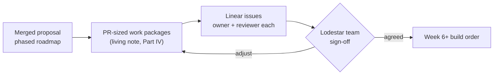

# EPF7 Week 5 Update — From Proposal to Implementation Planning

Week 5 was the transition from defining the Lodestar Builder project to preparing to implement it.

Marko and I closed out the proposal checkpoint by delivering the [project presentation](https://docs.google.com/presentation/d/1cmC3fpu652gZFTIm2_P1lIYOfC2M_w3c5qXSUZ4B6lc) around the merged [Lodestar EIP-7732 Builder proposal](https://github.com/eth-protocol-fellows/cohort-seven/blob/master/projects/lodestar-eip-7732-builder.md). The last proposal follow-ups landed too. Nico's review prompted a small amendment to the strong-success list, which Marko carried in [PR #186](https://github.com/eth-protocol-fellows/cohort-seven/pull/186), and the [living technical note](https://hackmd.io/@krisos/S1a9mdB7fl) is now public on HackMD. From there the project tipped into its operational phase. We are in the process of setting up the project scaffolding at the moment i.e. Linear project boards, the Slack and GitHub integrations, our development workflow, a fork of the Lodestar repository, and a proper pass through the contribution guidelines. However, most of the core substance of the planning still lies ahead. Decomposing the remaining sixteen weeks into a dependency-aware issue backlog, and agreeing on that backlog with the Lodestar team, will take up the bulk of the work for the next one to two weeks.

## Delivering the proposal presentation

The presentation was the final part of the proposal checkpoint. Its purpose was not to repeat the proposal or the living note, but to make the central idea understandable quickly:

> Lodestar already understands Gloas bids and payload envelopes. Our project is to make Lodestar actively behave as the external builder that creates, tracks, and fulfils those commitments.

The deck covered the current relay-based PBS model, what EIP-7732 changes, which Gloas components Lodestar already implements, the missing external Builder, the bid → selection → reveal lifecycle, and our definition of success.

## What the weekly sweep turned up

I ran the sweep ahead of the checkpoint and it was the busiest one yet. Four things moved that directly reshape what we are planning against.

- **Lodestar cut its first packaged Gloas release candidate.** [`v1.45.0-rc.0`](https://github.com/ChainSafe/lodestar/releases/tag/v1.45.0-rc.0) went out on July 17 at commit `668ea9d`, carrying a large Gloas tranche: the block-production circuit breaker ([#9598](https://github.com/ChainSafe/lodestar/pull/9598)), Builder-adjacent endpoints and events such as [`getStateBuilders`](https://github.com/ChainSafe/lodestar/pull/9593) and the [`payload_attestation_message` stream](https://github.com/ChainSafe/lodestar/pull/9636), tightened bid and PTC validation ([#9627](https://github.com/ChainSafe/lodestar/pull/9627), [#9624](https://github.com/ChainSafe/lodestar/pull/9624), [#9588](https://github.com/ChainSafe/lodestar/pull/9588)), the fork-choice and parent-strength work, and envelope cache and import fixes. [`v1.44.0`](https://github.com/ChainSafe/lodestar/releases/tag/v1.44.0) remains the stable baseline, and the RC is not yet proof of alpha.12 alignment — [#9665](https://github.com/ChainSafe/lodestar/pull/9665) still carries skipped Gloas and fork-choice test failures — but the base question has changed shape.
- **The envelope submission contract settled.** [beacon-APIs #624](https://github.com/ethereum/beacon-APIs/pull/624) merged. The final model is one signed envelope with two request shapes selected by the `Eth-Blob-Data-Included` header: stateful callers send `SignedExecutionPayloadEnvelope`, stateless callers send `SignedExecutionPayloadEnvelopeContents` with the blobs and KZG proofs included, and `consensus_and_equivocation` is the publication validation to target. Lodestar's side is in progress in [#9595](https://github.com/ChainSafe/lodestar/pull/9595) with the equivocation check still open, so this is a target contract rather than released behaviour, but it is enough to shape the reveal-path work — and both request shapes now need their own tests.
- **The service-boundary question has an anchor.** A draft Gloas Builder API PR ([#9594](https://github.com/ChainSafe/lodestar/pull/9594)) is open in Lodestar, and it looks like the natural attachment point for the Builder service. It does not by itself decide whether the Builder runs as a CLI, a beacon-node service, or a standalone process, but it changes the order of operations: the first step is reviewing that draft and landing our plan inside the surface ChainSafe is already sketching, not beside it.
- **One open question closed and another sharpened.** [#9622](https://github.com/ChainSafe/lodestar/pull/9622), the generic `chain.targetGasLimit` path, was closed as a design decision, so per-payload gas-limit plumbing needs its own answer rather than piggybacking on a node-level setting. And [issue #9660](https://github.com/ChainSafe/lodestar/issues/9660) with its fix in [#9661](https://github.com/ChainSafe/lodestar/pull/9661) showed that an unverified invalid envelope could persist as a cache hit and stall sync — the strongest support yet for treating the bid → payload cache as a fail-closed safety boundary, and a concrete new requirement for its design, covered below.

## The planning work ahead

After the presentation, the focus shifted to turning the proposal into a plan that can survive contact with the codebase and with the Lodestar team's review process. That work has only just started. Over the next one to two weeks Marko and I will be working through it with the Lodestar team, beginning with the implementation questions that matter first:

- the exact Lodestar base commit or branch;
- where the Builder should live;
- which existing APIs and internal services it should reuse;
- whether the first demo should mock an active Builder or exercise the full EIP-8282 lifecycle;
- which execution client to target first;
- how proposer `target_gas_limit` reaches the EL per payload;
- when a selected bid should trigger reveal;
- what the smallest independently reviewable first PR should be.

Our current process is:

```text
inspect current code and specifications
→ write down the viable options and trade-offs
→ propose an implementation direction
→ get sign-off from the Lodestar team
→ turn the agreed direction into issues and code
```

That is the loop we are now entering.

## Setting up the working environment

A good part of the week was operational. We set up the Linear project boards that will carry the Builder work, connected them to Slack and GitHub so that issues, pull requests, and reviews surface in one place, prepared our development workflow, forked the Lodestar repository, and went back through Lodestar's [contribution guidelines](https://github.com/ChainSafe/lodestar/blob/unstable/CONTRIBUTING.md).

## From roadmap to issue backlog

The project scope has not changed. The core deliverable is still the honest Gloas Builder loop:

```text
proposer preferences
→ local execution payload
→ signed bid
→ bid selected in a beacon block
→ exact cached payload recovered
→ matching payload envelope revealed
→ payload becomes available / FULL
```

What changed is that each arrow now needs an owner, an interface, a failure contract, tests, and a place in the implementation order. The proposal's broad phases are not enough to implement from, and translating them into individual issues is exactly what the planning work described above is for.



The decomposition we are proposing organises the backlog around dependencies rather than pretending every item can begin immediately:

| Planning group | Main questions / work |
|---|---|
| Base and architecture | Pin the implementation commit; choose standalone process, beacon-node service, validator-adjacent service, or temporary internal prototype; define narrow interfaces and failure behaviour |
| Builder skeleton | Configuration, builder key handling, signer boundary, process lifecycle, logging, API/event connectivity |
| Preferences and payload | Consume proposer preferences, match slot and dependent root, select the first EL, construct payload attributes, resolve per-payload gas-limit plumbing |
| Bid construction | Fork-aware bid type, builder signature, baseline bid policy, persistence-before-publication rule, gossip/API publication |
| Cache and win detection | Exact bid → payload identity, verification states, eviction, restart behaviour, selected-bid observation, reorg/orphan handling |
| Reveal | Envelope construction/signing, stateful and stateless publication shapes, blobs/KZG material, retry/idempotency policy, reveal trigger |
| Testing and observability | Unit and integration tests, FULL/EMPTY outcome, timing metrics, circuit-breaker behaviour, invalid-cache cases, mixed-client assumptions |
| Demo and extensions | Reproducible local loop, possible buildoor competition, devnet readiness, then one gated FOCIL / Deathstar / bid-policy / UI extension if the core is stable |
| Handoff | Documentation, runbook, open issues, final report, presentation, and maintainer handoff |

The value of doing this properly is not that the plan will remain unchanged for sixteen weeks, it almost certainly will not. The value is that once the backlog exists, scope changes can be expressed as issue and dependency changes rather than quietly expanding the project. The board will also keep different kinds of work distinct. "Choose the Builder service boundary" is a decision issue, "add bid signing" is an implementation issue, and "test cache recovery after restart" is a verification issue. Keeping those separate should make review and progress easier to follow.

## The cache is becoming a state machine, not a map

One thing this week sharpened for the planning process ahead is that the bid → payload cache needs to be treated as a lifecycle state machine.

The proposal already described the cache as a safety boundary: publish a bid only if the exact committed payload package can later be recovered, and fail closed on a missing or mismatched entry. The newer Lodestar cache work shows what that means in practice. A cache entry cannot simply mean "we have something for this block hash." The Builder needs to know whether the material was:

```text
received
→ reconstructed
→ verified
→ imported
→ selected / won
→ revealed
```

It also needs distinct failure states:

```text
transient EL or network failure
≠ definitive invalidity
≠ expired / evicted
≠ commitment mismatch
```

That distinction will shape the issue breakdown for persistence, retries, eviction, restart recovery, duplicate receipt, and reveal idempotency. It is also a good example of why the planning phase deserves real time. "Implement the cache" is too large and too ambiguous to be one issue.

## What I did this week

- Delivered the Week 5 proposal presentation with Marko and closed out the proposal checkpoint, after a final tightening pass on the deck driven by writing full speaker notes.
- Closed the proposal follow-ups: the strong-success amendment from Nico's review landed via Marko's [PR #186](https://github.com/eth-protocol-fellows/cohort-seven/pull/186), and the living technical note went public on [HackMD](https://hackmd.io/@krisos/S1a9mdB7fl).
- Began the move into the operational phase: set up the Linear project boards, the Slack and GitHub integrations, our development workflow, and the Lodestar fork, and worked through the contribution requirements.
- Sketched the dependency-aware planning groups the issue backlog will be built from, keeping decision, implementation, and verification issues distinct.
- Ran the weekly sweep and reconciled the living note with `v1.45.0-rc.0`, the merged envelope contract, the draft Builder API, and the sharper invalid-cache cases.

## What I learned this week

The main lesson was that a project roadmap and an implementation plan are different things. The proposal can say "Weeks 11–14: cache, win detection, and reveal." The implementation plan has to answer which identity keys the cache uses, what is persisted before publication, which states are terminal, how restart recovery works, which event proves a win, what triggers reveal, what is retried, and which tests make the path safe to review. That gap is why the translation into issues is worth the next one to two weeks rather than an afternoon.

## Plan for the next one to two weeks

1. Work through the planning loop with Marko and the Lodestar team: take the implementation questions above into those conversations, propose directions, and get sign-off, with the aim of an approved plan and the initial issues on the board — with owners and reviewers — by the end of it.
2. Pin the first implementation base as part of that: evaluate `v1.45.0-rc.0` / `668ea9d` against the relevant reviewed branch state, including [#9665](https://github.com/ChainSafe/lodestar/pull/9665), and record exactly what the Builder branch will be based on.
3. Draft the first architecture proposal — a recommended Builder service boundary, the interfaces it owns, the APIs and internal services it consumes, and the failure and retry contract — informed by a proper review of the draft Builder API ([#9594](https://github.com/ChainSafe/lodestar/pull/9594)), and shortlist the smallest independently useful first implementation slice to propose alongside it.
4. Build and test the fork locally, running the setup, test, lint, and contribution checks before adding any Builder code so that baseline failures stay separate from project failures.
5. Keep the standing tracks moving — the weekly implementation log, the Deathstar notebook rows, and the sweep before the next update — and keep [#9594](https://github.com/ChainSafe/lodestar/pull/9594), [#9595](https://github.com/ChainSafe/lodestar/pull/9595), [#9661](https://github.com/ChainSafe/lodestar/pull/9661), [#9665](https://github.com/ChainSafe/lodestar/pull/9665), the bid-selection API work, and devnet-7 status tracked, since this plan is being written against a baseline that is visibly still moving.

This lines up with the phased roadmap in our Lodestar Builder proposal, which always placed architecture & planning in Weeks 6–7 before beginning implementation. 

## Useful links

### Project

- [Merged proposal](https://github.com/eth-protocol-fellows/cohort-seven/blob/master/projects/lodestar-eip-7732-builder.md) · [proposal PR #161](https://github.com/eth-protocol-fellows/cohort-seven/pull/161) · [amendment PR #186](https://github.com/eth-protocol-fellows/cohort-seven/pull/186)
- [Living technical note](https://hackmd.io/@krisos/S1a9mdB7fl) · [proposal presentation](https://docs.google.com/presentation/d/1cmC3fpu652gZFTIm2_P1lIYOfC2M_w3c5qXSUZ4B6lc)
- [EPF7 repository](https://github.com/eth-protocol-fellows/cohort-seven) · [development updates](https://github.com/eth-protocol-fellows/cohort-seven/blob/master/development-updates.md)

### Lodestar and current baseline

- [Lodestar repository](https://github.com/ChainSafe/lodestar) · [CONTRIBUTING](https://github.com/ChainSafe/lodestar/blob/unstable/CONTRIBUTING.md)
- [v1.44.0 stable](https://github.com/ChainSafe/lodestar/releases/tag/v1.44.0) · [v1.45.0-rc.0 experiment candidate](https://github.com/ChainSafe/lodestar/releases/tag/v1.45.0-rc.0) · [alpha.12 test adoption #9665](https://github.com/ChainSafe/lodestar/pull/9665) · [circuit breaker #9598](https://github.com/ChainSafe/lodestar/pull/9598)
- [Draft Builder API #9594](https://github.com/ChainSafe/lodestar/pull/9594) · [envelope implementation #9595](https://github.com/ChainSafe/lodestar/pull/9595) · [invalid-envelope cache issue #9660](https://github.com/ChainSafe/lodestar/issues/9660) / [repair #9661](https://github.com/ChainSafe/lodestar/pull/9661) · [closed target-gas-limit #9622](https://github.com/ChainSafe/lodestar/pull/9622)

### Specifications, APIs, and devnet

- [EIP-7732](https://eips.ethereum.org/EIPS/eip-7732) · Gloas [builder](https://github.com/ethereum/consensus-specs/blob/master/specs/gloas/builder.md) and [p2p](https://github.com/ethereum/consensus-specs/blob/master/specs/gloas/p2p-interface.md) specs · [EIP-8282](https://eips.ethereum.org/EIPS/eip-8282) · [consensus-specs v1.7.0-alpha.12](https://github.com/ethereum/consensus-specs/releases/tag/v1.7.0-alpha.12)
- [beacon-APIs #624 — final envelope publication model](https://github.com/ethereum/beacon-APIs/pull/624) · bid-selection shapes [#625](https://github.com/ethereum/beacon-APIs/pull/625) / [#627](https://github.com/ethereum/beacon-APIs/pull/627) · watching [builder-specs #165](https://github.com/ethereum/builder-specs/pull/165) and [Prysm #16860](https://github.com/OffchainLabs/prysm/pull/16860)
- [glamsterdam-devnet-7 configuration](https://notes.ethereum.org/@ethpandaops/glamsterdam-devnet-7) · [glamsterdam-devnets](https://github.com/ethpandaops/glamsterdam-devnets) · [fixtures v7.2.0](https://github.com/ethereum/execution-specs/releases/tag/tests-glamsterdam-devnet%40v7.2.0)
- [buildoor](https://github.com/ethpandaops/buildoor) · [assertoor `gloas-dev` playbooks](https://github.com/ethpandaops/assertoor/tree/master/playbooks/gloas-dev) · [Deathstar chaos catalogue](https://github.com/ChainSafe/lodestar/blob/deathstar/EPBS_CHAOS_FEATURES.md)