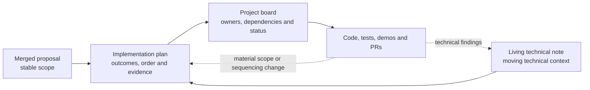
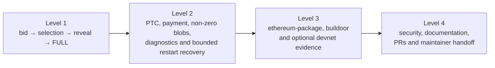

# EPF7 Week 6 Update — The Lodestar Builder Implementation Plan Goes to Review

The last update closed as Marko and I were moving into implementation planning. We used week 6 to create a detailed implementation plan.

Marko and I worked through the remaining implementation questions with Nico and NC across two rounds of discussion, consolidated the answers into a full [Lodestar EIP-7732 Builder implementation plan](https://hackmd.io/@krisos/SyPZNJp4fg) covering Weeks 6–21+, and gave it to the Lodestar team for review. Once the feedback is incorporated and the final version is agreed, the plan will be converted into issues on our project board and implementation begins in Week 8.

Marko also got a head start on the code side, with the first Builder package, CLI, key-loading, and signing work already open for early review. His own update covers that properly, so I only touch on it briefly below.

## What changed since Week 5

The proposal's broad roadmap now has an execution model behind it: accepted architecture decisions, individual issues with dependencies, milestone gates, objective completion evidence, and a process for absorbing upstream change.

The new implementation plan explains how the work gets delivered, in what order, and what has to be true before anything is considered done; and the project board will carry live ownership, dependencies, status, and day-to-day execution once the plan is signed off.



## Lodestar team discussion

### Round one: architecture and workflow

The first round of discussion settled most of the large architecture questions carried over from the Week 5 update.

The Builder itself is a standalone `lodestar builder` process in `packages/builder`, wired into the Lodestar CLI alongside `beacon` and `validator`. It is designed to sit beside a compatible beacon node and consume standard Beacon APIs and SSE events where those surfaces are sufficient, with narrow Lodestar-specific routes or events added where the workflow genuinely needs them and useful additions proposed upstream afterwards.

The source beacon node remains authoritative for the Engine API connection, proposer context and preferences, payload construction, Builder state, solvency checks, and reveal material; the sidecar never talks to the execution client directly. Builder onboarding is outside the first implementation's scope. The sidecar will initially import one Builder BLS key and read the active Builder's status through the [builders API](https://github.com/ChainSafe/lodestar/pull/9593), while deposits, exits, and top-ups remain external through genesis configuration or ethPandaOps tooling.

The proposer's `target_gas_limit` flows through proposer preferences and reaches the EL through payload attributes ([execution-apis #796](https://github.com/ethereum/execution-apis/pull/796)). Bid selection stays a proposer-beacon-node decision; for the local test path, Lodestar can be configured to prefer the external bid with `--builder.selection builderalways`. The Builder learns that it won through beacon-node events and block retrieval rather than joining libp2p directly.

### Round two: simplifying the first iteration

The second round covered bid value, solvency, the trust boundary, the reveal cache, key scope, equivocation, and completion evidence. Most of the answers made the first implementation smaller.

NC initially suggested starting the bid at 90% of execution rewards. However, Nico suggested that we set `bid.value` to the local execution-payload value behind a small strategy function, with `execution_payment = 0` for the trustless p2p bid.

For now, builder solvency will be determined by the beacon node. The BN rejects a bid the Builder cannot cover, while the sidecar surfaces that as a clear operator warning and can expose the current balance returned by the status lookup it already needs for Builder-index resolution.

The reveal path reuses the beacon node's stateful block-production cache model. The source BN retains the exact payload, execution requests, blobs, and proofs until reveal or bounded expiry, then evicts the material after a successful reveal. Publication validation, including any equivocation check available on the pinned baseline, stays with the beacon node. If the full upstream check is still missing when we pin, that becomes a documented upstream gap rather than a new Builder-side policy or a blocker for the first happy path. One local keystore-backed Builder key is enough for the first iteration.

The accepted directions, condensed:

| Area | Accepted direction |
|---|---|
| Base and workflow | Pin `unstable`; keep one shared feature branch current with it; split later when review benefits |
| Product form | Standalone `lodestar builder` command in `packages/builder`, parallel to `packages/validator`, wired into the CLI |
| EL and payload state | Source BN owns the Engine API and payload-building state; no sidecar-to-EL path |
| API boundary | Standard Beacon APIs and SSE where possible; narrow Lodestar-specific routes and events where required |
| Onboarding | Outside the first implementation — import one Builder key and read status through the builders API; deposits, exits, and top-ups remain external |
| Proposer inputs | `target_gas_limit` flows through proposer preferences and payload attributes; test selection stays BN-controlled |
| Keys | One local keystore-backed Builder key; no remote signer or keymanager work |
| Bid policy | `bid.value = execution_payload_value` behind a small strategy function; `execution_payment = 0` |
| Solvency | BN-authoritative rejection, surfaced as an operator warning, with status and balance visible when available |
| Reveal cache | Reuse the stateful BN cache; retain exact material until reveal or bounded expiry; evict after success |
| Timing | Bid as soon as the candidate exists; reveal when a BN event and block show that the local bid was selected; no strategic delay or timing games |
| Equivocation | Publication validation stays BN-owned; record any missing upstream check as a gap |
| Testing | Kurtosis first; extend ethereum-package as needed using buildoor's participant configuration as a reference; devnets later |

This planning process allowed us to define a clear ownership boundary too:

```text
lodestar builder
  owns keys, signatures, orchestration, exact matching and diagnostics

source Lodestar beacon node
  owns chain state, proposer preferences, EL access, payload construction,
  solvency checks, stateful reveal material and publication validation
```

## The plan

The plan is the execution document for the remainder of the fellowship. It consolidates the merged proposal, the living technical note, the weekly updates, the team's guidance above, and the maintained [Beacon API Builder flow](https://github.com/ethereum/beacon-APIs/blob/master/validator-flow.md#builder-optional) into one delivery sequence that can be reviewed and then translated directly into project board issues. The core lifecycle is unchanged from the proposal, but is now specified to issue depth:

```text
real BN-built payload
→ complete unsigned payload-value bid from the source beacon node
→ local Builder signature and immediate publication
→ Lodestar proposer selects the bid
→ Builder sees the selecting block through a BN event
→ immediate stateful envelope reveal
→ block reaches FULL
```



## From roadmap to issues and gates

The review draft breaks the core project into twenty individual issues and preserves the proposal's strong and stretch goals as seven named conditional packages. Each core issue carries a reason for existing, a bounded task list, dependencies, a lane, a target week, an effort estimate, and objective completion evidence. The core work is grouped into four epics:

| Epic | Main work |
|---|---|
| Foundation and source-BN access | Deterministic Kurtosis environment, `packages/builder`, CLI lifecycle, local signer, typed BN client, active-Builder resolution, block events and retrieval |
| BN payload, bid, and stateful reveal support | Required BN route/event surface, reuse of canonical payload production, complete payload-value bid construction, and stateful reveal-cache handling |
| Bid, selection, reveal, and outcomes | Candidate request, signing and publication, exact local selection, immediate reveal, PTC/payment evidence, non-zero blobs, diagnostics, and bounded same-BN restart recovery |
| Demonstration, integration, security, and handoff | Repeatable local demo, ethereum-package/buildoor integration, security and resource review, documentation, PR shaping, and final handoff |

BN/API work and Builder-side work can move in separate fellow lanes, while shared integration work brings them together at the evidence gates.

The roadmap itself is organised around evidence gates rather than only calendar dates:

| Gate | Target | Required result |
|---|---:|---|
| Plan and board ready | End of Week 7 | Plan accepted, all issues and dependencies on the board, exact `unstable` SHA pinned, Week 8 work Ready |
| Builder foundation | End of Week 9 | Local environment, `packages/builder`, one local key, typed BN connection, active Builder resolution |
| Real bid path | End of Week 12 | The BN builds a complete real bid, retains the reveal material, and the sidecar signs and publishes it |
| First working loop | End of Week 14 | Lodestar selects the bid, the Builder reveals immediately, and the block reaches FULL in repeatable Kurtosis runs |
| Protocol-complete local evidence | End of Week 16 | PTC/payment evidence, non-zero blobs and data, diagnostics, and bounded same-source-BN restart recovery |
| Broader integration | Weeks 17–18 | ethereum-package/buildoor evidence and an optional devnet attempt or documented blocker |
| Handoff | Week 21+ | Security review, documentation, PRs, final EPF outputs, and a clear follow-up backlog |

## Getting it reviewed

The plan is under review in [PR #2](https://github.com/krisoshea-eth/lodestar-eip-7732-builder-docs/pull/2), with Nico and NC added as collaborators.

## Preliminary implementation in parallel

While the plan was in review, Marko started the scaffolding it describes. His [Builder branch](https://github.com/markolazic01/lodestar/tree/feat/builder) now includes the `packages/builder` and CLI setup, local keystore loading, and a `BuilderSigner` for bids and envelopes with tests. He has opened a [first PR](https://github.com/markolazic01/lodestar/pull/1) on his fork so the direction can be checked before more work builds on top of it.

## What the latest tracking will feed into Week 7

Several of the findings below landed after the plan went out, so I am treating them as inputs to the Week 7 baseline audit rather than as completed Week 6 work.

- **Bid-production and peer-admission semantics are becoming clearer.** [consensus-specs #5472](https://github.com/ethereum/consensus-specs/pull/5472) separates uncapped Builder-side bid production across necessary branches from the peer-side `MAX_BIDS_PER_BUILDER = 3` validation and forwarding bound. The new [#5491](https://github.com/ethereum/consensus-specs/pull/5491) requires full, head-compatible validation before a bid consumes that quota or enters the seen cache. [#5473](https://github.com/ethereum/consensus-specs/pull/5473) has also merged the parent-slot payload-availability lookup that our later fork-choice and PTC evidence must respect.
- **The chosen `unstable` base gained useful pieces.** The production seam in [Lodestar #9595](https://github.com/ChainSafe/lodestar/pull/9595), the Gloas fast-confirmation runner in [#9704](https://github.com/ChainSafe/lodestar/pull/9704), and the minimum bid-increment gossip-forwarding rule in [#9706](https://github.com/ChainSafe/lodestar/pull/9706) have merged. That should narrow some planned BN-side work once the exact baseline is pinned. The external Builder API in [#9594](https://github.com/ChainSafe/lodestar/pull/9594) remains draft, while stable [v1.45.0](https://github.com/ChainSafe/lodestar/releases/tag/v1.45.0) predates these changes, reinforcing the decision to work from `unstable` and keep merging it.
- **The Beacon API Builder surface also moved.** [beacon-APIs #631](https://github.com/ethereum/beacon-APIs/pull/631) merged the `produceBlockV4` execution-value fields, which Lodestar already implements and which directly support the payload-value baseline. [#630](https://github.com/ethereum/beacon-APIs/pull/630) remains open around Builder policy and `max_execution_payment`, while the single-envelope publication model from [#624](https://github.com/ethereum/beacon-APIs/pull/624) remains the reveal target.
- **Lodestar now has a wider Gloas readiness index.** [Issue #9692](https://github.com/ChainSafe/lodestar/issues/9692) tracks fork transition, sync, scale, fork choice, cache pressure, and Builder delivery. It should be checked against the plan during the baseline audit, but a checklist entry is not completion evidence and each linked implementation and test surface still needs independent verification.
- **The circuit-breaker contract is still unsettled.** The [July 29 public ePBS discussion](https://github.com/ethereum/eth-rnd-archive/blob/master/epbs/2026-07-29.json) leaves open whether the breaker responds to a direct Builder or relay-wide behaviour, as well as the threshold and recovery rules. That supports keeping it as an awareness and observability concern rather than coupling the first Builder implementation to an unsettled policy.

## What I did this week

- Wrote and repeatedly refined the full implementation plan: core outcome and definition of done, sixteen accepted decisions, twenty core issues across four epics, dependencies and milestone gates, the board workflow and definition of Ready, acceptance evidence, seven conditional packages, and the upstream change-control rules.
- Separated the first repeatable Builder loop from the later PTC, payment, blob, reliability, integration, security, and handoff evidence.
- Shared the plan for review on HackMD, then stood up the public docs repository with two-way GitHub sync, mirrored the proposal, plan, and living note there, and opened the review PR with Nico and NC as collaborators.
- Agreed the high-value review path with Marko so the team can review the decisions and issue boundaries without reading every operational detail.
- Kept the daily tracking running and routed its findings towards the Week 7 baseline audit, while holding the living technical note steady until the review round completes.

## Plan for Week 7

1. Work through every Lodestar review comment as it lands, record its disposition, and apply the accepted changes to the plan and the affected issue boundaries.
2. Recirculate the final candidate with a concise change summary, obtain approval or an agreed no-objection, and publish the plan as v1.0.
3. Pin the exact `unstable` SHA, record the current specification and API versions, run the baseline capability audit so already-landed work can be narrowed or closed with evidence, and cut the shared feature branch.
4. Create all twenty core issues and the conditional parent items on the Linear board with owners, reviewers, dependencies, milestones, target weeks, and evidence fields. Mark the first Week 8 issues — the deterministic environment and the `lodestar builder` package and command — Ready once their remaining baseline details are resolved.
5. Keep Marko's early CLI and signing work aligned with the reviewed plan so it folds cleanly into the shared branch after the baseline pin.
6. Update the living technical note with the accepted decisions, current baseline, and tracking results above, and keep the daily tracking running — with [#5472](https://github.com/ethereum/consensus-specs/pull/5472), [#5491](https://github.com/ethereum/consensus-specs/pull/5491), [#630](https://github.com/ethereum/beacon-APIs/pull/630), [#9594](https://github.com/ChainSafe/lodestar/pull/9594), the readiness checklist, and devnet-7 as the items most likely to move under us.

The aim is to end Week 7 with no hidden planning dependency left between us and implementation. If the review closes cleanly, this should be the last planning-heavy update — from Week 8 these become implementation updates.

## Useful links

### Project

- [Merged proposal](https://github.com/eth-protocol-fellows/cohort-seven/blob/master/projects/lodestar-eip-7732-builder.md) · [living technical note](https://hackmd.io/@krisos/S1a9mdB7fl) · [implementation plan](https://hackmd.io/@krisos/SyPZNJp4fg)
- [Docs repository](https://github.com/krisoshea-eth/lodestar-eip-7732-builder-docs) · [review PR #2](https://github.com/krisoshea-eth/lodestar-eip-7732-builder-docs/pull/2) · [presentation](https://docs.google.com/presentation/d/1cmC3fpu652gZFTIm2_P1lIYOfC2M_w3c5qXSUZ4B6lc)
- [Marko's Builder branch](https://github.com/markolazic01/lodestar/tree/feat/builder) · [first scaffolding PR](https://github.com/markolazic01/lodestar/pull/1)
- [EPF7 repository](https://github.com/eth-protocol-fellows/cohort-seven) · [development updates](https://github.com/eth-protocol-fellows/cohort-seven/blob/master/development-updates.md)

### Lodestar and current baseline

- [Lodestar repository](https://github.com/ChainSafe/lodestar) · [v1.45.0 stable](https://github.com/ChainSafe/lodestar/releases/tag/v1.45.0) · [Gloas mainnet readiness checklist #9692](https://github.com/ChainSafe/lodestar/issues/9692)
- [Production seam #9595](https://github.com/ChainSafe/lodestar/pull/9595) · [draft Builder API #9594](https://github.com/ChainSafe/lodestar/pull/9594) · [builders API #9593](https://github.com/ChainSafe/lodestar/pull/9593)
- [Gloas FCR runner #9704](https://github.com/ChainSafe/lodestar/pull/9704) · [bid-forwarding threshold #9706](https://github.com/ChainSafe/lodestar/pull/9706) · [progressive bounds #9689](https://github.com/ChainSafe/lodestar/pull/9689)

### Specifications, APIs, and testing

- [EIP-7732](https://eips.ethereum.org/EIPS/eip-7732) · Gloas [Builder spec](https://github.com/ethereum/consensus-specs/blob/master/specs/gloas/builder.md) · [consensus-specs v1.7.0-alpha.12](https://github.com/ethereum/consensus-specs/releases/tag/v1.7.0-alpha.12) · [multi-branch bids #5472](https://github.com/ethereum/consensus-specs/pull/5472) · [validate-before-count #5491](https://github.com/ethereum/consensus-specs/pull/5491) · [parent-slot availability #5473](https://github.com/ethereum/consensus-specs/pull/5473)
- [Beacon API Builder flow](https://github.com/ethereum/beacon-APIs/blob/master/validator-flow.md#builder-optional) · [`getExecutionPayloadBid`](https://github.com/ethereum/beacon-APIs/blob/master/apis/validator/execution_payload_bid.yaml) · [envelope publication #624](https://github.com/ethereum/beacon-APIs/pull/624) · [Builder policy #630](https://github.com/ethereum/beacon-APIs/pull/630) · [execution value #631](https://github.com/ethereum/beacon-APIs/pull/631) · [builder-specs #165](https://github.com/ethereum/builder-specs/pull/165) · [payload-attributes gas limit — execution-apis #796](https://github.com/ethereum/execution-apis/pull/796)
- [ethereum-package](https://github.com/ethpandaops/ethereum-package) · [buildoor](https://github.com/ethpandaops/buildoor) · [withheld-payload rules #147](https://github.com/ethpandaops/buildoor/pull/147) · [assertoor `gloas-dev` playbooks](https://github.com/ethpandaops/assertoor/tree/master/playbooks/gloas-dev) · [glamsterdam-devnet-7](https://notes.ethereum.org/@ethpandaops/glamsterdam-devnet-7) · [fixtures v7.2.1](https://github.com/ethereum/execution-specs/releases/tag/tests-glamsterdam-devnet%40v7.2.1)
