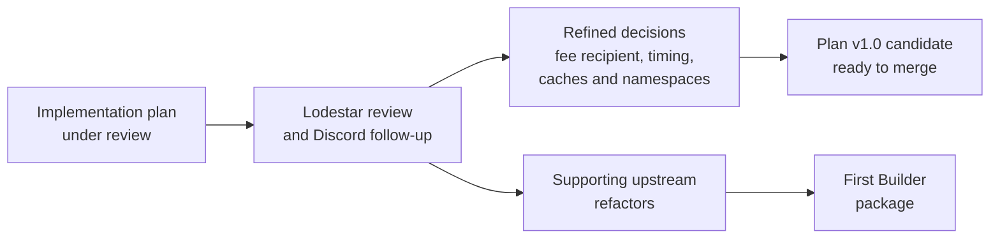

# EPF7 Week 7 Update — The Lodestar Builder Plan Survives Review and the First Builder Package Lands

Week 6 ended with the full implementation plan sitting in front of the Lodestar team for review. Week 7 was spent on the other side of that exchange, working through the review comment by comment in [PR #2](https://github.com/krisoshea-eth/lodestar-eip-7732-builder-docs/pull/2), checking the assumptions that would have been expensive to get wrong later, settling the remaining questions, and folding all of it back into the plan.

The review mattered as much as it did because the Builder is not being implemented in isolation. It sits on top of Lodestar's existing block production, execution-client integration, Builder state, Beacon APIs, gossip validation, payload caching, and fork-choice behaviour, and a mistake in where one of those boundaries is drawn could have created weeks of unnecessary work. In parallel, Marko turned his preliminary scaffolding into the first substantial Builder implementation, and a set of small upstream refactors landed to clear the path for it.

## What changed since Week 6

The architecture came through the review untouched, so the changes worth recording all sit one level down. Week 6 committed to reusing the beacon node's stateful payload machinery, and that decision stands, but the review put a step in front of it. Before writing any cancellation or cache logic, we first trace what Lodestar already does with stale payload jobs after a head change, and only build something new if the pinned baseline shows a real gap. Timing moved as well. Week 6 treated bidding as a single event that happens as soon as a candidate exists, and the review split it into two decisions, production and publication, with the beacon node responsible for the first and the Builder for the second. The review also produced firm answers in three areas the plan had left loose: the execution fee recipient, the bid-construction boundary, and the API namespaces. Each has its own section below.

On the code side, what ended Week 6 as preview scaffolding on [Marko's fork](https://github.com/markolazic01/lodestar/tree/feat/builder) became a completed implementation, merged upstream at the start of the following week as [#9758](https://github.com/ChainSafe/lodestar/pull/9758).



## What the review settled

### The shape held

The first implementation remains a same-host, stateful Builder sidecar connected to one operator-controlled Lodestar beacon node, with stateless operation, multiple beacon nodes, failover, and remote signing all staying outside the first milestone. That keeps the sidecar small and avoids standing up a second payload-production stack beside the one Lodestar already maintains.

The review reinforced why this stateful model earns its place. Because the source node retains the exact payload, execution requests, blobs, and proofs between bid construction and reveal, the sidecar avoids maintaining a second copy of the payload cache, and a sidecar restart can eventually be recoverable as long as the same source node is still online with the reveal material, while losing the source node itself stays a separate, deferred high-availability problem. The Builder should reuse Lodestar's payload-production and cache machinery wherever possible, and before designing anything new on top we first verify what the existing payload-job cleanup already does.

### The beacon node hands over a complete bid

The review also clarified the construction boundary. The source node produces the complete unsigned `ExecutionPayloadBid`, and the sidecar's job is to sanity-check and sign that exact object, not to reconstruct it, revalue it, or mutate any field before signing. That keeps proposer context, payload value, balance validation, and the payload itself on one authoritative path, and it narrows the sidecar's own checks to identity, fork and domain, `execution_payment = 0`, and bid-envelope consistency. The unsigned-bid route this contract relies on is currently untested in Lodestar, so auditing it end to end is flagged for the baseline pin rather than assumed to work.

### The payload fee recipient belongs to the Builder

The review caught a mistake that would have cost the Builder real money. An external Builder earns its income on the execution layer: whatever address sits in the payload's `feeRecipient` collects the block's execution rewards, and the Builder pays the proposer separately through the `bid.value` it committed to. Lodestar's existing block production fills `feeRecipient` with the proposer's own address, which is correct when a validator builds its own block, since proposer and builder are then the same party. Reused unchanged by an external Builder, that default sends the execution rewards to the proposer while the Builder still owes `bid.value` on top, leaving the Builder with a block it paid for and earned nothing from. The plan treats a wrongly configured fee recipient accordingly, as an error that loses money rather than a cosmetic slip. The two addresses have separate jobs:

```text
execution payload feeRecipient
→ Builder-controlled execution address
→ receives the execution-layer block value

bid.fee_recipient
→ proposer payment address
→ receives the trustless Builder payment
```

The Builder can reuse its withdrawal address here for convenience, but nothing requires it. The one hard rule is that the fee recipient never silently falls back to the proposer's self-build default. In practice that makes it a required piece of Builder configuration, and one that has to reach the beacon node's payload-preparation path before the payload is built, since the address is written into the payload at construction.

### Bids are commitments with two clocks

A published bid cannot be withdrawn. If the head changes, the Builder does not retract anything; it may prepare and publish another bid for the new compatible parent tuple, while the original bid remains something it has committed to honour if selected, and any stale payload work underneath follows the beacon node's existing cleanup and expiry behaviour.

On top of that, producing a bid and publishing it run on separate clocks:

```text
bid production
→ the BN prepares the payload and candidate ahead of the slot

bid publication
→ the Builder releases the signed bid at a configurable pre-slot offset
```

The separation matters because publication has a constraint of its own, which is that the bid has to reach proposers before their local selection cutoff, so waiting for slot start is wrong and publishing the instant a candidate is ready is an assumption to test rather than a default to hardcode. The Builder tracks its connected node's head over SSE, keys its signed bids by parent tuple, and bids compatibly with that head view; bidding across competing branches or FULL and EMPTY alternatives stays extension work, and flood publication in particular would require relaxing local bid validation, so it remains firmly in the stretch tier.

### The API boundary is a finding, not a given

The review confirmed that the current Beacon API surface and Lodestar implementation do not yet expose every interface this flow needs end to end, and treated that as an outcome of the project rather than a blocker. Builder-only operations belong under a standard `/builder` namespace and chain or publication operations under `/beacon`, with no invented Lodestar-specific namespace for interfaces that are meant to be standardised. The current location of the unsigned-bid route under `/validator` is itself a recorded upstream gap ([beacon-APIs #595](https://github.com/ethereum/beacon-APIs/issues/595)), as is the question of how an external Builder learns that its bid was selected ([beacon-APIs #599](https://github.com/ethereum/beacon-APIs/issues/599)). Where the implementation needs something missing, it adds the narrowest interface in the intended namespace and proposes it upstream with evidence.

### Validation ownership

Envelope publication should explicitly request `consensus_and_equivocation`, with the beacon node owning the check rather than the sidecar keeping a second view of proposer equivocation. The review identified the publication-time check as still missing in Lodestar, and Nico picked that gap up during the same period; the work later merged as [#9757](https://github.com/ChainSafe/lodestar/pull/9757), so the project can test against the real check, including a planned Deathstar-driven rejection case, instead of inventing a Builder-side policy.

### Package boundaries

A set of smaller decisions cleaned up the dependency picture. The small `waitForGenesis` helper has no clean shared home because it depends on `@lodestar/api`, so the Validator and Builder keep small, behaviourally aligned copies. `assertEqualParams` belongs in `@lodestar/config`, where both packages can use it, and the clock functionality both need belongs below them rather than the Builder importing Validator internals. No unreachable genesis-404 branch gets added to the Lodestar beacon node, which cannot reach that path, while the client side keeps handling the specified 404 for Teku and any other node that can return it. Request-authentication domains stay with the staked Builder API path rather than entering the core sidecar, and a review suggestion to add a Builder Grafana dashboard became a bounded stretch package rather than core scope.

The refinements, condensed:

| Area | Review outcome |
|---|---|
| Shape | Same-host stateful sidecar against one BN; stateless, multi-BN, failover, and remote signing deferred |
| Bid construction | The BN returns the complete unsigned bid; the sidecar sanity-checks and signs it unchanged |
| Fee recipient | Builder-controlled payload `feeRecipient`, distinct from the proposer payment in `bid.fee_recipient`; wrong coinbase is a financial-loss error |
| Bid lifecycle | No withdrawal; a head change means a fresh bid for the new parent tuple |
| Publication timing | Separate from production; configurable pre-slot so bids beat the proposer's selection cutoff |
| Head tracking | Follow the connected BN's head over SSE; key signed bids by parent tuple |
| Multi-branch bidding | Extension work; flood publication needs relaxed local validation and stays stretch |
| API namespaces | `/builder` and `/beacon`, never a bespoke namespace; known gaps recorded upstream |
| Reveal validation | Request `consensus_and_equivocation`; the BN owns the check |
| Caches | Reuse BN payload-production machinery; trace existing cleanup before adding anything |
| Code sharing | Aligned `waitForGenesis` copies; `assertEqualParams` to config; clock below both packages; no cosmetic 404 branch |

## Supporting Lodestar changes

Several small upstream changes landed during the week, clearing dependency problems for the new package and completing surfaces it will consume. Marko's [#9486](https://github.com/ChainSafe/lodestar/pull/9486) merged on 28 July, implementing the `head_v2` event that gives the Builder the head stream it will follow over SSE. [#9725](https://github.com/ChainSafe/lodestar/pull/9725) moved `assertEqualParams` from the Validator into `@lodestar/config` on 30 July, which lets the Builder verify that its configured chain parameters match the source node without importing the Validator package. [#9726](https://github.com/ChainSafe/lodestar/pull/9726) taught the genesis polling to distinguish the expected pre-genesis 404 from real API failures on the same day, and the Builder's copy follows the same behaviour. [#9733](https://github.com/ChainSafe/lodestar/pull/9733) moved the clock utility both packages need into state-transition on 31 July, removing another reason for the new package to depend on Validator internals. The upstream half of the head-compatible bid model followed just as the week turned, with Nico's [#9739](https://github.com/ChainSafe/lodestar/pull/9739) merging on the morning of 3 August on the back of the merged consensus-specification change [#5497](https://github.com/ethereum/consensus-specs/pull/5497). These are individually small PRs, but together they tidy the ground under `@lodestar/builder` before more gets built on top of it.

## The first Builder implementation

Marko completed the first substantial Builder implementation during the week, and it merged upstream as [#9758](https://github.com/ChainSafe/lodestar/pull/9758). It establishes the `@lodestar/builder` package and the `lodestar builder` CLI entry point, Builder key loading from an encrypted keystore with optional expected public-key verification, signing of execution payload bids and envelopes with signer and keystore tests, genesis waiting and configuration-compatibility checks, Builder identity and graceful shutdown handling, and the packaging and build-system integration. The early fork PRs ([#1](https://github.com/markolazic01/lodestar/pull/1) and [#2](https://github.com/markolazic01/lodestar/pull/2)) that carried this work for preview closed in favour of the upstream merge.

Consequently, there is now an actual Builder package in ChainSafe's repository that the rest of the lifecycle can attach to. It is still only the foundation, since it does not yet produce and publish the complete external-Builder bid, detect selection, or reveal a payload, but those pieces now have a real package and process to build on. Marko's own update covers the implementation properly, so I will leave the detail to him.

## What Week 7 did not close

Not everything the Week 6 plan targeted for this week landed inside it. The plan review was settled in substance, but the PR itself required a few additional edits. The exact `unstable` baseline audit stayed open, deliberately, because so much Gloas work has been landing that I do not want to declare a baseline from an observed SHA and then discover that several planned issues were already partly implemented upstream.

## What I did this week

- Worked through every Lodestar review comment on [PR #2](https://github.com/krisoshea-eth/lodestar-eip-7732-builder-docs/pull/2), recorded each disposition, and applied the accepted changes to the plan and the affected issue boundaries, including the complete-bid contract, the publication-timing configuration, and the fee-recipient wiring.
- Followed the Discord rounds where Nico and Marko worked through the head-change, cache, namespace, and code-sharing questions above, and folded the settled answers into the plan text.
- Recorded the Beacon API gaps surfaced by the review, including [#595](https://github.com/ethereum/beacon-APIs/issues/595) and [#599](https://github.com/ethereum/beacon-APIs/issues/599), inside the issues that will meet them, instead of hiding them behind Lodestar-specific endpoints.
- Kept the plan aligned with Marko's implementation as it firmed up, so [#9758](https://github.com/ChainSafe/lodestar/pull/9758) and the reviewed plan describe the same Builder implementation.
- Prepared the v1.0 candidate for merge and conversion into board issues, and kept the daily tracking running with the upstream refactors above as the main movers.

## Plan for Week 8

1. Merge the reviewed plan formally.
2. Convert the plan into the full issue inventory on Linear, keep it synced to GitHub, and organise a public view the Lodestar team can follow without Linear access.
3. Reconcile the issue inventory against what has already landed upstream, and split out any work that deserves its own issue rather than hiding it inside a closed one.
4. Continue the Builder foundation after Marko's #9758, particularly source-node readiness, Builder identity, fee-recipient configuration, timeouts, tests, and metrics.
5. Prepare the deterministic Kurtosis environment needed for the first real payload → bid → selection → reveal run.
6. Keep the payload-preparation and Beacon API boundaries adaptable while the upstream specifications continue to settle.

At this point the project is moving out of planning, and the next updates should increasingly be about code, tests, local runs, and the gaps we discover by making the full lifecycle work.

## Useful links

### Project

- [Merged proposal](https://github.com/eth-protocol-fellows/cohort-seven/blob/master/projects/lodestar-eip-7732-builder.md) · [implementation plan review PR #2](https://github.com/krisoshea-eth/lodestar-eip-7732-builder-docs/pull/2) · [living technical note](https://hackmd.io/@krisos/S1a9mdB7fl) · [docs repository](https://github.com/krisoshea-eth/lodestar-eip-7732-builder-docs)
- [First Builder package #9758](https://github.com/ChainSafe/lodestar/pull/9758) · [Marko's Builder branch](https://github.com/markolazic01/lodestar/tree/feat/builder)
- [EPF7 repository](https://github.com/eth-protocol-fellows/cohort-seven) · [development updates](https://github.com/eth-protocol-fellows/cohort-seven/blob/master/development-updates.md)

### Upstream

- [Lodestar repository](https://github.com/ChainSafe/lodestar) · [v1.45.0 stable](https://github.com/ChainSafe/lodestar/releases/tag/v1.45.0)
- [`head_v2` event #9486](https://github.com/ChainSafe/lodestar/pull/9486) · [`assertEqualParams` to config #9725](https://github.com/ChainSafe/lodestar/pull/9725) · [genesis 404 handling #9726](https://github.com/ChainSafe/lodestar/pull/9726) · [clock util to state-transition #9733](https://github.com/ChainSafe/lodestar/pull/9733) · [head-compatible multiple bids #9739](https://github.com/ChainSafe/lodestar/pull/9739) · [consensus-specs #5497](https://github.com/ethereum/consensus-specs/pull/5497) · [`consensus_and_equivocation` work #9757](https://github.com/ChainSafe/lodestar/pull/9757)

### Specifications and APIs

- [EIP-7732](https://eips.ethereum.org/EIPS/eip-7732) · [Gloas Builder specification](https://github.com/ethereum/consensus-specs/blob/master/specs/gloas/builder.md) · [Beacon API Builder flow](https://github.com/ethereum/beacon-APIs/blob/master/validator-flow.md#builder-optional)
- [Unsigned-bid namespace gap #595](https://github.com/ethereum/beacon-APIs/issues/595) · [bid-selection signal gap #599](https://github.com/ethereum/beacon-APIs/issues/599)