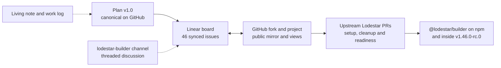

# EPF7 Week 8 Update — From Implementation Plan to an Upstream Lodestar Builder

Week 7 closed with a reviewed plan and a finished first implementation waiting to merge. Week 8 converted both into the system we now work from. The plan merged on 5 August, the project board went live across Linear with a public GitHub mirror, the `@lodestar/builder` package was published on 4 August, and implementation carried straight on into beacon-node readiness and Builder identity work while Nico landed equivocation validation upstream. By Friday the first Builder package was riding inside a Lodestar release candidate.

There is still a lot to build before the payload → bid → selection → reveal loop works, but the execution path is now much cleaner. The scope is agreed, the work is broken down and tracked, the foundation is upstream, and what remains is mostly implementation rather than planning.

## What changed since Week 7

Week 7 closed with the plan as the central document of the project. A week later it works more like an operating system. Issue ownership, dependencies, and day-to-day status live on the board, and the board continuously updates based on what the implementation process actually exposes.

The week also retired a contingency from Week 6. Back then, publication-time equivocation checking was recorded as a possible upstream gap, something we would document and carry if it was still missing when we pinned. [#9757](https://github.com/ChainSafe/lodestar/pull/9757) merged on 7 August, so the check now exists upstream, and the preserved adversarial scenario is waiting to exercise it against our own Builder.



## The plan merged

The [implementation plan](https://github.com/krisoshea-eth/lodestar-eip-7732-builder-docs/blob/main/docs/implementation-plan.md) merged as v1.0 with all review comments and the confirmed guidance incorporated and no plan-level implementation question left open. The same day I reconciled the GitHub and HackMD copies of the planning surfaces and refreshed the [living technical note](https://hackmd.io/@krisos/S1a9mdB7fl) with the recent specification, Lodestar, and project decisions.

The docs repository has become the shared home for the material around the project, holding the proposal, the plan, the living note, the weekly updates, the test plans, and a new [work log](https://github.com/krisoshea-eth/lodestar-eip-7732-builder-docs/blob/main/docs/work-log.md) from Marko explaining how the tools divide responsibilities. On the Discord side we also moved into a dedicated `lodestar-builder` channel with per-topic threads, so the Lodestar team can follow discussions without digging through a general channel. The documents and systems now have clear jobs:

| Document or system | Role |
|---|---|
| EPF proposal | Stable public scope and motivation |
| Living technical note | Moving specifications, design findings, and technical context |
| Implementation plan | Delivery sequence, dependencies, and completion evidence |
| Linear | Ownership, dependencies, cycles, and daily execution |
| GitHub issues and project | Public mirror and implementation visibility |
| Lodestar PRs | Actual upstream implementation and review |
| Discord | Technical discussion with the Lodestar team |

## Converting the plan into a live board

The initial conversion produced 44 issues, mirrored into the [shared fork](https://github.com/krisoshea-eth/lodestar/issues) as issues #1 through #44:

```text
4 epic parents
3 supporting planning issues
20 core implementation issues
8 conditional package parents
9 deferred tracking markers
```

The eight conditional parents are the proposal's original seven plus the Grafana dashboard package that came out of the review.

Because Linear stays the primary tool for ownership, dependencies, cycles, and day-to-day status, I also built a [public GitHub Project](https://github.com/users/krisoshea-eth/projects/2/views/2) that mirrors the Linear organisation with views for workflow, core execution, decisions and upstream dependencies, and extension work, so the ChainSafe side can follow progress.

| State | Issues |
|---|---|
| Complete or reorganised | PLAN-01, BOARD-01, CLI-01, SIGN-01, and the original API-01 |
| In progress | Epic A and TEST-01 |
| Next | BASELINE-01, ENV-01, API-02, MET-01 |

## The package shipped

Nico published [`@lodestar/builder`](https://www.npmjs.com/package/@lodestar/builder) to npm on 4 August, the day after [#9758](https://github.com/ChainSafe/lodestar/pull/9758) merged, which moved the Builder from a planning proposal and a personal fork into Lodestar's release pipeline. The package gives us the process, the configuration, the key boundary, and the signer that the next pieces build on.

## Builder identity and source-node readiness

The next implementation slice is Marko's [#9781](https://github.com/ChainSafe/lodestar/pull/9781), which develops the Builder's relationship with its source beacon node. On the identity side, resolution moves into its own module, and a new tracker follows the active Builder's status and balance. On the readiness side, the Builder gains checks that the beacon node is synced and its execution layer is online, logs the source node's version, and polls the Gloas fork schedule. The PR also adds two configuration options, the `--executionFeeRecipient` flag the review called for and a request timeout, and wires all of these pieces into the Builder lifecycle.

The most useful discussion here was about what ready actually means. A Builder should not produce bids against a node that is far behind the network, and the corresponding execution layer has to be available too, so both need to be sufficiently synced before the Builder does anything, with that check conceptually belonging on the beacon-node side even if the first implementation asserts from wherever is practical. At the same time, the Validator's sync tracker carries behaviours the Builder may not need, such as refetching duties after a resync, so the direction is to reuse only the smallest useful readiness logic, share Validator code only where the lifecycle and callback requirements line up, and keep importing the Validator package as a fallback if the amount of reused code grows.

## Equivocation validation and the Deathstar scenario

Nico's [#9757](https://github.com/ChainSafe/lodestar/pull/9757) merged on 7 August, implementing `consensus_and_equivocation` validation for blocks and payload envelopes so that conflicting objects are rejected before import, gossip, or reveal. In the same territory, [#9787](https://github.com/ChainSafe/lodestar/pull/9787) merged with proposer-slashing production from observed equivocations, and its devnet-7 evidence reports a slashing produced and broadcast 137 ms after an adversarial equivocation, with a small [diagnostic follow-up](https://github.com/ChainSafe/lodestar/pull/9789) landing after the release-candidate tag.

On our side, I preserved the corresponding adversarial scenario in the docs repository as a versioned [Kurtosis test plan](https://github.com/krisoshea-eth/lodestar-eip-7732-builder-docs/blob/main/docs/test-plans/pr-9757-builder-equivocation.yaml):

```text
Deathstar proposer
→ publishes an honest block and a second signature-valid block root

Builder
→ bids on the honest block and later attempts the envelope reveal

source beacon node
→ rejects the envelope under consensus_and_equivocation
  before gossip publication
```

The configuration currently uses Buildoor as the Builder, which is also what the upstream validation work exercised, and we have not yet run the end-to-end scenario with `lodestar builder`, because its lifecycle and bid flow are not far enough along.

## A release candidate to audit against

Lodestar published [v1.46.0-rc.0](https://github.com/ChainSafe/lodestar/releases/tag/v1.46.0-rc.0) on 7 August from commit `03e8e79`, the first tag since stable [v1.45.0](https://github.com/ChainSafe/lodestar/releases/tag/v1.45.0) to gather the Gloas and Builder safety work we have been tracking. It carries the equivocation validation from [#9757](https://github.com/ChainSafe/lodestar/pull/9757), the proposer-slashing production from [#9787](https://github.com/ChainSafe/lodestar/pull/9787), the Builder deposit-signature caching from [#9727](https://github.com/ChainSafe/lodestar/pull/9727), the first-orphaned-payload range-sync fix from [#9785](https://github.com/ChainSafe/lodestar/pull/9785), and the initial Builder package itself.

[#9781](https://github.com/ChainSafe/lodestar/pull/9781) is still a draft, the [circuit-breaker follow-ups in #9780](https://github.com/ChainSafe/lodestar/pull/9780) are open, and the [alpha.13 fast-confirmation test update #9778](https://github.com/ChainSafe/lodestar/pull/9778) still carries 20 skips tied to upstream vector artifacts.

## The Builder API is still moving

The older Lodestar Builder API draft, [#9594](https://github.com/ChainSafe/lodestar/pull/9594), was closed without merging. The upstream specifications are still settling, and the team expects that work to land over the next week or two, with Nico implementing the finalised API once it does. That reinforces a decision the plan already carries, which is that the first sidecar must not depend deeply on an API shape we know is moving. The core orchestration stays behind a narrow typed adapter so a route move, an authentication change, or a Builder API revision does not mean rewriting the Builder, and the gaps we have already logged upstream, the unsigned-bid namespace in [#595](https://github.com/ethereum/beacon-APIs/issues/595) and the bid-selection signal in [#599](https://github.com/ethereum/beacon-APIs/issues/599), should be answered with implementation evidence as Beacon API changes rather than becoming permanent Lodestar-specific endpoints.

## What I did this week

- Merged the implementation plan as v1.0, reconciled the GitHub and HackMD surfaces, and refreshed the living technical note.
- Converted the plan into the board, audited the resulting hierarchy, dependencies, and evidence fields, and folded in Marko's TEST-01 and MET-01 split that took the inventory from 44 issues to 46 as implementation exposed the need for separate test and metrics work.
- Built and organised the public GitHub Project views so NC and the wider Lodestar team can follow progress without Linear, and kept the two-way sync healthy.
- Moved the team discussion into the dedicated `lodestar-builder` channel Nico created, set up its topic threads, and merged Marko's work log document.
- Preserved the proposer-equivocation Kurtosis scenario as a versioned test plan for rerunning with our Builder, and kept the implementation issues aligned with Marko's upstream work.

## Plan for Week 9

1. Bring Marko's [#9781](https://github.com/ChainSafe/lodestar/pull/9781) out of draft, and close the accompanying TEST-01 and MET-01 work so the readiness, identity, and fee-recipient slice lands with its tests and metrics.
2. Complete BASELINE-01, auditing every planned capability against `v1.46.0-rc.0` at `03e8e79` while keeping v1.45.0 as the stable comparison point.
3. Finish ENV-01, the deterministic local Kurtosis environment, so evidence runs become repeatable.
4. Begin API-02, using beacon-node block events plus fork-correct block retrieval as the first selected-bid observation path.
5. Trace the existing payload-preparation path in detail before fixing the external-Builder candidate contract, in line with the review's verify-before-building principle.
6. Keep the Builder API boundary behind its adapter while the upstream specification work settles.
7. Rerun the proposer-equivocation scenario with `lodestar builder` once the lifecycle and bid flow are functional, and keep the daily tracking running with #9781, #9780, #9778, and the v1.46 release path as the items most likely to move.

The target for the next stretch is to complete Epic A: one Builder process, one verified source node, one active Builder key, deterministic local infrastructure, tests and metrics in place, and no ambiguity about whether the system is ready. Once that is complete, the interesting part begins, because the payload and bid path is where we start testing the central hypothesis of the project.

## Useful links

### Project

- [Implementation plan v1.0](https://github.com/krisoshea-eth/lodestar-eip-7732-builder-docs/blob/main/docs/implementation-plan.md) · [living technical note](https://hackmd.io/@krisos/S1a9mdB7fl) · [work log](https://github.com/krisoshea-eth/lodestar-eip-7732-builder-docs/blob/main/docs/work-log.md) · [docs repository](https://github.com/krisoshea-eth/lodestar-eip-7732-builder-docs)
- [Fork issue board](https://github.com/krisoshea-eth/lodestar/issues) · [public GitHub Project](https://github.com/users/krisoshea-eth/projects/2/views/2) · [Linear project](https://linear.app/kriso/project/lodestar-eip-7732-builder-814d6faca6fd) · [equivocation test plan](https://github.com/krisoshea-eth/lodestar-eip-7732-builder-docs/blob/main/docs/test-plans/pr-9757-builder-equivocation.yaml)
- [EPF7 repository](https://github.com/eth-protocol-fellows/cohort-seven) · [development updates](https://github.com/eth-protocol-fellows/cohort-seven/blob/master/development-updates.md)

### Current Builder work

- [Builder setup #9758](https://github.com/ChainSafe/lodestar/pull/9758) · [readiness and identity #9781](https://github.com/ChainSafe/lodestar/pull/9781) · [`@lodestar/builder` on npm](https://www.npmjs.com/package/@lodestar/builder)
- [package build scripts #9766](https://github.com/ChainSafe/lodestar/pull/9766) · [hidden Builder docs #9770](https://github.com/ChainSafe/lodestar/pull/9770) · [equivocation validation #9757](https://github.com/ChainSafe/lodestar/pull/9757) · [proposer slashings #9787](https://github.com/ChainSafe/lodestar/pull/9787)

### Current baseline

- [v1.46.0-rc.0](https://github.com/ChainSafe/lodestar/releases/tag/v1.46.0-rc.0) · [v1.45.0 stable](https://github.com/ChainSafe/lodestar/releases/tag/v1.45.0) · [Gloas readiness tracker #9692](https://github.com/ChainSafe/lodestar/issues/9692)
- [deposit-signature cache #9727](https://github.com/ChainSafe/lodestar/pull/9727) · [range-sync fix #9785](https://github.com/ChainSafe/lodestar/pull/9785) · [circuit-breaker follow-ups #9780](https://github.com/ChainSafe/lodestar/pull/9780) · [alpha.13 FCR tests #9778](https://github.com/ChainSafe/lodestar/pull/9778) · [closed Builder API draft #9594](https://github.com/ChainSafe/lodestar/pull/9594)
- [unsigned-bid namespace gap #595](https://github.com/ethereum/beacon-APIs/issues/595) · [bid-selection signal gap #599](https://github.com/ethereum/beacon-APIs/issues/599)